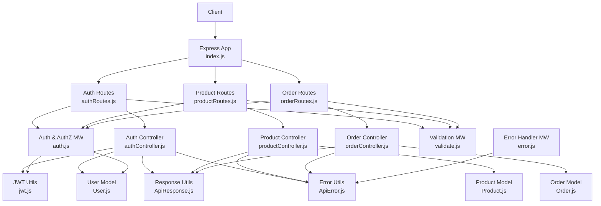
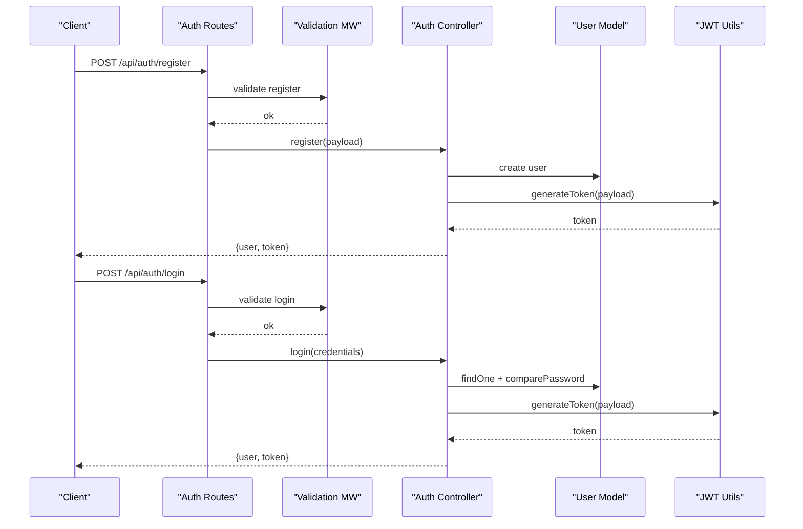
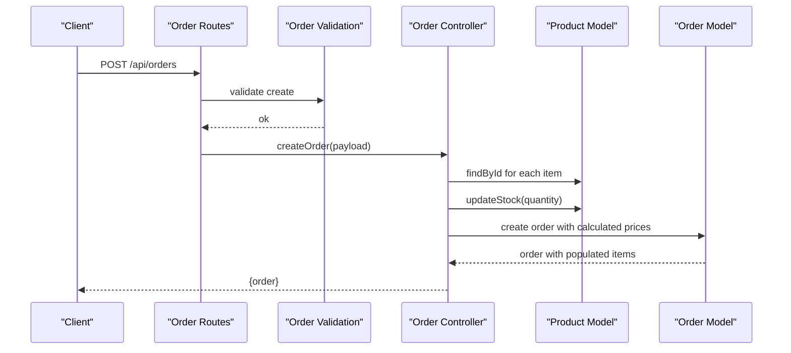
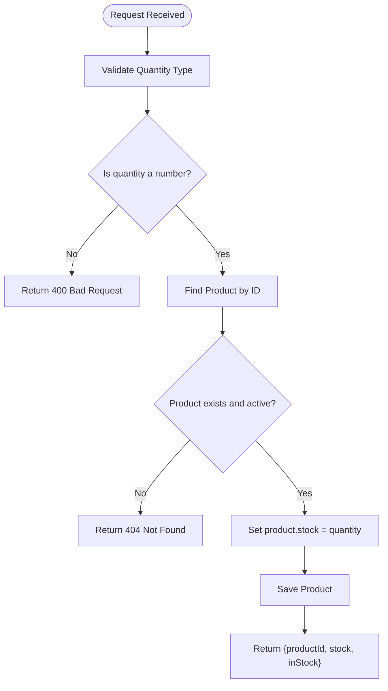
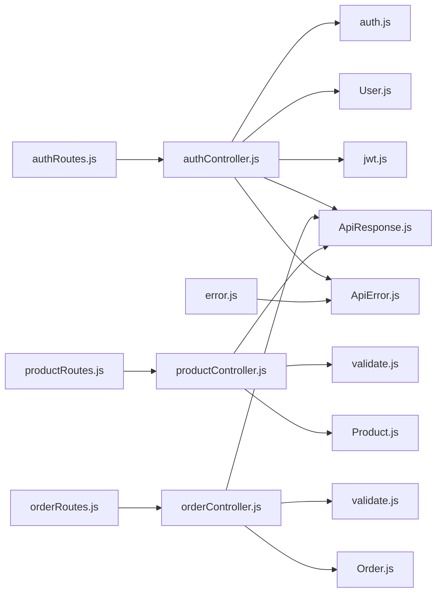

# API Documentation

<cite>
**Referenced Files in This Document**
- [index.js](file://backend/index.js)
- [authRoutes.js](file://backend/routes/authRoutes.js)
- [productRoutes.js](file://backend/routes/productRoutes.js)
- [orderRoutes.js](file://backend/routes/orderRoutes.js)
- [authController.js](file://backend/controllers/authController.js)
- [productController.js](file://backend/controllers/productController.js)
- [orderController.js](file://backend/controllers/orderController.js)
- [auth.js](file://backend/middleware/auth.js)
- [validate.js](file://backend/middleware/validate.js)
- [ApiResponse.js](file://backend/utils/ApiResponse.js)
- [ApiError.js](file://backend/utils/ApiError.js)
- [jwt.js](file://backend/utils/jwt.js)
- [error.js](file://backend/middleware/error.js)
- [User.js](file://backend/models/User.js)
- [Product.js](file://backend/models/Product.js)
- [Order.js](file://backend/models/Order.js)
- [package.json](file://backend/package.json)
</cite>

## Table of Contents
1. [Introduction](#introduction)
2. [Project Structure](#project-structure)
3. [Core Components](#core-components)
4. [Architecture Overview](#architecture-overview)
5. [Detailed Component Analysis](#detailed-component-analysis)
6. [Dependency Analysis](#dependency-analysis)
7. [Performance Considerations](#performance-considerations)
8. [Troubleshooting Guide](#troubleshooting-guide)
9. [Conclusion](#conclusion)
10. [Appendices](#appendices)

## Introduction
This document provides comprehensive API documentation for the e-commerce RESTful backend. It covers authentication, product management, and order processing endpoints, including HTTP methods, URL patterns, request/response schemas, authentication requirements, validation rules, error handling, and status codes. It also includes practical client implementation guidelines, integration examples, rate limiting considerations, security recommendations, and API versioning strategy.

## Project Structure
The backend follows an MVC-style structure with routes delegating to controllers, which interact with models via MongoDB/Mongoose. Middleware handles authentication, authorization, validation, and centralized error handling. Utilities standardize responses and manage JWT tokens.

**Diagram sources**
- [index.js:1-119](file://backend/index.js#L1-L119)
- [authRoutes.js:1-85](file://backend/routes/authRoutes.js#L1-L85)
- [productRoutes.js:1-101](file://backend/routes/productRoutes.js#L1-L101)
- [orderRoutes.js:1-77](file://backend/routes/orderRoutes.js#L1-L77)
- [authController.js:1-299](file://backend/controllers/authController.js#L1-L299)
- [productController.js:1-341](file://backend/controllers/productController.js#L1-L341)
- [orderController.js:1-358](file://backend/controllers/orderController.js#L1-L358)
- [auth.js:1-124](file://backend/middleware/auth.js#L1-L124)
- [validate.js:1-221](file://backend/middleware/validate.js#L1-L221)
- [error.js:1-121](file://backend/middleware/error.js#L1-L121)
- [jwt.js:1-49](file://backend/utils/jwt.js#L1-L49)
- [ApiResponse.js:1-52](file://backend/utils/ApiResponse.js#L1-L52)
- [ApiError.js:1-21](file://backend/utils/ApiError.js#L1-L21)
- [User.js:1-135](file://backend/models/User.js#L1-L135)
- [Product.js:1-217](file://backend/models/Product.js#L1-L217)
- [Order.js:1-217](file://backend/models/Order.js#L1-L217)

**Section sources**
- [index.js:1-119](file://backend/index.js#L1-L119)
- [package.json:1-33](file://backend/package.json#L1-L33)

## Core Components
- Authentication and Authorization: JWT-based bearer tokens; role-based access control (user/admin).
- Validation: express-validator rules for request payloads and parameters.
- Error Handling: centralized handler with standardized error and success responses.
- Models: User, Product, Order with indexes and pre-save hooks.
- Utilities: JWT helpers, standardized response/error helpers.

**Section sources**
- [auth.js:1-124](file://backend/middleware/auth.js#L1-L124)
- [validate.js:1-221](file://backend/middleware/validate.js#L1-L221)
- [error.js:1-121](file://backend/middleware/error.js#L1-L121)
- [ApiResponse.js:1-52](file://backend/utils/ApiResponse.js#L1-L52)
- [ApiError.js:1-21](file://backend/utils/ApiError.js#L1-L21)
- [jwt.js:1-49](file://backend/utils/jwt.js#L1-L49)
- [User.js:1-135](file://backend/models/User.js#L1-L135)
- [Product.js:1-217](file://backend/models/Product.js#L1-L217)
- [Order.js:1-217](file://backend/models/Order.js#L1-L217)

## Architecture Overview
The API is organized under base paths:
- /api/auth: Authentication and user profile management
- /api/products: Product catalog, categories, search, and admin operations
- /api/orders: Order creation, retrieval, updates, and admin analytics

```mermaid
graph TB
subgraph "Base Paths"
A["/api/auth"]
P["/api/products"]
O["/api/orders"]
end
A --> A1["POST /register"]
A --> A2["POST /login"]
A --> A3["GET /profile"]
A --> A4["PUT /profile"]
A --> A5["PUT /change-password"]
A --> A6["POST /addresses"]
A --> A7["PUT /addresses/:addressId"]
A --> A8["DELETE /addresses/:addressId"]
A --> A9["POST /logout"]
P --> P1["GET /"]
P --> P2["GET /search"]
P --> P3["GET /featured/list"]
P --> P4["GET /categories/all"]
P --> P5["GET /category/:category"]
P --> P6["GET /sku/:sku"]
P --> P7["GET /:id"]
P --> P8["POST / (Admin)"]
P --> P9["PUT /:id (Admin)"]
P --> P10["PATCH /:id/stock (Admin)"]
P --> P11["DELETE /:id (Admin)"]
O --> O1["POST /"]
O --> O2["GET /my-orders"]
O --> O3["GET /stats/overview (Admin)"]
O --> O4["GET /:id"]
O --> O5["PUT /:id/status (Admin)"]
O --> O6["PUT /:id/payment (Admin)"]
O --> O7["PUT /:id/cancel"]
O --> O8["GET / (Admin)"]
```

**Diagram sources**
- [authRoutes.js:1-85](file://backend/routes/authRoutes.js#L1-L85)
- [productRoutes.js:1-101](file://backend/routes/productRoutes.js#L1-L101)
- [orderRoutes.js:1-77](file://backend/routes/orderRoutes.js#L1-L77)

## Detailed Component Analysis

### Authentication API
- Base Path: /api/auth
- Authentication: Bearer token required for private endpoints; optional for some public endpoints.

Endpoints:
- POST /register
  - Access: Public
  - Body: name, email, password
  - Response: user profile, token
  - Validation: name length, email format, password strength
  - Errors: 400 validation failures, 409 conflict if email exists
  - Example curl:
    - curl -X POST "$BASE/api/auth/register" -H "Content-Type: application/json" -d '{"name":"John","email":"john@example.com","password":"SecurePass123"}'

- POST /login
  - Access: Public
  - Body: email, password
  - Response: user profile, token
  - Errors: 401 invalid credentials or deactivated account
  - Example curl:
    - curl -X POST "$BASE/api/auth/login" -H "Content-Type: application/json" -d '{"email":"john@example.com","password":"SecurePass123"}'

- GET /profile
  - Access: Private
  - Headers: Authorization: Bearer <token>
  - Response: user profile
  - Errors: 401 missing/invalid/expired token, 404 user not found

- PUT /profile
  - Access: Private
  - Body: name, phone, avatar (optional fields)
  - Response: updated user profile

- PUT /change-password
  - Access: Private
  - Body: currentPassword, newPassword
  - Errors: 401 if current password incorrect, 404 if user not found

- POST /addresses
  - Access: Private
  - Body: street, city, state, zipCode, country (default India), isDefault (boolean)
  - Response: updated addresses array

- PUT /addresses/:addressId
  - Access: Private
  - Body: street, city, state, zipCode, country, isDefault
  - Errors: 404 if address not found

- DELETE /addresses/:addressId
  - Access: Private
  - Errors: 404 if address not found

- POST /logout
  - Access: Private
  - Notes: Client-side token removal; server-side token not invalidated

Security and Validation:
- Tokens are passed in Authorization header as Bearer <token>.
- Password hashing occurs on save; password comparison is supported.
- User isActive flag affects authentication.

**Section sources**
- [authRoutes.js:1-85](file://backend/routes/authRoutes.js#L1-L85)
- [authController.js:1-299](file://backend/controllers/authController.js#L1-L299)
- [auth.js:1-124](file://backend/middleware/auth.js#L1-L124)
- [validate.js:27-67](file://backend/middleware/validate.js#L27-L67)
- [User.js:1-135](file://backend/models/User.js#L1-L135)

### Product Management API
- Base Path: /api/products
- Authentication: Public for read operations; Admin-only for write operations.

Endpoints:
- GET /
  - Access: Public
  - Query: page, limit (1–100), sortBy, order (asc/desc), category, minPrice, maxPrice, search, featured, badge
  - Response: products array, pagination metadata
  - Filters: category whitelist, price range, text search, featured, badge
  - Errors: 400 invalid filters, 404 product not found for SKU/id lookups

- GET /search
  - Access: Public
  - Query: q (required), page, limit
  - Response: search results with pagination

- GET /featured/list
  - Access: Public
  - Query: limit (default 8)
  - Response: featured products

- GET /categories/all
  - Access: Public
  - Response: categories with product counts and price ranges

- GET /category/:category
  - Access: Public
  - Params: category (whitelisted)
  - Query: page, limit, sortBy, order
  - Response: products by category with pagination

- GET /sku/:sku
  - Access: Public
  - Params: sku
  - Response: product by SKU

- GET /:id
  - Access: Public
  - Params: id (MongoDB ObjectId)
  - Response: product by ID

- POST /
  - Access: Private/Admin
  - Body: product fields (name, description, category, price, stock, mainImage, images, etc.)
  - Response: created product

- PUT /:id
  - Access: Private/Admin
  - Params: id
  - Body: product fields (optional)
  - Response: updated product

- PATCH /:id/stock
  - Access: Private/Admin
  - Params: id
  - Body: quantity (number)
  - Response: productId, stock, inStock

- DELETE /:id
  - Access: Private/Admin
  - Params: id
  - Response: deletion confirmation

Validation Rules:
- Product creation: name length, description presence, category whitelist, price non-negative, stock optional, mainImage URL
- Product update: id validation, optional numeric fields
- List filters: page/limit bounds, category whitelist, numeric price filters

Models and Behavior:
- Product schema supports text search, indexes, discount calculation, stock updates, and SKU generation.

**Section sources**
- [productRoutes.js:1-101](file://backend/routes/productRoutes.js#L1-L101)
- [productController.js:1-341](file://backend/controllers/productController.js#L1-L341)
- [validate.js:70-156](file://backend/middleware/validate.js#L70-L156)
- [Product.js:1-217](file://backend/models/Product.js#L1-L217)

### Order Processing API
- Base Path: /api/orders
- Authentication: Private for user operations; Admin-only for administrative actions.

Endpoints:
- POST /
  - Access: Private
  - Body: orderItems (array, min 1), each item has product (ObjectId), quantity (>=1); shippingAddress (object with street, city, state, zipCode), paymentInfo.method (card, upi, cod, wallet)
  - Response: created order with populated items and user
  - Validation: orderItems presence and structure, shipping address completeness, payment method enum
  - Errors: 404 product not found or inactive, 400 insufficient stock, 404 order not found for retrieval

- GET /my-orders
  - Access: Private
  - Query: page, limit
  - Response: logged-in user’s orders with pagination

- GET /stats/overview
  - Access: Private/Admin
  - Response: overall stats (totalOrders, totalRevenue, avgOrderValue), status breakdown, monthly revenue

- GET /:id
  - Access: Private
  - Params: id
  - Response: order by ID (authorized to owner or admin)
  - Errors: 403 unauthorized, 404 not found

- PUT /:id/status
  - Access: Private/Admin
  - Params: id
  - Body: status (pending, processing, shipped, delivered, cancelled) and optional note
  - Response: updated order
  - Validation: status enum, valid transitions per current status

- PUT /:id/payment
  - Access: Private/Admin
  - Params: id
  - Body: status (payment status), optional transactionId
  - Response: updated order (payment processed or status updated)

- PUT /:id/cancel
  - Access: Private
  - Params: id
  - Body: reason (optional)
  - Response: cancelled order with stock restored
  - Errors: 403 unauthorized, 400 cannot cancel at this stage

- GET /
  - Access: Private/Admin
  - Query: page, limit, status, paymentStatus
  - Response: orders with pagination and total sales aggregation

Order Flow and Calculations:
- Items price, tax (18%), shipping (free above 500, otherwise 50), total computed on save.
- Status history maintained; delivered timestamp set upon delivery.
- Payment processing sets status to completed and records transactionId/paidAt.

**Section sources**
- [orderRoutes.js:1-77](file://backend/routes/orderRoutes.js#L1-L77)
- [orderController.js:1-358](file://backend/controllers/orderController.js#L1-L358)
- [validate.js:158-213](file://backend/middleware/validate.js#L158-L213)
- [Order.js:1-217](file://backend/models/Order.js#L1-L217)

### Authentication Flow (Sequence)

**Diagram sources**
- [authRoutes.js:1-85](file://backend/routes/authRoutes.js#L1-L85)
- [validate.js:27-67](file://backend/middleware/validate.js#L27-L67)
- [authController.js:1-299](file://backend/controllers/authController.js#L1-L299)
- [jwt.js:1-49](file://backend/utils/jwt.js#L1-L49)
- [User.js:1-135](file://backend/models/User.js#L1-L135)

### Order Creation Flow (Sequence)

**Diagram sources**
- [orderRoutes.js:1-77](file://backend/routes/orderRoutes.js#L1-L77)
- [validate.js:158-193](file://backend/middleware/validate.js#L158-L193)
- [orderController.js:1-358](file://backend/controllers/orderController.js#L1-L358)
- [Product.js:1-217](file://backend/models/Product.js#L1-L217)
- [Order.js:1-217](file://backend/models/Order.js#L1-L217)

### Product Stock Update Flow (Flowchart)

**Diagram sources**
- [productController.js:260-288](file://backend/controllers/productController.js#L260-L288)
- [validate.js:270-272](file://backend/middleware/validate.js#L270-L272)

## Dependency Analysis
- Route files depend on controllers and middleware.
- Controllers depend on models and utilities.
- Middleware depends on models and validation library.
- Error middleware centralizes error responses.

**Diagram sources**
- [authRoutes.js:1-85](file://backend/routes/authRoutes.js#L1-L85)
- [productRoutes.js:1-101](file://backend/routes/productRoutes.js#L1-L101)
- [orderRoutes.js:1-77](file://backend/routes/orderRoutes.js#L1-L77)
- [authController.js:1-299](file://backend/controllers/authController.js#L1-L299)
- [productController.js:1-341](file://backend/controllers/productController.js#L1-L341)
- [orderController.js:1-358](file://backend/controllers/orderController.js#L1-L358)
- [auth.js:1-124](file://backend/middleware/auth.js#L1-L124)
- [validate.js:1-221](file://backend/middleware/validate.js#L1-L221)
- [jwt.js:1-49](file://backend/utils/jwt.js#L1-L49)
- [ApiResponse.js:1-52](file://backend/utils/ApiResponse.js#L1-L52)
- [ApiError.js:1-21](file://backend/utils/ApiError.js#L1-L21)
- [error.js:1-121](file://backend/middleware/error.js#L1-L121)
- [User.js:1-135](file://backend/models/User.js#L1-L135)
- [Product.js:1-217](file://backend/models/Product.js#L1-L217)
- [Order.js:1-217](file://backend/models/Order.js#L1-L217)

**Section sources**
- [authRoutes.js:1-85](file://backend/routes/authRoutes.js#L1-L85)
- [productRoutes.js:1-101](file://backend/routes/productRoutes.js#L1-L101)
- [orderRoutes.js:1-77](file://backend/routes/orderRoutes.js#L1-L77)
- [authController.js:1-299](file://backend/controllers/authController.js#L1-L299)
- [productController.js:1-341](file://backend/controllers/productController.js#L1-L341)
- [orderController.js:1-358](file://backend/controllers/orderController.js#L1-L358)
- [auth.js:1-124](file://backend/middleware/auth.js#L1-L124)
- [validate.js:1-221](file://backend/middleware/validate.js#L1-L221)
- [error.js:1-121](file://backend/middleware/error.js#L1-L121)

## Performance Considerations
- Pagination: Use page and limit query parameters to avoid large payloads.
- Indexes: Product and order collections use indexes for frequent queries (category, price, status, createdAt).
- Text search: Product search leverages text indexes; consider query optimization and relevance scoring.
- Stock updates: Atomic operations reduce race conditions during order placement.
- Payload sizes: JSON limits configured at middleware; keep payloads reasonable.

[No sources needed since this section provides general guidance]

## Troubleshooting Guide
Common Errors and Causes:
- 400 Bad Request: Validation failures or invalid input; review validation messages.
- 401 Unauthorized: Missing, invalid, or expired token; re-authenticate.
- 403 Forbidden: Insufficient permissions (role-based) or unauthorized access to resource.
- 404 Not Found: Resource does not exist or is inactive (products/users/orders).
- 409 Conflict: Duplicate key violation (e.g., email).
- 500 Internal Server Error: Unhandled operational errors; check logs.

Standardized Responses:
- Success: { success: true, message, data, meta? }
- Error: { success: false, message, errors? }

Centralized Error Handling:
- Converts database and JWT errors to appropriate HTTP status codes.
- In development, includes stack traces; in production, masks internal details.

**Section sources**
- [error.js:1-121](file://backend/middleware/error.js#L1-L121)
- [ApiResponse.js:1-52](file://backend/utils/ApiResponse.js#L1-L52)
- [ApiError.js:1-21](file://backend/utils/ApiError.js#L1-L21)

## Conclusion
This API provides a robust, secure, and scalable foundation for an e-commerce platform. It enforces strong authentication and authorization, comprehensive validation, and consistent error handling. The documented endpoints, schemas, and flows enable reliable client integrations while maintaining performance and security best practices.

[No sources needed since this section summarizes without analyzing specific files]

## Appendices

### Authentication Requirements
- Header: Authorization: Bearer <token>
- Roles: user, admin
- Token lifetime controlled by environment variable; refresh token generation supported.

**Section sources**
- [auth.js:1-124](file://backend/middleware/auth.js#L1-L124)
- [jwt.js:1-49](file://backend/utils/jwt.js#L1-L49)

### Request/Response Schemas

- Authentication
  - POST /api/auth/register
    - Request: { name, email, password }
    - Response: { user: UserPublicProfile, token }
  - POST /api/auth/login
    - Request: { email, password }
    - Response: { user: UserPublicProfile, token }
  - GET /api/auth/profile
    - Response: { user: UserPublicProfile }
  - PUT /api/auth/profile
    - Request: { name?, phone?, avatar? }
    - Response: { user: UserPublicProfile }
  - PUT /api/auth/change-password
    - Request: { currentPassword, newPassword }
    - Response: { message }
  - POST /api/auth/addresses
    - Request: { street, city, state, zipCode, country?, isDefault? }
    - Response: { addresses }
  - PUT /api/auth/addresses/:addressId
    - Request: { street?, city?, state?, zipCode?, country?, isDefault? }
    - Response: { addresses }
  - DELETE /api/auth/addresses/:addressId
    - Response: { addresses }
  - POST /api/auth/logout
    - Response: { message }

- Product Management
  - GET /api/products/
    - Query: { page?, limit?, sortBy?, order?, category?, minPrice?, maxPrice?, search?, featured?, badge? }
    - Response: { data: Product[], meta: pagination }
  - GET /api/products/search
    - Query: { q, page?, limit? }
    - Response: { data: Product[], meta: pagination }
  - GET /api/products/featured/list
    - Query: { limit? }
    - Response: { data: Product[] }
  - GET /api/products/categories/all
    - Response: { data: [{ name, productCount, priceRange }] }
  - GET /api/products/category/:category
    - Query: { page?, limit?, sortBy?, order? }
    - Response: { data: Product[], meta: pagination }
  - GET /api/products/sku/:sku
    - Response: { data: Product }
  - GET /api/products/:id
    - Response: { data: Product }
  - POST /api/products/
    - Request: ProductCreateInput (validated)
    - Response: { data: Product }
  - PUT /api/products/:id
    - Request: ProductUpdateInput (validated)
    - Response: { data: Product }
  - PATCH /api/products/:id/stock
    - Request: { quantity }
    - Response: { productId, stock, inStock }
  - DELETE /api/products/:id
    - Response: { message }

- Order Processing
  - POST /api/orders/
    - Request: { orderItems, shippingAddress, paymentInfo, notes? }
    - Response: { data: Order }
  - GET /api/orders/my-orders
    - Query: { page?, limit? }
    - Response: { data: Order[], meta: pagination }
  - GET /api/orders/stats/overview
    - Response: { data: { overall, byStatus, monthlyRevenue } }
  - GET /api/orders/:id
    - Response: { data: Order }
  - PUT /api/orders/:id/status
    - Request: { status, note? }
    - Response: { data: Order }
  - PUT /api/orders/:id/payment
    - Request: { status, transactionId? }
    - Response: { data: Order }
  - PUT /api/orders/:id/cancel
    - Request: { reason? }
    - Response: { data: Order }
  - GET /api/orders/
    - Query: { page?, limit?, status?, paymentStatus? }
    - Response: { data: Order[], meta: pagination, stats: { totalSales } }

**Section sources**
- [authController.js:1-299](file://backend/controllers/authController.js#L1-L299)
- [productController.js:1-341](file://backend/controllers/productController.js#L1-L341)
- [orderController.js:1-358](file://backend/controllers/orderController.js#L1-L358)
- [validate.js:27-213](file://backend/middleware/validate.js#L27-L213)
- [User.js:118-130](file://backend/models/User.js#L118-L130)
- [Product.js:146-152](file://backend/models/Product.js#L146-L152)
- [Order.js:131-134](file://backend/models/Order.js#L131-L134)

### Status Codes
- 200 OK: Successful GET/PUT/PATCH
- 201 Created: Successful POST (resources)
- 400 Bad Request: Validation errors, invalid input
- 401 Unauthorized: Missing/invalid/expired token, deactivated user
- 403 Forbidden: Insufficient permissions
- 404 Not Found: Resource not found
- 409 Conflict: Duplicate key
- 500 Internal Server Error: Unexpected server error

**Section sources**
- [error.js:1-121](file://backend/middleware/error.js#L1-L121)

### Rate Limiting and Security
- Rate limiting: Not implemented in the current codebase. Consider adding rate limiting middleware (e.g., express-rate-limit) per route or globally.
- Security:
  - Use HTTPS in production.
  - Store JWT_SECRET securely in environment variables.
  - Validate and sanitize all inputs using express-validator.
  - Enforce CORS policies as configured.
  - Avoid exposing sensitive fields in responses; use public profiles.

**Section sources**
- [index.js:23-30](file://backend/index.js#L23-L30)
- [jwt.js:13-29](file://backend/utils/jwt.js#L13-L29)

### API Versioning
- Current version: 1.0.0
- Versioning strategy: Use base path versioning (/api/v1/...) to evolve endpoints without breaking changes. Keep backward compatibility and deprecate older versions gradually.

**Section sources**
- [index.js:55-69](file://backend/index.js#L55-L69)

### Client Implementation Guidelines
- Authentication:
  - On login/register, store the returned token securely (e.g., httpOnly cookie or secure storage).
  - Include Authorization: Bearer <token> for private endpoints.
- Pagination:
  - Respect pagination meta fields (page, limit, total, pages, hasMore).
- Error Handling:
  - Parse standardized error responses and present user-friendly messages.
- Validation:
  - Follow validation rules to avoid 400 errors.

**Section sources**
- [ApiResponse.js:14-26](file://backend/utils/ApiResponse.js#L14-L26)
- [validate.js:12-25](file://backend/middleware/validate.js#L12-L25)

### Integration Examples
- Register a new user:
  - curl -X POST "$BASE/api/auth/register" -H "Content-Type: application/json" -d '{"name":"Alice","email":"alice@example.com","password":"StrongPass123"}'
- Login:
  - curl -X POST "$BASE/api/auth/login" -H "Content-Type: application/json" -d '{"email":"alice@example.com","password":"StrongPass123"}'
- Fetch products with filters:
  - curl "$BASE/api/products/?category=Smartphones&minPrice=10000&maxPrice=50000&page=1&limit=10"
- Create an order:
  - curl -X POST "$BASE/api/orders/" -H "Content-Type: application/json" -H "Authorization: Bearer $TOKEN" -d '{"orderItems":[{"product":"<PRODUCT_ID>","quantity":1}],"shippingAddress":{"street":"123 Main St","city":"City","state":"State","zipCode":"123456"},"paymentInfo":{"method":"card"}}'

**Section sources**
- [authRoutes.js:21-33](file://backend/routes/authRoutes.js#L21-L33)
- [productRoutes.js:23-28](file://backend/routes/productRoutes.js#L23-L28)
- [orderRoutes.js:20-25](file://backend/routes/orderRoutes.js#L20-L25)