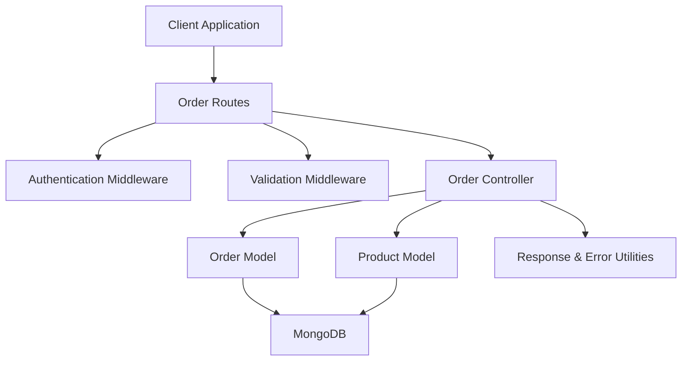
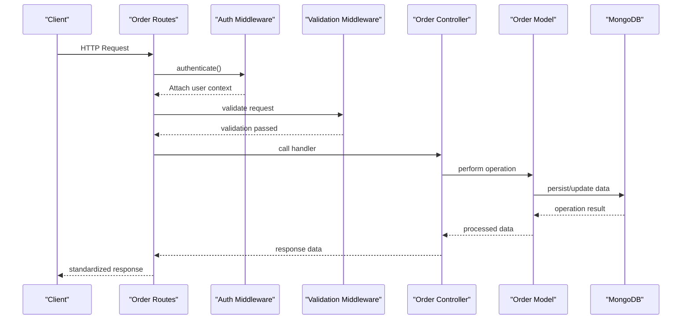
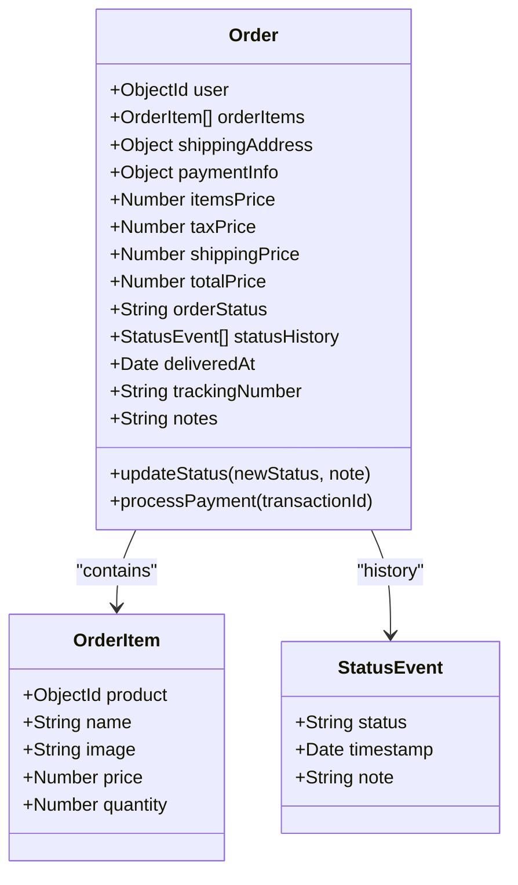
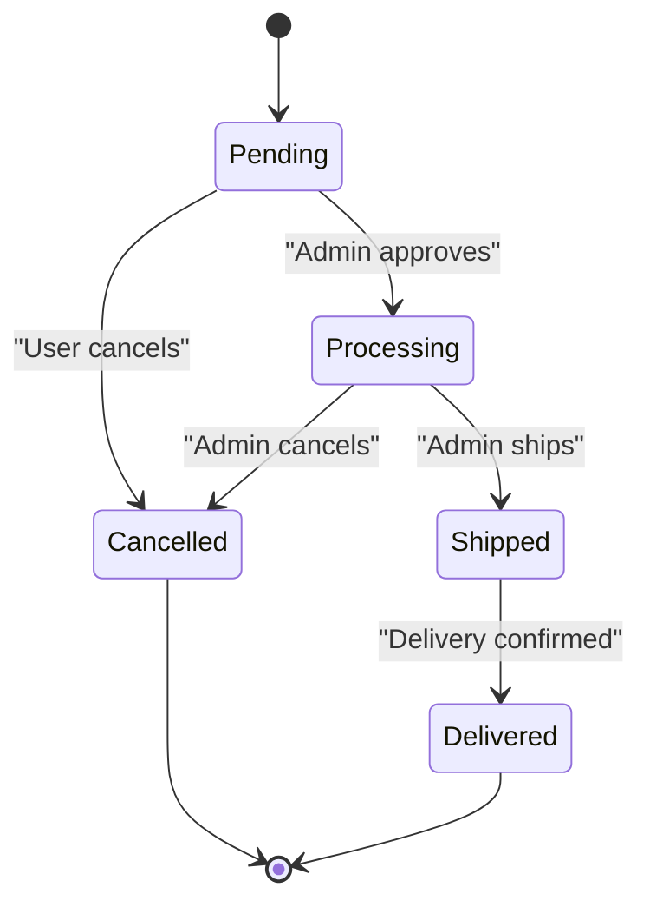
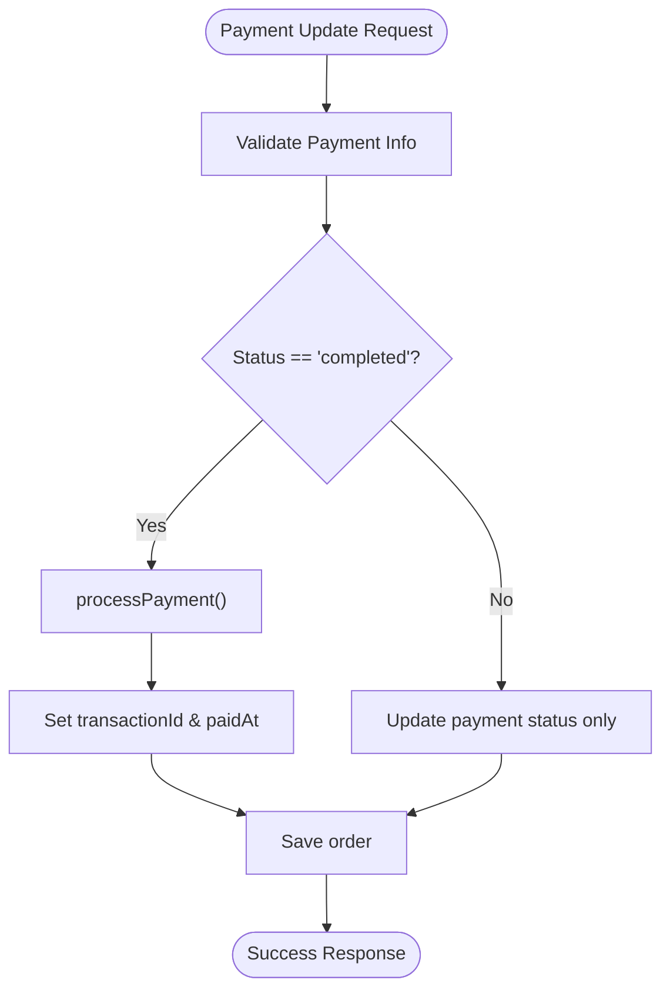
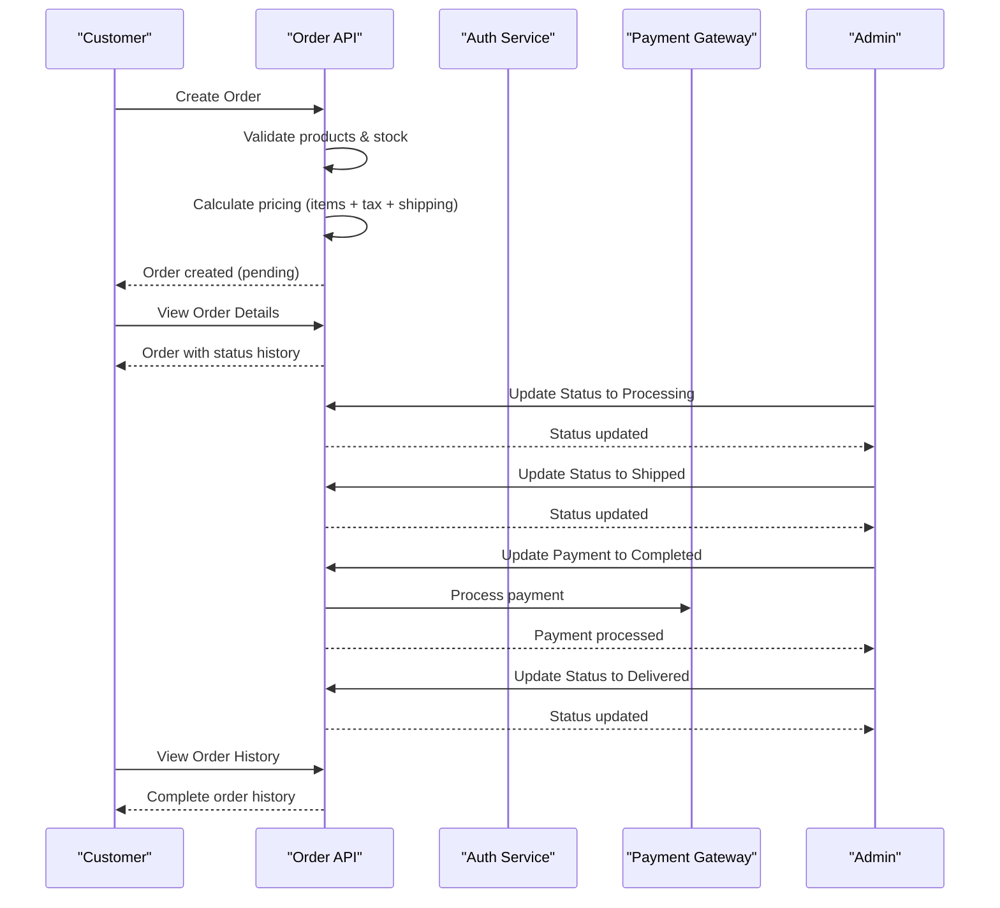
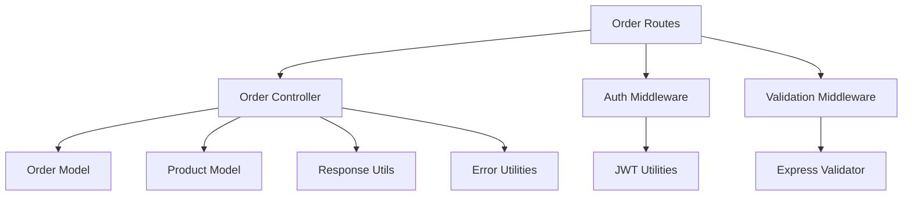

# Order Processing API

<cite>
**Referenced Files in This Document**
- [orderRoutes.js](file://backend/routes/orderRoutes.js)
- [orderController.js](file://backend/controllers/orderController.js)
- [Order.js](file://backend/models/Order.js)
- [auth.js](file://backend/middleware/auth.js)
- [validate.js](file://backend/middleware/validate.js)
- [ApiError.js](file://backend/utils/ApiError.js)
- [ApiResponse.js](file://backend/utils/ApiResponse.js)
- [error.js](file://backend/middleware/error.js)
- [index.js](file://backend/index.js)
- [API_GUIDE.md](file://backend/API_GUIDE.md)
</cite>

## Table of Contents
1. [Introduction](#introduction)
2. [Project Structure](#project-structure)
3. [Core Components](#core-components)
4. [Architecture Overview](#architecture-overview)
5. [Detailed Component Analysis](#detailed-component-analysis)
6. [Dependency Analysis](#dependency-analysis)
7. [Performance Considerations](#performance-considerations)
8. [Troubleshooting Guide](#troubleshooting-guide)
9. [Conclusion](#conclusion)

## Introduction
This document provides comprehensive API documentation for the order processing system. It covers all order-related endpoints, authentication and authorization requirements, request/response schemas, pagination and filtering capabilities, order data structures, status workflows, payment processing integration, and administrative operations. The documentation is designed to be accessible to both technical and non-technical stakeholders while maintaining precision for implementation.

## Project Structure
The order processing API follows a layered architecture:
- Routes define endpoint contracts and apply middleware
- Controllers implement business logic and orchestrate model operations
- Models define data schemas and instance/static methods
- Middleware handles authentication, authorization, and validation
- Utilities standardize responses and error handling



**Diagram sources**
- [orderRoutes.js:1-77](file://backend/routes/orderRoutes.js#L1-L77)
- [orderController.js:1-358](file://backend/controllers/orderController.js#L1-L358)
- [Order.js:1-217](file://backend/models/Order.js#L1-L217)
- [auth.js:1-124](file://backend/middleware/auth.js#L1-L124)
- [validate.js:1-221](file://backend/middleware/validate.js#L1-L221)
- [ApiResponse.js:1-52](file://backend/utils/ApiResponse.js#L1-L52)
- [ApiError.js:1-21](file://backend/utils/ApiError.js#L1-L21)

**Section sources**
- [orderRoutes.js:1-77](file://backend/routes/orderRoutes.js#L1-L77)
- [orderController.js:1-358](file://backend/controllers/orderController.js#L1-L358)
- [Order.js:1-217](file://backend/models/Order.js#L1-L217)
- [auth.js:1-124](file://backend/middleware/auth.js#L1-L124)
- [validate.js:1-221](file://backend/middleware/validate.js#L1-L221)
- [ApiResponse.js:1-52](file://backend/utils/ApiResponse.js#L1-L52)
- [ApiError.js:1-21](file://backend/utils/ApiError.js#L1-L21)
- [error.js:1-121](file://backend/middleware/error.js#L1-L121)
- [index.js:1-119](file://backend/index.js#L1-L119)

## Core Components
- Order Routes: Define all order endpoints with HTTP methods, URL patterns, and middleware chains
- Order Controller: Implements business logic for order creation, retrieval, status updates, cancellations, and statistics
- Order Model: Defines order schema, embedded order items, pricing calculations, and helper methods
- Authentication Middleware: Validates JWT tokens and attaches user context
- Validation Middleware: Provides request validation for order operations
- Response Utilities: Standardizes success and error responses
- Error Handler: Centralizes error processing and response formatting

**Section sources**
- [orderRoutes.js:1-77](file://backend/routes/orderRoutes.js#L1-L77)
- [orderController.js:1-358](file://backend/controllers/orderController.js#L1-L358)
- [Order.js:1-217](file://backend/models/Order.js#L1-L217)
- [auth.js:1-124](file://backend/middleware/auth.js#L1-L124)
- [validate.js:1-221](file://backend/middleware/validate.js#L1-L221)
- [ApiResponse.js:1-52](file://backend/utils/ApiResponse.js#L1-L52)
- [ApiError.js:1-21](file://backend/utils/ApiError.js#L1-L21)
- [error.js:1-121](file://backend/middleware/error.js#L1-L121)

## Architecture Overview
The order processing system integrates multiple layers to provide a robust API:
- Route Layer: Exposes REST endpoints with proper HTTP methods and URL patterns
- Middleware Layer: Applies authentication, authorization, and validation
- Controller Layer: Orchestrates business logic and database operations
- Model Layer: Manages data persistence and schema enforcement
- Utility Layer: Ensures consistent response and error handling



**Diagram sources**
- [orderRoutes.js:1-77](file://backend/routes/orderRoutes.js#L1-L77)
- [auth.js:10-55](file://backend/middleware/auth.js#L10-L55)
- [validate.js:12-25](file://backend/middleware/validate.js#L12-L25)
- [orderController.js:17-69](file://backend/controllers/orderController.js#L17-L69)
- [Order.js:139-165](file://backend/models/Order.js#L139-L165)

## Detailed Component Analysis

### Order Data Structure
The order system uses a structured schema with embedded order items and comprehensive metadata.



**Diagram sources**
- [Order.js:36-126](file://backend/models/Order.js#L36-L126)
- [Order.js:7-30](file://backend/models/Order.js#L7-L30)
- [Order.js:97-107](file://backend/models/Order.js#L97-L107)

**Section sources**
- [Order.js:1-217](file://backend/models/Order.js#L1-L217)

### Order Status Workflow
The system enforces a strict status transition workflow to maintain data integrity.



**Diagram sources**
- [orderController.js:189-202](file://backend/controllers/orderController.js#L189-L202)

### Payment Processing Integration
Payment processing integrates with order status updates and transaction tracking.



**Diagram sources**
- [orderController.js:214-232](file://backend/controllers/orderController.js#L214-L232)
- [Order.js:188-193](file://backend/models/Order.js#L188-L193)

### Endpoint Specifications

#### Order Creation
- **Method**: POST
- **URL**: `/api/orders`
- **Authentication**: Required (Private)
- **Authorization**: None (any authenticated user)
- **Request Body**:
  - `orderItems`: Array of order items (minimum 1)
  - `shippingAddress`: Object containing street, city, state, zipCode
  - `paymentInfo`: Object with method (card, upi, cod, wallet)
  - `notes`: Optional string (max 500 chars)
- **Response**: Created order with calculated pricing and initial status
- **Validation**: Enforces product existence, stock availability, and address completeness

#### User Order History
- **Method**: GET
- **URL**: `/api/orders/my-orders`
- **Authentication**: Required (Private)
- **Authorization**: None
- **Query Parameters**:
  - `page`: Page number (default: 1)
  - `limit`: Items per page (default: 10)
- **Response**: Paginated list of user's orders with product and user details

#### Admin Order Management
- **Method**: GET
- **URL**: `/api/orders`
- **Authentication**: Required (Private)
- **Authorization**: Admin only
- **Query Parameters**:
  - `page`: Page number (default: 1)
  - `limit`: Items per page (default: 10)
  - `status`: Filter by order status
  - `paymentStatus`: Filter by payment status
- **Response**: Paginated list of all orders with user and product details plus statistics

#### Order Details
- **Method**: GET
- **URL**: `/api/orders/:id`
- **Authentication**: Required (Private)
- **Authorization**: Owner or Admin
- **Path Parameters**:
  - `id`: Order ObjectId
- **Response**: Complete order details with populated user and product information

#### Order Cancellation
- **Method**: PUT
- **URL**: `/api/orders/:id/cancel`
- **Authentication**: Required (Private)
- **Authorization**: Owner or Admin
- **Path Parameters**:
  - `id`: Order ObjectId
- **Request Body**:
  - `reason`: Optional cancellation reason
- **Constraints**: Only pending or processing orders can be cancelled

#### Order Statistics
- **Method**: GET
- **URL**: `/api/orders/stats/overview`
- **Authentication**: Required (Private)
- **Authorization**: Admin only
- **Response**: Comprehensive statistics including total orders, revenue, average order value, status breakdown, and monthly revenue trends

#### Status Updates
- **Method**: PUT
- **URL**: `/api/orders/:id/status`
- **Authentication**: Required (Private)
- **Authorization**: Admin only
- **Path Parameters**:
  - `id`: Order ObjectId
- **Request Body**:
  - `status`: New status (pending, processing, shipped, delivered, cancelled)
  - `note`: Optional status change note
- **Validation**: Enforces valid status transitions according to workflow

#### Payment Status Updates
- **Method**: PUT
- **URL**: `/api/orders/:id/payment`
- **Authentication**: Required (Private)
- **Authorization**: Admin only
- **Path Parameters**:
  - `id`: Order ObjectId
- **Request Body**:
  - `status`: Payment status (pending, completed, failed, refunded)
  - `transactionId`: Optional transaction identifier
- **Behavior**: Automatically processes payment when status becomes "completed"

**Section sources**
- [orderRoutes.js:20-77](file://backend/routes/orderRoutes.js#L20-L77)
- [orderController.js:17-358](file://backend/controllers/orderController.js#L17-L358)
- [validate.js:161-213](file://backend/middleware/validate.js#L161-L213)

### Pagination and Filtering
The API supports comprehensive pagination and filtering:
- **Pagination**: `page` (default: 1) and `limit` (default: 10, max: 100)
- **Order Filtering**: `status` (order status) and `paymentStatus` (payment status)
- **Response Metadata**: Includes pagination info and computed statistics

**Section sources**
- [orderController.js:76-118](file://backend/controllers/orderController.js#L76-L118)
- [orderController.js:125-147](file://backend/controllers/orderController.js#L125-L147)
- [API_GUIDE.md:235-240](file://backend/API_GUIDE.md#L235-L240)

### Authentication and Authorization
- **Authentication**: JWT tokens via Authorization header (Bearer token)
- **Authorization Levels**:
  - Private: Any authenticated user
  - Private/Admin: Requires admin role
- **Middleware Chain**: Authentication → Authorization → Validation → Controller

**Section sources**
- [auth.js:10-55](file://backend/middleware/auth.js#L10-L55)
- [auth.js:95-123](file://backend/middleware/auth.js#L95-L123)
- [orderRoutes.js:17-18](file://backend/routes/orderRoutes.js#L17-L18)

### Request/Response Schemas
Standardized response format:
- **Success Response**: `{ success: true, message, data, meta? }`
- **Error Response**: `{ success: false, message, errors? }`
- **Meta Information**: Pagination details and computed statistics

Validation error format:
- **Field-level validation**: Array of `{ field, message }`
- **HTTP Status**: 400 for validation failures

**Section sources**
- [ApiResponse.js:14-26](file://backend/utils/ApiResponse.js#L14-L26)
- [validate.js:12-25](file://backend/middleware/validate.js#L12-L25)
- [ApiError.js:5-18](file://backend/utils/ApiError.js#L5-L18)

### Order Item Management
Order items are embedded documents with:
- Product reference (ObjectId)
- Product name and image
- Current price at order time
- Quantity (minimum 1)
- Automatic stock validation during creation

**Section sources**
- [Order.js:7-30](file://backend/models/Order.js#L7-L30)
- [orderController.js:24-51](file://backend/controllers/orderController.js#L24-L51)

### Complete Order Workflow Example
End-to-end order processing flow:



**Diagram sources**
- [orderController.js:17-69](file://backend/controllers/orderController.js#L17-L69)
- [orderController.js:178-207](file://backend/controllers/orderController.js#L178-L207)
- [orderController.js:214-232](file://backend/controllers/orderController.js#L214-L232)

## Dependency Analysis
The order processing system exhibits clean separation of concerns with minimal coupling:



**Diagram sources**
- [orderRoutes.js:1-77](file://backend/routes/orderRoutes.js#L1-L77)
- [orderController.js:1-6](file://backend/controllers/orderController.js#L1-L6)
- [auth.js:1-4](file://backend/middleware/auth.js#L1-L4)
- [validate.js:1-2](file://backend/middleware/validate.js#L1-L2)

**Section sources**
- [orderRoutes.js:1-77](file://backend/routes/orderRoutes.js#L1-L77)
- [orderController.js:1-6](file://backend/controllers/orderController.js#L1-L6)
- [auth.js:1-4](file://backend/middleware/auth.js#L1-L4)
- [validate.js:1-2](file://backend/middleware/validate.js#L1-L2)

## Performance Considerations
- **Database Indexes**: Strategic indexing on user, status, payment status, and timestamps for efficient queries
- **Population Strategy**: Selective population of user and product details to minimize payload size
- **Pagination**: Default limits prevent excessive memory usage and improve response times
- **Aggregation Queries**: Efficient statistical computations using MongoDB aggregation pipeline
- **Stock Management**: Atomic operations during order creation and cancellation

**Section sources**
- [Order.js:131-134](file://backend/models/Order.js#L131-L134)
- [orderController.js:101-104](file://backend/controllers/orderController.js#L101-L104)
- [orderController.js:259-266](file://backend/controllers/orderController.js#L259-L266)

## Troubleshooting Guide

### Common Error Scenarios
- **Authentication Failures**: Invalid or missing JWT tokens result in 401 status
- **Authorization Issues**: Non-admin users attempting admin-only operations receive 403
- **Validation Errors**: Malformed requests trigger 400 with detailed field-level errors
- **Resource Not Found**: Non-existent orders or products return 404
- **Business Logic Constraints**: Invalid status transitions and unauthorized cancellations

### Error Response Format
All errors follow a standardized format:
```json
{
  "success": false,
  "message": "Error description",
  "errors": [
    { "field": "email", "message": "Email is required" }
  ]
}
```

### Debugging Tips
- Enable development logging for detailed request/response inspection
- Use validation error arrays to identify specific field issues
- Check database indexes for performance bottlenecks
- Monitor aggregation queries for statistical endpoints

**Section sources**
- [error.js:84-103](file://backend/middleware/error.js#L84-L103)
- [validate.js:12-25](file://backend/middleware/validate.js#L12-L25)
- [ApiError.js:5-18](file://backend/utils/ApiError.js#L5-L18)

## Conclusion
The order processing API provides a comprehensive, secure, and scalable solution for e-commerce order management. Its layered architecture ensures maintainability, while strict validation and authorization mechanisms protect data integrity. The standardized response format and comprehensive error handling facilitate reliable client integration. The system's focus on performance through strategic indexing and efficient aggregation queries supports scalability as business demands grow.