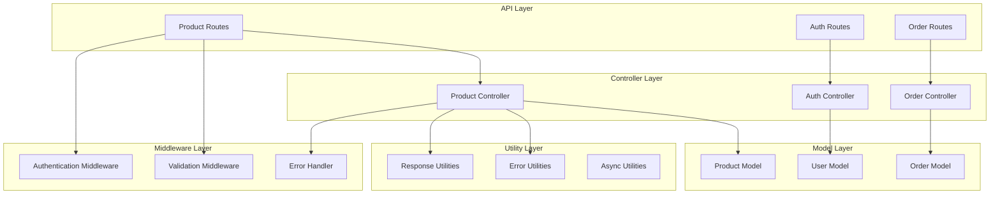
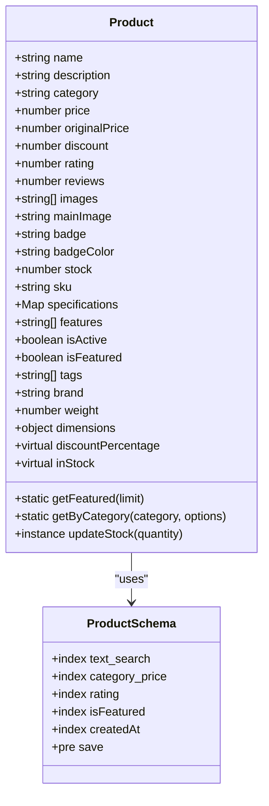
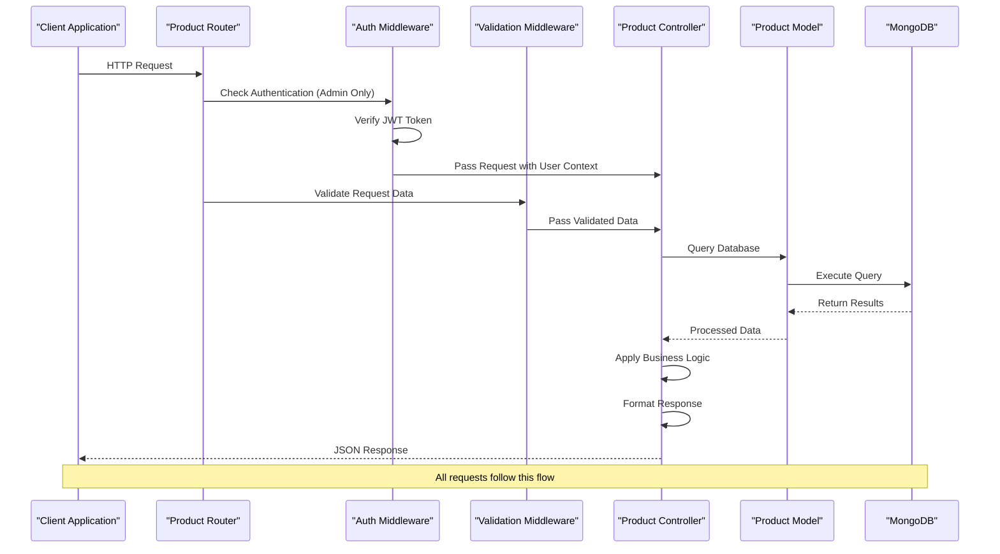
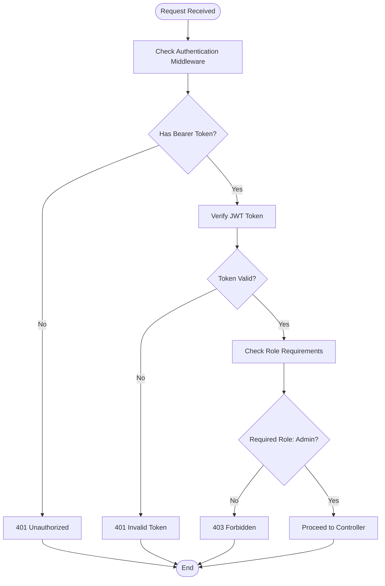
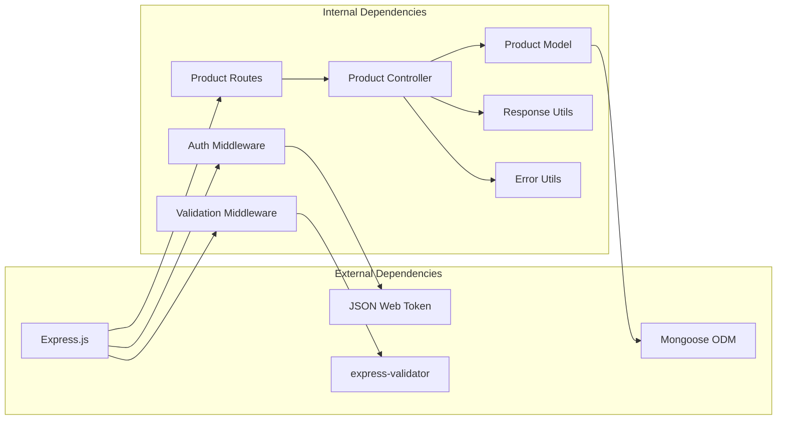

# Product Management API

<cite>
**Referenced Files in This Document**
- [productRoutes.js](file://backend/routes/productRoutes.js)
- [productController.js](file://backend/controllers/productController.js)
- [Product.js](file://backend/models/Product.js)
- [validate.js](file://backend/middleware/validate.js)
- [auth.js](file://backend/middleware/auth.js)
- [ApiResponse.js](file://backend/utils/ApiResponse.js)
- [ApiError.js](file://backend/utils/ApiError.js)
- [error.js](file://backend/middleware/error.js)
- [index.js](file://backend/index.js)
- [API_GUIDE.md](file://backend/API_GUIDE.md)
</cite>

## Table of Contents
1. [Introduction](#introduction)
2. [Project Structure](#project-structure)
3. [Core Components](#core-components)
4. [Architecture Overview](#architecture-overview)
5. [Detailed Component Analysis](#detailed-component-analysis)
6. [Dependency Analysis](#dependency-analysis)
7. [Performance Considerations](#performance-considerations)
8. [Troubleshooting Guide](#troubleshooting-guide)
9. [Conclusion](#conclusion)

## Introduction
This document provides comprehensive API documentation for the product management system. It covers all product-related endpoints including listing, searching, filtering, and administrative operations. The API follows REST conventions with standardized response formats and robust validation and error handling mechanisms.

## Project Structure
The product management API is organized using a layered architecture pattern with clear separation of concerns:



**Diagram sources**
- [productRoutes.js:1-101](file://backend/routes/productRoutes.js#L1-L101)
- [productController.js:1-341](file://backend/controllers/productController.js#L1-L341)
- [Product.js:1-217](file://backend/models/Product.js#L1-L217)

**Section sources**
- [productRoutes.js:1-101](file://backend/routes/productRoutes.js#L1-L101)
- [index.js:50-53](file://backend/index.js#L50-L53)

## Core Components

### Product Data Model
The Product model defines the complete structure for product documents with comprehensive validation rules:



**Diagram sources**
- [Product.js:8-217](file://backend/models/Product.js#L8-L217)

### Response and Error Handling
The API uses standardized response and error handling utilities:

| Component | Purpose | Response Format |
|-----------|---------|----------------|
| successResponse | Standard success responses | `{ success: true, message, data, meta? }` |
| errorResponse | Standard error responses | `{ success: false, message, errors? }` |
| ApiError | Custom error class | `{ statusCode, message, isOperational }` |

**Section sources**
- [ApiResponse.js:14-26](file://backend/utils/ApiResponse.js#L14-L26)
- [ApiError.js:5-17](file://backend/utils/ApiError.js#L5-L17)

## Architecture Overview



**Diagram sources**
- [productRoutes.js:20-21](file://backend/routes/productRoutes.js#L20-L21)
- [auth.js:10-55](file://backend/middleware/auth.js#L10-L55)
- [validate.js:12-25](file://backend/middleware/validate.js#L12-L25)

## Detailed Component Analysis

### Product Endpoints

#### 1. List All Products
**Endpoint**: `GET /api/products`
**Access**: Public
**Purpose**: Retrieve paginated products with advanced filtering and sorting capabilities

**Query Parameters**:
- `page`: Page number (default: 1, min: 1)
- `limit`: Items per page (default: 10, min: 1, max: 100)
- `category`: Filter by product category
- `minPrice`: Minimum price filter
- `maxPrice`: Maximum price filter
- `search`: Text search query
- `featured`: Boolean flag for featured products only
- `badge`: Filter by product badge
- `sortBy`: Sort field (createdAt, price, rating, name)
- `order`: Sort order (asc, desc)

**Response Schema**:
```json
{
  "success": true,
  "message": "Products retrieved successfully",
  "data": [/* Array of Product objects */],
  "meta": {
    "pagination": {
      "page": 1,
      "limit": 10,
      "total": 100,
      "pages": 10,
      "hasMore": true
    }
  }
}
```

**Example Requests**:
- `GET /api/products?page=2&limit=20&category=Smartphones&minPrice=50000&maxPrice=150000&sortBy=price&order=asc`
- `GET /api/products?search=iphone&featured=true&badge=Best Seller`

**Section sources**
- [productRoutes.js:24-28](file://backend/routes/productRoutes.js#L24-L28)
- [productController.js:16-85](file://backend/controllers/productController.js#L16-L85)
- [validate.js:133-155](file://backend/middleware/validate.js#L133-L155)

#### 2. Product Search
**Endpoint**: `GET /api/products/search`
**Access**: Public
**Purpose**: Full-text search across product names and descriptions

**Query Parameters**:
- `q`: Search query (required)
- `page`: Page number (default: 1)
- `limit`: Items per page (default: 10)

**Search Implementation**:
- Uses MongoDB text indexes for efficient full-text search
- Results are scored by relevance
- Case-insensitive search across name and description fields

**Example Request**:
- `GET /api/products/search?q=wireless headphones&page=1&limit=15`

**Section sources**
- [productRoutes.js:30-35](file://backend/routes/productRoutes.js#L30-L35)
- [productController.js:295-326](file://backend/controllers/productController.js#L295-L326)

#### 3. Featured Products
**Endpoint**: `GET /api/products/featured/list`
**Access**: Public
**Purpose**: Retrieve featured products sorted by rating

**Query Parameters**:
- `limit`: Maximum number of featured products (default: 8)

**Example Request**:
- `GET /api/products/featured/list?limit=12`

**Section sources**
- [productRoutes.js:37-42](file://backend/routes/productRoutes.js#L37-L42)
- [productController.js:126-134](file://backend/controllers/productController.js#L126-L134)

#### 4. Category Listing
**Endpoint**: `GET /api/products/categories/all`
**Access**: Public
**Purpose**: Get all available categories with product counts and price ranges

**Response Schema**:
```json
{
  "success": true,
  "message": "Categories retrieved successfully",
  "data": [
    {
      "name": "Smartphones",
      "productCount": 25,
      "priceRange": {
        "min": 15000,
        "max": 120000
      }
    }
  ]
}
```

**Section sources**
- [productRoutes.js:44-49](file://backend/routes/productRoutes.js#L44-L49)
- [productController.js:179-203](file://backend/controllers/productController.js#L179-L203)

#### 5. Category Filter
**Endpoint**: `GET /api/products/category/:category`
**Access**: Public
**Purpose**: Filter products by category with pagination

**Path Parameters**:
- `category`: Category name (validated against predefined list)

**Query Parameters**:
- `page`: Page number (default: 1)
- `limit`: Items per page (default: 10)
- `sortBy`: Sort field (default: createdAt)
- `order`: Sort order (default: desc)

**Valid Categories**: Audio, Laptops, Smartphones, Tablets, Wearables, TVs, Accessories, Gaming

**Section sources**
- [productRoutes.js:51-56](file://backend/routes/productRoutes.js#L51-L56)
- [productController.js:141-172](file://backend/controllers/productController.js#L141-L172)

#### 6. SKU Lookup
**Endpoint**: `GET /api/products/sku/:sku`
**Access**: Public
**Purpose**: Retrieve product by SKU (stock keeping unit)

**Path Parameters**:
- `sku`: Unique product identifier

**Section sources**
- [productRoutes.js:58-63](file://backend/routes/productRoutes.js#L58-L63)
- [productController.js:109-119](file://backend/controllers/productController.js#L109-L119)

#### 7. Individual Product Retrieval
**Endpoint**: `GET /api/products/:id`
**Access**: Public
**Purpose**: Get single product by MongoDB ObjectId

**Path Parameters**:
- `id`: Product MongoDB ObjectId

**Section sources**
- [productRoutes.js:65-70](file://backend/routes/productRoutes.js#L65-L70)
- [productController.js:92-102](file://backend/controllers/productController.js#L92-L102)

#### 8. Administrative Operations

##### Create Product (Admin Only)
**Endpoint**: `POST /api/products`
**Access**: Private/Admin
**Purpose**: Create new product

**Request Body** (Validation Rules):
- `name`: Required, max 100 characters
- `description`: Required, max 2000 characters
- `category`: Required, must be one of predefined categories
- `price`: Required, positive number
- `stock`: Optional, non-negative integer
- `mainImage`: Required, valid URL

**Response**: Product object with creation timestamp

**Section sources**
- [productRoutes.js:72-77](file://backend/routes/productRoutes.js#L72-L77)
- [validate.js:73-104](file://backend/middleware/validate.js#L73-L104)
- [productController.js:210-216](file://backend/controllers/productController.js#L210-L216)

##### Update Product (Admin Only)
**Endpoint**: `PUT /api/products/:id`
**Access**: Private/Admin
**Purpose**: Update existing product

**Path Parameters**:
- `id`: Product MongoDB ObjectId

**Request Body** (Partial Validation):
- `name`: Optional, max 100 characters
- `price`: Optional, positive number
- `stock`: Optional, non-negative integer

**Section sources**
- [productRoutes.js:79-84](file://backend/routes/productRoutes.js#L79-L84)
- [validate.js:106-124](file://backend/middleware/validate.js#L106-L124)
- [productController.js:223-238](file://backend/controllers/productController.js#L223-L238)

##### Update Stock (Admin Only)
**Endpoint**: `PATCH /api/products/:id/stock`
**Access**: Private/Admin
**Purpose**: Update product stock quantity

**Path Parameters**:
- `id`: Product MongoDB ObjectId

**Request Body**:
- `quantity`: Number (required)

**Response Schema**:
```json
{
  "success": true,
  "message": "Stock updated successfully",
  "data": {
    "productId": "ObjectId",
    "stock": 50,
    "inStock": true
  }
}
```

**Section sources**
- [productRoutes.js:86-91](file://backend/routes/productRoutes.js#L86-L91)
- [productController.js:266-288](file://backend/controllers/productController.js#L266-L288)

##### Delete Product (Admin Only)
**Endpoint**: `DELETE /api/products/:id`
**Access**: Private/Admin
**Purpose**: Soft delete product (sets isActive to false)

**Path Parameters**:
- `id`: Product MongoDB ObjectId

**Section sources**
- [productRoutes.js:93-98](file://backend/routes/productRoutes.js#L93-L98)
- [productController.js:245-259](file://backend/controllers/productController.js#L245-L259)

### Authentication and Authorization



**Diagram sources**
- [auth.js:10-55](file://backend/middleware/auth.js#L10-L55)
- [auth.js:95-116](file://backend/middleware/auth.js#L95-L116)

**Section sources**
- [auth.js:10-55](file://backend/middleware/auth.js#L10-L55)
- [auth.js:95-116](file://backend/middleware/auth.js#L95-L116)

## Dependency Analysis



**Diagram sources**
- [index.js:3-6](file://backend/index.js#L3-L6)
- [productController.js:1-4](file://backend/controllers/productController.js#L1-L4)

### Key Dependencies and Relationships

| Component | Dependencies | Purpose |
|-----------|--------------|---------|
| Product Routes | Express Router, Product Controller | Define API endpoints |
| Product Controller | Product Model, Async Handler, Response Utils | Business logic implementation |
| Product Model | Mongoose Schema, Virtual Fields | Data structure and validation |
| Auth Middleware | JWT Utils, User Model | Authentication and authorization |
| Validation Middleware | express-validator | Request data validation |
| Response Utils | Standardized response format | Consistent API responses |
| Error Utils | Custom error handling | Unified error management |

**Section sources**
- [productRoutes.js:1-17](file://backend/routes/productRoutes.js#L1-L17)
- [productController.js:1-4](file://backend/controllers/productController.js#L1-L4)
- [Product.js:1-217](file://backend/models/Product.js#L1-L217)

## Performance Considerations

### Database Indexing Strategy
The Product model implements strategic indexing for optimal query performance:

| Index Type | Field(s) | Purpose |
|------------|----------|---------|
| Text Index | name, description | Full-text search operations |
| Compound Index | category, price | Category filtering with price sorting |
| Single Index | rating | Rating-based sorting |
| Single Index | isFeatured | Featured product queries |
| Single Index | createdAt | Newest product sorting |

### Query Optimization
- **Pagination**: Implemented with skip/limit for efficient large dataset handling
- **Filtering**: MongoDB query construction with selective field inclusion
- **Text Search**: Dedicated text indexes for improved search performance
- **Sorting**: Index-aware sorting with compound indexes for category+price queries

### Caching Opportunities
Consider implementing Redis caching for:
- Frequently accessed product lists
- Category aggregations
- Featured products
- Popular search queries

## Troubleshooting Guide

### Common Error Scenarios

| Error Type | HTTP Status | Cause | Solution |
|------------|-------------|-------|----------|
| 400 Bad Request | 400 | Validation failure | Check request payload against validation rules |
| 401 Unauthorized | 401 | Missing/invalid token | Verify Bearer token format and expiration |
| 403 Forbidden | 403 | Insufficient permissions | Ensure user has admin role |
| 404 Not Found | 404 | Product not found | Verify product ID exists and is active |
| 409 Conflict | 409 | Duplicate SKU | Use unique SKU or let system auto-generate |
| 500 Internal Error | 500 | Server issue | Check database connectivity and logs |

### Validation Error Response Format
```json
{
  "success": false,
  "message": "Validation failed",
  "errors": [
    {
      "field": "email",
      "message": "Email is required"
    }
  ]
}
```

### Debugging Tips
1. **Enable Development Logging**: Server logs all requests in development mode
2. **Check Database Connection**: Verify MongoDB connection string and credentials
3. **Validate JWT Tokens**: Ensure tokens are properly signed and not expired
4. **Test Endpoints Individually**: Use curl or Postman to isolate issues
5. **Review Index Status**: Monitor database index health and query performance

**Section sources**
- [error.js:84-103](file://backend/middleware/error.js#L84-L103)
- [ApiError.js:5-17](file://backend/utils/ApiError.js#L5-L17)

## Conclusion

The Product Management API provides a comprehensive, secure, and scalable solution for e-commerce product operations. Key strengths include:

- **Robust Security**: JWT-based authentication with role-based access control
- **Flexible Filtering**: Advanced query parameters for precise product discovery
- **Standardized Responses**: Consistent API response format across all endpoints
- **Comprehensive Validation**: Client-side and server-side validation for data integrity
- **Performance Optimization**: Strategic indexing and pagination for large datasets
- **Error Handling**: Comprehensive error management with meaningful error messages

The API supports both consumer-facing operations (public endpoints) and administrative functions (admin-only endpoints), making it suitable for modern e-commerce applications requiring both customer experience and backend management capabilities.