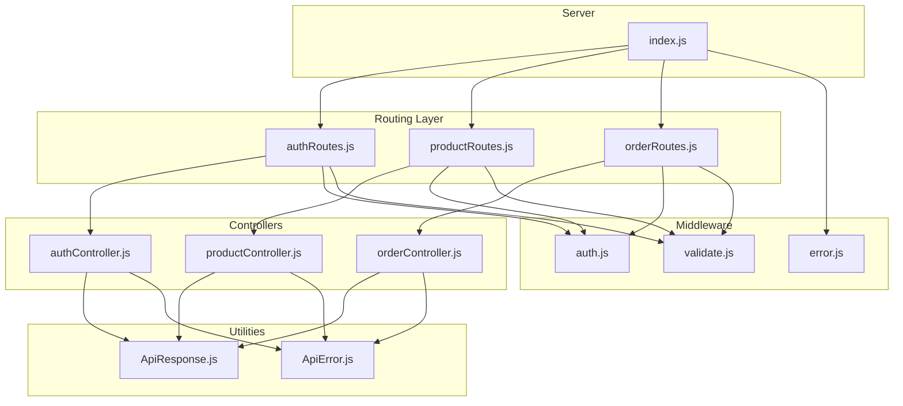
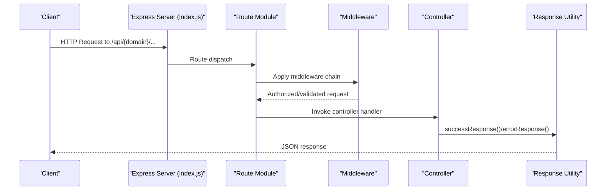
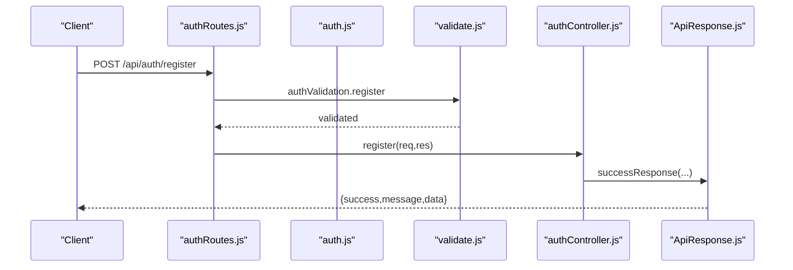
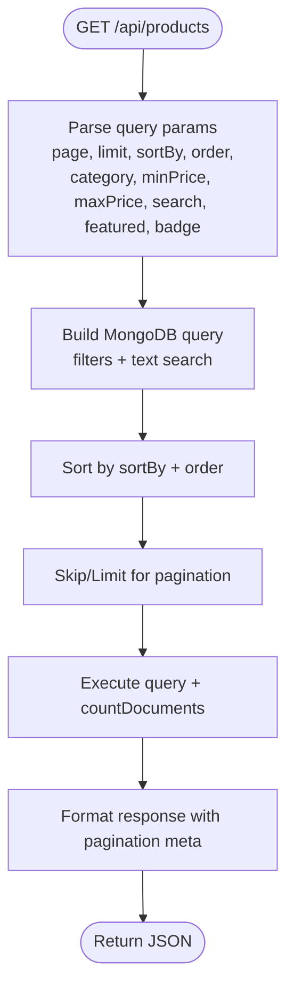
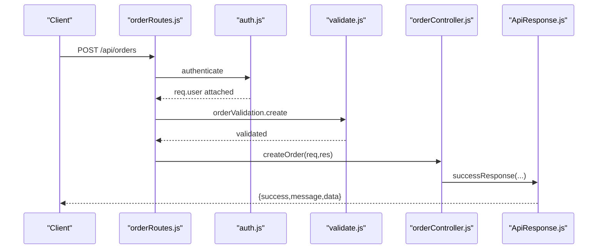
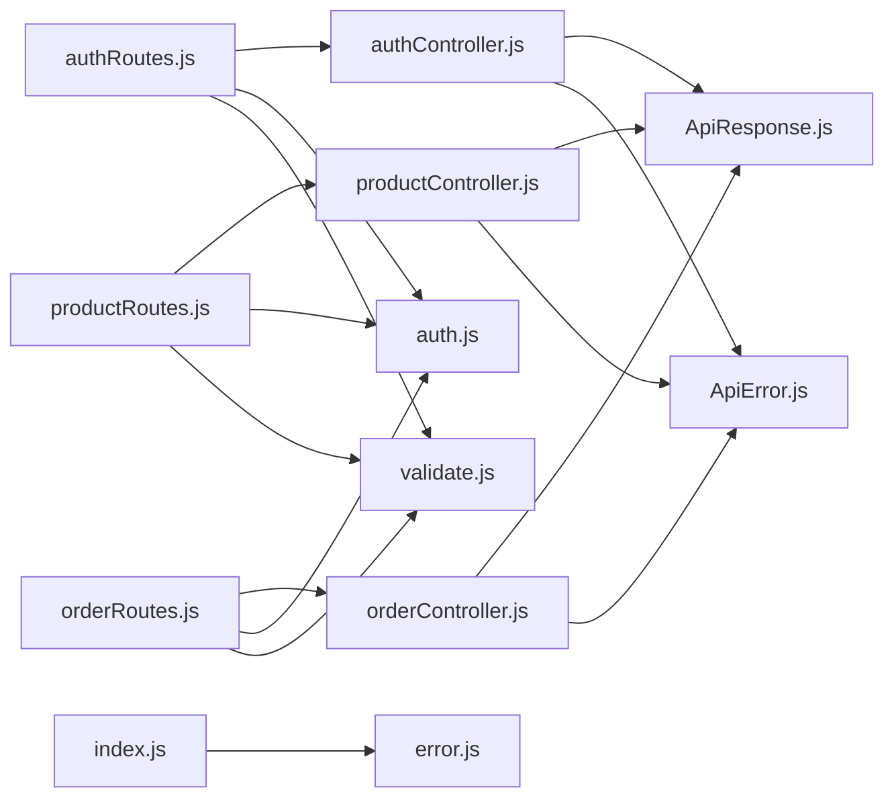

# API Routing Organization

<cite>
**Referenced Files in This Document**
- [index.js](file://backend/index.js)
- [authRoutes.js](file://backend/routes/authRoutes.js)
- [productRoutes.js](file://backend/routes/productRoutes.js)
- [orderRoutes.js](file://backend/routes/orderRoutes.js)
- [authController.js](file://backend/controllers/authController.js)
- [productController.js](file://backend/controllers/productController.js)
- [orderController.js](file://backend/controllers/orderController.js)
- [auth.js](file://backend/middleware/auth.js)
- [validate.js](file://backend/middleware/validate.js)
- [ApiResponse.js](file://backend/utils/ApiResponse.js)
- [ApiError.js](file://backend/utils/ApiError.js)
- [error.js](file://backend/middleware/error.js)
- [API_GUIDE.md](file://backend/API_GUIDE.md)
</cite>

## Table of Contents
1. [Introduction](#introduction)
2. [Project Structure](#project-structure)
3. [Core Components](#core-components)
4. [Architecture Overview](#architecture-overview)
5. [Detailed Component Analysis](#detailed-component-analysis)
6. [Dependency Analysis](#dependency-analysis)
7. [Performance Considerations](#performance-considerations)
8. [Troubleshooting Guide](#troubleshooting-guide)
9. [Conclusion](#conclusion)

## Introduction
This document explains the API routing organization and endpoint structure of the backend. It covers how routes are organized by functional domains (authentication, products, orders), HTTP method mapping, URL pattern conventions, parameter handling, query string processing, request body validation, middleware integration, and response formatting. It also outlines RESTful design principles, endpoint naming conventions, and strategies for API versioning.

## Project Structure
The backend follows a modular Express architecture:
- Routes define URL patterns and HTTP methods per domain.
- Controllers encapsulate business logic and orchestrate model interactions.
- Middleware enforces authentication, authorization, and request validation.
- Utilities standardize response and error handling.
- The main server initializes middleware, mounts routes, and handles errors.

**Diagram sources**
- [index.js:50-75](file://backend/index.js#L50-L75)
- [authRoutes.js:1-85](file://backend/routes/authRoutes.js#L1-L85)
- [productRoutes.js:1-101](file://backend/routes/productRoutes.js#L1-L101)
- [orderRoutes.js:1-77](file://backend/routes/orderRoutes.js#L1-L77)
- [authController.js:1-299](file://backend/controllers/authController.js#L1-L299)
- [productController.js:1-341](file://backend/controllers/productController.js#L1-L341)
- [orderController.js:1-358](file://backend/controllers/orderController.js#L1-L358)
- [auth.js:1-124](file://backend/middleware/auth.js#L1-L124)
- [validate.js:1-221](file://backend/middleware/validate.js#L1-L221)
- [ApiResponse.js:1-52](file://backend/utils/ApiResponse.js#L1-L52)
- [ApiError.js:1-21](file://backend/utils/ApiError.js#L1-L21)
- [error.js:1-121](file://backend/middleware/error.js#L1-L121)

**Section sources**
- [index.js:50-75](file://backend/index.js#L50-L75)
- [API_GUIDE.md:28-69](file://backend/API_GUIDE.md#L28-L69)

## Core Components
- Route modules define domain-specific endpoints under /api/{domain}.
- Controllers implement business logic and return standardized responses.
- Middleware enforces authentication, authorization, and validation.
- Utilities provide consistent response and error structures.

Key responsibilities:
- Routes: Define HTTP methods, URL patterns, and attach middleware.
- Controllers: Extract params/query/body, interact with models, and format responses.
- Middleware: Authenticate/authorize users and validate requests.
- Utilities: Ensure uniform success/error responses and error classification.

**Section sources**
- [authRoutes.js:1-85](file://backend/routes/authRoutes.js#L1-L85)
- [productRoutes.js:1-101](file://backend/routes/productRoutes.js#L1-L101)
- [orderRoutes.js:1-77](file://backend/routes/orderRoutes.js#L1-L77)
- [authController.js:1-299](file://backend/controllers/authController.js#L1-L299)
- [productController.js:1-341](file://backend/controllers/productController.js#L1-L341)
- [orderController.js:1-358](file://backend/controllers/orderController.js#L1-L358)
- [auth.js:1-124](file://backend/middleware/auth.js#L1-L124)
- [validate.js:1-221](file://backend/middleware/validate.js#L1-L221)
- [ApiResponse.js:1-52](file://backend/utils/ApiResponse.js#L1-L52)
- [ApiError.js:1-21](file://backend/utils/ApiError.js#L1-L21)

## Architecture Overview
The server mounts three route groups under /api:
- /api/auth for authentication and user profile operations
- /api/products for product catalog, search, and inventory
- /api/orders for order lifecycle and administrative reporting

Each route module imports its controller and applies domain-specific middleware (authentication, authorization, and validation). Controllers use async handlers and standardized response utilities.

**Diagram sources**
- [index.js:50-75](file://backend/index.js#L50-L75)
- [authRoutes.js:1-85](file://backend/routes/authRoutes.js#L1-L85)
- [productRoutes.js:1-101](file://backend/routes/productRoutes.js#L1-L101)
- [orderRoutes.js:1-77](file://backend/routes/orderRoutes.js#L1-L77)
- [auth.js:10-55](file://backend/middleware/auth.js#L10-L55)
- [validate.js:12-25](file://backend/middleware/validate.js#L12-L25)
- [ApiResponse.js:14-26](file://backend/utils/ApiResponse.js#L14-L26)

## Detailed Component Analysis

### Authentication Domain (/api/auth)
- Purpose: User registration, login, profile management, password change, and address management.
- Key endpoints:
  - POST /api/auth/register
  - POST /api/auth/login
  - GET /api/auth/profile
  - PUT /api/auth/profile
  - PUT /api/auth/change-password
  - POST /api/auth/addresses
  - PUT /api/auth/addresses/:addressId
  - DELETE /api/auth/addresses/:addressId
  - POST /api/auth/logout

- Route organization:
  - Public endpoints: register, login
  - Private endpoints: profile, change-password, addresses, logout
  - Route parameters: :addressId for address operations
  - Query processing: none in auth routes

- Middleware:
  - Authentication: protect private endpoints
  - Validation: request body validation for register/login

- Response formatting:
  - Standardized success messages and data payloads
  - Token included on register/login

- Example definitions and usage:
  - Route definition: [authRoutes.js:26](file://backend/routes/authRoutes.js#L26), [authRoutes.js:33](file://backend/routes/authRoutes.js#L33), [authRoutes.js:40](file://backend/routes/authRoutes.js#L40)
  - Controller handlers: [authController.js:17](file://backend/controllers/authController.js#L17), [authController.js:54](file://backend/controllers/authController.js#L54), [authController.js:101](file://backend/controllers/authController.js#L101)
  - Validation: [validate.js:30](file://backend/middleware/validate.js#L30), [validate.js:55](file://backend/middleware/validate.js#L55)

**Diagram sources**
- [authRoutes.js:26](file://backend/routes/authRoutes.js#L26)
- [validate.js:30](file://backend/middleware/validate.js#L30)
- [authController.js:17](file://backend/controllers/authController.js#L17)
- [ApiResponse.js:14-26](file://backend/utils/ApiResponse.js#L14-L26)

**Section sources**
- [authRoutes.js:1-85](file://backend/routes/authRoutes.js#L1-L85)
- [authController.js:1-299](file://backend/controllers/authController.js#L1-L299)
- [validate.js:30](file://backend/middleware/validate.js#L30)
- [auth.js:10-55](file://backend/middleware/auth.js#L10-L55)

### Products Domain (/api/products)
- Purpose: Product catalog, search, category filtering, stock updates, and admin CRUD.
- Key endpoints:
  - GET /api/products (filtering, sorting, pagination)
  - GET /api/products/search
  - GET /api/products/featured/list
  - GET /api/products/categories/all
  - GET /api/products/category/:category
  - GET /api/products/sku/:sku
  - GET /api/products/:id
  - POST /api/products (admin)
  - PUT /api/products/:id (admin)
  - PATCH /api/products/:id/stock (admin)
  - DELETE /api/products/:id (admin)

- Route organization:
  - Public endpoints: list, search, featured, categories, category/:category, sku/:sku, :id
  - Admin-only endpoints: create, update, stock, delete
  - Route parameters: :id for product operations, :category for category filtering, :sku for SKU lookup
  - Query processing: pagination, sorting, filtering (page, limit, sortBy, order, category, minPrice, maxPrice, search, featured, badge)

- Middleware:
  - Authentication and admin-only restrictions for admin endpoints
  - Validation for create/update/list operations

- Response formatting:
  - Standardized success responses with optional pagination metadata

- Example definitions and usage:
  - Route definition: [productRoutes.js:28](file://backend/routes/productRoutes.js#L28), [productRoutes.js:56](file://backend/routes/productRoutes.js#L56), [productRoutes.js:77](file://backend/routes/productRoutes.js#L77)
  - Controller handlers: [productController.js:16](file://backend/controllers/productController.js#L16), [productController.js:92](file://backend/controllers/productController.js#L92), [productController.js:210](file://backend/controllers/productController.js#L210)
  - Validation: [validate.js:72](file://backend/middleware/validate.js#L72), [validate.js:133](file://backend/middleware/validate.js#L133)

**Diagram sources**
- [productController.js:16-85](file://backend/controllers/productController.js#L16-L85)

**Section sources**
- [productRoutes.js:1-101](file://backend/routes/productRoutes.js#L1-L101)
- [productController.js:1-341](file://backend/controllers/productController.js#L1-L341)
- [validate.js:72](file://backend/middleware/validate.js#L72)
- [auth.js:115-123](file://backend/middleware/auth.js#L115-L123)

### Orders Domain (/api/orders)
- Purpose: Order creation, retrieval, cancellation, and administrative management.
- Key endpoints:
  - POST /api/orders
  - GET /api/orders/my-orders
  - GET /api/orders/stats/overview (admin)
  - GET /api/orders/:id
  - PUT /api/orders/:id/status (admin)
  - PUT /api/orders/:id/payment (admin)
  - PUT /api/orders/:id/cancel
  - GET /api/orders (admin)

- Route organization:
  - Private endpoints: create, my-orders, cancel, :id details
  - Admin-only endpoints: stats, all orders, status/payment updates
  - Route parameters: :id for order operations
  - Query processing: pagination and filters for admin orders

- Middleware:
  - Authentication and admin-only restrictions for admin endpoints
  - Validation for create and status updates

- Response formatting:
  - Standardized success responses with optional pagination and stats metadata

- Example definitions and usage:
  - Route definition: [orderRoutes.js:25](file://backend/routes/orderRoutes.js#L25), [orderRoutes.js:32](file://backend/routes/orderRoutes.js#L32), [orderRoutes.js:74](file://backend/routes/orderRoutes.js#L74)
  - Controller handlers: [orderController.js:17](file://backend/controllers/orderController.js#L17), [orderController.js:125](file://backend/controllers/orderController.js#L125), [orderController.js:178](file://backend/controllers/orderController.js#L178)
  - Validation: [validate.js:161](file://backend/middleware/validate.js#L161), [validate.js:195](file://backend/middleware/validate.js#L195)

**Diagram sources**
- [orderRoutes.js:25](file://backend/routes/orderRoutes.js#L25)
- [auth.js:10-55](file://backend/middleware/auth.js#L10-L55)
- [validate.js:161](file://backend/middleware/validate.js#L161)
- [orderController.js:17](file://backend/controllers/orderController.js#L17)
- [ApiResponse.js:14-26](file://backend/utils/ApiResponse.js#L14-L26)

**Section sources**
- [orderRoutes.js:1-77](file://backend/routes/orderRoutes.js#L1-L77)
- [orderController.js:1-358](file://backend/controllers/orderController.js#L1-L358)
- [validate.js:161](file://backend/middleware/validate.js#L161)
- [auth.js:10-55](file://backend/middleware/auth.js#L10-L55)

## Dependency Analysis
- Routes depend on controllers and middleware.
- Controllers depend on models, async handlers, and response utilities.
- Middleware depends on JWT utilities and validation helpers.
- Error middleware centralizes error handling across all routes.

**Diagram sources**
- [authRoutes.js:1-15](file://backend/routes/authRoutes.js#L1-L15)
- [productRoutes.js:1-17](file://backend/routes/productRoutes.js#L1-L17)
- [orderRoutes.js:1-14](file://backend/routes/orderRoutes.js#L1-L14)
- [authController.js:1-6](file://backend/controllers/authController.js#L1-L6)
- [productController.js:1-4](file://backend/controllers/productController.js#L1-L4)
- [orderController.js:1-5](file://backend/controllers/orderController.js#L1-L5)
- [auth.js:1-4](file://backend/middleware/auth.js#L1-L4)
- [validate.js:1-2](file://backend/middleware/validate.js#L1-L2)
- [ApiResponse.js:1-52](file://backend/utils/ApiResponse.js#L1-L52)
- [ApiError.js:1-21](file://backend/utils/ApiError.js#L1-L21)
- [error.js:1-121](file://backend/middleware/error.js#L1-L121)
- [index.js:50-75](file://backend/index.js#L50-L75)

**Section sources**
- [index.js:50-75](file://backend/index.js#L50-L75)
- [authRoutes.js:1-15](file://backend/routes/authRoutes.js#L1-L15)
- [productRoutes.js:1-17](file://backend/routes/productRoutes.js#L1-L17)
- [orderRoutes.js:1-14](file://backend/routes/orderRoutes.js#L1-L14)

## Performance Considerations
- Pagination: Implemented across product and order listings to limit payload sizes.
- Indexing: Text search relies on MongoDB text indexes; ensure indexes exist for efficient search.
- Population: Controllers populate related documents; minimize population depth and fields to reduce overhead.
- Validation: Early validation prevents unnecessary database calls.
- Query limits: Enforced in validation to prevent excessive resource usage.

[No sources needed since this section provides general guidance]

## Troubleshooting Guide
Common issues and resolutions:
- Authentication failures:
  - Missing or invalid Bearer token
  - Deactivated user account
  - Use the authentication middleware to diagnose and return appropriate errors.

- Validation errors:
  - Invalid input fields or types
  - Validation middleware aggregates field-specific errors and returns structured failure responses.

- Authorization failures:
  - Non-admin users attempting admin-only endpoints
  - Use admin-only middleware to enforce role-based access.

- Resource not found:
  - Invalid ObjectId or missing records
  - Centralized error handler converts cast/duplicate errors to meaningful HTTP responses.

- Request body validation:
  - Ensure Content-Type is application/json
  - Validate required fields per endpoint

**Section sources**
- [auth.js:10-55](file://backend/middleware/auth.js#L10-L55)
- [validate.js:12-25](file://backend/middleware/validate.js#L12-L25)
- [error.js:84-103](file://backend/middleware/error.js#L84-L103)
- [ApiError.js:5-17](file://backend/utils/ApiError.js#L5-L17)

## Conclusion
The API follows a clean, modular architecture with domain-based routing, explicit middleware chains, and standardized response/error handling. Endpoints adhere to RESTful principles with clear HTTP methods, resource-oriented URLs, and consistent status codes. Validation and authentication are enforced early in the pipeline, while controllers focus on business logic and response formatting. The design supports scalability and maintainability through separation of concerns and reusable utilities.