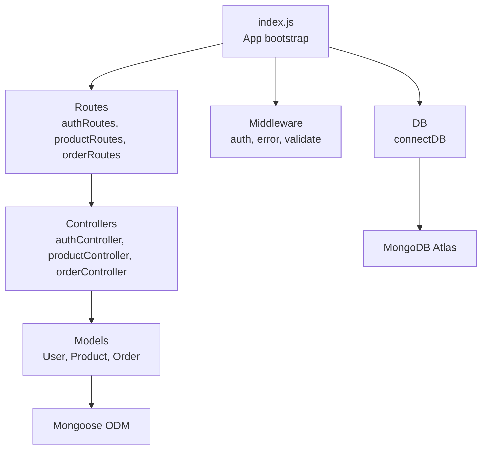
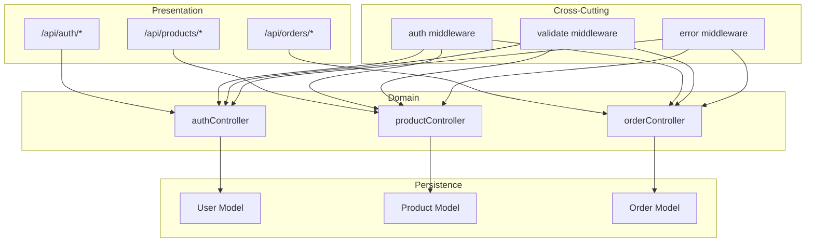
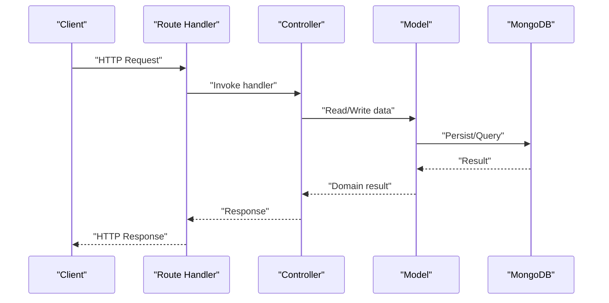
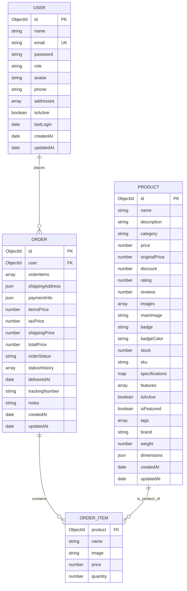
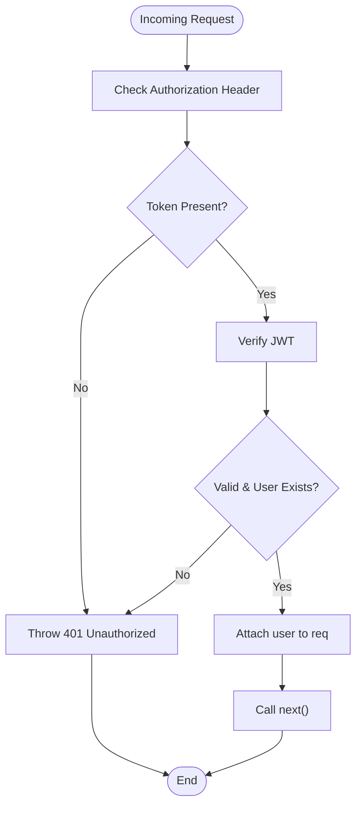
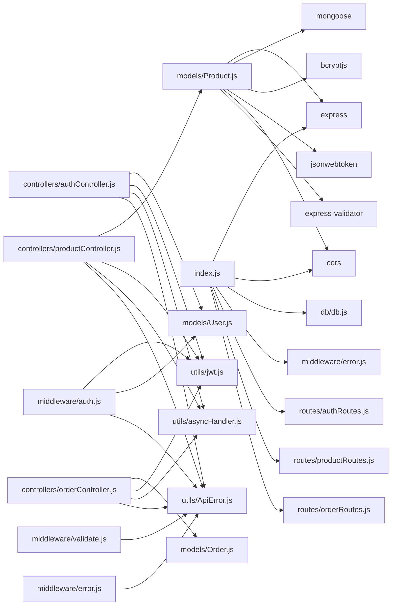

# Backend Architecture

<cite>
**Referenced Files in This Document**
- [index.js](file://backend/index.js)
- [package.json](file://backend/package.json)
- [API_GUIDE.md](file://backend/API_GUIDE.md)
- [db.js](file://backend/db/db.js)
- [authController.js](file://backend/controllers/authController.js)
- [productController.js](file://backend/controllers/productController.js)
- [orderController.js](file://backend/controllers/orderController.js)
- [auth.js](file://backend/middleware/auth.js)
- [error.js](file://backend/middleware/error.js)
- [validate.js](file://backend/middleware/validate.js)
- [jwt.js](file://backend/utils/jwt.js)
- [asyncHandler.js](file://backend/utils/asyncHandler.js)
- [ApiError.js](file://backend/utils/ApiError.js)
- [User.js](file://backend/models/User.js)
- [Product.js](file://backend/models/Product.js)
- [Order.js](file://backend/models/Order.js)
</cite>

## Table of Contents
1. [Introduction](#introduction)
2. [Project Structure](#project-structure)
3. [Core Components](#core-components)
4. [Architecture Overview](#architecture-overview)
5. [Detailed Component Analysis](#detailed-component-analysis)
6. [Dependency Analysis](#dependency-analysis)
7. [Performance Considerations](#performance-considerations)
8. [Security Considerations](#security-considerations)
9. [Production Deployment Topology](#production-deployment-topology)
10. [Troubleshooting Guide](#troubleshooting-guide)
11. [Conclusion](#conclusion)

## Introduction
This document describes the backend architecture for the Node.js/Express e-commerce API. The system follows an MVC-like structure with clear separation of concerns:
- Controllers orchestrate request handling and coordinate business logic.
- Models define data schemas and encapsulate persistence logic via Mongoose ODM.
- Middleware enforces authentication, authorization, validation, and centralized error handling.
- Routes define the RESTful API surface organized by domain areas (authentication, products, orders).
- Utilities provide shared helpers for async handling, JWT operations, and error modeling.

The backend connects to MongoDB Atlas, supports CORS for cross-origin requests, and exposes health checks and standardized API responses. It implements role-based access control, robust validation, and comprehensive error handling patterns.

## Project Structure
The backend is organized by feature and responsibility:
- Entry point initializes Express, configures middleware, mounts routes, and starts the server.
- Controllers implement action handlers for each resource.
- Models define Mongoose schemas with indexes, virtuals, and pre/post hooks.
- Middleware handles authentication, authorization, validation, and error management.
- Utils provide reusable utilities for JWT, async wrappers, and error classes.
- Routes group endpoints by domain and apply appropriate middleware.

**Diagram sources**
- [index.js:1-119](file://backend/index.js#L1-L119)
- [authController.js:1-299](file://backend/controllers/authController.js#L1-L299)
- [productController.js:1-341](file://backend/controllers/productController.js#L1-L341)
- [orderController.js:1-358](file://backend/controllers/orderController.js#L1-L358)
- [User.js:1-135](file://backend/models/User.js#L1-L135)
- [Product.js:1-217](file://backend/models/Product.js#L1-L217)
- [Order.js:1-217](file://backend/models/Order.js#L1-L217)
- [db.js:1-37](file://backend/db/db.js#L1-L37)

**Section sources**
- [index.js:1-119](file://backend/index.js#L1-L119)
- [package.json:1-33](file://backend/package.json#L1-L33)

## Core Components
- Express application initialization, middleware stack, and route mounting.
- Database connection abstraction for MongoDB Atlas.
- RESTful routes grouped under /api/{auth,products,orders}.
- Authentication middleware for bearer tokens and role-based authorization.
- Validation middleware using express-validator with structured error responses.
- Centralized error handler for operational vs. programming errors.
- Utility modules for async handling, JWT signing/verification, and custom error class.

Key implementation references:
- Application bootstrap and middleware: [index.js:1-119](file://backend/index.js#L1-L119)
- Database connection: [db.js:1-37](file://backend/db/db.js#L1-L37)
- Authentication middleware: [auth.js:1-124](file://backend/middleware/auth.js#L1-L124)
- Validation middleware: [validate.js:1-221](file://backend/middleware/validate.js#L1-L221)
- Error handling: [error.js:1-121](file://backend/middleware/error.js#L1-L121)
- Async wrapper: [asyncHandler.js:1-16](file://backend/utils/asyncHandler.js#L1-L16)
- JWT utilities: [jwt.js:1-49](file://backend/utils/jwt.js#L1-L49)
- Custom error class: [ApiError.js:1-21](file://backend/utils/ApiError.js#L1-L21)

**Section sources**
- [index.js:1-119](file://backend/index.js#L1-L119)
- [db.js:1-37](file://backend/db/db.js#L1-L37)
- [auth.js:1-124](file://backend/middleware/auth.js#L1-L124)
- [validate.js:1-221](file://backend/middleware/validate.js#L1-L221)
- [error.js:1-121](file://backend/middleware/error.js#L1-L121)
- [asyncHandler.js:1-16](file://backend/utils/asyncHandler.js#L1-L16)
- [jwt.js:1-49](file://backend/utils/jwt.js#L1-L49)
- [ApiError.js:1-21](file://backend/utils/ApiError.js#L1-L21)

## Architecture Overview
The system follows a layered architecture:
- Presentation Layer: Express routes and controllers.
- Domain Layer: Business logic in controllers, validated by middleware.
- Persistence Layer: Mongoose models interacting with MongoDB Atlas.
- Cross-Cutting Concerns: Authentication, authorization, validation, and error handling.

**Diagram sources**
- [index.js:50-53](file://backend/index.js#L50-L53)
- [authController.js:1-299](file://backend/controllers/authController.js#L1-L299)
- [productController.js:1-341](file://backend/controllers/productController.js#L1-L341)
- [orderController.js:1-358](file://backend/controllers/orderController.js#L1-L358)
- [auth.js:1-124](file://backend/middleware/auth.js#L1-L124)
- [validate.js:1-221](file://backend/middleware/validate.js#L1-L221)
- [error.js:1-121](file://backend/middleware/error.js#L1-L121)
- [User.js:1-135](file://backend/models/User.js#L1-L135)
- [Product.js:1-217](file://backend/models/Product.js#L1-L217)
- [Order.js:1-217](file://backend/models/Order.js#L1-L217)

## Detailed Component Analysis

### Controllers
Controllers implement REST endpoints for each domain:
- Authentication: registration, login, profile management, password change, address management, logout.
- Products: listing with filters/sorting/pagination, search, category filtering, CRUD (admin), stock updates.
- Orders: creation with stock validation, retrieval (own/admin), status/payment updates, cancellation, statistics.

Representative references:
- Auth controller actions: [authController.js:17-298](file://backend/controllers/authController.js#L17-L298)
- Product controller actions: [productController.js:16-340](file://backend/controllers/productController.js#L16-L340)
- Order controller actions: [orderController.js:17-357](file://backend/controllers/orderController.js#L17-L357)

**Diagram sources**
- [authController.js:17-94](file://backend/controllers/authController.js#L17-L94)
- [productController.js:16-85](file://backend/controllers/productController.js#L16-L85)
- [orderController.js:17-69](file://backend/controllers/orderController.js#L17-L69)
- [User.js:1-135](file://backend/models/User.js#L1-L135)
- [Product.js:1-217](file://backend/models/Product.js#L1-L217)
- [Order.js:1-217](file://backend/models/Order.js#L1-L217)

**Section sources**
- [authController.js:1-299](file://backend/controllers/authController.js#L1-L299)
- [productController.js:1-341](file://backend/controllers/productController.js#L1-L341)
- [orderController.js:1-358](file://backend/controllers/orderController.js#L1-L358)

### Models and Schemas
Models define the data structures and business rules:
- User: personal info, addresses, role, activity status, timestamps, password hashing, public profile projection.
- Product: metadata, pricing, inventory, categorization, badges, text search indexes, SKU generation, stock updates.
- Order: embedded items, shipping/payment info, pricing calculations, status transitions, populated relations.

**Diagram sources**
- [User.js:8-135](file://backend/models/User.js#L8-L135)
- [Product.js:8-217](file://backend/models/Product.js#L8-L217)
- [Order.js:7-217](file://backend/models/Order.js#L7-L217)

**Section sources**
- [User.js:1-135](file://backend/models/User.js#L1-L135)
- [Product.js:1-217](file://backend/models/Product.js#L1-L217)
- [Order.js:1-217](file://backend/models/Order.js#L1-L217)

### Authentication and Authorization Middleware
- authenticate: extracts Bearer token, verifies JWT, loads user, ensures active status.
- optionalAuth: attempts to authenticate if present, otherwise proceeds.
- authorize/adminOnly: role gating for admin-only endpoints.
- JWT utilities: sign/verify tokens with configurable expiry.

**Diagram sources**
- [auth.js:10-55](file://backend/middleware/auth.js#L10-L55)
- [jwt.js:13-29](file://backend/utils/jwt.js#L13-L29)

**Section sources**
- [auth.js:1-124](file://backend/middleware/auth.js#L1-L124)
- [jwt.js:1-49](file://backend/utils/jwt.js#L1-L49)

### Validation Middleware
- Uses express-validator to define validation chains per endpoint.
- Aggregates validation errors into a structured ApiError with field-level details.

Representative references:
- Auth validations: [validate.js:30-67](file://backend/middleware/validate.js#L30-L67)
- Product validations: [validate.js:72-156](file://backend/middleware/validate.js#L72-L156)
- Order validations: [validate.js:161-213](file://backend/middleware/validate.js#L161-L213)

**Section sources**
- [validate.js:1-221](file://backend/middleware/validate.js#L1-L221)

### Error Handling Patterns
- Centralized error handler converts operational errors (validation, cast, duplicate key, JWT) to standard responses.
- Development mode returns stack traces; production mode suppresses internal details.
- 404 handler wraps unknown routes in ApiError.

Representative references:
- Error handler: [error.js:84-103](file://backend/middleware/error.js#L84-L103)
- 404 handler: [error.js:109-115](file://backend/middleware/error.js#L109-L115)

**Section sources**
- [error.js:1-121](file://backend/middleware/error.js#L1-L121)
- [ApiError.js:1-21](file://backend/utils/ApiError.js#L1-L21)

### API Endpoint Organization
Endpoints are grouped under /api with domain-specific paths:
- Authentication: /api/auth/register, /api/auth/login, /api/auth/profile, /api/auth/change-password, /api/auth/addresses, /api/auth/logout.
- Products: /api/products/, /api/products/search, /api/products/featured/list, /api/products/categories/all, /api/products/category/:category, /api/products/sku/:sku, /api/products/:id, plus admin CRUD and stock endpoints.
- Orders: /api/orders/, /api/orders/my-orders, /api/orders/:id, /api/orders/:id/cancel, /api/orders/stats/overview, /api/orders/:id/status, /api/orders/:id/payment.

Representative references:
- Route mounting: [index.js:50-53](file://backend/index.js#L50-L53)
- API guide overview: [API_GUIDE.md:30-69](file://backend/API_GUIDE.md#L30-L69)

**Section sources**
- [index.js:50-53](file://backend/index.js#L50-L53)
- [API_GUIDE.md:1-277](file://backend/API_GUIDE.md#L1-L277)

## Dependency Analysis
External dependencies include Express, Mongoose, bcrypt, JWT, CORS, dotenv, and express-validator. Internal dependencies are organized by feature folders with clear import relationships.

**Diagram sources**
- [package.json:20-28](file://backend/package.json#L20-L28)
- [index.js:3-11](file://backend/index.js#L3-L11)
- [authController.js:1-6](file://backend/controllers/authController.js#L1-L6)
- [productController.js:1-5](file://backend/controllers/productController.js#L1-L5)
- [orderController.js:1-6](file://backend/controllers/orderController.js#L1-L6)
- [auth.js:1-4](file://backend/middleware/auth.js#L1-L4)
- [validate.js:1-2](file://backend/middleware/validate.js#L1-L2)
- [error.js:1-1](file://backend/middleware/error.js#L1-L1)
- [jwt.js:1-2](file://backend/utils/jwt.js#L1-L2)
- [asyncHandler.js:1-3](file://backend/utils/asyncHandler.js#L1-L3)
- [ApiError.js:1-3](file://backend/utils/ApiError.js#L1-L3)

**Section sources**
- [package.json:1-33](file://backend/package.json#L1-L33)
- [index.js:1-119](file://backend/index.js#L1-L119)

## Performance Considerations
- Database indexing: Users indexed by email/role; Products indexed for text search, category+price, rating, featured, createdAt; Orders indexed by user, status, payment status, and createdAt.
- Query optimization: Controllers apply pagination, selective sorting, and targeted filtering to reduce payload sizes.
- Asynchronous handling: asyncHandler eliminates repetitive try-catch blocks and improves readability.
- Payload limits: Express JSON/URL-encoded limits configured to support larger payloads.
- Population: Controllers populate related entities selectively to avoid N+1 problems while keeping responses lean.

Evidence:
- User indexes: [User.js:86-87](file://backend/models/User.js#L86-L87)
- Product indexes: [Product.js:147-151](file://backend/models/Product.js#L147-L151)
- Order indexes: [Order.js:131-134](file://backend/models/Order.js#L131-L134)
- Controller pagination and filtering: [productController.js:16-85](file://backend/controllers/productController.js#L16-L85), [orderController.js:76-118](file://backend/controllers/orderController.js#L76-L118)
- Async wrapper: [asyncHandler.js:9-13](file://backend/utils/asyncHandler.js#L9-L13)
- Body limits: [index.js:20-21](file://backend/index.js#L20-L21)

**Section sources**
- [User.js:86-87](file://backend/models/User.js#L86-L87)
- [Product.js:147-151](file://backend/models/Product.js#L147-L151)
- [Order.js:131-134](file://backend/models/Order.js#L131-L134)
- [productController.js:16-85](file://backend/controllers/productController.js#L16-L85)
- [orderController.js:76-118](file://backend/controllers/orderController.js#L76-L118)
- [asyncHandler.js:9-13](file://backend/utils/asyncHandler.js#L9-L13)
- [index.js:20-21](file://backend/index.js#L20-L21)

## Security Considerations
- CORS: Configured with allowed origins, credentials, methods, and headers; controlled by environment variable.
- Authentication: Bearer token scheme enforced by authenticate middleware; user must be active.
- Authorization: Role-based gating via authorize/adminOnly; order endpoints enforce ownership or admin privileges.
- Input validation: express-validator chains for all endpoints; validation errors return structured ApiError instances.
- Password security: bcrypt hashing with strong salt rounds; password field excluded from default queries.
- Token lifecycle: JWT utilities support signing and verification; refresh token generation available.

References:
- CORS configuration: [index.js:24-30](file://backend/index.js#L24-L30)
- Auth middleware: [auth.js:10-55](file://backend/middleware/auth.js#L10-L55)
- Admin-only routes: [auth.js:95-116](file://backend/middleware/auth.js#L95-L116)
- Validation chains: [validate.js:30-213](file://backend/middleware/validate.js#L30-L213)
- Password hashing: [User.js:92-103](file://backend/models/User.js#L92-L103)
- JWT utilities: [jwt.js:13-29](file://backend/utils/jwt.js#L13-L29)

**Section sources**
- [index.js:24-30](file://backend/index.js#L24-L30)
- [auth.js:10-55](file://backend/middleware/auth.js#L10-L55)
- [auth.js:95-116](file://backend/middleware/auth.js#L95-L116)
- [validate.js:30-213](file://backend/middleware/validate.js#L30-L213)
- [User.js:92-103](file://backend/models/User.js#L92-L103)
- [jwt.js:13-29](file://backend/utils/jwt.js#L13-L29)

## Production Deployment Topology
- Environment variables: NODE_ENV, PORT, CLIENT_URL, MONGODB_URI, JWT_SECRET, JWT_EXPIRE.
- Process management: graceful shutdown on SIGTERM, unhandled rejection and uncaught exception handling.
- Health checks: /health endpoint returns server status and environment.
- Database: MongoDB Atlas connection established at startup.

References:
- Environment and process handling: [index.js:78-116](file://backend/index.js#L78-L116)
- Health endpoint: [index.js:40-48](file://backend/index.js#L40-L48)
- DB connection: [db.js:7-21](file://backend/db/db.js#L7-L21)

**Section sources**
- [index.js:40-48](file://backend/index.js#L40-L48)
- [index.js:78-116](file://backend/index.js#L78-L116)
- [db.js:7-21](file://backend/db/db.js#L7-L21)

## Troubleshooting Guide
Common issues and resolutions:
- 401 Unauthorized: Missing or invalid Bearer token; verify token validity and user activity status.
- 403 Forbidden: Insufficient permissions; ensure user role meets endpoint requirements.
- 404 Not Found: Unknown route or missing resource; confirm endpoint path and resource existence.
- Validation failures: Review field-level error messages returned by validation middleware.
- Database errors: Cast errors (invalid ObjectId), duplicate key conflicts, and validation errors are normalized to standard ApiError responses.

References:
- Error handler mapping: [error.js:84-103](file://backend/middleware/error.js#L84-L103)
- 404 handler: [error.js:109-115](file://backend/middleware/error.js#L109-L115)
- Validation error extraction: [validate.js:12-25](file://backend/middleware/validate.js#L12-L25)
- Authentication failure paths: [auth.js:22-54](file://backend/middleware/auth.js#L22-L54)

**Section sources**
- [error.js:84-103](file://backend/middleware/error.js#L84-L103)
- [error.js:109-115](file://backend/middleware/error.js#L109-L115)
- [validate.js:12-25](file://backend/middleware/validate.js#L12-L25)
- [auth.js:22-54](file://backend/middleware/auth.js#L22-L54)

## Conclusion
The backend employs a clean, modular architecture leveraging Express and Mongoose to deliver a secure, scalable e-commerce API. Clear separation of concerns, robust middleware for auth/authorization/validation/error handling, and well-defined models enable maintainable growth. The RESTful design, standardized responses, and comprehensive documentation facilitate frontend integration and operational reliability.