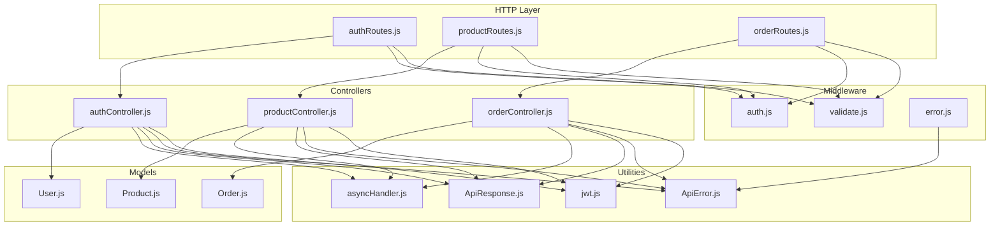
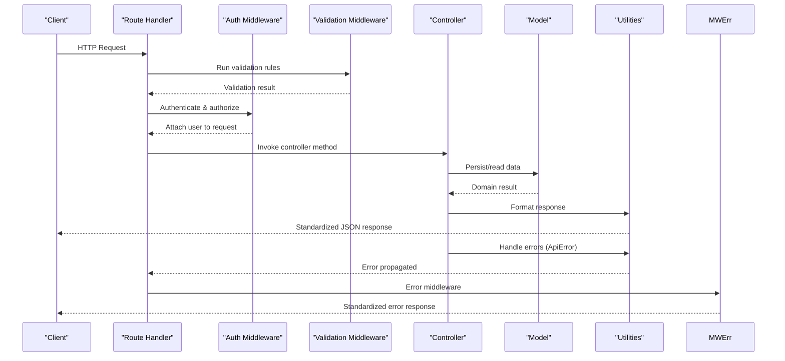
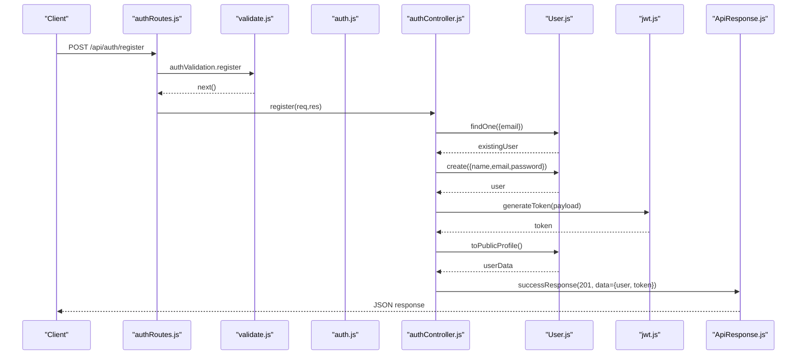
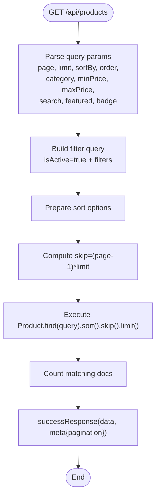
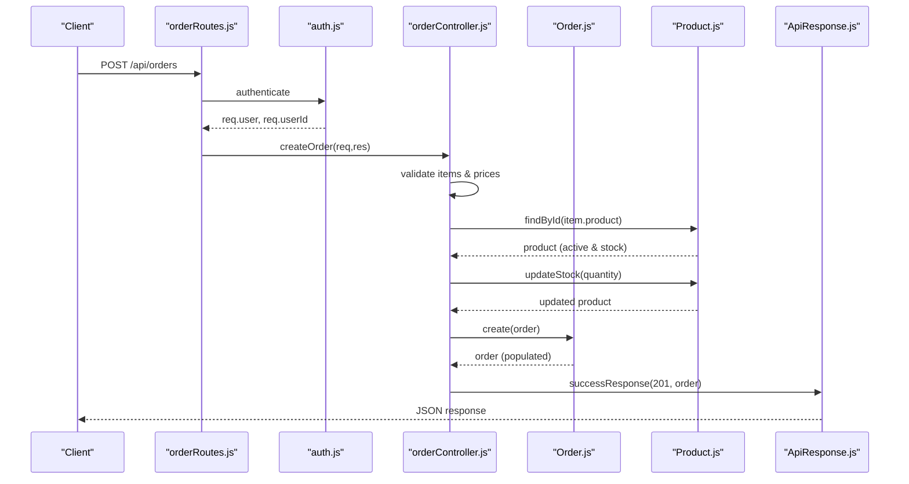
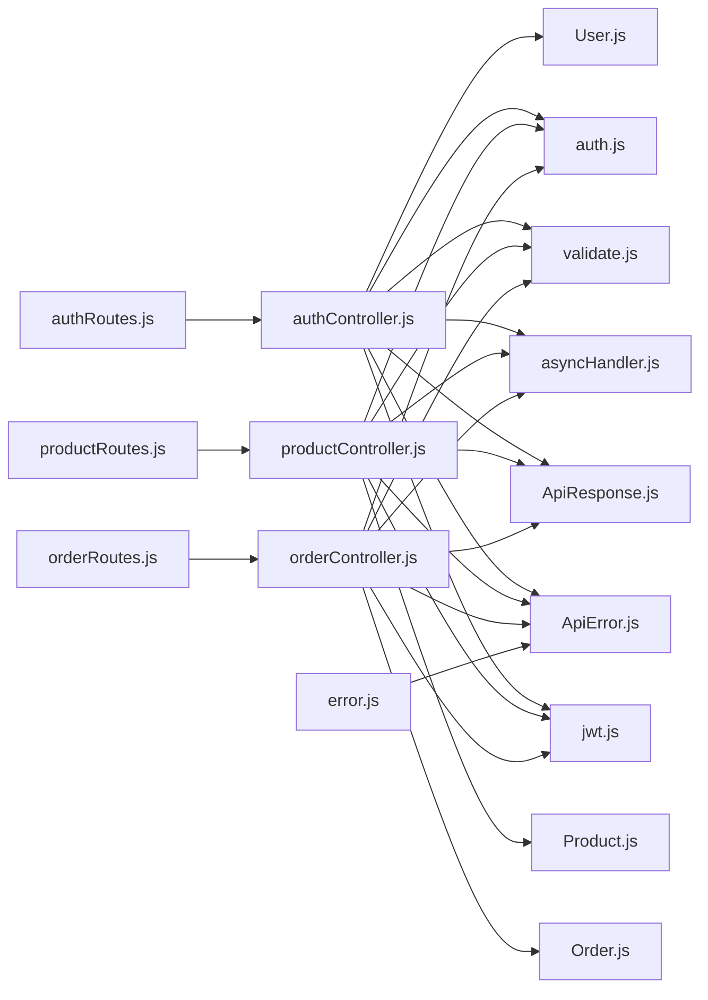

# Controller Layer Implementation

<cite>
**Referenced Files in This Document**
- [authController.js](file://backend/controllers/authController.js)
- [productController.js](file://backend/controllers/productController.js)
- [orderController.js](file://backend/controllers/orderController.js)
- [authRoutes.js](file://backend/routes/authRoutes.js)
- [productRoutes.js](file://backend/routes/productRoutes.js)
- [orderRoutes.js](file://backend/routes/orderRoutes.js)
- [auth.js](file://backend/middleware/auth.js)
- [validate.js](file://backend/middleware/validate.js)
- [error.js](file://backend/middleware/error.js)
- [asyncHandler.js](file://backend/utils/asyncHandler.js)
- [ApiResponse.js](file://backend/utils/ApiResponse.js)
- [ApiError.js](file://backend/utils/ApiError.js)
- [jwt.js](file://backend/utils/jwt.js)
- [User.js](file://backend/models/User.js)
- [Product.js](file://backend/models/Product.js)
- [Order.js](file://backend/models/Order.js)
</cite>

## Table of Contents
1. [Introduction](#introduction)
2. [Project Structure](#project-structure)
3. [Core Components](#core-components)
4. [Architecture Overview](#architecture-overview)
5. [Detailed Component Analysis](#detailed-component-analysis)
6. [Dependency Analysis](#dependency-analysis)
7. [Performance Considerations](#performance-considerations)
8. [Troubleshooting Guide](#troubleshooting-guide)
9. [Conclusion](#conclusion)

## Introduction
This document explains the controller layer implementation following the Model-View-Controller (MVC) pattern. It focuses on how controllers orchestrate requests, validate inputs, integrate with models, and return standardized responses. It covers three primary domains:
- Authentication controllers: registration, login, profile management, and address management
- Product management controllers: CRUD operations, search, filtering, and categorization
- Order processing controllers: order creation, status updates, cancellation, and analytics

The controllers leverage middleware for authentication, authorization, and validation, and utilities for consistent error handling and response formatting.

## Project Structure
The backend follows a layered architecture:
- Routes define endpoints and bind middleware
- Controllers implement business logic and coordinate with models
- Models encapsulate data schemas and business methods
- Middleware handles cross-cutting concerns (auth, validation, error handling)
- Utilities provide shared helpers (async wrapper, API response/error, JWT)

**Diagram sources**
- [authRoutes.js:1-85](file://backend/routes/authRoutes.js#L1-L85)
- [productRoutes.js:1-101](file://backend/routes/productRoutes.js#L1-L101)
- [orderRoutes.js:1-77](file://backend/routes/orderRoutes.js#L1-L77)
- [authController.js:1-299](file://backend/controllers/authController.js#L1-L299)
- [productController.js:1-341](file://backend/controllers/productController.js#L1-L341)
- [orderController.js:1-358](file://backend/controllers/orderController.js#L1-L358)
- [auth.js:1-124](file://backend/middleware/auth.js#L1-L124)
- [validate.js:1-221](file://backend/middleware/validate.js#L1-L221)
- [error.js:1-121](file://backend/middleware/error.js#L1-L121)
- [asyncHandler.js:1-16](file://backend/utils/asyncHandler.js#L1-L16)
- [ApiResponse.js:1-52](file://backend/utils/ApiResponse.js#L1-L52)
- [ApiError.js:1-21](file://backend/utils/ApiError.js#L1-L21)
- [jwt.js:1-49](file://backend/utils/jwt.js#L1-L49)
- [User.js:1-135](file://backend/models/User.js#L1-L135)
- [Product.js:1-217](file://backend/models/Product.js#L1-L217)
- [Order.js:1-217](file://backend/models/Order.js#L1-L217)

**Section sources**
- [authRoutes.js:1-85](file://backend/routes/authRoutes.js#L1-L85)
- [productRoutes.js:1-101](file://backend/routes/productRoutes.js#L1-L101)
- [orderRoutes.js:1-77](file://backend/routes/orderRoutes.js#L1-L77)

## Core Components
- Controllers: Implement domain-specific logic and delegate persistence to models. They use async/await, rely on asyncHandler to centralize error propagation, and return structured responses via ApiResponse helpers.
- Middleware:
  - Authentication: Extracts tokens from Authorization headers, verifies JWT, attaches user to request, and enforces deactivation checks.
  - Authorization: Role-based gatekeeping for admin-only endpoints.
  - Validation: Express-validator rules for request bodies, params, and queries; centralized error handler transforms validation failures into API errors.
  - Error: Converts low-level errors (Mongoose, JWT, cast errors) into standardized API errors and responds consistently.
- Utilities:
  - Async wrapper eliminates repetitive try-catch blocks around async route handlers.
  - Standardized success/error response helpers enforce consistent JSON envelopes.
  - Custom API error class carries HTTP status codes and operational flags.
  - JWT utilities generate and verify tokens.

**Section sources**
- [authController.js:1-299](file://backend/controllers/authController.js#L1-L299)
- [productController.js:1-341](file://backend/controllers/productController.js#L1-L341)
- [orderController.js:1-358](file://backend/controllers/orderController.js#L1-L358)
- [auth.js:1-124](file://backend/middleware/auth.js#L1-L124)
- [validate.js:1-221](file://backend/middleware/validate.js#L1-L221)
- [error.js:1-121](file://backend/middleware/error.js#L1-L121)
- [asyncHandler.js:1-16](file://backend/utils/asyncHandler.js#L1-L16)
- [ApiResponse.js:1-52](file://backend/utils/ApiResponse.js#L1-L52)
- [ApiError.js:1-21](file://backend/utils/ApiError.js#L1-L21)
- [jwt.js:1-49](file://backend/utils/jwt.js#L1-L49)

## Architecture Overview
The controller layer adheres to MVC principles:
- Model: Encapsulates data and domain logic (schemas, indexes, pre-save hooks, static/methods).
- View: Handled by the React frontend; controllers expose RESTful endpoints.
- Controller: Coordinates request handling, validation, authorization, model interactions, and response formatting.

**Diagram sources**
- [authRoutes.js:1-85](file://backend/routes/authRoutes.js#L1-L85)
- [productRoutes.js:1-101](file://backend/routes/productRoutes.js#L1-L101)
- [orderRoutes.js:1-77](file://backend/routes/orderRoutes.js#L1-L77)
- [auth.js:1-124](file://backend/middleware/auth.js#L1-L124)
- [validate.js:1-221](file://backend/middleware/validate.js#L1-L221)
- [error.js:1-121](file://backend/middleware/error.js#L1-L121)
- [authController.js:1-299](file://backend/controllers/authController.js#L1-L299)
- [productController.js:1-341](file://backend/controllers/productController.js#L1-L341)
- [orderController.js:1-358](file://backend/controllers/orderController.js#L1-L358)
- [User.js:1-135](file://backend/models/User.js#L1-L135)
- [Product.js:1-217](file://backend/models/Product.js#L1-L217)
- [Order.js:1-217](file://backend/models/Order.js#L1-L217)
- [ApiResponse.js:1-52](file://backend/utils/ApiResponse.js#L1-L52)
- [ApiError.js:1-21](file://backend/utils/ApiError.js#L1-L21)

## Detailed Component Analysis

### Authentication Controller
Responsibilities:
- Registration: Validates input, checks uniqueness, creates user, hashes password via model pre-save hook, generates JWT, returns public profile.
- Login: Finds user with password, validates activity and credentials, updates last login, generates JWT.
- Profile management: Retrieves, updates profile fields, changes password with verification.
- Address management: Adds, updates, deletes addresses with default address handling.

Key patterns:
- Async handlers wrapped with asyncHandler to avoid try-catch.
- Validation middleware applied to register/login.
- Authentication middleware attached to private endpoints.
- Standardized successResponse for success paths; ApiError for failures.
- JWT utilities for token generation and verification.

**Diagram sources**
- [authRoutes.js:26-26](file://backend/routes/authRoutes.js#L26-L26)
- [validate.js:30-67](file://backend/middleware/validate.js#L30-L67)
- [authController.js:17-47](file://backend/controllers/authController.js#L17-L47)
- [User.js:118-130](file://backend/models/User.js#L118-L130)
- [jwt.js:13-19](file://backend/utils/jwt.js#L13-L19)
- [ApiResponse.js:14-26](file://backend/utils/ApiResponse.js#L14-L26)

**Section sources**
- [authController.js:17-299](file://backend/controllers/authController.js#L17-L299)
- [authRoutes.js:22-82](file://backend/routes/authRoutes.js#L22-L82)
- [validate.js:30-67](file://backend/middleware/validate.js#L30-L67)
- [auth.js:10-55](file://backend/middleware/auth.js#L10-L55)
- [User.js:110-130](file://backend/models/User.js#L110-L130)
- [jwt.js:13-29](file://backend/utils/jwt.js#L13-L29)
- [ApiResponse.js:14-26](file://backend/utils/ApiResponse.js#L14-L26)

### Product Management Controller
Responsibilities:
- Listing: Filtering by category/price/badge, text search, sorting, pagination.
- Retrieval: By ID, SKU, featured, category, categories with counts.
- Administration: Create, update, soft-delete (set inactive), stock update.
- Search: Text search with scoring and pagination.

Key patterns:
- Robust query building for filters and sorts.
- Aggregation for category statistics.
- Validation for product creation/update and ID formats.
- Admin-only middleware for write operations.

**Diagram sources**
- [productController.js:16-85](file://backend/controllers/productController.js#L16-L85)
- [validate.js:133-155](file://backend/middleware/validate.js#L133-L155)

**Section sources**
- [productController.js:16-341](file://backend/controllers/productController.js#L16-L341)
- [productRoutes.js:24-98](file://backend/routes/productRoutes.js#L24-L98)
- [validate.js:72-155](file://backend/middleware/validate.js#L72-L155)
- [auth.js:95-123](file://backend/middleware/auth.js#L95-L123)
- [Product.js:147-151](file://backend/models/Product.js#L147-L151)

### Order Processing Controller
Responsibilities:
- Creation: Validates items against active products, checks stock, computes prices, persists order, populates relations.
- Retrieval: Admin list with filters and stats; user’s orders; single order with ownership/admin checks.
- Updates: Status transitions with validation, payment status updates, cancellation with stock restoration.
- Analytics: Overall stats, status breakdown, monthly revenue aggregation.

Key patterns:
- Strict authorization checks per endpoint.
- Status transition matrix prevents invalid state changes.
- Payment processing updates payment info and timestamps.
- Aggregation pipelines compute sales and statistics.

**Diagram sources**
- [orderRoutes.js:25-25](file://backend/routes/orderRoutes.js#L25-L25)
- [orderController.js:17-69](file://backend/controllers/orderController.js#L17-L69)
- [Order.js:139-165](file://backend/models/Order.js#L139-L165)
- [Product.js:208-212](file://backend/models/Product.js#L208-L212)
- [ApiResponse.js:14-26](file://backend/utils/ApiResponse.js#L14-L26)

**Section sources**
- [orderController.js:17-358](file://backend/controllers/orderController.js#L17-L358)
- [orderRoutes.js:21-76](file://backend/routes/orderRoutes.js#L21-L76)
- [auth.js:95-123](file://backend/middleware/auth.js#L95-L123)
- [Order.js:168-193](file://backend/models/Order.js#L168-L193)
- [Product.js:208-212](file://backend/models/Product.js#L208-L212)
- [ApiResponse.js:14-26](file://backend/utils/ApiResponse.js#L14-L26)

## Dependency Analysis
- Controllers depend on:
  - Models for persistence and domain logic (pre-save hooks, virtuals, static/methods).
  - Middleware for auth/authorization/validation.
  - Utilities for async handling, response formatting, and error modeling.
- Routes bind controllers to endpoints and apply middleware stacks.
- Error middleware normalizes all errors into standardized responses.

**Diagram sources**
- [authRoutes.js:1-85](file://backend/routes/authRoutes.js#L1-L85)
- [productRoutes.js:1-101](file://backend/routes/productRoutes.js#L1-L101)
- [orderRoutes.js:1-77](file://backend/routes/orderRoutes.js#L1-L77)
- [authController.js:1-299](file://backend/controllers/authController.js#L1-L299)
- [productController.js:1-341](file://backend/controllers/productController.js#L1-L341)
- [orderController.js:1-358](file://backend/controllers/orderController.js#L1-L358)
- [auth.js:1-124](file://backend/middleware/auth.js#L1-L124)
- [validate.js:1-221](file://backend/middleware/validate.js#L1-L221)
- [error.js:1-121](file://backend/middleware/error.js#L1-L121)
- [asyncHandler.js:1-16](file://backend/utils/asyncHandler.js#L1-L16)
- [ApiResponse.js:1-52](file://backend/utils/ApiResponse.js#L1-L52)
- [ApiError.js:1-21](file://backend/utils/ApiError.js#L1-L21)
- [jwt.js:1-49](file://backend/utils/jwt.js#L1-L49)
- [User.js:1-135](file://backend/models/User.js#L1-L135)
- [Product.js:1-217](file://backend/models/Product.js#L1-L217)
- [Order.js:1-217](file://backend/models/Order.js#L1-L217)

**Section sources**
- [authController.js:1-299](file://backend/controllers/authController.js#L1-L299)
- [productController.js:1-341](file://backend/controllers/productController.js#L1-L341)
- [orderController.js:1-358](file://backend/controllers/orderController.js#L1-L358)
- [auth.js:1-124](file://backend/middleware/auth.js#L1-L124)
- [validate.js:1-221](file://backend/middleware/validate.js#L1-L221)
- [error.js:1-121](file://backend/middleware/error.js#L1-L121)
- [asyncHandler.js:1-16](file://backend/utils/asyncHandler.js#L1-L16)
- [ApiResponse.js:1-52](file://backend/utils/ApiResponse.js#L1-L52)
- [ApiError.js:1-21](file://backend/utils/ApiError.js#L1-L21)
- [jwt.js:1-49](file://backend/utils/jwt.js#L1-L49)
- [User.js:1-135](file://backend/models/User.js#L1-L135)
- [Product.js:1-217](file://backend/models/Product.js#L1-L217)
- [Order.js:1-217](file://backend/models/Order.js#L1-L217)

## Performance Considerations
- Indexes: Models define strategic indexes for frequent queries (e.g., user email, product category/price/rating, order statuses).
- Aggregation: Controllers use aggregation for category stats and order analytics to offload computation server-side.
- Pagination: Controllers compute skip and limit to avoid large result sets.
- Population: Controlled population of relations (user, products) to balance readability and performance.
- Validation early exit: Validation middleware short-circuits invalid requests before hitting database.

[No sources needed since this section provides general guidance]

## Troubleshooting Guide
Common issues and resolutions:
- Authentication failures:
  - Missing or malformed Authorization header: 401 Access denied.
  - Invalid/expired token: 401 Invalid token; prompt re-authentication.
  - Deactivated user: 401 Account deactivated.
- Authorization failures:
  - Missing role: 403 Access denied; ensure admin role.
- Validation errors:
  - Express-validator rules return 400 with field-specific messages.
- Business logic errors:
  - Product not found or inactive, insufficient stock, invalid status transitions, unauthorized order access.
- Error normalization:
  - Centralized error handler converts low-level errors into standardized API errors with appropriate HTTP status codes.

**Section sources**
- [auth.js:10-55](file://backend/middleware/auth.js#L10-L55)
- [validate.js:12-25](file://backend/middleware/validate.js#L12-L25)
- [error.js:84-121](file://backend/middleware/error.js#L84-L121)
- [authController.js:20-24](file://backend/controllers/authController.js#L20-L24)
- [orderController.js:165-168](file://backend/controllers/orderController.js#L165-L168)
- [orderController.js:188-202](file://backend/controllers/orderController.js#L188-L202)

## Conclusion
The controller layer cleanly separates concerns:
- Routes define contracts and apply middleware.
- Controllers implement domain logic with robust validation, authorization, and standardized responses.
- Models encapsulate data and domain methods.
- Utilities and middleware ensure consistent error handling and async patterns.

This design supports scalability, maintainability, and predictable behavior across authentication, product, and order domains.