# Database Design and Connection

<cite>
**Referenced Files in This Document**
- [db.js](file://backend/db/db.js)
- [index.js](file://backend/index.js)
- [User.js](file://backend/models/User.js)
- [Product.js](file://backend/models/Product.js)
- [Order.js](file://backend/models/Order.js)
- [seed.js](file://backend/seed.js)
- [error.js](file://backend/middleware/error.js)
- [auth.js](file://backend/middleware/auth.js)
- [validate.js](file://backend/middleware/validate.js)
- [authController.js](file://backend/controllers/authController.js)
- [productController.js](file://backend/controllers/productController.js)
- [orderController.js](file://backend/controllers/orderController.js)
- [package.json](file://backend/package.json)
</cite>

## Table of Contents
1. [Introduction](#introduction)
2. [Project Structure](#project-structure)
3. [Core Components](#core-components)
4. [Architecture Overview](#architecture-overview)
5. [Detailed Component Analysis](#detailed-component-analysis)
6. [Dependency Analysis](#dependency-analysis)
7. [Performance Considerations](#performance-considerations)
8. [Troubleshooting Guide](#troubleshooting-guide)
9. [Conclusion](#conclusion)
10. [Appendices](#appendices)

## Introduction
This document provides comprehensive documentation for the MongoDB database design and connection management in the e-commerce backend. It covers:
- Database connection setup using Mongoose ODM, connection lifecycle, and error handling
- Complete schema design for User, Product, and Order models, including field definitions, data types, validation rules, and relationships
- Indexing strategies, data relationships (one-to-many, many-to-many via embedding), and referential integrity
- Database seeding functionality, connection lifecycle management, and production deployment considerations
- Performance optimization techniques, query patterns, and data migration strategies

## Project Structure
The backend follows an MVC architecture with clear separation of concerns:
- Database connection and lifecycle management in db/db.js
- Model definitions under models/ with Mongoose schemas and indexes
- Controllers under controllers/ implementing business logic
- Routers under routes/ delegating to controllers
- Middleware for validation, authentication, and error handling
- Seeding script under seed.js for initial data population

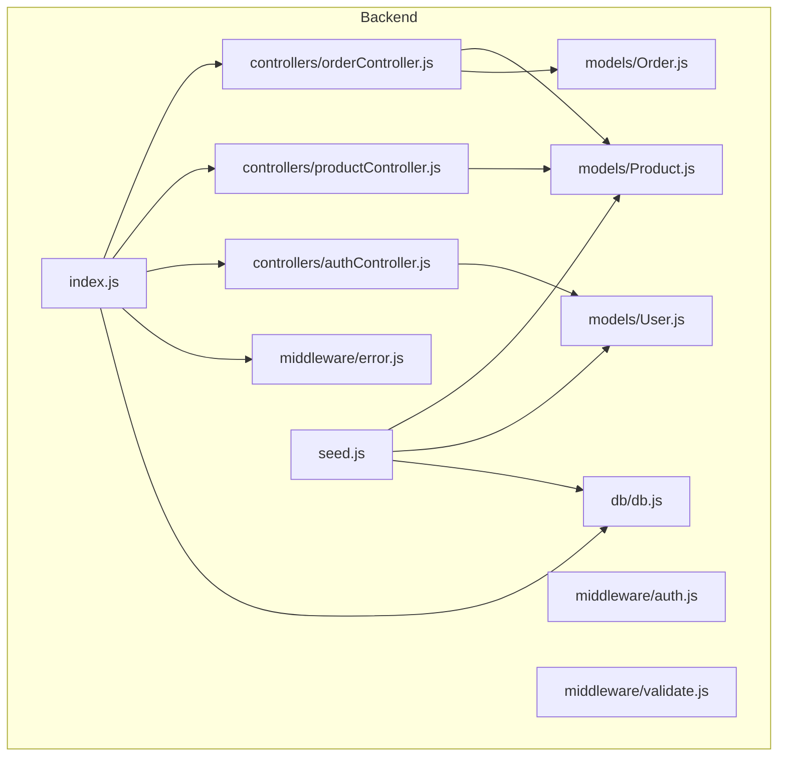

**Diagram sources**
- [index.js](file://backend/index.js)
- [db.js](file://backend/db/db.js)
- [error.js](file://backend/middleware/error.js)
- [auth.js](file://backend/middleware/auth.js)
- [validate.js](file://backend/middleware/validate.js)
- [authController.js](file://backend/controllers/authController.js)
- [productController.js](file://backend/controllers/productController.js)
- [orderController.js](file://backend/controllers/orderController.js)
- [User.js](file://backend/models/User.js)
- [Product.js](file://backend/models/Product.js)
- [Order.js](file://backend/models/Order.js)
- [seed.js](file://backend/seed.js)

**Section sources**
- [index.js](file://backend/index.js)
- [db.js](file://backend/db/db.js)
- [User.js](file://backend/models/User.js)
- [Product.js](file://backend/models/Product.js)
- [Order.js](file://backend/models/Order.js)
- [seed.js](file://backend/seed.js)

## Core Components
- Database connection module: Provides connectDB and disconnectDB functions with robust error handling and graceful exit on connection failure.
- Models: Define schemas, indexes, virtuals, middleware, and helper methods for User, Product, and Order.
- Controllers: Implement CRUD and business logic, leveraging models and middleware.
- Middleware: Validation, authentication, and centralized error handling.
- Seeding: Automated script to populate the database with sample users and products.

**Section sources**
- [db.js](file://backend/db/db.js)
- [User.js](file://backend/models/User.js)
- [Product.js](file://backend/models/Product.js)
- [Order.js](file://backend/models/Order.js)
- [seed.js](file://backend/seed.js)
- [error.js](file://backend/middleware/error.js)
- [auth.js](file://backend/middleware/auth.js)
- [validate.js](file://backend/middleware/validate.js)
- [authController.js](file://backend/controllers/authController.js)
- [productController.js](file://backend/controllers/productController.js)
- [orderController.js](file://backend/controllers/orderController.js)

## Architecture Overview
The system initializes the Express server, connects to MongoDB, registers routes, and applies middleware. Controllers interact with models to perform operations, while middleware enforces validation and authentication.

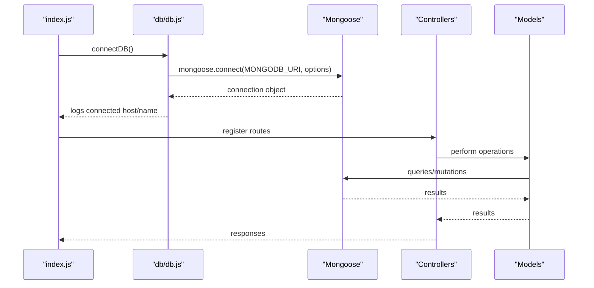

**Diagram sources**
- [index.js](file://backend/index.js)
- [db.js](file://backend/db/db.js)
- [User.js](file://backend/models/User.js)
- [Product.js](file://backend/models/Product.js)
- [Order.js](file://backend/models/Order.js)

## Detailed Component Analysis

### Database Connection Management
- Connection setup: Uses mongoose.connect with environment variable MONGODB_URI. Includes console logs for connection host and database name.
- Error handling: Catches connection errors and exits the process with non-zero status.
- Disconnection: Provides disconnectDB for controlled disconnection during tests or shutdown.
- Lifecycle: Called once at server startup in index.js.

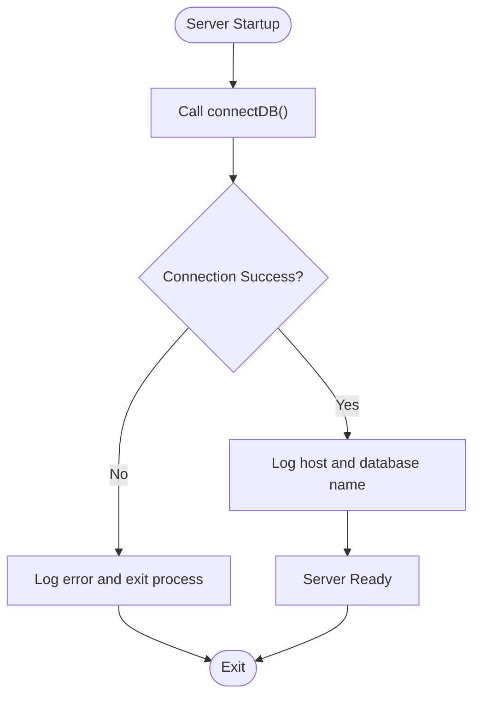

**Diagram sources**
- [index.js](file://backend/index.js)
- [db.js](file://backend/db/db.js)

**Section sources**
- [db.js](file://backend/db/db.js)
- [index.js](file://backend/index.js)

### User Model
- Fields and types: name, email (unique), password (hashed), role, avatar, phone, addresses array, isActive, lastLogin, timestamps.
- Validation: Trimmed strings, required fields, regex for email, password constraints, enum for role.
- Indexes: email, role for efficient lookups.
- Virtuals: orders populated via virtual populate referencing Order model.
- Middleware: Pre-save hook hashes password with bcrypt (salt rounds 12) and only runs when password is modified.
- Methods: comparePassword for verification, toPublicProfile for safe serialization.
- Security: select: false prevents password leakage by default; explicit selection when needed.

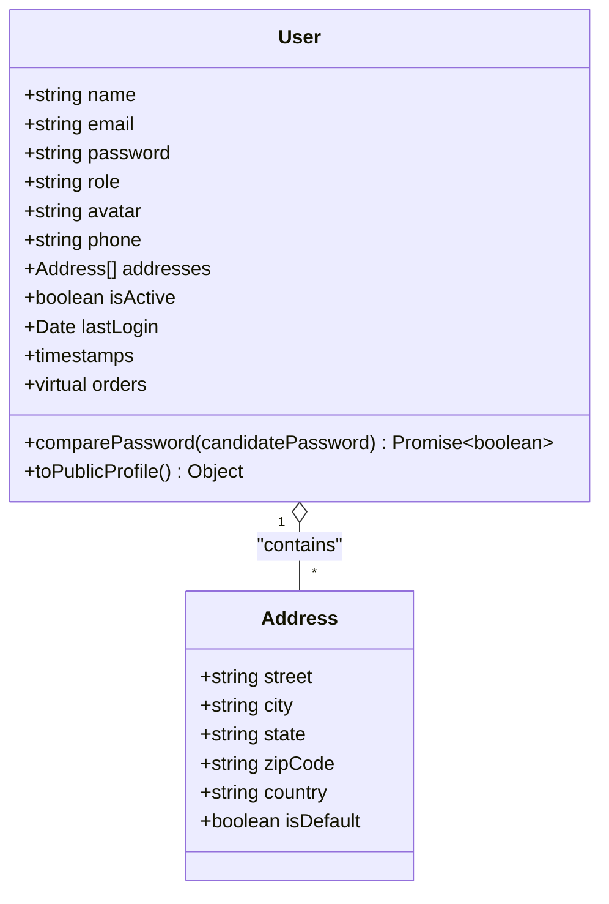

**Diagram sources**
- [User.js](file://backend/models/User.js)

**Section sources**
- [User.js](file://backend/models/User.js)

### Product Model
- Fields and types: name, description, category (enum), price, originalPrice, discount, rating, reviews, images array, mainImage, badge, badgeColor, stock, sku (unique, sparse), specifications (Map), features array, isActive, isFeatured, tags, brand, weight, dimensions.
- Validation: Length limits, numeric ranges, enums, arrays required entries.
- Indexes: compound text index for search, category+price, rating, isFeatured, createdAt.
- Virtuals: discountPercentage computed, inStock computed.
- Middleware: Pre-save generates SKU if missing using category prefix, timestamp, and random suffix.
- Statics: getFeatured, getByCategory with sorting, pagination, and price filters.
- Methods: updateStock decrements and saves with relaxed validation.

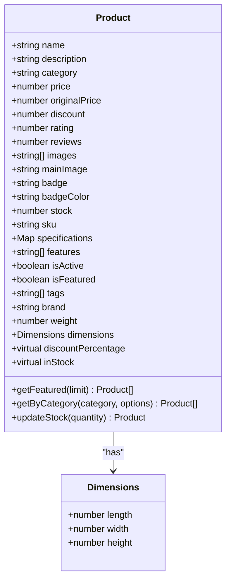

**Diagram sources**
- [Product.js](file://backend/models/Product.js)

**Section sources**
- [Product.js](file://backend/models/Product.js)

### Order Model
- Embedded documents: orderItemSchema with product reference, name, image, price, quantity.
- Fields and types: user reference, orderItems, shippingAddress, paymentInfo (method, status, transactionId, paidAt), pricing fields, orderStatus, statusHistory, deliveredAt, trackingNumber, notes, timestamps.
- Indexes: user+createdAt, orderStatus, paymentInfo.status, createdAt.
- Middleware: Pre-save calculates itemsPrice, tax (18%), shipping (free above 500), totalPrice, and initializes statusHistory on creation.
- Methods: updateStatus appends to statusHistory and sets deliveredAt when delivered; processPayment updates payment info and completion timestamp.
- Aggregation: getUserStats computes total orders, spent, and average order value.

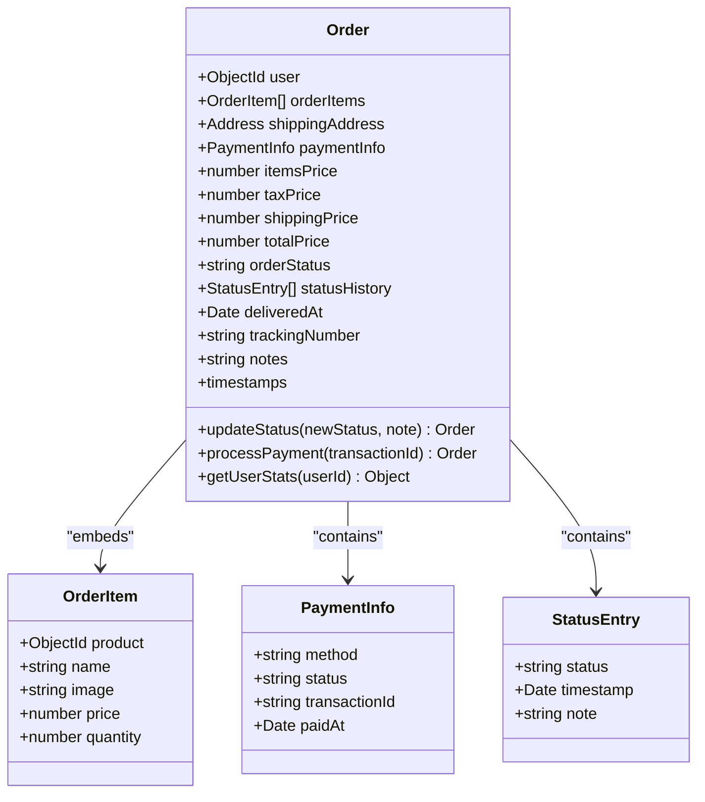

**Diagram sources**
- [Order.js](file://backend/models/Order.js)

**Section sources**
- [Order.js](file://backend/models/Order.js)

### Relationship and Referential Integrity
- One-to-many: User has many Orders (virtual populate via user.orders); Product is referenced by OrderItem.product.
- Many-to-many: Achieved via embedding OrderItem.product reference within Order, avoiding cross-collection joins.
- Referential integrity: Product SKU is unique and sparse; email is unique; category enum restricts values; order status transitions validated in controller.

**Section sources**
- [User.js](file://backend/models/User.js)
- [Order.js](file://backend/models/Order.js)
- [Product.js](file://backend/models/Product.js)

### Indexing Strategies
- User: email, role for fast lookups and filtering.
- Product: text index on name and description for search; category+price for filtering and sorting; rating, isFeatured, createdAt for analytics and UI queries.
- Order: user+createdAt for user order history; orderStatus and paymentInfo.status for reporting; createdAt for recency.

**Section sources**
- [User.js](file://backend/models/User.js)
- [Product.js](file://backend/models/Product.js)
- [Order.js](file://backend/models/Order.js)

### Database Seeding
- Purpose: Populate database with sample users and products for development and testing.
- Flow: Connects to DB, clears existing data, creates users with hashed passwords, inserts products, prints credentials, disconnects, exits.

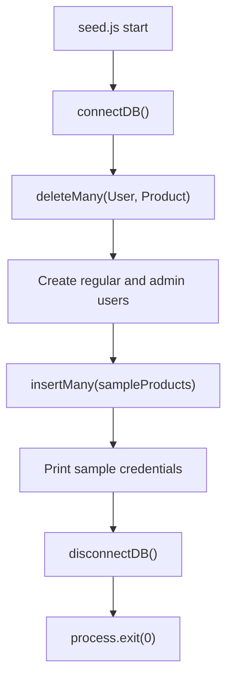

**Diagram sources**
- [seed.js](file://backend/seed.js)
- [db.js](file://backend/db/db.js)

**Section sources**
- [seed.js](file://backend/seed.js)

### Connection Lifecycle Management
- Startup: index.js calls connectDB() synchronously at boot.
- Shutdown: graceful handling of unhandled rejections and uncaught exceptions; SIGTERM handling for containerized deployments.
- Disconnection: disconnectDB exported by db/db.js for testing or controlled shutdown.

**Section sources**
- [index.js](file://backend/index.js)
- [db.js](file://backend/db/db.js)

### Production Deployment Considerations
- Environment variables: MONGODB_URI, CLIENT_URL, NODE_ENV, PORT.
- Dependencies: mongoose, bcryptjs, dotenv, express, cors, express-validator, jsonwebtoken.
- Error handling: Centralized error handler with development vs production responses; JWT-specific error handling.
- Authentication: JWT bearer tokens verified in middleware; admin-only routes enforced.

**Section sources**
- [package.json](file://backend/package.json)
- [error.js](file://backend/middleware/error.js)
- [auth.js](file://backend/middleware/auth.js)

## Dependency Analysis
- Controllers depend on models and middleware for validation and auth.
- Models depend on Mongoose for schema definition and indexes.
- Routes depend on controllers.
- index.js orchestrates DB connection, middleware, routes, and error handlers.

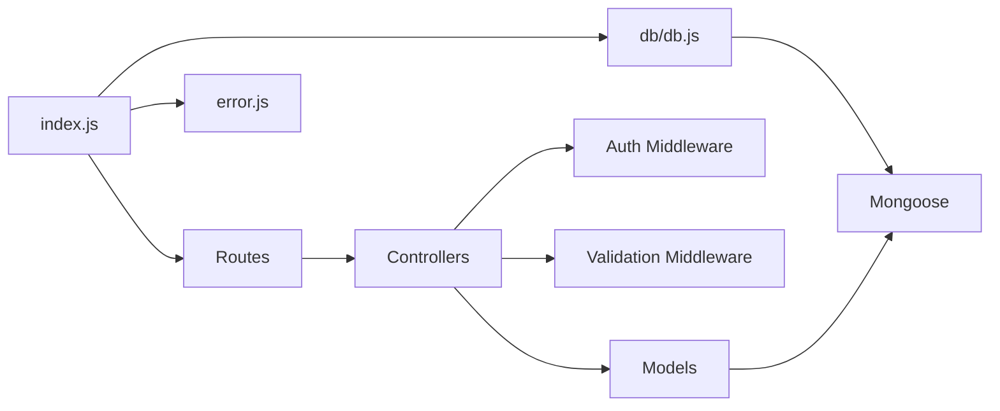

**Diagram sources**
- [index.js](file://backend/index.js)
- [db.js](file://backend/db/db.js)
- [error.js](file://backend/middleware/error.js)
- [auth.js](file://backend/middleware/auth.js)
- [validate.js](file://backend/middleware/validate.js)
- [authController.js](file://backend/controllers/authController.js)
- [productController.js](file://backend/controllers/productController.js)
- [orderController.js](file://backend/controllers/orderController.js)
- [User.js](file://backend/models/User.js)
- [Product.js](file://backend/models/Product.js)
- [Order.js](file://backend/models/Order.js)

**Section sources**
- [index.js](file://backend/index.js)
- [db.js](file://backend/db/db.js)
- [error.js](file://backend/middleware/error.js)
- [auth.js](file://backend/middleware/auth.js)
- [validate.js](file://backend/middleware/validate.js)
- [authController.js](file://backend/controllers/authController.js)
- [productController.js](file://backend/controllers/productController.js)
- [orderController.js](file://backend/controllers/orderController.js)
- [User.js](file://backend/models/User.js)
- [Product.js](file://backend/models/Product.js)
- [Order.js](file://backend/models/Order.js)

## Performance Considerations
- Indexing: Use targeted indexes for frequent filters (category, status, payment status) and sorts (rating, createdAt).
- Queries: Prefer filtered and paginated queries; leverage text search index for product search.
- Embedding: Embedded order items reduce joins and improve read performance for order retrieval.
- Validation: Use pre-save hooks judiciously; avoid expensive computations in middleware.
- Aggregation: Use aggregation pipelines for reporting and statistics to minimize round trips.
- Caching: Consider application-level caching for frequently accessed static data (not implemented here).

[No sources needed since this section provides general guidance]

## Troubleshooting Guide
- Connection failures: Check MONGODB_URI; verify network connectivity and credentials; review error logs and ensure process exits on fatal error.
- Validation errors: Review express-validator rules and error messages returned by handleValidationErrors.
- Authentication errors: Confirm JWT presence, validity, and user activity status; ensure proper headers.
- Operational errors: Distinguish between operational and programming errors; production responses hide internal stack traces.

**Section sources**
- [db.js](file://backend/db/db.js)
- [error.js](file://backend/middleware/error.js)
- [validate.js](file://backend/middleware/validate.js)
- [auth.js](file://backend/middleware/auth.js)

## Conclusion
The backend implements a robust MongoDB design with Mongoose, featuring well-defined models, indexes, middleware, and controllers. It supports essential e-commerce operations with clear separation of concerns, comprehensive validation, and centralized error handling. The seeding script simplifies development setup, while lifecycle management ensures reliable operation across environments.

[No sources needed since this section summarizes without analyzing specific files]

## Appendices

### API Workflows

#### User Registration and Login
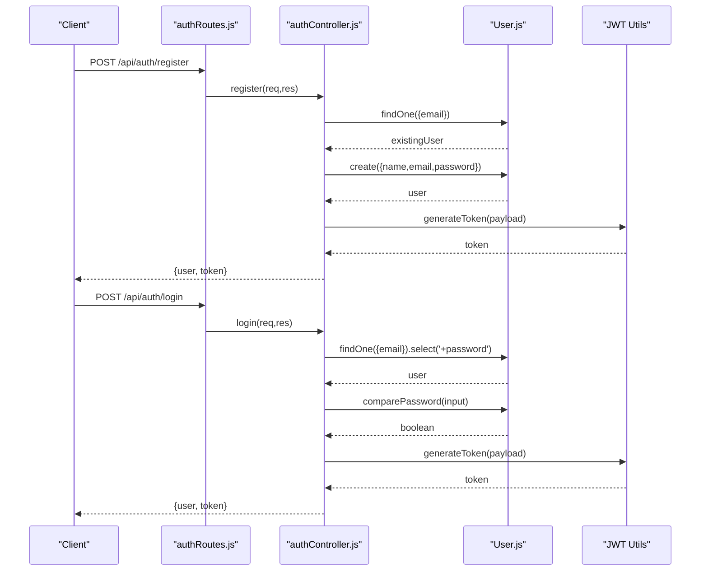

**Diagram sources**
- [authRoutes.js](file://backend/routes/authRoutes.js)
- [authController.js](file://backend/controllers/authController.js)
- [User.js](file://backend/models/User.js)

**Section sources**
- [authRoutes.js](file://backend/routes/authRoutes.js)
- [authController.js](file://backend/controllers/authController.js)
- [User.js](file://backend/models/User.js)

### Product Search and Filtering
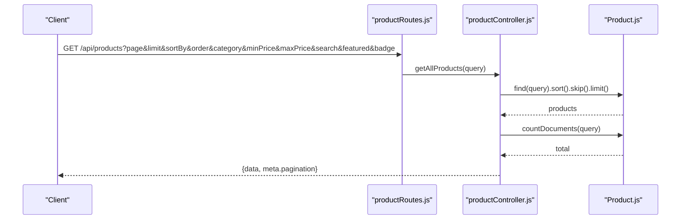

**Diagram sources**
- [productController.js](file://backend/controllers/productController.js)
- [Product.js](file://backend/models/Product.js)

**Section sources**
- [productController.js](file://backend/controllers/productController.js)
- [Product.js](file://backend/models/Product.js)

### Order Creation and Stock Management
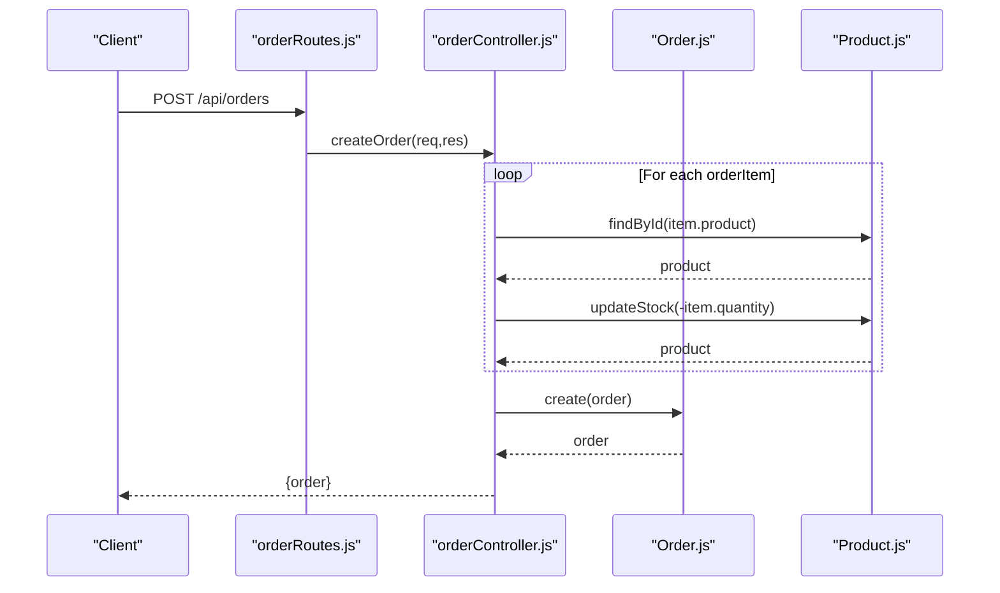

**Diagram sources**
- [orderController.js](file://backend/controllers/orderController.js)
- [Order.js](file://backend/models/Order.js)
- [Product.js](file://backend/models/Product.js)

**Section sources**
- [orderController.js](file://backend/controllers/orderController.js)
- [Order.js](file://backend/models/Order.js)
- [Product.js](file://backend/models/Product.js)