# Express Server Configuration

<cite>
**Referenced Files in This Document**
- [index.js](file://backend/index.js)
- [package.json](file://backend/package.json)
- [error.js](file://backend/middleware/error.js)
- [ApiError.js](file://backend/utils/ApiError.js)
- [ApiResponse.js](file://backend/utils/ApiResponse.js)
- [db.js](file://backend/db/db.js)
- [auth.js](file://backend/middleware/auth.js)
- [validate.js](file://backend/middleware/validate.js)
- [authRoutes.js](file://backend/routes/authRoutes.js)
- [productRoutes.js](file://backend/routes/productRoutes.js)
- [orderRoutes.js](file://backend/routes/orderRoutes.js)
- [asyncHandler.js](file://backend/utils/asyncHandler.js)
- [jwt.js](file://backend/utils/jwt.js)
</cite>

## Table of Contents
1. [Introduction](#introduction)
2. [Project Structure](#project-structure)
3. [Core Components](#core-components)
4. [Architecture Overview](#architecture-overview)
5. [Detailed Component Analysis](#detailed-component-analysis)
6. [Dependency Analysis](#dependency-analysis)
7. [Performance Considerations](#performance-considerations)
8. [Troubleshooting Guide](#troubleshooting-guide)
9. [Conclusion](#conclusion)
10. [Appendices](#appendices)

## Introduction
This document explains the Express.js server configuration and initialization for the backend. It covers middleware setup (CORS, JSON parsing, URL encoding), environment variable handling, port configuration, CORS policy, development request logging, health checks, error handling, graceful shutdown, and unhandled exception/rejection handling. It also outlines production deployment considerations, security headers, and performance optimizations, along with environment configuration examples and server startup patterns.

## Project Structure
The server entry point initializes Express, connects to MongoDB, configures middleware, mounts routes, and sets up error handling and lifecycle hooks. Supporting utilities provide standardized error and response formats, JWT helpers, and async error handling.

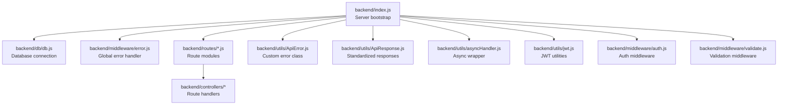

**Diagram sources**
- [index.js:1-119](file://backend/index.js#L1-L119)
- [db.js:1-37](file://backend/db/db.js#L1-L37)
- [error.js:1-121](file://backend/middleware/error.js#L1-L121)
- [authRoutes.js:1-85](file://backend/routes/authRoutes.js#L1-L85)
- [productRoutes.js:1-101](file://backend/routes/productRoutes.js#L1-L101)
- [orderRoutes.js:1-77](file://backend/routes/orderRoutes.js#L1-L77)
- [ApiError.js:1-21](file://backend/utils/ApiError.js#L1-L21)
- [ApiResponse.js:1-52](file://backend/utils/ApiResponse.js#L1-L52)
- [asyncHandler.js:1-16](file://backend/utils/asyncHandler.js#L1-L16)
- [jwt.js:1-49](file://backend/utils/jwt.js#L1-L49)
- [auth.js:1-124](file://backend/middleware/auth.js#L1-L124)
- [validate.js:1-221](file://backend/middleware/validate.js#L1-L221)

**Section sources**
- [index.js:1-119](file://backend/index.js#L1-L119)
- [package.json:1-33](file://backend/package.json#L1-L33)

## Core Components
- Express app initialization and middleware pipeline
- CORS configuration with environment-driven origin and credentials support
- Body parsing for JSON and URL-encoded payloads with size limits
- Development-only request logging
- Health check endpoint returning environment and timestamp
- Route mounting for authentication, products, and orders
- Global 404 and error handling middleware
- Database connection via Mongoose
- Lifecycle hooks for graceful shutdown and unhandled error handling

**Section sources**
- [index.js:14-92](file://backend/index.js#L14-L92)
- [db.js:7-21](file://backend/db/db.js#L7-L21)
- [error.js:84-120](file://backend/middleware/error.js#L84-L120)

## Architecture Overview
The server follows a layered architecture:
- Entry point initializes app, loads environment, connects DB, configures middleware, mounts routes, and starts the HTTP server.
- Middleware handles cross-cutting concerns (CORS, logging, validation, authentication).
- Routes delegate to controllers; controllers use async handlers and utilities for consistent responses and errors.
- Error middleware centralizes error translation and response formatting.

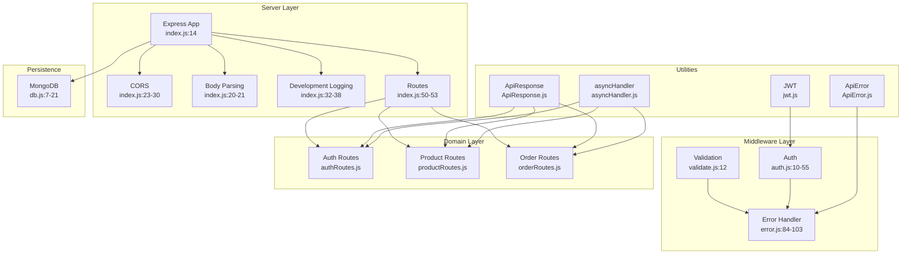

**Diagram sources**
- [index.js:14-92](file://backend/index.js#L14-L92)
- [validate.js:12-25](file://backend/middleware/validate.js#L12-L25)
- [error.js:84-103](file://backend/middleware/error.js#L84-L103)
- [auth.js:10-55](file://backend/middleware/auth.js#L10-L55)
- [authRoutes.js:1-85](file://backend/routes/authRoutes.js#L1-L85)
- [productRoutes.js:1-101](file://backend/routes/productRoutes.js#L1-L101)
- [orderRoutes.js:1-77](file://backend/routes/orderRoutes.js#L1-L77)
- [ApiError.js:5-18](file://backend/utils/ApiError.js#L5-L18)
- [ApiResponse.js:14-46](file://backend/utils/ApiResponse.js#L14-L46)
- [asyncHandler.js:9-13](file://backend/utils/asyncHandler.js#L9-L13)
- [jwt.js:13-29](file://backend/utils/jwt.js#L13-L29)
- [db.js:7-21](file://backend/db/db.js#L7-L21)

## Detailed Component Analysis

### Server Initialization and Startup
- Loads environment variables via dotenv.
- Initializes Express app and connects to MongoDB.
- Configures body parsers with size limits.
- Applies CORS with origin from environment, credentials enabled, and allowed methods/headers.
- Adds development-only request logger.
- Mounts health check and API routes.
- Starts server on configured port with graceful startup banner.
- Registers unhandled rejection and uncaught exception handlers.
- Sets SIGTERM graceful shutdown hook.

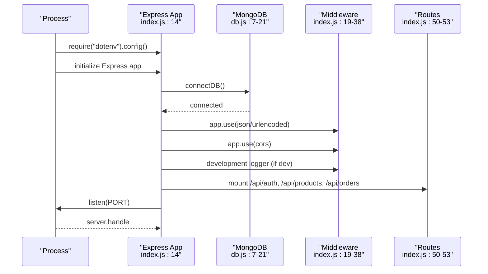

**Diagram sources**
- [index.js:1-119](file://backend/index.js#L1-L119)
- [db.js:7-21](file://backend/db/db.js#L7-L21)

**Section sources**
- [index.js:1-119](file://backend/index.js#L1-L119)
- [db.js:7-21](file://backend/db/db.js#L7-L21)

### CORS Policy Configuration
- Origin is controlled by CLIENT_URL environment variable with a fallback to localhost development URL.
- Credentials are enabled to support cookies/auth flows.
- Methods include standard CRUD plus OPTIONS.
- Allowed headers include Content-Type, Authorization, and X-Requested-With.

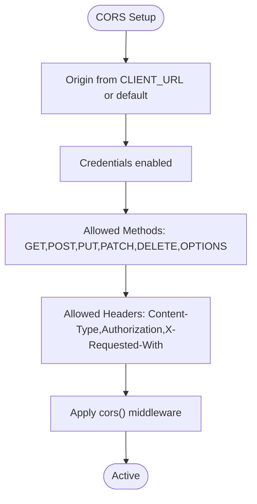

**Diagram sources**
- [index.js:23-30](file://backend/index.js#L23-L30)

**Section sources**
- [index.js:23-30](file://backend/index.js#L23-L30)

### Environment Variable Handling and Port Configuration
- NODE_ENV controls development logging and error response modes.
- PORT determines runtime binding; defaults to 5000.
- MONGODB_URI drives database connection.
- CLIENT_URL configures CORS origin.
- JWT_SECRET and JWT_EXPIRE control token signing and expiration.
- Development script uses nodemon; production uses node.

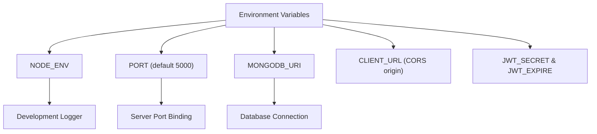

**Diagram sources**
- [index.js:1-119](file://backend/index.js#L1-L119)
- [db.js:9-13](file://backend/db/db.js#L9-L13)
- [jwt.js:13-19](file://backend/utils/jwt.js#L13-L19)

**Section sources**
- [index.js:1-119](file://backend/index.js#L1-L119)
- [db.js:9-13](file://backend/db/db.js#L9-L13)
- [jwt.js:13-19](file://backend/utils/jwt.js#L13-L19)
- [package.json:6-10](file://backend/package.json#L6-L10)

### Request Logging for Development
- A simple middleware logs method and URL with ISO timestamp during development.
- Disabled in non-development environments.

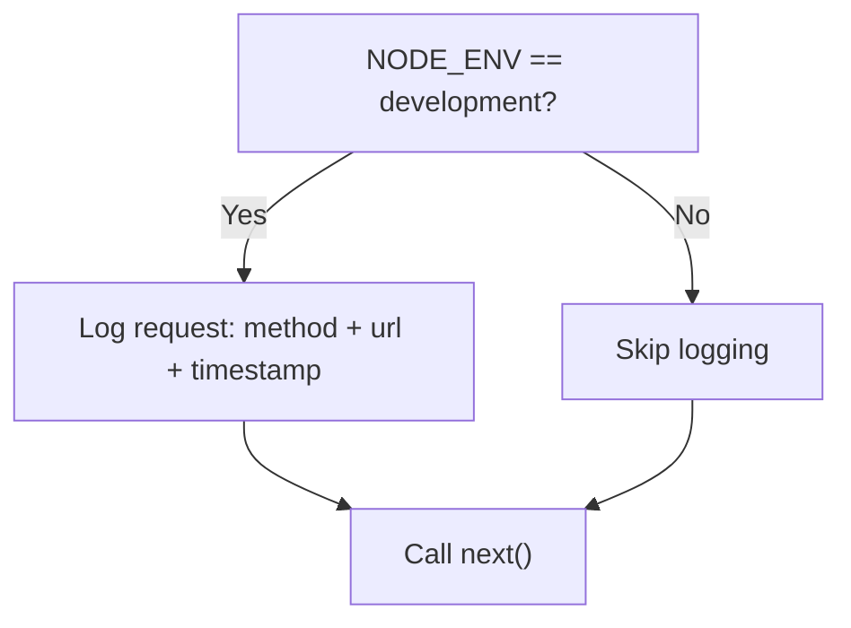

**Diagram sources**
- [index.js:32-38](file://backend/index.js#L32-L38)

**Section sources**
- [index.js:32-38](file://backend/index.js#L32-L38)

### Health Check Endpoint
- GET /health responds with success flag, message, timestamp, and environment.
- Useful for load balancers and container orchestrators.

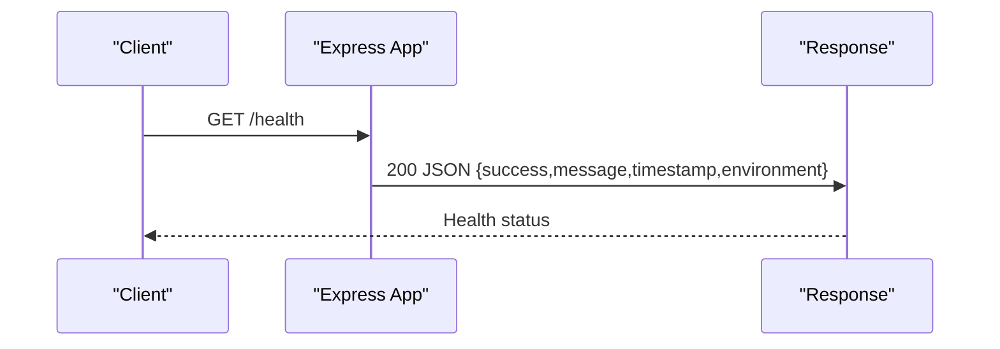

**Diagram sources**
- [index.js:40-48](file://backend/index.js#L40-L48)

**Section sources**
- [index.js:40-48](file://backend/index.js#L40-L48)

### Error Handling Mechanisms
- Centralized error handler translates various error types (CastError, duplicate key, validation, JWT errors) into structured ApiError instances.
- Development mode returns full error details; production returns sanitized messages.
- 404 handler marks unmatched routes as errors.
- ApiError captures status code, operational flag, and error classification.

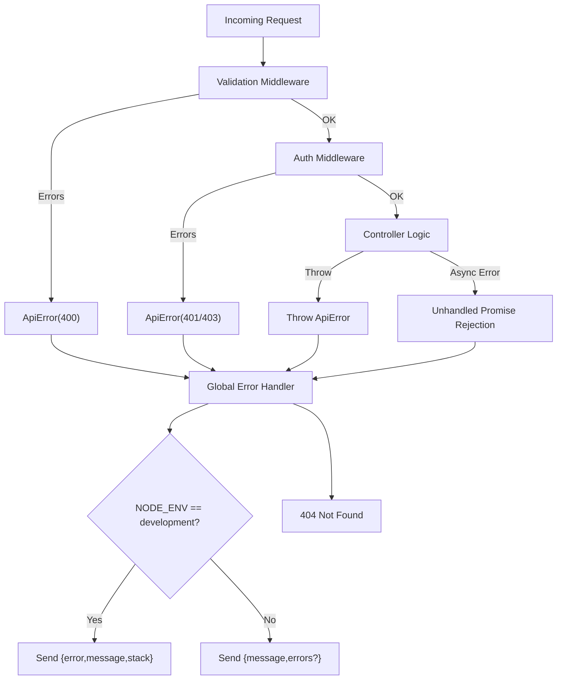

**Diagram sources**
- [error.js:84-103](file://backend/middleware/error.js#L84-L103)
- [error.js:109-115](file://backend/middleware/error.js#L109-L115)
- [ApiError.js:5-18](file://backend/utils/ApiError.js#L5-L18)
- [validate.js:12-25](file://backend/middleware/validate.js#L12-L25)
- [auth.js:10-55](file://backend/middleware/auth.js#L10-L55)

**Section sources**
- [error.js:84-103](file://backend/middleware/error.js#L84-L103)
- [error.js:109-115](file://backend/middleware/error.js#L109-L115)
- [ApiError.js:5-18](file://backend/utils/ApiError.js#L5-L18)
- [validate.js:12-25](file://backend/middleware/validate.js#L12-L25)
- [auth.js:10-55](file://backend/middleware/auth.js#L10-L55)

### Graceful Shutdown and Unhandled Exceptions
- Unhandled promise rejections trigger server close and process exit.
- Uncaught exceptions log and exit immediately.
- SIGTERM triggers graceful shutdown by closing the server.

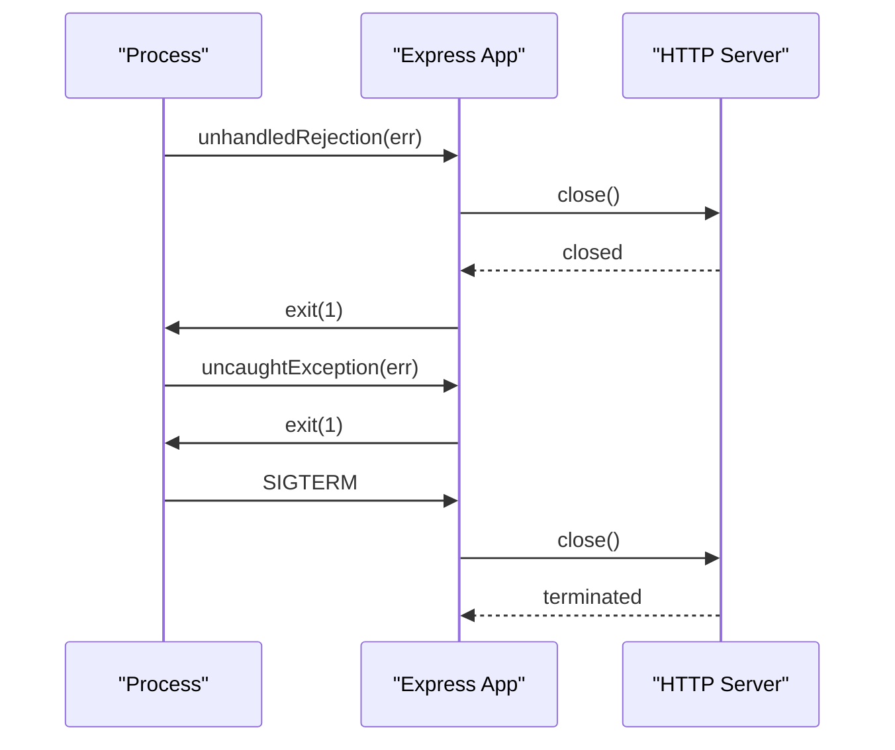

**Diagram sources**
- [index.js:94-116](file://backend/index.js#L94-L116)

**Section sources**
- [index.js:94-116](file://backend/index.js#L94-L116)

### Route Modules and Middleware Integration
- Routes define endpoints grouped by domain (auth, products, orders).
- Each route integrates validation and authentication middleware.
- Controllers receive validated and authenticated requests via async handlers.

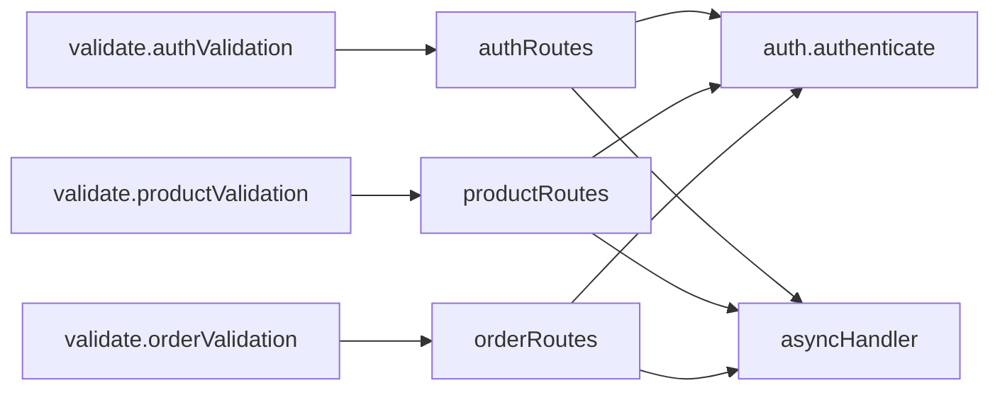

**Diagram sources**
- [authRoutes.js:17-20](file://backend/routes/authRoutes.js#L17-L20)
- [productRoutes.js:19-21](file://backend/routes/productRoutes.js#L19-L21)
- [orderRoutes.js:16-18](file://backend/routes/orderRoutes.js#L16-L18)
- [validate.js:30-67](file://backend/middleware/validate.js#L30-L67)
- [auth.js:95-110](file://backend/middleware/auth.js#L95-L110)
- [asyncHandler.js:9-13](file://backend/utils/asyncHandler.js#L9-L13)

**Section sources**
- [authRoutes.js:1-85](file://backend/routes/authRoutes.js#L1-L85)
- [productRoutes.js:1-101](file://backend/routes/productRoutes.js#L1-L101)
- [orderRoutes.js:1-77](file://backend/routes/orderRoutes.js#L1-L77)
- [validate.js:1-221](file://backend/middleware/validate.js#L1-L221)
- [auth.js:1-124](file://backend/middleware/auth.js#L1-L124)
- [asyncHandler.js:1-16](file://backend/utils/asyncHandler.js#L1-L16)

### Security Headers and Production Hardening
- Current implementation does not apply explicit security headers.
- Recommended additions for production:
  - helmet for default secure headers
  - rate-limit for API throttling
  - hpp for HTTP parameter pollution
  - xssFilters for XSS protection
  - enforce HTTPS in production environments
  - restrict CORS origin to exact domains in production

[No sources needed since this section provides general guidance]

### Performance Optimizations
- Body parser size limits configured to accommodate larger payloads.
- Centralized async error handling reduces boilerplate and improves error propagation.
- Standardized response utilities ensure consistent payloads.
- Validation middleware aggregates and normalizes validation errors.

**Section sources**
- [index.js:20-21](file://backend/index.js#L20-L21)
- [asyncHandler.js:9-13](file://backend/utils/asyncHandler.js#L9-L13)
- [ApiResponse.js:14-46](file://backend/utils/ApiResponse.js#L14-L46)
- [validate.js:12-25](file://backend/middleware/validate.js#L12-L25)

## Dependency Analysis
- Express app depends on dotenv, cors, and Mongoose.
- Routes depend on controllers and middleware modules.
- Middleware depends on validation utilities and JWT helpers.
- Utilities depend on core libraries (jsonwebtoken, express-validator).

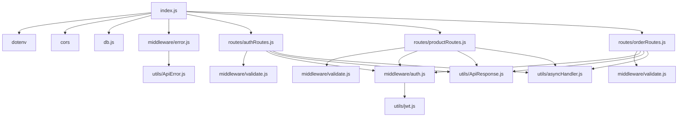

**Diagram sources**
- [index.js:1-119](file://backend/index.js#L1-L119)
- [authRoutes.js:1-85](file://backend/routes/authRoutes.js#L1-L85)
- [productRoutes.js:1-101](file://backend/routes/productRoutes.js#L1-L101)
- [orderRoutes.js:1-77](file://backend/routes/orderRoutes.js#L1-L77)
- [validate.js:1-221](file://backend/middleware/validate.js#L1-L221)
- [auth.js:1-124](file://backend/middleware/auth.js#L1-L124)
- [jwt.js:1-49](file://backend/utils/jwt.js#L1-L49)
- [error.js:1-121](file://backend/middleware/error.js#L1-L121)
- [ApiError.js:1-21](file://backend/utils/ApiError.js#L1-L21)
- [ApiResponse.js:1-52](file://backend/utils/ApiResponse.js#L1-L52)
- [asyncHandler.js:1-16](file://backend/utils/asyncHandler.js#L1-L16)

**Section sources**
- [index.js:1-119](file://backend/index.js#L1-L119)
- [package.json:20-28](file://backend/package.json#L20-L28)

## Performance Considerations
- Keep body parser limits appropriate for your workload; avoid overly large limits to prevent memory pressure.
- Use asyncHandler consistently to prevent unhandled promise rejections from impacting performance.
- Centralize error handling to reduce branching overhead in routes.
- Consider adding compression middleware for production traffic reduction.
- Monitor database connection pool sizing and timeouts.

[No sources needed since this section provides general guidance]

## Troubleshooting Guide
- Database connection failures: Check MONGODB_URI and network connectivity; the connection routine exits the process on failure.
- CORS errors: Verify CLIENT_URL matches the frontend origin; ensure credentials are supported if cookies are used.
- Validation errors: Review validation rules and ensure request payloads match expected schemas.
- Authentication failures: Confirm JWT_SECRET is set and tokens are not expired.
- Unhandled rejections: Inspect logs for unhandledRejection events; ensure all async paths use asyncHandler or proper error propagation.
- SIGTERM handling: Confirm process manager sends SIGTERM and that server.close completes gracefully.

**Section sources**
- [db.js:17-20](file://backend/db/db.js#L17-L20)
- [index.js:23-30](file://backend/index.js#L23-L30)
- [validate.js:12-25](file://backend/middleware/validate.js#L12-L25)
- [jwt.js:27-29](file://backend/utils/jwt.js#L27-L29)
- [index.js:94-116](file://backend/index.js#L94-L116)

## Conclusion
The server is configured with a clear middleware pipeline, centralized error handling, and lifecycle hooks for robust operation. CORS, body parsing, and development logging are environment-aware. The modular route and middleware structure supports maintainability. For production, add security headers, rate limiting, and monitoring to enhance resilience and compliance.

## Appendices

### Environment Configuration Examples
- Development (.env):
  - NODE_ENV=development
  - PORT=5000
  - MONGODB_URI=mongodb://localhost:27017/ecommerce_dev
  - CLIENT_URL=http://localhost:3000
  - JWT_SECRET=your_jwt_secret_key
  - JWT_EXPIRE=7d
- Production (.env.production):
  - NODE_ENV=production
  - PORT=8000
  - MONGODB_URI=your_atlas_uri
  - CLIENT_URL=https://yourdomain.com
  - JWT_SECRET=your_production_secret
  - JWT_EXPIRE=7d

[No sources needed since this section provides general guidance]

### Server Startup Patterns
- Development: npm run dev (nodemon watches for changes)
- Production: npm start (node index.js)

**Section sources**
- [package.json:6-10](file://backend/package.json#L6-L10)