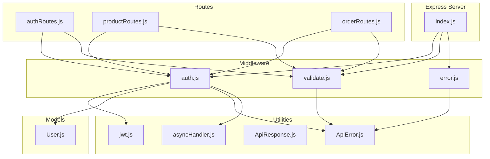
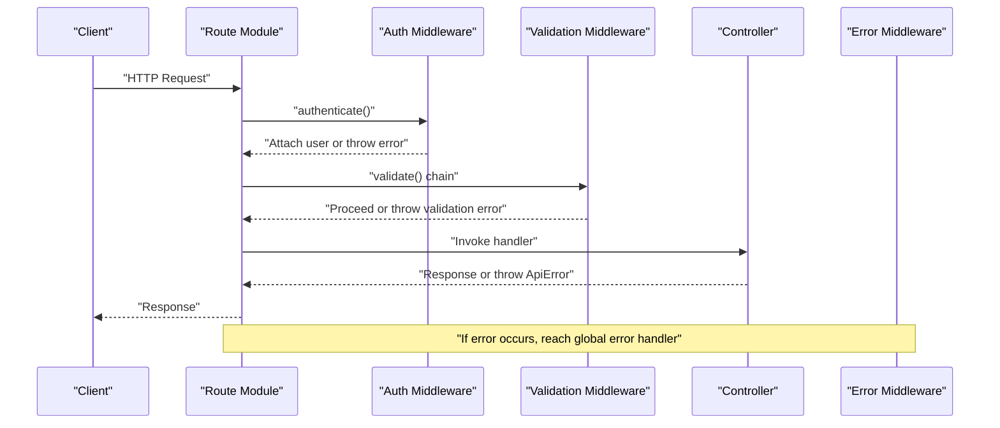
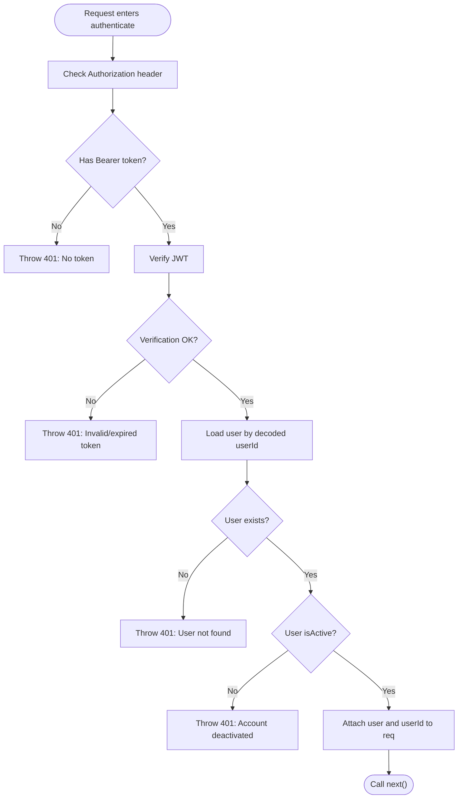
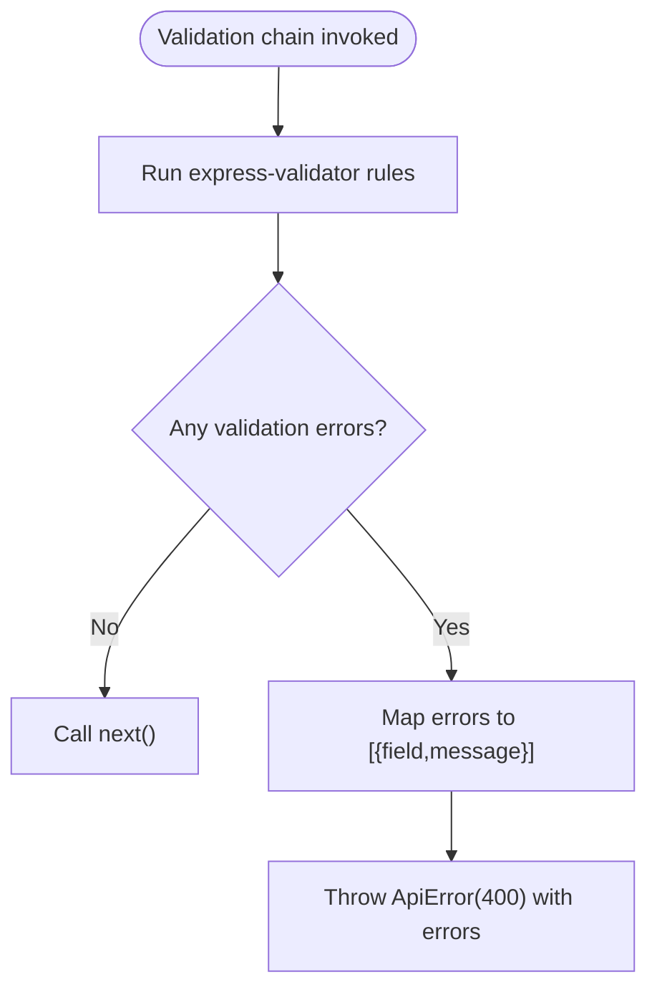
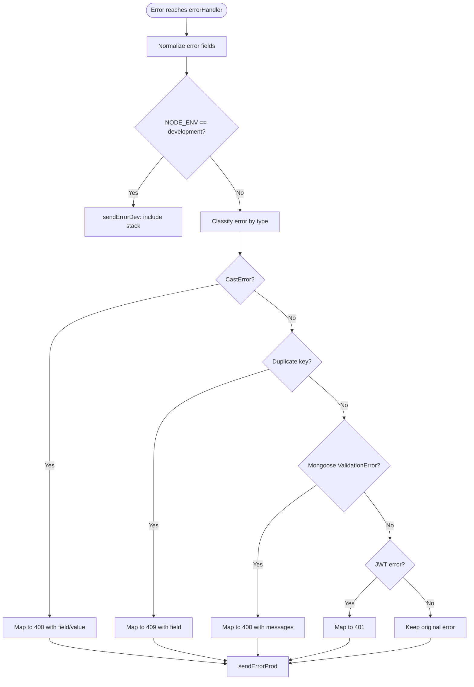
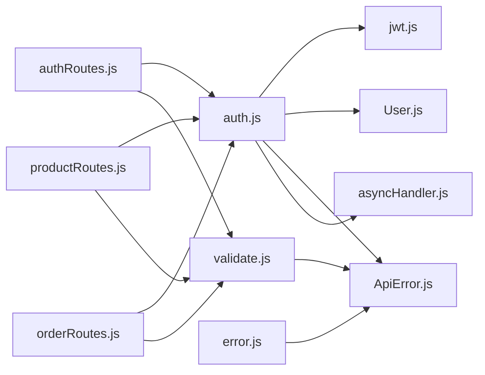

# Middleware System

<cite>
**Referenced Files in This Document**
- [auth.js](file://backend/middleware/auth.js)
- [validate.js](file://backend/middleware/validate.js)
- [error.js](file://backend/middleware/error.js)
- [jwt.js](file://backend/utils/jwt.js)
- [ApiError.js](file://backend/utils/ApiError.js)
- [ApiResponse.js](file://backend/utils/ApiResponse.js)
- [asyncHandler.js](file://backend/utils/asyncHandler.js)
- [User.js](file://backend/models/User.js)
- [authRoutes.js](file://backend/routes/authRoutes.js)
- [productRoutes.js](file://backend/routes/productRoutes.js)
- [orderRoutes.js](file://backend/routes/orderRoutes.js)
- [index.js](file://backend/index.js)
</cite>

## Table of Contents
1. [Introduction](#introduction)
2. [Project Structure](#project-structure)
3. [Core Components](#core-components)
4. [Architecture Overview](#architecture-overview)
5. [Detailed Component Analysis](#detailed-component-analysis)
6. [Dependency Analysis](#dependency-analysis)
7. [Performance Considerations](#performance-considerations)
8. [Troubleshooting Guide](#troubleshooting-guide)
9. [Conclusion](#conclusion)

## Introduction
This document explains the middleware system that implements cross-cutting concerns in the backend. It covers:
- Authentication middleware for JWT token validation and user authorization
- Validation middleware for input sanitization, data validation, and request preprocessing
- Error handling middleware for standardized error responses, logging, and exception management
It also details middleware chaining patterns, custom middleware development, integration with Express routing, examples of implementation, error propagation, debugging techniques, and performance considerations.

## Project Structure
The middleware system resides under backend/middleware and integrates with routes, controllers, and utilities. The Express server initializes middleware globally and mounts route modules.

**Diagram sources**
- [index.js:1-119](file://backend/index.js#L1-L119)
- [auth.js:1-124](file://backend/middleware/auth.js#L1-L124)
- [validate.js:1-221](file://backend/middleware/validate.js#L1-L221)
- [error.js:1-121](file://backend/middleware/error.js#L1-L121)
- [jwt.js:1-49](file://backend/utils/jwt.js#L1-L49)
- [ApiError.js:1-21](file://backend/utils/ApiError.js#L1-L21)
- [ApiResponse.js:1-52](file://backend/utils/ApiResponse.js#L1-L52)
- [asyncHandler.js:1-16](file://backend/utils/asyncHandler.js#L1-L16)
- [User.js:1-135](file://backend/models/User.js#L1-L135)
- [authRoutes.js:1-85](file://backend/routes/authRoutes.js#L1-L85)
- [productRoutes.js:1-101](file://backend/routes/productRoutes.js#L1-L101)
- [orderRoutes.js:1-77](file://backend/routes/orderRoutes.js#L1-L77)

**Section sources**
- [index.js:1-119](file://backend/index.js#L1-L119)
- [authRoutes.js:1-85](file://backend/routes/authRoutes.js#L1-L85)
- [productRoutes.js:1-101](file://backend/routes/productRoutes.js#L1-L101)
- [orderRoutes.js:1-77](file://backend/routes/orderRoutes.js#L1-L77)

## Core Components
- Authentication middleware: Validates JWT tokens, attaches user to request, optional auth, and role-based authorization.
- Validation middleware: Uses express-validator to sanitize and validate request bodies, params, and query strings, then centralizes error extraction.
- Error handling middleware: Centralizes error classification, response formatting, and environment-aware logging.

**Section sources**
- [auth.js:1-124](file://backend/middleware/auth.js#L1-L124)
- [validate.js:1-221](file://backend/middleware/validate.js#L1-L221)
- [error.js:1-121](file://backend/middleware/error.js#L1-L121)

## Architecture Overview
The middleware system follows a layered approach:
- Route modules define endpoints and apply middleware in a specific order.
- Authentication middleware verifies tokens and attaches user context.
- Validation middleware enforces input rules and throws structured errors.
- Error middleware standardizes responses and handles operational vs. programming errors.

**Diagram sources**
- [authRoutes.js:1-85](file://backend/routes/authRoutes.js#L1-L85)
- [productRoutes.js:1-101](file://backend/routes/productRoutes.js#L1-L101)
- [orderRoutes.js:1-77](file://backend/routes/orderRoutes.js#L1-L77)
- [auth.js:1-124](file://backend/middleware/auth.js#L1-L124)
- [validate.js:1-221](file://backend/middleware/validate.js#L1-L221)
- [error.js:1-121](file://backend/middleware/error.js#L1-L121)

## Detailed Component Analysis

### Authentication Middleware
Implements JWT-based authentication and authorization:
- authenticate: Extracts Bearer token from Authorization header, verifies it, loads user, checks activation, and attaches user to request.
- optionalAuth: Same as authenticate but does not fail if token is missing or invalid; silently sets null user.
- authorize: Role-based gatekeeper returning a middleware that checks req.user against allowed roles.
- adminOnly: Convenience wrapper around authorize for admin role.

**Diagram sources**
- [auth.js:10-55](file://backend/middleware/auth.js#L10-L55)
- [jwt.js:27-29](file://backend/utils/jwt.js#L27-L29)
- [User.js:1-135](file://backend/models/User.js#L1-L135)

Implementation highlights:
- Uses asyncHandler to simplify error propagation to the global error handler.
- Throws ApiError instances with appropriate status codes and messages.
- Attaches req.user and req.userId for downstream middleware and controllers.

Integration examples:
- Routes apply authenticate for private endpoints and authorize/adminOnly for protected admin actions.

**Section sources**
- [auth.js:1-124](file://backend/middleware/auth.js#L1-L124)
- [jwt.js:1-49](file://backend/utils/jwt.js#L1-L49)
- [User.js:1-135](file://backend/models/User.js#L1-L135)
- [authRoutes.js:1-85](file://backend/routes/authRoutes.js#L1-L85)
- [productRoutes.js:1-101](file://backend/routes/productRoutes.js#L1-L101)
- [orderRoutes.js:1-77](file://backend/routes/orderRoutes.js#L1-L77)

### Validation Middleware
Provides structured input validation using express-validator:
- handleValidationErrors: Converts validation errors into a standardized ApiError with field and message arrays.
- authValidation: Registration and login validations with sanitization and constraints.
- productValidation: Create, update, getById, and list validations with category, price, stock, and URL checks.
- orderValidation: Create order, update status, and getById validations with nested object and enum checks.

**Diagram sources**
- [validate.js:12-25](file://backend/middleware/validate.js#L12-L25)

Key behaviors:
- Uses body(), param(), query() helpers to define rules.
- Applies normalization (trim, normalizeEmail, isURL) and sanitization.
- Centralizes error extraction and throws a single ApiError with detailed errors.

**Section sources**
- [validate.js:1-221](file://backend/middleware/validate.js#L1-L221)
- [ApiError.js:1-21](file://backend/utils/ApiError.js#L1-L21)

### Error Handling Middleware
Centralizes error handling:
- Type-specific handlers: CastError, duplicate key, Mongoose validation, JWT invalid/expired.
- Environment-aware responses: Development sends stack traces; production masks internal details.
- notFound: Creates a 404 ApiError for undefined routes.
- errorHandler: Normalizes error, classifies operational errors, and responds consistently.

**Diagram sources**
- [error.js:84-103](file://backend/middleware/error.js#L84-L103)
- [error.js:51-79](file://backend/middleware/error.js#L51-L79)

**Section sources**
- [error.js:1-121](file://backend/middleware/error.js#L1-L121)
- [ApiError.js:1-21](file://backend/utils/ApiError.js#L1-L21)

### JWT Utilities
- generateToken: Signs payload with secret and expiration.
- verifyToken: Verifies token signature and returns decoded payload.
- generateRefreshToken: Longer-lived refresh token.

**Section sources**
- [jwt.js:1-49](file://backend/utils/jwt.js#L1-L49)

### API Helpers
- ApiResponse: Provides successResponse and errorResponse helpers for consistent JSON responses.
- ApiError: Custom error class with status code, operational flag, and stack capture.

**Section sources**
- [ApiResponse.js:1-52](file://backend/utils/ApiResponse.js#L1-L52)
- [ApiError.js:1-21](file://backend/utils/ApiError.js#L1-L21)

### Async Handler Utility
- asyncHandler: Wraps async route handlers so thrown errors are passed to Express error middleware without try-catch in controllers.

**Section sources**
- [asyncHandler.js:1-16](file://backend/utils/asyncHandler.js#L1-L16)

## Dependency Analysis
The middleware system exhibits low coupling and high cohesion:
- auth.js depends on jwt.js, User model, ApiError, and asyncHandler.
- validate.js depends on express-validator and ApiError.
- error.js depends on ApiError and environment variables.
- Routes depend on auth and validate middleware to enforce policies.

**Diagram sources**
- [auth.js:1-124](file://backend/middleware/auth.js#L1-L124)
- [validate.js:1-221](file://backend/middleware/validate.js#L1-L221)
- [error.js:1-121](file://backend/middleware/error.js#L1-L121)
- [jwt.js:1-49](file://backend/utils/jwt.js#L1-L49)
- [User.js:1-135](file://backend/models/User.js#L1-L135)
- [ApiError.js:1-21](file://backend/utils/ApiError.js#L1-L21)
- [asyncHandler.js:1-16](file://backend/utils/asyncHandler.js#L1-L16)
- [authRoutes.js:1-85](file://backend/routes/authRoutes.js#L1-L85)
- [productRoutes.js:1-101](file://backend/routes/productRoutes.js#L1-L101)
- [orderRoutes.js:1-77](file://backend/routes/orderRoutes.js#L1-L77)

**Section sources**
- [auth.js:1-124](file://backend/middleware/auth.js#L1-L124)
- [validate.js:1-221](file://backend/middleware/validate.js#L1-L221)
- [error.js:1-121](file://backend/middleware/error.js#L1-L121)
- [authRoutes.js:1-85](file://backend/routes/authRoutes.js#L1-L85)
- [productRoutes.js:1-101](file://backend/routes/productRoutes.js#L1-L101)
- [orderRoutes.js:1-77](file://backend/routes/orderRoutes.js#L1-L77)

## Performance Considerations
- Middleware ordering matters: Place fast checks early (e.g., CORS, body parsing) and heavy operations later (e.g., database lookups).
- Prefer optionalAuth when a route should remain accessible even without a token to reduce unnecessary failures.
- Use environment-specific logging (development) to minimize overhead in production.
- Keep validation rules minimal and targeted to avoid excessive CPU usage on large payloads.
- Ensure asyncHandler prevents repeated try-catch blocks, reducing boilerplate and potential misconfiguration.

[No sources needed since this section provides general guidance]

## Troubleshooting Guide
Common issues and resolutions:
- 401 Unauthorized during authentication:
  - Verify Authorization header format and presence of Bearer token.
  - Confirm JWT_SECRET is set and correct.
  - Check user.isActive and existence in the database.
- 403 Forbidden on role-gated endpoints:
  - Ensure req.user.role matches allowed roles.
- Validation errors:
  - Review handleValidationErrors output for field-level messages.
  - Confirm express-validator rules align with request payload shape.
- 404 Not Found:
  - Ensure route paths match request URLs and that notFound is mounted after route modules.
- Global error responses:
  - Development mode exposes stack traces; production mode hides internals.
  - Operational errors are sent with details; programming errors are masked.

Debugging techniques:
- Enable development logging middleware to inspect request flow.
- Use ApiError messages and error.status to quickly identify failure categories.
- Temporarily bypass optionalAuth to isolate token-related issues.

**Section sources**
- [auth.js:1-124](file://backend/middleware/auth.js#L1-L124)
- [validate.js:1-221](file://backend/middleware/validate.js#L1-L221)
- [error.js:1-121](file://backend/middleware/error.js#L1-L121)
- [index.js:32-38](file://backend/index.js#L32-L38)

## Conclusion
The middleware system provides a robust foundation for cross-cutting concerns:
- Authentication ensures secure access with clear user context.
- Validation guarantees input integrity and produces consistent error messages.
- Error handling delivers standardized responses and safe production behavior.
Proper middleware ordering and thoughtful composition enable scalable, maintainable APIs.

[No sources needed since this section summarizes without analyzing specific files]