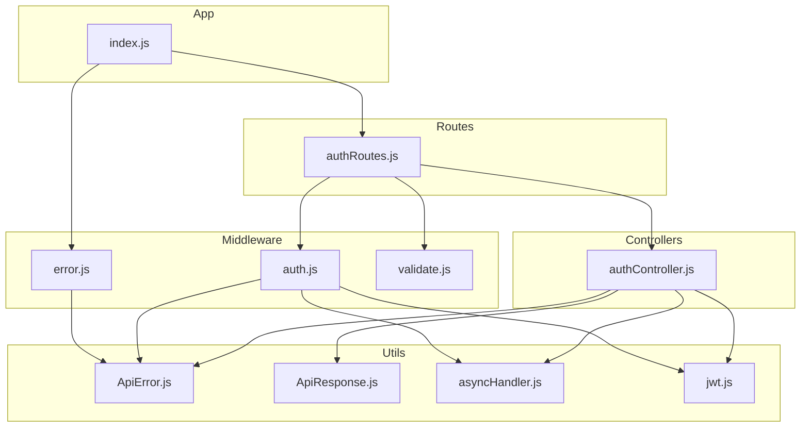
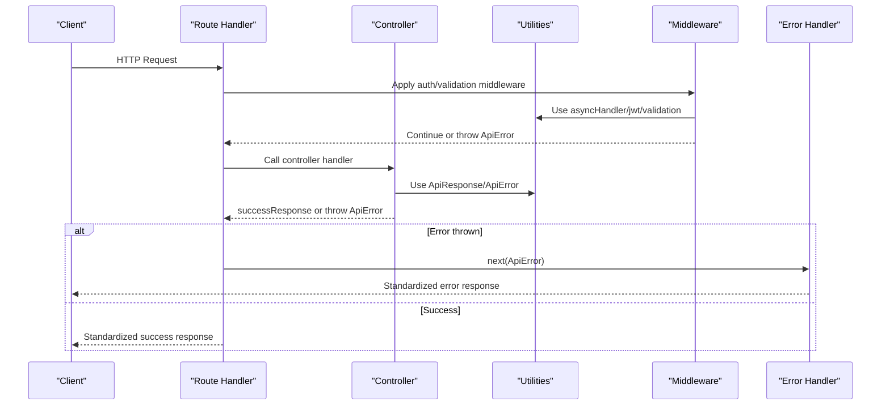
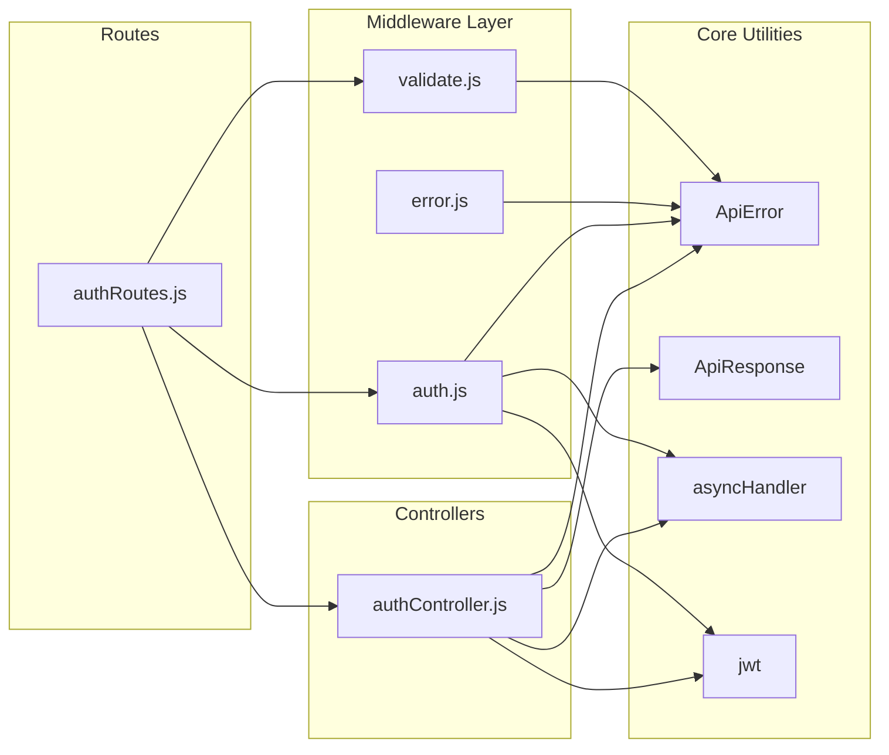

# Utility Functions and Helpers

<cite>
**Referenced Files in This Document**
- [ApiError.js](file://backend/utils/ApiError.js)
- [ApiResponse.js](file://backend/utils/ApiResponse.js)
- [asyncHandler.js](file://backend/utils/asyncHandler.js)
- [jwt.js](file://backend/utils/jwt.js)
- [error.js](file://backend/middleware/error.js)
- [auth.js](file://backend/middleware/auth.js)
- [validate.js](file://backend/middleware/validate.js)
- [authController.js](file://backend/controllers/authController.js)
- [authRoutes.js](file://backend/routes/authRoutes.js)
- [index.js](file://backend/index.js)
</cite>

## Table of Contents
1. [Introduction](#introduction)
2. [Project Structure](#project-structure)
3. [Core Components](#core-components)
4. [Architecture Overview](#architecture-overview)
5. [Detailed Component Analysis](#detailed-component-analysis)
6. [Dependency Analysis](#dependency-analysis)
7. [Performance Considerations](#performance-considerations)
8. [Troubleshooting Guide](#troubleshooting-guide)
9. [Conclusion](#conclusion)

## Introduction
This document provides comprehensive documentation for the utility functions and helper modules that support the backend architecture. It focuses on:
- The API error handling system (ApiError class)
- Standardized response formatting (ApiResponse)
- Async error handling patterns (asyncHandler)
- JWT token management utilities
- Implementation patterns, usage, integration with controllers and middleware
- Examples of error handling, response standardization, and JWT operations
- Testing considerations, reusability patterns, and extension points

## Project Structure
The backend follows a modular structure with dedicated utility modules under the utils directory and integration points in middleware, controllers, and routes.

**Diagram sources**
- [ApiError.js:1-21](file://backend/utils/ApiError.js#L1-L21)
- [ApiResponse.js:1-52](file://backend/utils/ApiResponse.js#L1-L52)
- [asyncHandler.js:1-16](file://backend/utils/asyncHandler.js#L1-L16)
- [jwt.js:1-49](file://backend/utils/jwt.js#L1-L49)
- [error.js:1-121](file://backend/middleware/error.js#L1-L121)
- [auth.js:1-124](file://backend/middleware/auth.js#L1-L124)
- [validate.js:1-221](file://backend/middleware/validate.js#L1-L221)
- [authController.js:1-299](file://backend/controllers/authController.js#L1-L299)
- [authRoutes.js:1-85](file://backend/routes/authRoutes.js#L1-L85)
- [index.js:1-119](file://backend/index.js#L1-L119)

**Section sources**
- [index.js:1-119](file://backend/index.js#L1-L119)

## Core Components
This section documents the four core utility modules and their responsibilities.

- ApiError: Custom error class extending Error with HTTP status code, operational flag, and automatic status classification.
- ApiResponse: Standardized response helpers for success and error responses with consistent JSON structure.
- asyncHandler: Higher-order function that wraps async route handlers to centralize error catching.
- jwt: JWT utilities for token generation, verification, and refresh token creation.

**Section sources**
- [ApiError.js:1-21](file://backend/utils/ApiError.js#L1-L21)
- [ApiResponse.js:1-52](file://backend/utils/ApiResponse.js#L1-L52)
- [asyncHandler.js:1-16](file://backend/utils/asyncHandler.js#L1-L16)
- [jwt.js:1-49](file://backend/utils/jwt.js#L1-L49)

## Architecture Overview
The utilities integrate across the application to provide consistent error handling, response formatting, and authentication flows.

**Diagram sources**
- [authRoutes.js:1-85](file://backend/routes/authRoutes.js#L1-L85)
- [authController.js:1-299](file://backend/controllers/authController.js#L1-L299)
- [auth.js:1-124](file://backend/middleware/auth.js#L1-L124)
- [validate.js:1-221](file://backend/middleware/validate.js#L1-L221)
- [error.js:1-121](file://backend/middleware/error.js#L1-L121)
- [ApiResponse.js:1-52](file://backend/utils/ApiResponse.js#L1-L52)
- [ApiError.js:1-21](file://backend/utils/ApiError.js#L1-L21)
- [asyncHandler.js:1-16](file://backend/utils/asyncHandler.js#L1-L16)
- [jwt.js:1-49](file://backend/utils/jwt.js#L1-L49)

## Detailed Component Analysis

### ApiError Class
Purpose: Centralized error representation with HTTP status code, operational flag, and automatic status classification.

Key characteristics:
- Extends native Error
- Stores statusCode, isOperational, and computed status ('fail' for 4xx, 'error' otherwise)
- Captures stack trace or uses Error.captureStackTrace
- Used extensively by controllers and middleware for consistent error signaling

Usage patterns:
- Controllers throw ApiError instances for business logic failures
- Middleware converts database and validation errors to ApiError
- Error handler middleware uses ApiError properties for response formatting

**Section sources**
- [ApiError.js:1-21](file://backend/utils/ApiError.js#L1-L21)
- [error.js:1-121](file://backend/middleware/error.js#L1-L121)
- [authController.js:1-299](file://backend/controllers/authController.js#L1-L299)

### ApiResponse Helpers
Purpose: Standardized response formatting across all endpoints.

Components:
- successResponse: Returns { success: true, message, data, meta? }
- errorResponse: Returns { success: false, message, errors? }

Integration:
- Controllers call successResponse for successful outcomes
- errorResponse is used internally by error middleware for standardized error responses
- Supports optional meta for pagination and additional metadata

**Section sources**
- [ApiResponse.js:1-52](file://backend/utils/ApiResponse.js#L1-L52)
- [authController.js:1-299](file://backend/controllers/authController.js#L1-L299)
- [error.js:1-121](file://backend/middleware/error.js#L1-L121)

### Async Handler Pattern
Purpose: Eliminate repetitive try-catch blocks in route handlers by wrapping async functions.

Implementation:
- asyncHandler(fn) returns an Express middleware function
- Executes fn and catches errors, passing them to next()
- Enables clean controller implementations with centralized error handling

Benefits:
- Reduces boilerplate error handling code
- Ensures all async errors reach the global error handler
- Improves readability and maintainability

**Section sources**
- [asyncHandler.js:1-16](file://backend/utils/asyncHandler.js#L1-L16)
- [authController.js:1-299](file://backend/controllers/authController.js#L1-L299)
- [auth.js:1-124](file://backend/middleware/auth.js#L1-L124)

### JWT Utilities
Purpose: Secure token management for authentication and authorization.

Functions:
- generateToken(payload): Creates signed JWT with configurable expiration
- verifyToken(token): Validates and decodes JWT using secret
- generateRefreshToken(payload): Creates long-lived refresh tokens

Security considerations:
- Uses process.env.JWT_SECRET for signing
- Configurable expiration via process.env.JWT_EXPIRE
- Supports refresh token pattern for extended sessions

Integration:
- Controllers generate tokens upon successful authentication
- Middleware verifies tokens and attaches user context
- Error handler manages JWT-specific error scenarios

**Section sources**
- [jwt.js:1-49](file://backend/utils/jwt.js#L1-L49)
- [authController.js:1-299](file://backend/controllers/authController.js#L1-L299)
- [auth.js:1-124](file://backend/middleware/auth.js#L1-L124)
- [error.js:1-121](file://backend/middleware/error.js#L1-L121)

### Error Handler Middleware
Purpose: Centralized error processing and response formatting.

Capabilities:
- Converts database errors (CastError, ValidationError, duplicate keys) to ApiError
- Handles JWT-specific errors (invalid/expired tokens)
- Provides development vs production error responses
- 404 handler for undefined routes

Response strategies:
- Development: Full error details including stack traces
- Production: Operational errors show messages; programming errors hide details

**Section sources**
- [error.js:1-121](file://backend/middleware/error.js#L1-L121)

### Authentication Middleware
Purpose: JWT-based authentication and authorization.

Features:
- authenticate: Requires valid JWT and attaches user context
- optionalAuth: Attempts authentication but continues if no/invalid token
- authorize: Role-based access control with flexible role lists
- adminOnly: Convenience wrapper for admin-only access

Integration:
- Extracts Bearer token from Authorization header
- Verifies token and loads user from database
- Enforces account activation status
- Throws ApiError for authentication/authorization failures

**Section sources**
- [auth.js:1-124](file://backend/middleware/auth.js#L1-L124)

### Validation Middleware
Purpose: Consistent request validation using express-validator.

Features:
- handleValidationErrors: Converts validation errors to ApiError
- Predefined validation sets for auth, products, and orders
- Comprehensive field-level validation with custom messages

Integration:
- Applied as middleware in routes
- Automatically throws ApiError on validation failure
- Provides structured error details for client feedback

**Section sources**
- [validate.js:1-221](file://backend/middleware/validate.js#L1-L221)
- [authRoutes.js:1-85](file://backend/routes/authRoutes.js#L1-L85)

## Dependency Analysis
The utilities form a cohesive dependency graph that ensures consistent behavior across the application.

**Diagram sources**
- [ApiError.js:1-21](file://backend/utils/ApiError.js#L1-L21)
- [ApiResponse.js:1-52](file://backend/utils/ApiResponse.js#L1-L52)
- [asyncHandler.js:1-16](file://backend/utils/asyncHandler.js#L1-L16)
- [jwt.js:1-49](file://backend/utils/jwt.js#L1-L49)
- [error.js:1-121](file://backend/middleware/error.js#L1-L121)
- [auth.js:1-124](file://backend/middleware/auth.js#L1-L124)
- [validate.js:1-221](file://backend/middleware/validate.js#L1-L221)
- [authController.js:1-299](file://backend/controllers/authController.js#L1-L299)
- [authRoutes.js:1-85](file://backend/routes/authRoutes.js#L1-L85)

**Section sources**
- [authController.js:1-299](file://backend/controllers/authController.js#L1-L299)
- [auth.js:1-124](file://backend/middleware/auth.js#L1-L124)
- [error.js:1-121](file://backend/middleware/error.js#L1-L121)

## Performance Considerations
- Error handling overhead: Centralized error handling reduces repeated try-catch logic and improves performance by avoiding redundant error checks.
- Response formatting: Standardized response helpers minimize object construction overhead and ensure consistent serialization.
- JWT operations: Token generation and verification are lightweight operations suitable for typical request rates; consider caching for high-throughput scenarios.
- Validation middleware: express-validator adds minimal overhead while providing comprehensive validation capabilities.

## Troubleshooting Guide
Common issues and resolutions:

### JWT Token Issues
- Invalid token errors: Check JWT_SECRET environment variable and token expiration
- Token verification failures: Ensure consistent token signing and verification across services
- Account deactivation: Verify user.isActive status before granting access

### Error Handling Patterns
- Uncaught exceptions: Application handles uncaught exceptions and unhandled rejections gracefully
- Validation errors: Use handleValidationErrors to convert express-validator errors to ApiError
- Database errors: CastError, duplicate key, and validation errors are automatically converted to ApiError

### Response Formatting
- Inconsistent responses: Ensure all controllers use ApiResponse helpers
- Missing error details: Check NODE_ENV setting for development vs production error responses

**Section sources**
- [error.js:1-121](file://backend/middleware/error.js#L1-L121)
- [auth.js:1-124](file://backend/middleware/auth.js#L1-L124)
- [validate.js:1-221](file://backend/middleware/validate.js#L1-L221)
- [index.js:1-119](file://backend/index.js#L1-L119)

## Conclusion
The utility functions and helper modules provide a robust foundation for error handling, response formatting, authentication, and validation across the backend architecture. Their integration ensures consistent behavior, improved maintainability, and simplified controller logic. The modular design allows for easy extension and customization while maintaining system reliability and security.