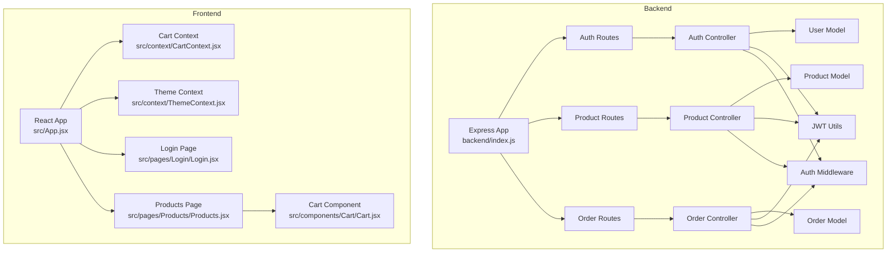
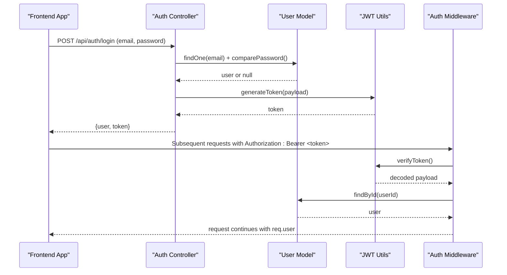
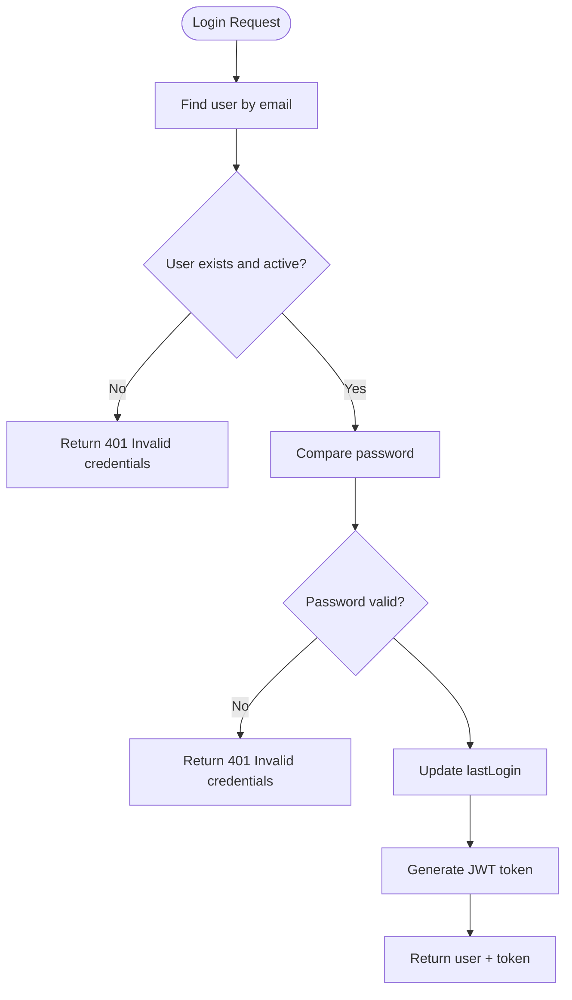
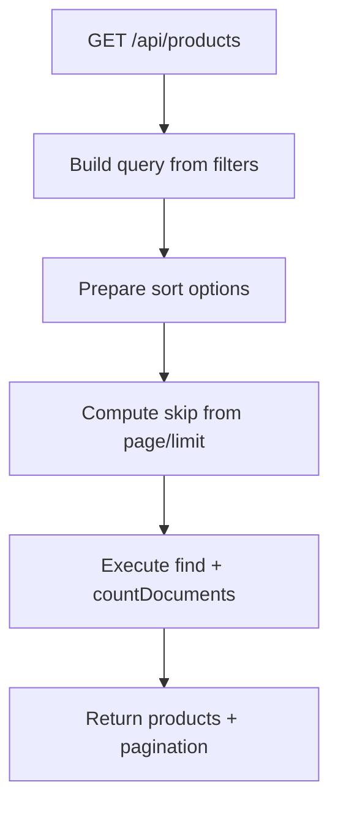
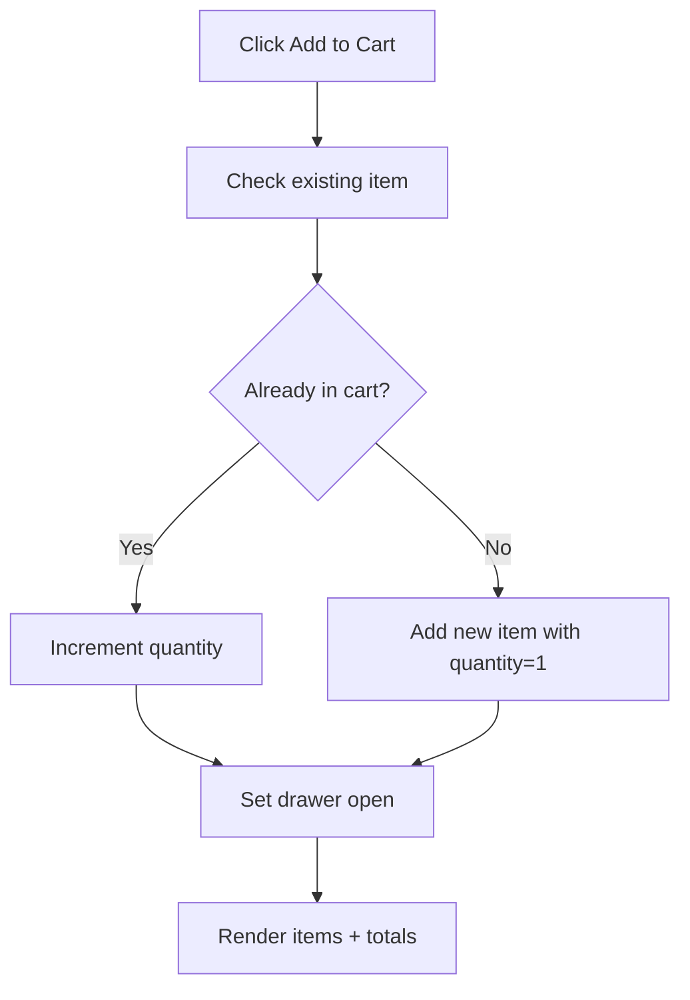
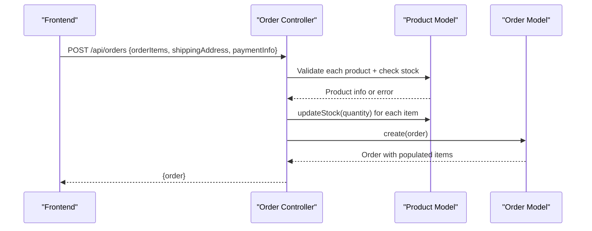
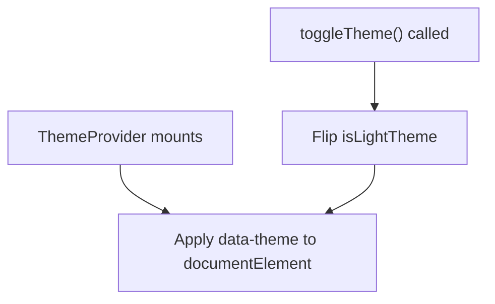
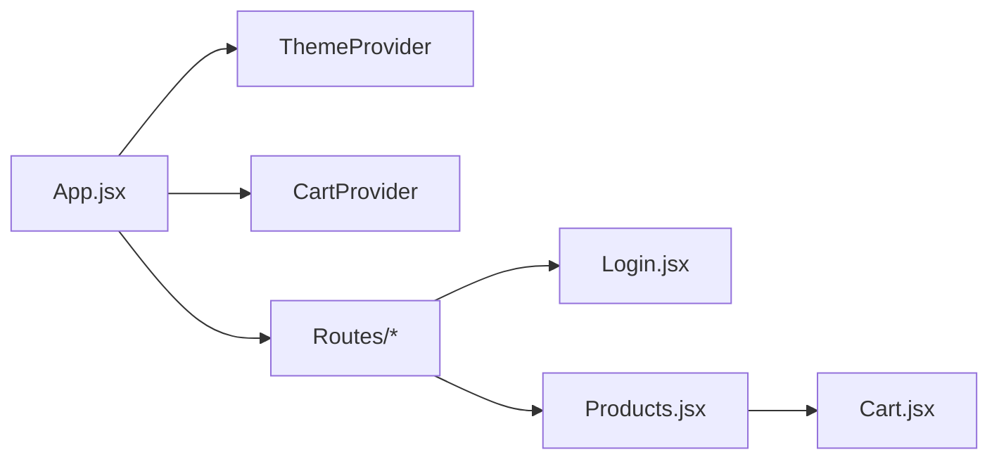
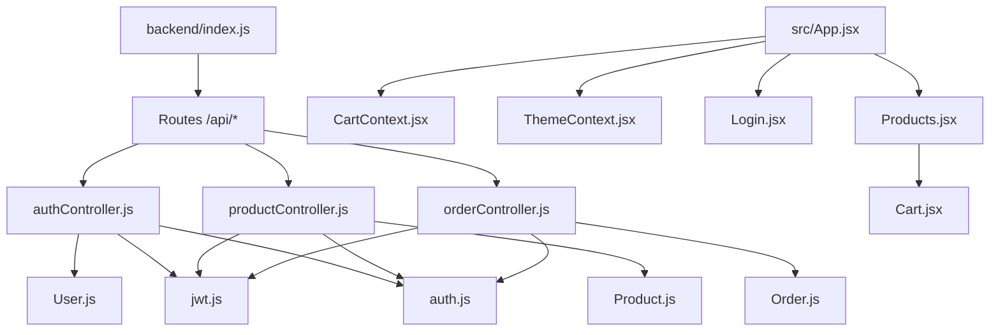

# Core Features

<cite>
**Referenced Files in This Document**
- [backend/index.js](file://backend/index.js)
- [backend/controllers/authController.js](file://backend/controllers/authController.js)
- [backend/controllers/productController.js](file://backend/controllers/productController.js)
- [backend/controllers/orderController.js](file://backend/controllers/orderController.js)
- [backend/middleware/auth.js](file://backend/middleware/auth.js)
- [backend/utils/jwt.js](file://backend/utils/jwt.js)
- [backend/models/User.js](file://backend/models/User.js)
- [backend/models/Product.js](file://backend/models/Product.js)
- [backend/models/Order.js](file://backend/models/Order.js)
- [src/App.jsx](file://src/App.jsx)
- [src/context/CartContext.jsx](file://src/context/CartContext.jsx)
- [src/context/ThemeContext.jsx](file://src/context/ThemeContext.jsx)
- [src/components/Cart/Cart.jsx](file://src/components/Cart/Cart.jsx)
- [src/pages/Login/Login.jsx](file://src/pages/Login/Login.jsx)
- [src/pages/Products/Products.jsx](file://src/pages/Products/Products.jsx)
</cite>

## Table of Contents
1. [Introduction](#introduction)
2. [Project Structure](#project-structure)
3. [Core Components](#core-components)
4. [Architecture Overview](#architecture-overview)
5. [Detailed Component Analysis](#detailed-component-analysis)
6. [Dependency Analysis](#dependency-analysis)
7. [Performance Considerations](#performance-considerations)
8. [Troubleshooting Guide](#troubleshooting-guide)
9. [Conclusion](#conclusion)

## Introduction
This document explains the core e-commerce features implemented in the application, focusing on:
- User authentication system
- Product catalog management
- Shopping cart operations
- Order processing
- Theme management

It provides both conceptual overviews for beginners and technical details for experienced developers, including implementation patterns, user workflows, and integration between frontend components and backend services.

## Project Structure
The application follows a clear separation of concerns:
- Backend: Express server exposing REST APIs for authentication, product catalog, and orders, with Mongoose models and middleware for auth and error handling.
- Frontend: React application with routing, context providers for cart and theme, and page components for browsing products and user authentication.

**Diagram sources**
- [backend/index.js:1-119](file://backend/index.js#L1-L119)
- [backend/controllers/authController.js:1-299](file://backend/controllers/authController.js#L1-L299)
- [backend/controllers/productController.js:1-341](file://backend/controllers/productController.js#L1-L341)
- [backend/controllers/orderController.js:1-358](file://backend/controllers/orderController.js#L1-L358)
- [backend/middleware/auth.js:1-124](file://backend/middleware/auth.js#L1-L124)
- [backend/utils/jwt.js:1-49](file://backend/utils/jwt.js#L1-L49)
- [backend/models/User.js:1-135](file://backend/models/User.js#L1-L135)
- [backend/models/Product.js:1-217](file://backend/models/Product.js#L1-L217)
- [backend/models/Order.js:1-217](file://backend/models/Order.js#L1-L217)
- [src/App.jsx:1-75](file://src/App.jsx#L1-L75)
- [src/context/CartContext.jsx:1-62](file://src/context/CartContext.jsx#L1-L62)
- [src/context/ThemeContext.jsx:1-30](file://src/context/ThemeContext.jsx#L1-L30)
- [src/pages/Login/Login.jsx:1-123](file://src/pages/Login/Login.jsx#L1-L123)
- [src/pages/Products/Products.jsx:1-50](file://src/pages/Products/Products.jsx#L1-L50)
- [src/components/Cart/Cart.jsx:1-260](file://src/components/Cart/Cart.jsx#L1-L260)

**Section sources**
- [backend/index.js:1-119](file://backend/index.js#L1-L119)
- [src/App.jsx:1-75](file://src/App.jsx#L1-L75)

## Core Components
- Authentication system: Registration, login, profile management, address management, and logout. Implemented via controllers, JWT utilities, and auth middleware.
- Product catalog: Browse, filter, sort, search, and manage products (admin). Implemented via controllers and models with indexes and aggregations.
- Shopping cart: Local state management for adding/removing/updating items and calculating totals. Integrated with UI via context provider.
- Order processing: Create orders, manage statuses, payments, and cancellation. Implemented via controllers and models with validation and stock updates.
- Theme management: Toggle light/dark theme via a context provider and apply to the document root.

**Section sources**
- [backend/controllers/authController.js:1-299](file://backend/controllers/authController.js#L1-L299)
- [backend/controllers/productController.js:1-341](file://backend/controllers/productController.js#L1-L341)
- [backend/controllers/orderController.js:1-358](file://backend/controllers/orderController.js#L1-L358)
- [src/context/CartContext.jsx:1-62](file://src/context/CartContext.jsx#L1-L62)
- [src/context/ThemeContext.jsx:1-30](file://src/context/ThemeContext.jsx#L1-L30)

## Architecture Overview
The backend exposes REST endpoints grouped under /api/auth, /api/products, and /api/orders. Controllers orchestrate requests, models define schemas and helpers, and middleware enforces authentication and authorization. The frontend integrates with the backend via HTTP requests and manages UI state locally.

**Diagram sources**
- [backend/controllers/authController.js:54-94](file://backend/controllers/authController.js#L54-L94)
- [backend/utils/jwt.js:13-29](file://backend/utils/jwt.js#L13-L29)
- [backend/middleware/auth.js:10-55](file://backend/middleware/auth.js#L10-L55)
- [backend/models/User.js:110-130](file://backend/models/User.js#L110-L130)

## Detailed Component Analysis

### User Authentication System
- Endpoints: register, login, profile (get/update), change password, addresses (add/update/delete), logout.
- Security: JWT tokens generated on login/register; middleware verifies tokens and attaches user; password hashing via bcrypt; selective population of password field.
- Workflows:
  - Registration: Validate uniqueness, create user, hash password, generate token, return user and token.
  - Login: Find user, verify activity, compare password, update last login, generate token, return user and token.
  - Profile: Retrieve and sanitize user profile.
  - Address management: Add/update/remove addresses with default handling.
  - Logout: Client-side token removal; endpoint reserved for future enhancements.

**Diagram sources**
- [backend/controllers/authController.js:54-94](file://backend/controllers/authController.js#L54-L94)
- [backend/models/User.js:110-130](file://backend/models/User.js#L110-L130)
- [backend/utils/jwt.js:13-29](file://backend/utils/jwt.js#L13-L29)

**Section sources**
- [backend/controllers/authController.js:17-94](file://backend/controllers/authController.js#L17-L94)
- [backend/middleware/auth.js:10-55](file://backend/middleware/auth.js#L10-L55)
- [backend/models/User.js:92-130](file://backend/models/User.js#L92-L130)
- [backend/utils/jwt.js:13-29](file://backend/utils/jwt.js#L13-L29)

### Product Catalog Management
- Endpoints: list with filters (category, price range, featured, badge, search), by ID/SKU, featured list, by category, categories aggregation, CRUD (admin), stock update, search.
- Filtering and pagination: Query builder supports page, limit, sortBy, order, category, min/max price, search text, featured, badge.
- Admin operations: Create, update, soft-delete (set inactive), stock adjustment.
- Data model: Rich product schema with indexes, text search, SKU generation, discount calculation, stock update helper.

**Diagram sources**
- [backend/controllers/productController.js:16-85](file://backend/controllers/productController.js#L16-L85)
- [backend/models/Product.js:147-151](file://backend/models/Product.js#L147-L151)

**Section sources**
- [backend/controllers/productController.js:16-341](file://backend/controllers/productController.js#L16-L341)
- [backend/models/Product.js:8-217](file://backend/models/Product.js#L8-L217)

### Shopping Cart Operations
- State management: Context provider maintains items array, open state, and actions (add, remove, update quantity, clear).
- UI integration: Cart drawer animates in/out, calculates subtotal/discount/delivery/total, handles outside clicks and escape key.
- Workflow: Users add products to cart; drawer opens automatically; quantities adjust; checkout triggers a success message.

**Diagram sources**
- [src/context/CartContext.jsx:9-32](file://src/context/CartContext.jsx#L9-L32)
- [src/components/Cart/Cart.jsx:75-260](file://src/components/Cart/Cart.jsx#L75-L260)

**Section sources**
- [src/context/CartContext.jsx:1-62](file://src/context/CartContext.jsx#L1-L62)
- [src/components/Cart/Cart.jsx:1-260](file://src/components/Cart/Cart.jsx#L1-L260)

### Order Processing
- Endpoints: create order, get all orders (admin), get my orders, get order by ID, update status (admin), update payment (admin), cancel order (user), order stats (admin).
- Validation: Ensures product existence, active status, sufficient stock, computes prices (items/tax/shipping), populates related entities.
- Status transitions: Enforced state machine for orderStatus updates.
- Payment: Completes payment by updating paymentInfo and marking paidAt; otherwise updates status.

**Diagram sources**
- [backend/controllers/orderController.js:17-69](file://backend/controllers/orderController.js#L17-L69)
- [backend/models/Product.js:208-212](file://backend/models/Product.js#L208-L212)
- [backend/models/Order.js:139-165](file://backend/models/Order.js#L139-L165)

**Section sources**
- [backend/controllers/orderController.js:17-358](file://backend/controllers/orderController.js#L17-L358)
- [backend/models/Order.js:36-217](file://backend/models/Order.js#L36-L217)
- [backend/models/Product.js:208-212](file://backend/models/Product.js#L208-L212)

### Theme Management
- Context provider toggles between light and dark themes and applies a data attribute to the document root for global styling.
- UI: Consumers can trigger toggle via a button or other controls.

**Diagram sources**
- [src/context/ThemeContext.jsx:5-22](file://src/context/ThemeContext.jsx#L5-L22)

**Section sources**
- [src/context/ThemeContext.jsx:1-30](file://src/context/ThemeContext.jsx#L1-L30)

### Frontend Routing and Entry Point
- App wraps the routing tree with ThemeProvider and CartProvider, conditionally renders Navbar/Cart except on auth pages, and applies animated page transitions.
- Pages: Login, Products, Deals, About, Home; Products page filters by category and renders ProductCard components.

**Diagram sources**
- [src/App.jsx:55-75](file://src/App.jsx#L55-L75)
- [src/pages/Login/Login.jsx:1-123](file://src/pages/Login/Login.jsx#L1-L123)
- [src/pages/Products/Products.jsx:1-50](file://src/pages/Products/Products.jsx#L1-L50)
- [src/components/Cart/Cart.jsx:75-260](file://src/components/Cart/Cart.jsx#L75-L260)

**Section sources**
- [src/App.jsx:1-75](file://src/App.jsx#L1-L75)
- [src/pages/Login/Login.jsx:1-123](file://src/pages/Login/Login.jsx#L1-L123)
- [src/pages/Products/Products.jsx:1-50](file://src/pages/Products/Products.jsx#L1-L50)

## Dependency Analysis
- Backend entry point registers routes and middleware, initializes database, and starts the server.
- Controllers depend on models and shared utilities (async handler, response/error helpers, JWT).
- Auth middleware depends on JWT utilities and User model to attach user context.
- Frontend App composes contexts and pages; Cart component consumes CartContext.

**Diagram sources**
- [backend/index.js:50-75](file://backend/index.js#L50-L75)
- [backend/controllers/authController.js:1-6](file://backend/controllers/authController.js#L1-L6)
- [backend/controllers/productController.js:1-5](file://backend/controllers/productController.js#L1-L5)
- [backend/controllers/orderController.js:1-6](file://backend/controllers/orderController.js#L1-L6)
- [backend/middleware/auth.js:1-5](file://backend/middleware/auth.js#L1-L5)
- [backend/utils/jwt.js:1-6](file://backend/utils/jwt.js#L1-L6)
- [src/App.jsx:55-75](file://src/App.jsx#L55-L75)
- [src/pages/Products/Products.jsx:1-50](file://src/pages/Products/Products.jsx#L1-L50)
- [src/components/Cart/Cart.jsx:1-260](file://src/components/Cart/Cart.jsx#L1-L260)

**Section sources**
- [backend/index.js:50-75](file://backend/index.js#L50-L75)
- [backend/controllers/authController.js:1-6](file://backend/controllers/authController.js#L1-L6)
- [backend/controllers/productController.js:1-5](file://backend/controllers/productController.js#L1-L5)
- [backend/controllers/orderController.js:1-6](file://backend/controllers/orderController.js#L1-L6)
- [backend/middleware/auth.js:1-5](file://backend/middleware/auth.js#L1-L5)
- [backend/utils/jwt.js:1-6](file://backend/utils/jwt.js#L1-L6)
- [src/App.jsx:55-75](file://src/App.jsx#L55-L75)

## Performance Considerations
- Database indexing: Product and order schemas include indexes for frequent queries (category, price, rating, status, createdAt). Text search indexes support product search.
- Aggregation: Product categories and order statistics use aggregation pipelines for efficient reporting.
- Pagination: Controllers compute skip and limit to avoid large result sets.
- Token-based auth: Stateless JWT reduces session overhead; ensure token size remains minimal.

[No sources needed since this section provides general guidance]

## Troubleshooting Guide
- Authentication errors: 401 for missing/invalid/expired tokens; user not found or deactivated; ensure Authorization header format and token validity.
- Product not found or inactive: Ensure product IDs are valid and isActive is true; verify SKU uniqueness and category enums.
- Insufficient stock during order creation: Validate quantities against product stock before placing orders.
- Unauthorized access: Admin-only endpoints require role=admin; verify middleware is applied.
- Frontend state: Cart operations rely on stable item IDs; ensure product IDs are unique and consistent.

**Section sources**
- [backend/middleware/auth.js:10-55](file://backend/middleware/auth.js#L10-L55)
- [backend/controllers/productController.js:92-102](file://backend/controllers/productController.js#L92-L102)
- [backend/controllers/orderController.js:17-69](file://backend/controllers/orderController.js#L17-L69)
- [src/context/CartContext.jsx:9-32](file://src/context/CartContext.jsx#L9-L32)

## Conclusion
The application implements a cohesive e-commerce solution with clear backend APIs and a responsive frontend. Authentication, product catalog, cart, orders, and theme management are modular and extensible. Following the documented workflows and leveraging the provided components ensures consistent behavior and maintainable development.