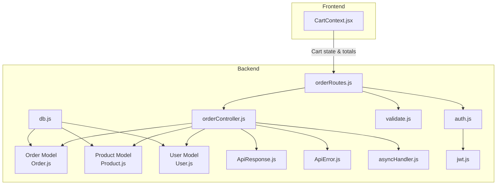
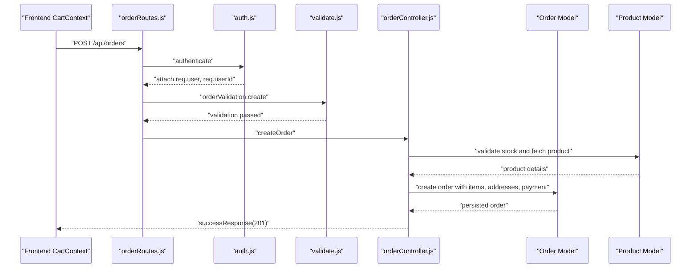
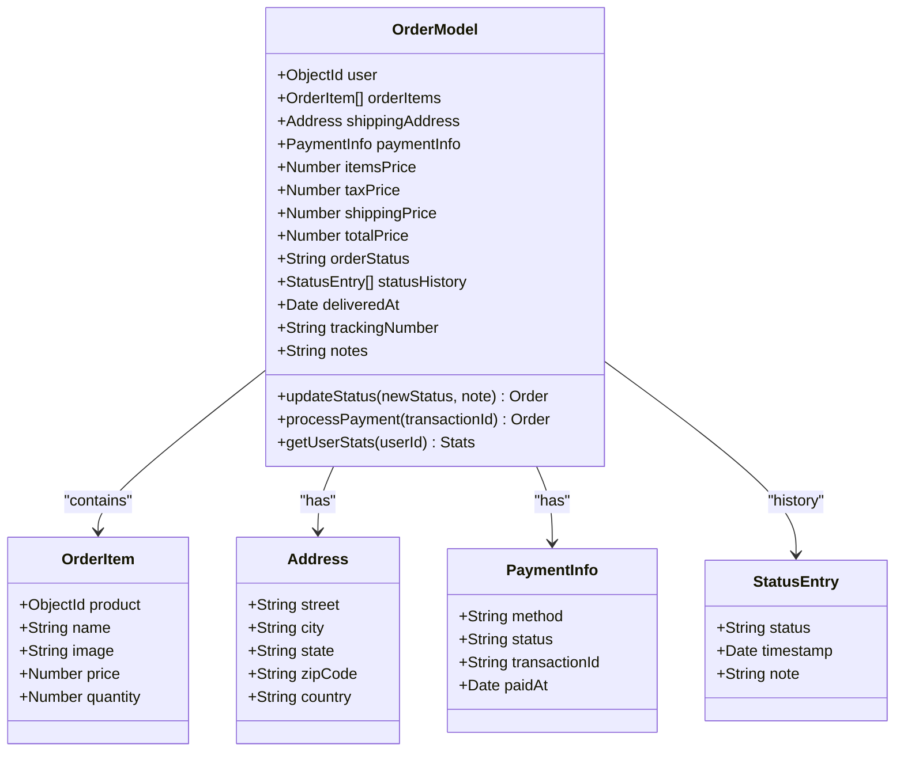
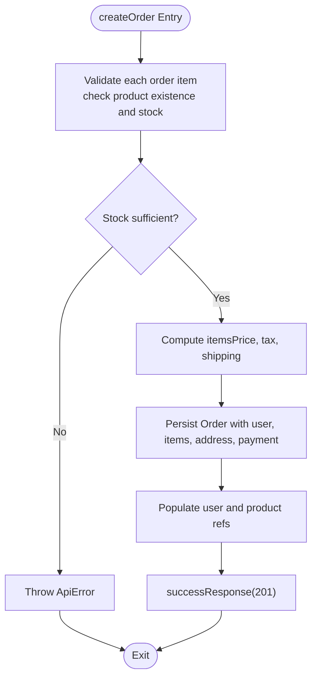
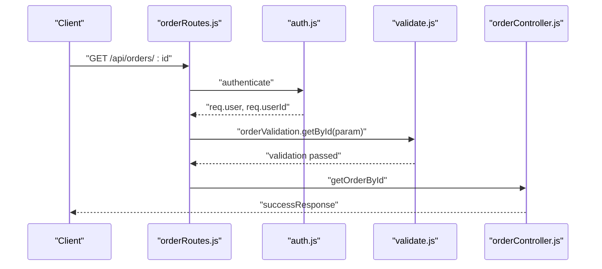
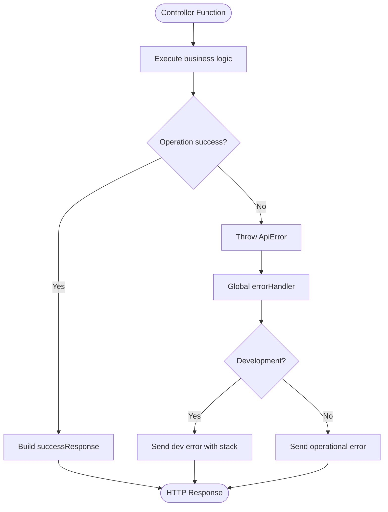
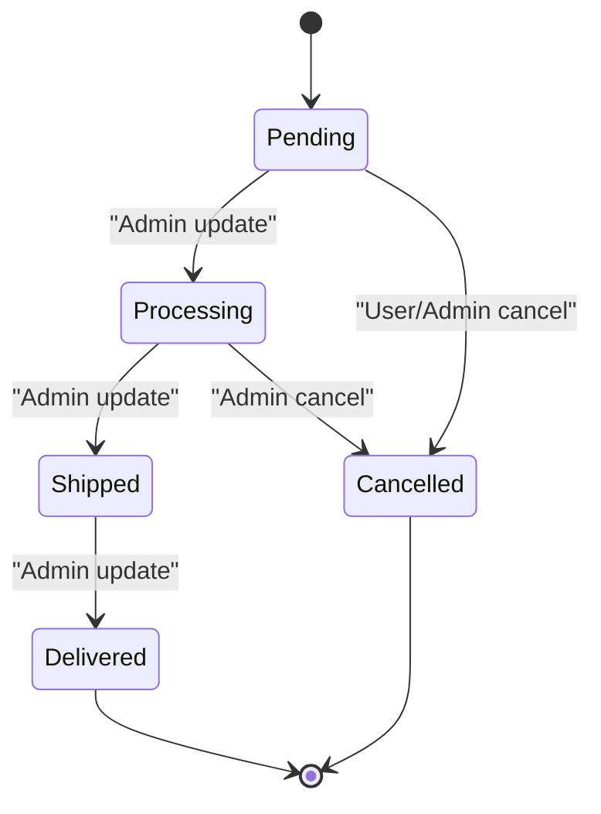
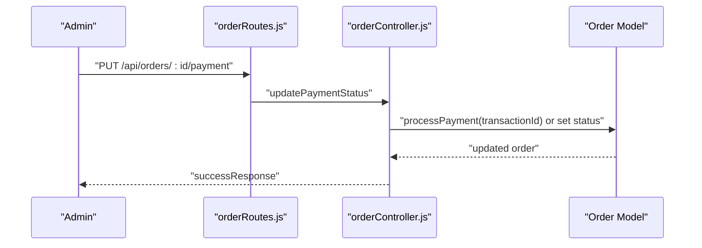
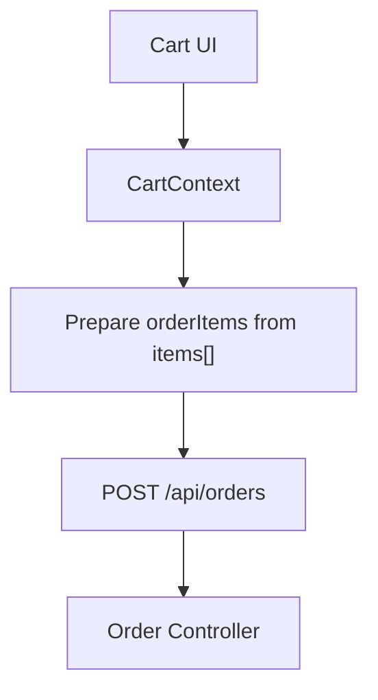
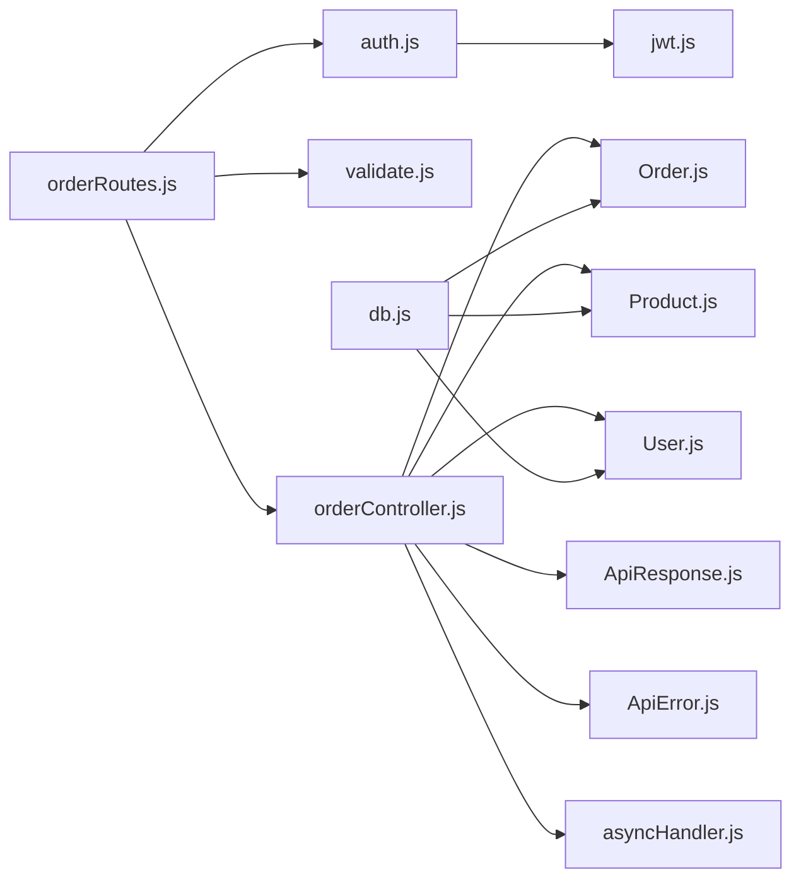

# Order Processing System

<cite>
**Referenced Files in This Document**
- [Order.js](file://backend/models/Order.js)
- [orderController.js](file://backend/controllers/orderController.js)
- [orderRoutes.js](file://backend/routes/orderRoutes.js)
- [validate.js](file://backend/middleware/validate.js)
- [auth.js](file://backend/middleware/auth.js)
- [ApiResponse.js](file://backend/utils/ApiResponse.js)
- [ApiError.js](file://backend/utils/ApiError.js)
- [asyncHandler.js](file://backend/utils/asyncHandler.js)
- [jwt.js](file://backend/utils/jwt.js)
- [db.js](file://backend/db/db.js)
- [index.js](file://backend/index.js)
- [CartContext.jsx](file://src/context/CartContext.jsx)
</cite>

## Table of Contents
1. [Introduction](#introduction)
2. [Project Structure](#project-structure)
3. [Core Components](#core-components)
4. [Architecture Overview](#architecture-overview)
5. [Detailed Component Analysis](#detailed-component-analysis)
6. [Dependency Analysis](#dependency-analysis)
7. [Performance Considerations](#performance-considerations)
8. [Troubleshooting Guide](#troubleshooting-guide)
9. [Conclusion](#conclusion)
10. [Appendices](#appendices)

## Introduction
This document describes the order processing system, covering the order creation workflow, order model schema, backend controller functions, and integration with the cart context. It explains order status management, payment processing coordination, order routes, request validation, and response formatting. Examples of placing an order, retrieving order history, and tracking order status are included. The document also covers order data validation, error handling, transaction management, notifications, confirmation emails, and lifecycle management.

## Project Structure
The order processing system is implemented in the backend under the backend directory. Key components include:
- Models: Order, Product, User
- Controllers: orderController
- Routes: orderRoutes
- Middleware: auth, validate, error
- Utilities: ApiResponse, ApiError, asyncHandler, jwt
- Database: db connection
- Frontend integration: CartContext

**Diagram sources**
- [orderRoutes.js:1-77](file://backend/routes/orderRoutes.js#L1-L77)
- [orderController.js:1-358](file://backend/controllers/orderController.js#L1-L358)
- [Order.js:1-217](file://backend/models/Order.js#L1-L217)
- [Product.js:1-217](file://backend/models/Product.js#L1-L217)
- [User.js:1-135](file://backend/models/User.js#L1-L135)
- [auth.js:1-124](file://backend/middleware/auth.js#L1-L124)
- [validate.js:1-221](file://backend/middleware/validate.js#L1-L221)
- [ApiResponse.js:1-52](file://backend/utils/ApiResponse.js#L1-L52)
- [ApiError.js:1-21](file://backend/utils/ApiError.js#L1-L21)
- [asyncHandler.js:1-16](file://backend/utils/asyncHandler.js#L1-L16)
- [jwt.js:1-49](file://backend/utils/jwt.js#L1-L49)
- [db.js:1-37](file://backend/db/db.js#L1-L37)
- [CartContext.jsx:1-62](file://src/context/CartContext.jsx#L1-L62)

**Section sources**
- [index.js:1-119](file://backend/index.js#L1-L119)
- [orderRoutes.js:1-77](file://backend/routes/orderRoutes.js#L1-L77)

## Core Components
- Order Model: Defines the order schema, embedded order items, shipping and payment info, pricing calculations, status history, and helper methods for status updates and payment processing.
- Order Controller: Implements order creation, retrieval, status updates, payment updates, cancellation, and statistics aggregation.
- Order Routes: Exposes REST endpoints for order operations with authentication and validation middleware.
- Validation Middleware: Provides request validation for order creation, status updates, and ID parameters.
- Authentication Middleware: Authenticates users via JWT and enforces role-based access.
- Response Utilities: Standardizes success and error responses across endpoints.
- Database Connection: Connects to MongoDB Atlas and manages graceful shutdowns.

**Section sources**
- [Order.js:1-217](file://backend/models/Order.js#L1-L217)
- [orderController.js:1-358](file://backend/controllers/orderController.js#L1-L358)
- [orderRoutes.js:1-77](file://backend/routes/orderRoutes.js#L1-L77)
- [validate.js:158-221](file://backend/middleware/validate.js#L158-L221)
- [auth.js:10-55](file://backend/middleware/auth.js#L10-L55)
- [ApiResponse.js:14-26](file://backend/utils/ApiResponse.js#L14-L26)
- [db.js:7-21](file://backend/db/db.js#L7-L21)

## Architecture Overview
The order processing system follows a layered architecture:
- Presentation Layer: Express routes define endpoints for order operations.
- Application Layer: Controllers orchestrate business logic, validate inputs, and coordinate with models.
- Domain Layer: Models encapsulate data structures and domain methods.
- Infrastructure Layer: Middleware handles authentication, validation, error handling, and database connectivity.

**Diagram sources**
- [orderRoutes.js:25](file://backend/routes/orderRoutes.js#L25)
- [auth.js:10-55](file://backend/middleware/auth.js#L10-L55)
- [validate.js:161-193](file://backend/middleware/validate.js#L161-L193)
- [orderController.js:17-69](file://backend/controllers/orderController.js#L17-L69)
- [Order.js:139-165](file://backend/models/Order.js#L139-L165)
- [Product.js:206-212](file://backend/models/Product.js#L206-L212)

## Detailed Component Analysis

### Order Model Schema
The Order model defines:
- Embedded order items with product reference, name, image, price, and quantity.
- Shipping address fields (street, city, state, zipCode, country).
- Payment info with method, status, transactionId, and paidAt.
- Pricing fields: itemsPrice, taxPrice (18% GST), shippingPrice (free above a threshold), totalPrice.
- Order status with transitions and a statusHistory array containing status, timestamp, and optional note.
- Delivery tracking fields: deliveredAt, trackingNumber.
- Notes field with length constraint.
- Indexes for efficient queries by user, status, payment status, and creation time.
- Pre-save middleware to compute prices and initialize status history.
- Instance methods to update status and process payment.
- Static method to compute user order statistics.

**Diagram sources**
- [Order.js:36-126](file://backend/models/Order.js#L36-L126)
- [Order.js:139-193](file://backend/models/Order.js#L139-L193)

**Section sources**
- [Order.js:36-126](file://backend/models/Order.js#L36-L126)
- [Order.js:139-193](file://backend/models/Order.js#L139-L193)

### Order Controller Functions
- createOrder: Validates products, checks stock, computes prices, persists order, and returns populated order.
- getAllOrders: Admin-only listing with filters, pagination, and sales aggregation.
- getMyOrders: Retrieves current user’s orders with pagination.
- getOrderById: Fetches a single order with authorization checks.
- updateOrderStatus: Enforces valid status transitions and updates history.
- updatePaymentStatus: Updates payment status and records transaction details.
- cancelOrder: Allows users to cancel pending or processing orders and restores stock.
- getOrderStats: Aggregates overall stats, status breakdown, and monthly revenue.

**Diagram sources**
- [orderController.js:17-69](file://backend/controllers/orderController.js#L17-L69)
- [Product.js:206-212](file://backend/models/Product.js#L206-L212)
- [Order.js:139-165](file://backend/models/Order.js#L139-L165)

**Section sources**
- [orderController.js:17-69](file://backend/controllers/orderController.js#L17-L69)
- [orderController.js:76-118](file://backend/controllers/orderController.js#L76-L118)
- [orderController.js:125-147](file://backend/controllers/orderController.js#L125-L147)
- [orderController.js:154-171](file://backend/controllers/orderController.js#L154-L171)
- [orderController.js:178-207](file://backend/controllers/orderController.js#L178-L207)
- [orderController.js:214-232](file://backend/controllers/orderController.js#L214-L232)
- [orderController.js:239-271](file://backend/controllers/orderController.js#L239-L271)
- [orderController.js:278-346](file://backend/controllers/orderController.js#L278-L346)

### Order Routes and Request Validation
- POST /api/orders: Requires authentication and order creation validation.
- GET /api/orders/my-orders: Requires authentication.
- GET /api/orders/stats/overview: Admin-only statistics.
- GET /api/orders/:id: Requires authentication and ID validation.
- PUT /api/orders/:id/status: Admin-only with status validation.
- PUT /api/orders/:id/payment: Admin-only payment update.
- PUT /api/orders/:id/cancel: Requires authentication.
- GET /api/orders: Admin-only listing.

Validation rules:
- Order creation validates order items array, product IDs, quantities, shipping address completeness, and payment method.
- Status update validates order ID and status enum.
- ID getters validate MongoDB ObjectIDs.

**Diagram sources**
- [orderRoutes.js:46](file://backend/routes/orderRoutes.js#L46)
- [validate.js:207-212](file://backend/middleware/validate.js#L207-L212)
- [auth.js:10-55](file://backend/middleware/auth.js#L10-L55)
- [orderController.js:154-171](file://backend/controllers/orderController.js#L154-L171)

**Section sources**
- [orderRoutes.js:20-77](file://backend/routes/orderRoutes.js#L20-L77)
- [validate.js:161-212](file://backend/middleware/validate.js#L161-L212)

### Response Formatting and Error Handling
- Success responses use a standardized format with success flag, message, data, and optional meta (pagination, stats).
- Error responses use ApiError with status code, operational flag, and structured error details.
- Global error handler centralizes error processing, including cast errors, validation errors, JWT errors, and generic server errors.
- Async handler wraps controller functions to propagate errors to the error middleware.

**Diagram sources**
- [ApiResponse.js:14-26](file://backend/utils/ApiResponse.js#L14-L26)
- [ApiError.js:5-18](file://backend/utils/ApiError.js#L5-L18)
- [error.js:84-103](file://backend/middleware/error.js#L84-L103)
- [asyncHandler.js:9-13](file://backend/utils/asyncHandler.js#L9-L13)

**Section sources**
- [ApiResponse.js:14-26](file://backend/utils/ApiResponse.js#L14-L26)
- [ApiError.js:5-18](file://backend/utils/ApiError.js#L5-L18)
- [error.js:84-103](file://backend/middleware/error.js#L84-L103)
- [asyncHandler.js:9-13](file://backend/utils/asyncHandler.js#L9-L13)

### Order Lifecycle Management
- Creation: Products validated, stock decremented, order persisted with computed pricing and initial status history.
- Status transitions: Enforced via controller logic with valid transitions per current status.
- Payment processing: Payment status updated and transaction details recorded; deliveredAt timestamp set upon delivery.
- Cancellation: Only pending or processing orders can be cancelled; stock restored and status updated.
- Statistics: Aggregation queries provide overall metrics, status distribution, and monthly revenue.

**Diagram sources**
- [orderController.js:189-202](file://backend/controllers/orderController.js#L189-L202)
- [Order.js:170-183](file://backend/models/Order.js#L170-L183)

**Section sources**
- [orderController.js:189-202](file://backend/controllers/orderController.js#L189-L202)
- [Order.js:170-183](file://backend/models/Order.js#L170-L183)

### Payment Processing Coordination
- Payment info captured during order creation.
- Admin can update payment status to completed with transactionId; otherwise, status is set directly.
- Payment processing triggers persistence of paidAt timestamp and transactionId.

**Diagram sources**
- [orderRoutes.js:60](file://backend/routes/orderRoutes.js#L60)
- [orderController.js:214-232](file://backend/controllers/orderController.js#L214-L232)
- [Order.js:188-193](file://backend/models/Order.js#L188-L193)

**Section sources**
- [orderController.js:214-232](file://backend/controllers/orderController.js#L214-L232)
- [Order.js:188-193](file://backend/models/Order.js#L188-L193)

### Notifications, Confirmation Emails, and Lifecycle Management
- The backend does not implement notification or email sending logic. Integration points for notifications would involve adding email service libraries and invoking them after order creation, payment completion, and status changes.
- Lifecycle management is enforced by controller validations and model methods, ensuring data consistency and auditability via statusHistory.

[No sources needed since this section provides general guidance]

### Frontend Integration with Cart Context
- The frontend CartContext maintains items, quantities, and totals. When placing an order, the frontend should prepare orderItems from the cart state, including product IDs and quantities, and submit to the backend order creation endpoint.

**Diagram sources**
- [CartContext.jsx:9-37](file://src/context/CartContext.jsx#L9-L37)
- [orderRoutes.js:25](file://backend/routes/orderRoutes.js#L25)
- [orderController.js:17-69](file://backend/controllers/orderController.js#L17-L69)

**Section sources**
- [CartContext.jsx:9-37](file://src/context/CartContext.jsx#L9-L37)

## Dependency Analysis
The order processing system exhibits clear separation of concerns:
- Routes depend on authentication and validation middleware and delegate to controllers.
- Controllers depend on models for data access and on utilities for responses and error handling.
- Models depend on Mongoose for schema definition and indexing.
- Middleware depends on JWT utilities and shared error handling.

**Diagram sources**
- [orderRoutes.js:1-77](file://backend/routes/orderRoutes.js#L1-L77)
- [auth.js:1-124](file://backend/middleware/auth.js#L1-L124)
- [validate.js:1-221](file://backend/middleware/validate.js#L1-L221)
- [orderController.js:1-358](file://backend/controllers/orderController.js#L1-L358)
- [Order.js:1-217](file://backend/models/Order.js#L1-L217)
- [Product.js:1-217](file://backend/models/Product.js#L1-L217)
- [User.js:1-135](file://backend/models/User.js#L1-L135)
- [ApiResponse.js:1-52](file://backend/utils/ApiResponse.js#L1-L52)
- [ApiError.js:1-21](file://backend/utils/ApiError.js#L1-L21)
- [asyncHandler.js:1-16](file://backend/utils/asyncHandler.js#L1-L16)
- [jwt.js:1-49](file://backend/utils/jwt.js#L1-L49)
- [db.js:1-37](file://backend/db/db.js#L1-L37)

**Section sources**
- [orderRoutes.js:1-77](file://backend/routes/orderRoutes.js#L1-L77)
- [orderController.js:1-358](file://backend/controllers/orderController.js#L1-L358)

## Performance Considerations
- Indexes on Order model support filtering by user, status, payment status, and sorting by creation time.
- Aggregation queries for statistics avoid loading full datasets.
- Population of references is scoped to necessary fields to minimize payload size.
- Consider caching frequently accessed order lists for authenticated users and implementing pagination limits.

[No sources needed since this section provides general guidance]

## Troubleshooting Guide
Common issues and resolutions:
- Validation failures: Ensure orderItems include valid product IDs and quantities, and shippingAddress fields are complete.
- Insufficient stock: Verify product stock before order creation; backend will reject orders exceeding available stock.
- Unauthorized access: Confirm authentication token and proper roles for admin-only endpoints.
- Invalid ObjectIDs: Ensure order and product IDs are valid MongoDB ObjectIDs.
- Payment errors: Confirm transactionId is provided when setting payment status to completed.

**Section sources**
- [validate.js:161-212](file://backend/middleware/validate.js#L161-L212)
- [orderController.js:24-51](file://backend/controllers/orderController.js#L24-L51)
- [auth.js:10-55](file://backend/middleware/auth.js#L10-L55)
- [error.js:84-103](file://backend/middleware/error.js#L84-L103)

## Conclusion
The order processing system provides a robust, validated, and secure foundation for order creation, management, and reporting. It leverages middleware for authentication and validation, models for data integrity, and controllers for business logic. The frontend integrates via CartContext to supply order data, while the backend ensures data consistency, enforceable status transitions, and standardized responses. Extending the system with notifications and email confirmations would complete the lifecycle management.

## Appendices

### Example Workflows

#### Place an Order
- Frontend prepares orderItems from CartContext and submits to POST /api/orders with authentication.
- Backend validates items, checks stock, computes pricing, persists order, and returns populated order.

**Section sources**
- [orderRoutes.js:25](file://backend/routes/orderRoutes.js#L25)
- [orderController.js:17-69](file://backend/controllers/orderController.js#L17-L69)
- [CartContext.jsx:9-37](file://src/context/CartContext.jsx#L9-L37)

#### Retrieve Order History
- User calls GET /api/orders/my-orders with authentication to receive paginated orders.

**Section sources**
- [orderRoutes.js:32](file://backend/routes/orderRoutes.js#L32)
- [orderController.js:125-147](file://backend/controllers/orderController.js#L125-L147)

#### Track Order Status
- User or admin calls GET /api/orders/:id to retrieve order details and current status.

**Section sources**
- [orderRoutes.js:46](file://backend/routes/orderRoutes.js#L46)
- [orderController.js:154-171](file://backend/controllers/orderController.js#L154-L171)

### Transaction Management
- Stock updates and order persistence occur within the controller’s order creation flow. For stricter guarantees across multiple writes, consider wrapping operations in a database transaction if using a compatible driver and replica set configuration.

[No sources needed since this section provides general guidance]