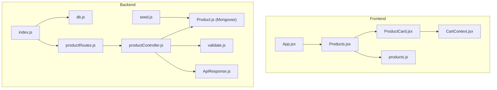
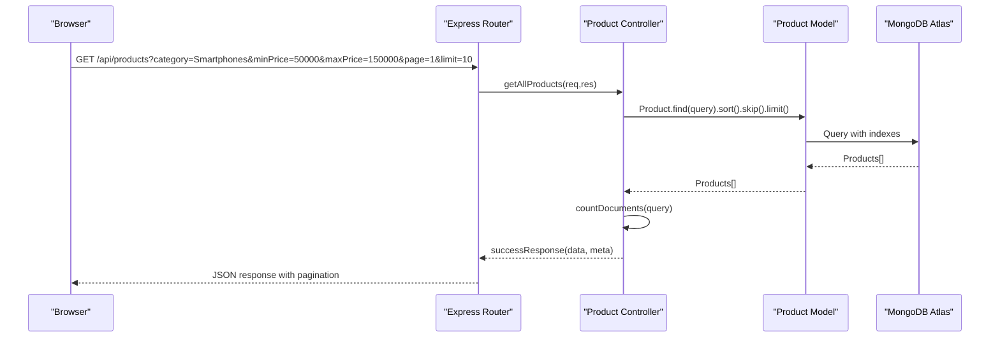
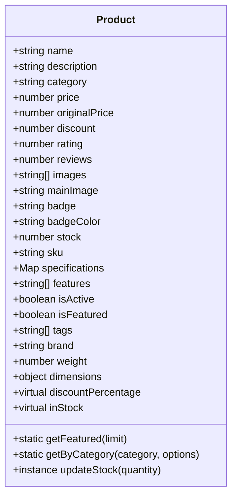
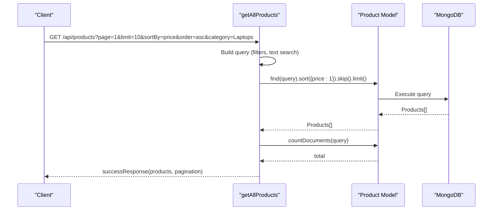
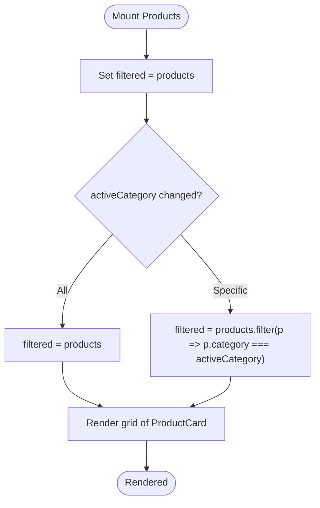
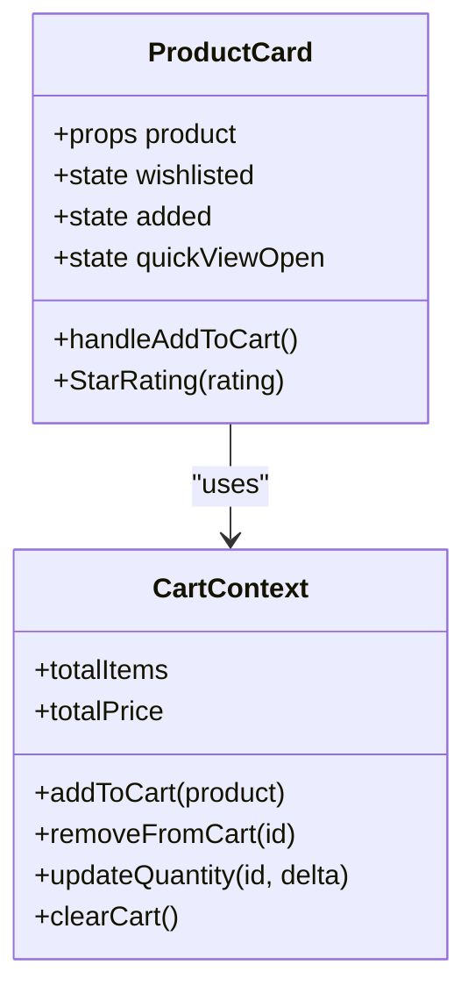
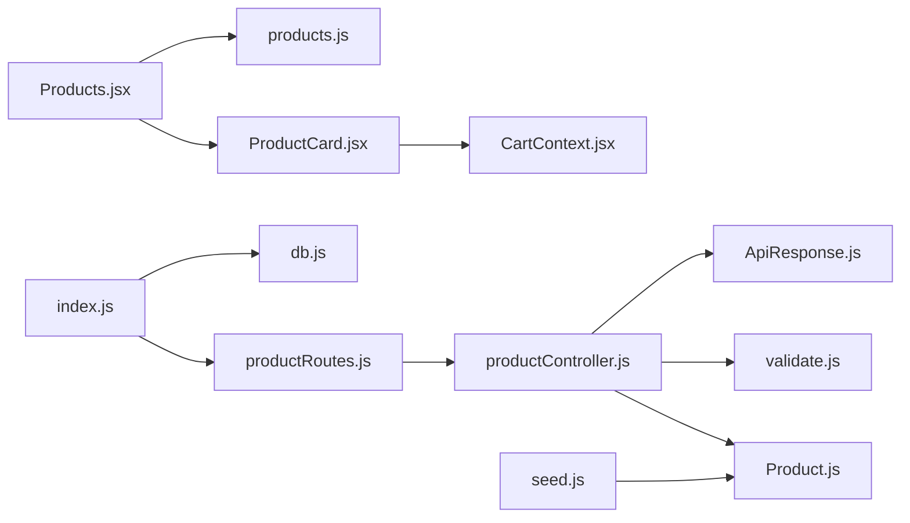

# Product Catalog Management

<cite>
**Referenced Files in This Document**
- [Product.js](file://backend/models/Product.js)
- [productController.js](file://backend/controllers/productController.js)
- [productRoutes.js](file://backend/routes/productRoutes.js)
- [validate.js](file://backend/middleware/validate.js)
- [ApiResponse.js](file://backend/utils/ApiResponse.js)
- [db.js](file://backend/db/db.js)
- [index.js](file://backend/index.js)
- [seed.js](file://backend/seed.js)
- [ProductCard.jsx](file://src/components/ProductCard/ProductCard.jsx)
- [ProductCard.module.css](file://src/components/ProductCard/ProductCard.module.css)
- [Products.jsx](file://src/pages/Products/Products.jsx)
- [Products.module.css](file://src/pages/Products/Products.module.css)
- [products.js](file://src/data/products.js)
- [CartContext.jsx](file://src/context/CartContext.jsx)
- [App.jsx](file://src/App.jsx)
</cite>

## Table of Contents
1. [Introduction](#introduction)
2. [Project Structure](#project-structure)
3. [Core Components](#core-components)
4. [Architecture Overview](#architecture-overview)
5. [Detailed Component Analysis](#detailed-component-analysis)
6. [Dependency Analysis](#dependency-analysis)
7. [Performance Considerations](#performance-considerations)
8. [Troubleshooting Guide](#troubleshooting-guide)
9. [Conclusion](#conclusion)
10. [Appendices](#appendices)

## Introduction
This document describes the product catalog management system, covering product display components, data structures, filtering capabilities, and backend controller functions. It explains how the product listing page renders cards, how static product data is managed, and how the backend handles product retrieval, filtering, and search. It also details pricing calculations, inventory representation, product image handling, and responsive design patterns with a mobile-first approach.

## Project Structure
The system comprises:
- Frontend React application with product listing and product card components
- Backend Express server with product routes, controllers, models, and middleware
- MongoDB via Mongoose for product persistence
- Static product data for local development and demonstration

**Diagram sources**
- [App.jsx:1-75](file://src/App.jsx#L1-L75)
- [Products.jsx:1-50](file://src/pages/Products/Products.jsx#L1-L50)
- [ProductCard.jsx:1-134](file://src/components/ProductCard/ProductCard.jsx#L1-L134)
- [products.js:1-100](file://src/data/products.js#L1-L100)
- [CartContext.jsx:1-62](file://src/context/CartContext.jsx#L1-L62)
- [index.js:1-119](file://backend/index.js#L1-L119)
- [db.js:1-37](file://backend/db/db.js#L1-L37)
- [productRoutes.js:1-101](file://backend/routes/productRoutes.js#L1-L101)
- [productController.js:1-341](file://backend/controllers/productController.js#L1-L341)
- [Product.js:1-217](file://backend/models/Product.js#L1-L217)
- [validate.js:1-221](file://backend/middleware/validate.js#L1-L221)
- [ApiResponse.js:1-52](file://backend/utils/ApiResponse.js#L1-L52)
- [seed.js:1-288](file://backend/seed.js#L1-L288)

**Section sources**
- [App.jsx:1-75](file://src/App.jsx#L1-L75)
- [Products.jsx:1-50](file://src/pages/Products/Products.jsx#L1-L50)
- [ProductCard.jsx:1-134](file://src/components/ProductCard/ProductCard.jsx#L1-L134)
- [products.js:1-100](file://src/data/products.js#L1-L100)
- [index.js:1-119](file://backend/index.js#L1-L119)
- [productRoutes.js:1-101](file://backend/routes/productRoutes.js#L1-L101)
- [productController.js:1-341](file://backend/controllers/productController.js#L1-L341)
- [Product.js:1-217](file://backend/models/Product.js#L1-L217)
- [validate.js:1-221](file://backend/middleware/validate.js#L1-L221)
- [ApiResponse.js:1-52](file://backend/utils/ApiResponse.js#L1-L52)
- [seed.js:1-288](file://backend/seed.js#L1-L288)

## Core Components
- Product model schema defines fields, validations, indexes, and helper methods for discounts, stock, and featured queries.
- Product controller exposes endpoints for listing, filtering, searching, category retrieval, and stock updates.
- Product routes define REST endpoints and apply validation middleware.
- Product card component renders product details, pricing, badges, ratings, and quick view modal.
- Products page manages category filters and renders product cards.
- Static product data provides a local dataset for development and demo.
- Cart context manages cart state and totals.

**Section sources**
- [Product.js:1-217](file://backend/models/Product.js#L1-L217)
- [productController.js:1-341](file://backend/controllers/productController.js#L1-L341)
- [productRoutes.js:1-101](file://backend/routes/productRoutes.js#L1-L101)
- [validate.js:72-155](file://backend/middleware/validate.js#L72-L155)
- [ProductCard.jsx:1-134](file://src/components/ProductCard/ProductCard.jsx#L1-L134)
- [Products.jsx:1-50](file://src/pages/Products/Products.jsx#L1-L50)
- [products.js:1-100](file://src/data/products.js#L1-L100)
- [CartContext.jsx:1-62](file://src/context/CartContext.jsx#L1-L62)

## Architecture Overview
The system follows a layered architecture:
- Presentation layer: React components render product listings and cards.
- Application layer: Routes delegate requests to controllers.
- Domain layer: Controllers orchestrate queries, validation, and responses.
- Persistence layer: Mongoose model interacts with MongoDB Atlas.

**Diagram sources**
- [productRoutes.js:28-28](file://backend/routes/productRoutes.js#L28-L28)
- [productController.js:16-85](file://backend/controllers/productController.js#L16-L85)
- [Product.js:147-151](file://backend/models/Product.js#L147-L151)

**Section sources**
- [productRoutes.js:1-101](file://backend/routes/productRoutes.js#L1-L101)
- [productController.js:1-341](file://backend/controllers/productController.js#L1-L341)
- [Product.js:147-151](file://backend/models/Product.js#L147-L151)

## Detailed Component Analysis

### Product Model Schema
The Product model defines:
- Required and optional fields: name, description, category, price, originalPrice, discount, rating, reviews, images, mainImage, badge, badgeColor, stock, sku, specifications, features, isActive, isFeatured, tags, brand, weight, dimensions.
- Virtuals: discountPercentage computed from originalPrice and price; inStock derived from stock.
- Indexes: text search on name and description, compound indexes for category+price, rating, isFeatured, and createdAt.
- Static methods: getFeatured and getByCategory with pagination and sorting.
- Instance method: updateStock to adjust inventory safely.

**Diagram sources**
- [Product.js:8-125](file://backend/models/Product.js#L8-L125)
- [Product.js:127-142](file://backend/models/Product.js#L127-L142)
- [Product.js:169-212](file://backend/models/Product.js#L169-L212)

**Section sources**
- [Product.js:1-217](file://backend/models/Product.js#L1-L217)

### Backend Product Controller Functions
Key endpoints and behaviors:
- List products with filters: category, minPrice, maxPrice, search, featured, badge; supports pagination and sorting.
- Get product by ID or SKU.
- Get featured products.
- Get products by category with pagination and sorting.
- Get categories with counts and price ranges.
- Create, update, delete (soft delete via isActive), update stock.
- Search products with text search and pagination.

**Diagram sources**
- [productController.js:16-85](file://backend/controllers/productController.js#L16-L85)
- [Product.js:147-151](file://backend/models/Product.js#L147-L151)

**Section sources**
- [productController.js:11-341](file://backend/controllers/productController.js#L11-L341)

### Product Listing Page and Filtering
The Products page:
- Maintains activeCategory state and filters the static products array client-side.
- Renders a grid of ProductCard components.
- Provides category filter buttons and empty state messaging.

**Diagram sources**
- [Products.jsx:6-16](file://src/pages/Products/Products.jsx#L6-L16)

**Section sources**
- [Products.jsx:1-50](file://src/pages/Products/Products.jsx#L1-L50)
- [products.js:1-100](file://src/data/products.js#L1-L100)

### Individual Product Card Component
The ProductCard component:
- Displays image, badge, discount percentage, star rating, pricing, and add-to-cart action.
- Implements quick view modal with product details.
- Integrates with CartContext to manage cart state.
- Uses animations and responsive CSS.

**Diagram sources**
- [ProductCard.jsx:20-134](file://src/components/ProductCard/ProductCard.jsx#L20-L134)
- [CartContext.jsx:5-55](file://src/context/CartContext.jsx#L5-L55)

**Section sources**
- [ProductCard.jsx:1-134](file://src/components/ProductCard/ProductCard.jsx#L1-L134)
- [ProductCard.module.css:1-414](file://src/components/ProductCard/ProductCard.module.css#L1-L414)
- [CartContext.jsx:1-62](file://src/context/CartContext.jsx#L1-L62)

### Static Product Data Management
Static data includes:
- Array of products with id, name, category, price, originalPrice, rating, reviews, image, badge, badgeColor.
- Categories list for UI filtering.

Usage:
- Imported by Products page to populate the grid.
- Used for local development and demos.

**Section sources**
- [products.js:1-100](file://src/data/products.js#L1-L100)

### Backend Routes and Validation
Routes:
- Define endpoints for listing, searching, featured, categories, by-category, by-ID/SKU, CRUD, and stock updates.
- Apply authentication and admin-only middleware where required.
- Apply product-specific validation for list, create, update, and getById.

Validation:
- Enforces constraints on numeric ranges, string lengths, URLs, and allowed categories.
- Centralizes validation error handling.

**Section sources**
- [productRoutes.js:1-101](file://backend/routes/productRoutes.js#L1-L101)
- [validate.js:72-155](file://backend/middleware/validate.js#L72-L155)

### Database Interactions and Seeding
Database:
- Connects to MongoDB Atlas using Mongoose.
- Provides disconnect utility for testing.

Seeding:
- Seeds the database with sample users and products.
- Creates realistic product entries with images, badges, features, and specifications.

**Section sources**
- [db.js:1-37](file://backend/db/db.js#L1-L37)
- [seed.js:1-288](file://backend/seed.js#L1-L288)

## Dependency Analysis
- Frontend depends on:
  - React and Framer Motion for animations.
  - CartContext for cart state.
  - Local product data for development.
- Backend depends on:
  - Express for routing and middleware.
  - Mongoose for schema and database operations.
  - Express validator for request validation.
  - Custom ApiResponse helpers for standardized responses.

**Diagram sources**
- [Products.jsx:1-50](file://src/pages/Products/Products.jsx#L1-L50)
- [ProductCard.jsx:1-134](file://src/components/ProductCard/ProductCard.jsx#L1-L134)
- [products.js:1-100](file://src/data/products.js#L1-L100)
- [CartContext.jsx:1-62](file://src/context/CartContext.jsx#L1-L62)
- [productRoutes.js:1-101](file://backend/routes/productRoutes.js#L1-L101)
- [productController.js:1-341](file://backend/controllers/productController.js#L1-L341)
- [Product.js:1-217](file://backend/models/Product.js#L1-L217)
- [validate.js:1-221](file://backend/middleware/validate.js#L1-L221)
- [ApiResponse.js:1-52](file://backend/utils/ApiResponse.js#L1-L52)
- [index.js:1-119](file://backend/index.js#L1-L119)
- [db.js:1-37](file://backend/db/db.js#L1-L37)
- [seed.js:1-288](file://backend/seed.js#L1-L288)

**Section sources**
- [Products.jsx:1-50](file://src/pages/Products/Products.jsx#L1-L50)
- [ProductCard.jsx:1-134](file://src/components/ProductCard/ProductCard.jsx#L1-L134)
- [productRoutes.js:1-101](file://backend/routes/productRoutes.js#L1-L101)
- [productController.js:1-341](file://backend/controllers/productController.js#L1-L341)
- [Product.js:1-217](file://backend/models/Product.js#L1-L217)
- [validate.js:1-221](file://backend/middleware/validate.js#L1-L221)
- [ApiResponse.js:1-52](file://backend/utils/ApiResponse.js#L1-L52)
- [index.js:1-119](file://backend/index.js#L1-L119)
- [db.js:1-37](file://backend/db/db.js#L1-L37)
- [seed.js:1-288](file://backend/seed.js#L1-L288)

## Performance Considerations
- Database indexes:
  - Text index on name and description for efficient search.
  - Compound indexes for category+price, rating, isFeatured, and createdAt to accelerate filtering and sorting.
- Pagination:
  - Controllers use skip and limit to avoid large result sets.
- Virtuals:
  - discountPercentage and inStock computed on-the-fly; keep projections minimal when not needed.
- Frontend:
  - Client-side filtering for static data is fast but scales poorly with large datasets; consider server-side filtering for production.
  - Lazy loading images reduce initial load time.
- CSS Grid:
  - Responsive grid with clamp and repeat(auto-fill, minmax(...)) ensures optimal density across devices.

[No sources needed since this section provides general guidance]

## Troubleshooting Guide
Common issues and resolutions:
- Validation errors:
  - Product listing query validation enforces page, limit, category, and price constraints. Ensure query parameters match allowed values.
- Product not found:
  - Retrieving by ID or SKU returns 404 if inactive or missing; confirm isActive flag and IDs.
- Stock updates:
  - Quantity must be a number; otherwise, a 400 error is returned.
- Search:
  - Search requires a query parameter; ensure q is present.
- Database connectivity:
  - Verify MONGODB_URI environment variable; check logs for connection errors.

**Section sources**
- [validate.js:133-155](file://backend/middleware/validate.js#L133-L155)
- [productController.js:92-102](file://backend/controllers/productController.js#L92-L102)
- [productController.js:266-288](file://backend/controllers/productController.js#L266-L288)
- [productController.js:295-326](file://backend/controllers/productController.js#L295-L326)
- [db.js:7-21](file://backend/db/db.js#L7-L21)

## Conclusion
The product catalog management system combines a robust backend with flexible filtering and a responsive frontend. The backend provides comprehensive product operations with validation, pagination, and search. The frontend offers an intuitive product listing experience with category filtering, quick view, and cart integration. The design emphasizes mobile-first responsiveness and consistent visual feedback.

[No sources needed since this section summarizes without analyzing specific files]

## Appendices

### API Endpoints Summary
- GET /api/products – List products with filters, sorting, pagination
- GET /api/products/search – Search with text search and pagination
- GET /api/products/featured/list – Featured products
- GET /api/products/categories/all – Categories with counts and price ranges
- GET /api/products/category/:category – Products by category with pagination
- GET /api/products/sku/:sku – Product by SKU
- GET /api/products/:id – Product by ID
- POST /api/products – Create product (admin)
- PUT /api/products/:id – Update product (admin)
- PATCH /api/products/:id/stock – Update stock (admin)
- DELETE /api/products/:id – Soft delete product (admin)

**Section sources**
- [productRoutes.js:24-98](file://backend/routes/productRoutes.js#L24-L98)

### Filtering and Sorting Examples
- Search: /api/products?search=wireless&page=1&limit=10
- Category filter: /api/products?category=Smartphones&page=1&limit=10
- Price range: /api/products?minPrice=50000&maxPrice=150000&page=1&limit=10
- Sorting: /api/products?sortBy=price&order=asc&page=1&limit=10
- Featured: /api/products?featured=true&page=1&limit=8
- Badge filter: /api/products?badge=Best%20Seller&page=1&limit=10

**Section sources**
- [productController.js:16-85](file://backend/controllers/productController.js#L16-L85)
- [validate.js:133-155](file://backend/middleware/validate.js#L133-L155)

### Pricing Calculations and Inventory Representation
- Discount percentage:
  - Computed from originalPrice and price; fallback to discount stored on the model.
- Pricing display:
  - Formatted currency using locale-aware formatting.
- Inventory:
  - inStock virtual indicates availability; stock updates handled via updateStock.

**Section sources**
- [Product.js:130-142](file://backend/models/Product.js#L130-L142)
- [ProductCard.jsx:26-31](file://src/components/ProductCard/ProductCard.jsx#L26-L31)
- [Product.js:208-212](file://backend/models/Product.js#L208-L212)

### Responsive Design Patterns
- Mobile-first grid using CSS Grid with repeat(auto-fill, minmax(clamp(...))) for adaptive sizing.
- Hover and overlay effects optimized for pointer devices; touch-friendly buttons and spacing.
- Modal quick view adapts layout for small screens with stacked grid.

**Section sources**
- [Products.module.css:68-72](file://src/pages/Products/Products.module.css#L68-L72)
- [ProductCard.module.css:291-414](file://src/components/ProductCard/ProductCard.module.css#L291-L414)