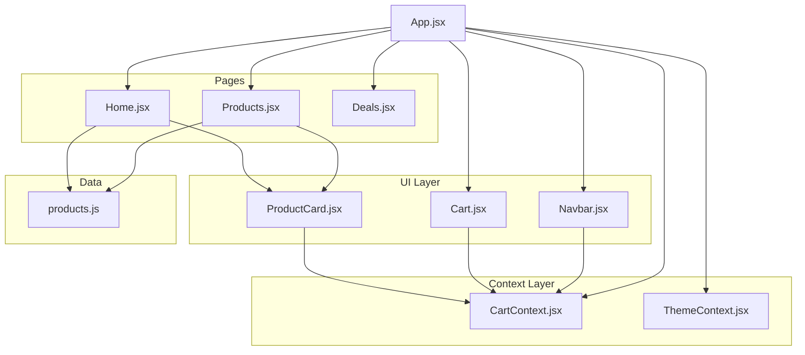
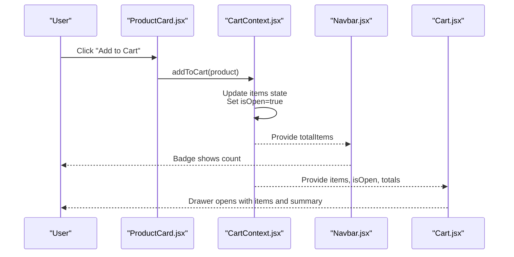
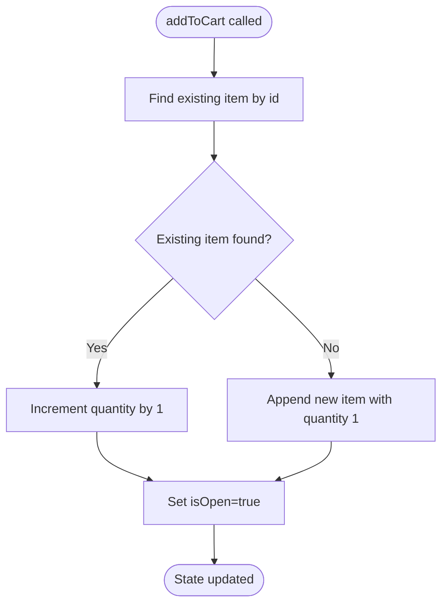
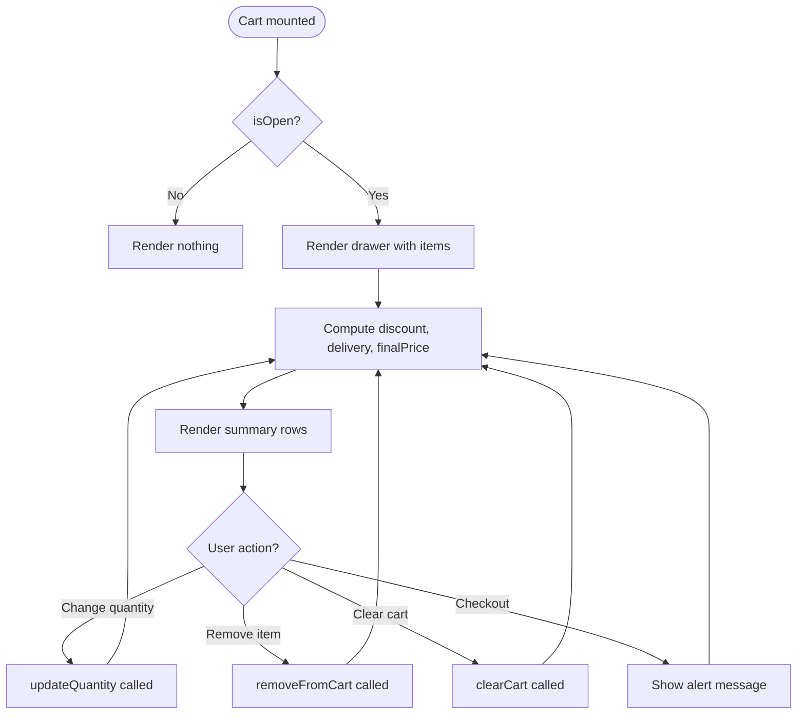
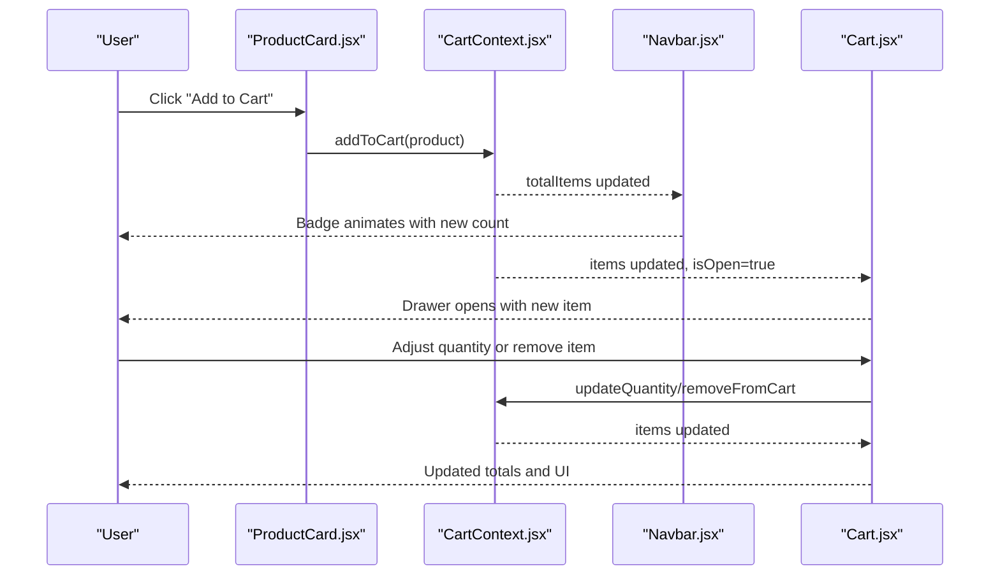
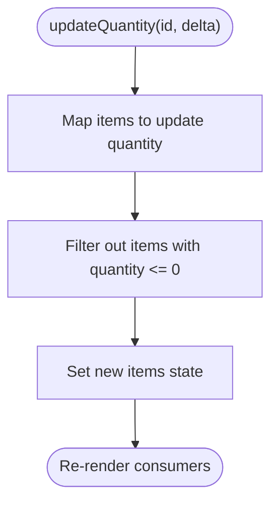
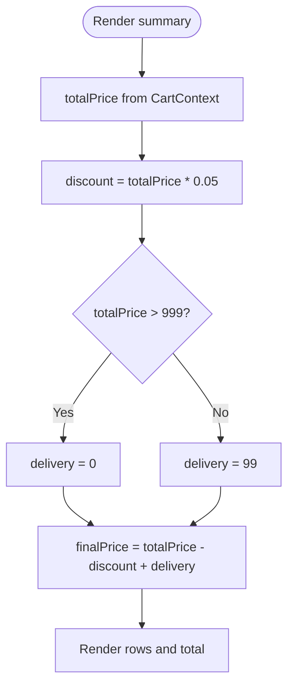
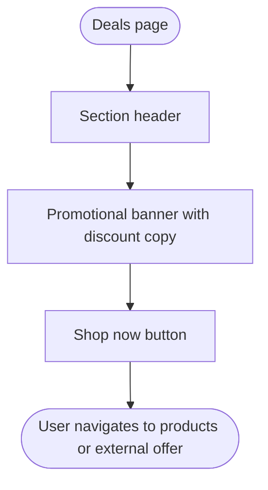
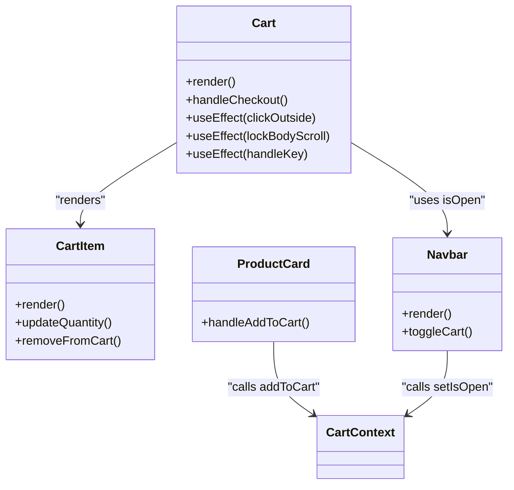
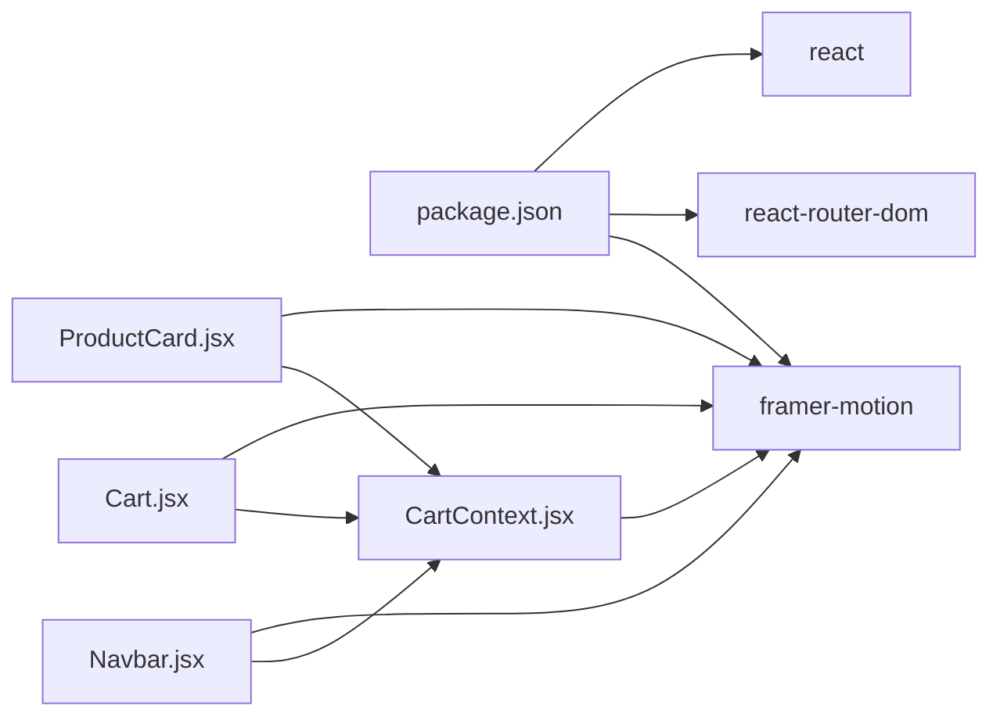

# Shopping Cart System

<cite>
**Referenced Files in This Document**
- [CartContext.jsx](file://src/context/CartContext.jsx)
- [Cart.jsx](file://src/components/Cart/Cart.jsx)
- [Cart.module.css](file://src/components/Cart/Cart.module.css)
- [Navbar.jsx](file://src/components/Navbar/Navbar.jsx)
- [ProductCard.jsx](file://src/components/ProductCard/ProductCard.jsx)
- [Products.jsx](file://src/pages/Products/Products.jsx)
- [Home.jsx](file://src/pages/Home/Home.jsx)
- [Deals.jsx](file://src/pages/Deals/Deals.jsx)
- [App.jsx](file://src/App.jsx)
- [products.js](file://src/data/products.js)
- [ThemeContext.jsx](file://src/context/ThemeContext.jsx)
- [package.json](file://package.json)
</cite>

## Table of Contents
1. [Introduction](#introduction)
2. [Project Structure](#project-structure)
3. [Core Components](#core-components)
4. [Architecture Overview](#architecture-overview)
5. [Detailed Component Analysis](#detailed-component-analysis)
6. [Dependency Analysis](#dependency-analysis)
7. [Performance Considerations](#performance-considerations)
8. [Troubleshooting Guide](#troubleshooting-guide)
9. [Conclusion](#conclusion)

## Introduction
This document provides comprehensive documentation for the shopping cart system implemented in the React application. It covers the state management via CartContext, cart item operations (add, remove, quantity updates), real-time calculations for totals and discounts, cart persistence mechanisms, UI animations and responsive design, and the integration with the deals page for promotional pricing display. The goal is to help developers understand how cart interactions work, how to extend functionality, and how to optimize the user experience.

## Project Structure
The cart system spans several modules:
- Context layer: CartContext manages shared cart state and exposes actions.
- UI layer: Cart component renders the cart drawer with animations and summary calculations.
- Integration layer: ProductCard integrates with CartContext to add items, and Navbar displays the cart badge.
- Pages: Products and Home pages render product listings and navigation; Deals page showcases promotional content.
- Data: products.js provides product catalog with pricing and badges.

**Diagram sources**
- [App.jsx:1-75](file://src/App.jsx#L1-L75)
- [CartContext.jsx:1-62](file://src/context/CartContext.jsx#L1-L62)
- [Navbar.jsx:1-143](file://src/components/Navbar/Navbar.jsx#L1-L143)
- [Cart.jsx:1-260](file://src/components/Cart/Cart.jsx#L1-L260)
- [ProductCard.jsx:1-134](file://src/components/ProductCard/ProductCard.jsx#L1-L134)
- [Products.jsx:1-50](file://src/pages/Products/Products.jsx#L1-L50)
- [Home.jsx:1-176](file://src/pages/Home/Home.jsx#L1-L176)
- [Deals.jsx:1-27](file://src/pages/Deals/Deals.jsx#L1-L27)
- [products.js:1-100](file://src/data/products.js#L1-L100)
- [ThemeContext.jsx:1-30](file://src/context/ThemeContext.jsx#L1-L30)

**Section sources**
- [App.jsx:1-75](file://src/App.jsx#L1-L75)
- [CartContext.jsx:1-62](file://src/context/CartContext.jsx#L1-L62)
- [Cart.jsx:1-260](file://src/components/Cart/Cart.jsx#L1-L260)
- [Navbar.jsx:1-143](file://src/components/Navbar/Navbar.jsx#L1-L143)
- [ProductCard.jsx:1-134](file://src/components/ProductCard/ProductCard.jsx#L1-L134)
- [Products.jsx:1-50](file://src/pages/Products/Products.jsx#L1-L50)
- [Home.jsx:1-176](file://src/pages/Home/Home.jsx#L1-L176)
- [Deals.jsx:1-27](file://src/pages/Deals/Deals.jsx#L1-L27)
- [products.js:1-100](file://src/data/products.js#L1-L100)
- [ThemeContext.jsx:1-30](file://src/context/ThemeContext.jsx#L1-L30)

## Core Components
This section explains the core cart components and their responsibilities.

- CartContext: Provides state and actions for cart operations and exposes derived values (total items and total price).
- Cart: Renders the cart drawer with animations, item controls, and summary calculations.
- ProductCard: Integrates with CartContext to add items and shows discount badges.
- Navbar: Displays the cart icon and badge reflecting total items.
- ThemeContext: Manages light/dark theme and is used by the cart UI for visual consistency.

Key responsibilities:
- State management: Centralized cart state via React Context.
- Item operations: Add, remove, update quantity, clear cart.
- Real-time calculations: Subtotal, discount, delivery, and final total computed from current items.
- UI integration: Cart drawer, badge, and animations coordinated across components.

**Section sources**
- [CartContext.jsx:1-62](file://src/context/CartContext.jsx#L1-L62)
- [Cart.jsx:1-260](file://src/components/Cart/Cart.jsx#L1-L260)
- [ProductCard.jsx:1-134](file://src/components/ProductCard/ProductCard.jsx#L1-L134)
- [Navbar.jsx:1-143](file://src/components/Navbar/Navbar.jsx#L1-L143)
- [ThemeContext.jsx:1-30](file://src/context/ThemeContext.jsx#L1-L30)

## Architecture Overview
The cart system follows a unidirectional data flow:
- ProductCard triggers addToCart with product data.
- CartContext updates items and sets isOpen to true.
- Cart reads items, isOpen, and derived totals to render the drawer and summary.
- Navbar reads totalItems to show the badge.

**Diagram sources**
- [ProductCard.jsx:33-37](file://src/components/ProductCard/ProductCard.jsx#L33-L37)
- [CartContext.jsx:9-20](file://src/context/CartContext.jsx#L9-L20)
- [Navbar.jsx](file://src/components/Navbar/Navbar.jsx#L11)
- [Cart.jsx:76-108](file://src/components/Cart/Cart.jsx#L76-L108)

**Section sources**
- [ProductCard.jsx:1-134](file://src/components/ProductCard/ProductCard.jsx#L1-L134)
- [CartContext.jsx:1-62](file://src/context/CartContext.jsx#L1-L62)
- [Navbar.jsx:1-143](file://src/components/Navbar/Navbar.jsx#L1-L143)
- [Cart.jsx:1-260](file://src/components/Cart/Cart.jsx#L1-L260)

## Detailed Component Analysis

### CartContext Implementation
CartContext encapsulates cart state and actions:
- State: items array and isOpen flag.
- Actions: addToCart, removeFromCart, updateQuantity, clearCart.
- Derived values: totalItems and totalPrice computed from items.
- Provider value: exposes all state and actions for consumption.

Implementation highlights:
- addToCart: Finds existing item by id and increments quantity; otherwise appends a new item with quantity 1. Sets isOpen to true after adding.
- removeFromCart: Filters items by id to remove.
- updateQuantity: Updates quantity by delta and filters out items with zero or negative quantities.
- clearCart: Resets items to an empty array.
- Derived totals: totalItems sums quantities; totalPrice multiplies price by quantity per item.

**Diagram sources**
- [CartContext.jsx:9-20](file://src/context/CartContext.jsx#L9-L20)

**Section sources**
- [CartContext.jsx:1-62](file://src/context/CartContext.jsx#L1-L62)

### Cart Component Structure and Operations
The Cart component renders a slide-in drawer with:
- Header: Title, item count, clear button, close button.
- Items list: Animated list of cart items with images, names, categories, prices, and controls.
- Summary: Subtotal, discount (5%), delivery (free above ₹999), and final total.
- Animations: Framer Motion for drawer, backdrop, item entries/exits, and alert messages.

Key behaviors:
- Outside click and Escape key close the drawer.
- Body scroll locking prevents background scrolling when drawer is open.
- Quantity controls adjust item quantities; remove button deletes items.
- Clear cart removes all items.
- Checkout triggers a temporary alert message.

Real-time calculations:
- discount = 5% of totalPrice (rounded).
- delivery = 0 if totalPrice > 999 else 99.
- finalPrice = totalPrice - discount + delivery.

**Diagram sources**
- [Cart.jsx:75-112](file://src/components/Cart/Cart.jsx#L75-L112)
- [Cart.jsx:114-130](file://src/components/Cart/Cart.jsx#L114-L130)
- [Cart.jsx:142-149](file://src/components/Cart/Cart.jsx#L142-L149)
- [Cart.jsx:204-254](file://src/components/Cart/Cart.jsx#L204-L254)

**Section sources**
- [Cart.jsx:1-260](file://src/components/Cart/Cart.jsx#L1-L260)
- [Cart.module.css:1-430](file://src/components/Cart/Cart.module.css#L1-L430)

### Cart Item Addition and Removal
Integration points:
- ProductCard: Calls addToCart when the user clicks "Add to Cart". Uses Framer Motion feedback and shows a temporary "Added" state.
- Navbar: Displays a badge with totalItems and toggles isOpen when clicked.
- Cart: Handles item removal and quantity updates via controls.

**Diagram sources**
- [ProductCard.jsx:33-37](file://src/components/ProductCard/ProductCard.jsx#L33-L37)
- [CartContext.jsx:9-34](file://src/context/CartContext.jsx#L9-L34)
- [Navbar.jsx:91-104](file://src/components/Navbar/Navbar.jsx#L91-L104)
- [Cart.jsx:13-73](file://src/components/Cart/Cart.jsx#L13-L73)

**Section sources**
- [ProductCard.jsx:1-134](file://src/components/ProductCard/ProductCard.jsx#L1-L134)
- [Navbar.jsx:1-143](file://src/components/Navbar/Navbar.jsx#L1-L143)
- [Cart.jsx:1-260](file://src/components/Cart/Cart.jsx#L1-L260)

### Quantity Management
Quantity management is handled centrally in CartContext.updateQuantity:
- Accepts item id and delta (+1 or -1).
- Updates quantity for the matched item.
- Filters out items with quantity <= 0.
- Triggers re-render across consumers.

**Diagram sources**
- [CartContext.jsx:26-32](file://src/context/CartContext.jsx#L26-L32)

**Section sources**
- [CartContext.jsx:26-32](file://src/context/CartContext.jsx#L26-L32)
- [Cart.jsx:34-51](file://src/components/Cart/Cart.jsx#L34-L51)

### Cart Persistence Mechanisms
Current implementation:
- Cart state is stored in memory via React state and Context.
- No persistence to localStorage or server is implemented in the provided code.

Recommendations for persistence:
- Local storage: Serialize items to JSON and persist on state changes. Load on app initialization.
- Server sync: On checkout, send items to backend to create an order and clear local state.
- Hydration: On app load, restore items from localStorage if present.

Note: These are suggestions for extending the system; the current code does not include persistence.

**Section sources**
- [CartContext.jsx:1-62](file://src/context/CartContext.jsx#L1-L62)
- [Cart.jsx:1-260](file://src/components/Cart/Cart.jsx#L1-L260)

### Total Calculations and Discount Handling
Calculated in Cart component:
- discount = 5% of totalPrice (rounded).
- delivery = 0 if totalPrice > 999 else 99.
- finalPrice = totalPrice - discount + delivery.
- Promotional messaging indicates remaining amount for free delivery.

**Diagram sources**
- [Cart.jsx:110-112](file://src/components/Cart/Cart.jsx#L110-L112)
- [Cart.jsx:211-236](file://src/components/Cart/Cart.jsx#L211-L236)

**Section sources**
- [Cart.jsx:110-112](file://src/components/Cart/Cart.jsx#L110-L112)
- [Cart.jsx:211-236](file://src/components/Cart/Cart.jsx#L211-L236)

### Deals Page Implementation and Promotional Pricing
The Deals page displays promotional content:
- Title and subtitle introduce daily deals.
- Banner highlights up to 50% off on premium audio with a call-to-action.
- Placeholder for more deals.

Promotional pricing display:
- ProductCard shows discount percentage based on originalPrice and price.
- Home and Deals pages feature promotional banners with CTA buttons.

**Diagram sources**
- [Deals.jsx:3-26](file://src/pages/Deals/Deals.jsx#L3-L26)
- [ProductCard.jsx:26-28](file://src/components/ProductCard/ProductCard.jsx#L26-L28)
- [Home.jsx:159-172](file://src/pages/Home/Home.jsx#L159-L172)

**Section sources**
- [Deals.jsx:1-27](file://src/pages/Deals/Deals.jsx#L1-L27)
- [ProductCard.jsx:26-28](file://src/components/ProductCard/ProductCard.jsx#L26-L28)
- [Home.jsx:159-172](file://src/pages/Home/Home.jsx#L159-L172)

### Cart UI Animations, Responsive Design, and UX Optimizations
Animations:
- Drawer slides in with spring easing.
- Backdrop fades in/out.
- Items animate in/out with layout animations.
- Alert appears/disappears with transitions.
- Badge scales when totalItems changes.

Responsive design:
- Drawer width is 100% up to 480px wide; full-width on smaller screens.

UX optimizations:
- Outside click and Escape key close the drawer.
- Body scroll lock prevents background scrolling.
- Hover and tap animations on interactive elements.
- Clear cart button available when items exist.
- Continue Shopping and Proceed to Checkout actions.

**Diagram sources**
- [Cart.jsx:75-260](file://src/components/Cart/Cart.jsx#L75-L260)
- [Cart.jsx:13-73](file://src/components/Cart/Cart.jsx#L13-L73)
- [Navbar.jsx:85-105](file://src/components/Navbar/Navbar.jsx#L85-L105)
- [ProductCard.jsx:33-37](file://src/components/ProductCard/ProductCard.jsx#L33-L37)

**Section sources**
- [Cart.jsx:1-260](file://src/components/Cart/Cart.jsx#L1-L260)
- [Cart.module.css:1-430](file://src/components/Cart/Cart.module.css#L1-L430)
- [Navbar.jsx:1-143](file://src/components/Navbar/Navbar.jsx#L1-L143)
- [ProductCard.jsx:1-134](file://src/components/ProductCard/ProductCard.jsx#L1-L134)

## Dependency Analysis
External dependencies relevant to cart functionality:
- framer-motion: Provides animations for cart drawer, items, alerts, and interactive elements.
- react-router-dom: Enables navigation to products and deals pages.
- react: Core library for component structure and hooks.

Internal dependencies:
- CartContext provides state/actions consumed by Cart, Navbar, and ProductCard.
- ThemeContext influences visual styling consistency across cart UI.

**Diagram sources**
- [package.json:5-15](file://package.json#L5-L15)
- [CartContext.jsx:1-62](file://src/context/CartContext.jsx#L1-L62)
- [Cart.jsx:1-260](file://src/components/Cart/Cart.jsx#L1-L260)
- [Navbar.jsx:1-143](file://src/components/Navbar/Navbar.jsx#L1-L143)
- [ProductCard.jsx:1-134](file://src/components/ProductCard/ProductCard.jsx#L1-L134)

**Section sources**
- [package.json:1-42](file://package.json#L1-L42)
- [CartContext.jsx:1-62](file://src/context/CartContext.jsx#L1-L62)
- [Cart.jsx:1-260](file://src/components/Cart/Cart.jsx#L1-L260)
- [Navbar.jsx:1-143](file://src/components/Navbar/Navbar.jsx#L1-L143)
- [ProductCard.jsx:1-134](file://src/components/ProductCard/ProductCard.jsx#L1-L134)

## Performance Considerations
- State updates: CartContext uses memoized callbacks (useCallback) for actions to prevent unnecessary re-renders.
- Derived values: totalItems and totalPrice are computed from items; keep items flat and avoid deep objects to minimize recalculation costs.
- Rendering: Cart uses AnimatePresence and layout animations; limit frequent reflows by batching updates.
- Scroll handling: Drawer locks body scroll; ensure cleanup in effects to avoid leaks.
- Navigation: Cart is rendered alongside routes; consider lazy-loading if bundle size grows.

[No sources needed since this section provides general guidance]

## Troubleshooting Guide
Common issues and resolutions:
- useCart used outside provider: Ensure CartProvider wraps the application to avoid "useCart must be used inside CartProvider" errors.
- Drawer not closing: Verify setIsOpen is called and event listeners are attached; check for conflicting z-index or pointer-events.
- Quantity not updating: Confirm updateQuantity receives correct id and delta; ensure items are filtered when quantity reaches zero.
- Prices not formatted: Check formatPrice usage and locale settings; ensure currency formatting matches expected region.
- Animations stuttering: Reduce layout thrashing by avoiding forced synchronous layouts; prefer transform/opacity for animations.

**Section sources**
- [CartContext.jsx:58-61](file://src/context/CartContext.jsx#L58-L61)
- [Cart.jsx:87-108](file://src/components/Cart/Cart.jsx#L87-L108)
- [Cart.jsx:26-32](file://src/components/Cart/Cart.jsx#L26-L32)

## Conclusion
The shopping cart system leverages React Context for centralized state management, Framer Motion for smooth UI animations, and a clean separation of concerns across components. It supports essential cart operations, real-time calculations, and responsive design. Extending the system with persistence (localStorage or backend) and advanced discount logic would further enhance robustness and scalability. The Deals page complements the cart by showcasing promotions, encouraging conversions.

[No sources needed since this section summarizes without analyzing specific files]