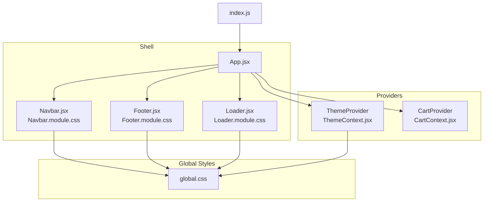
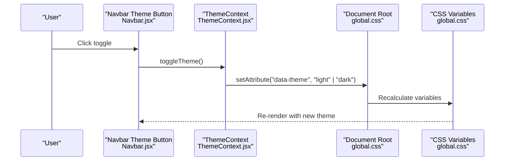
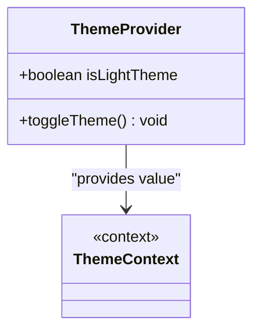
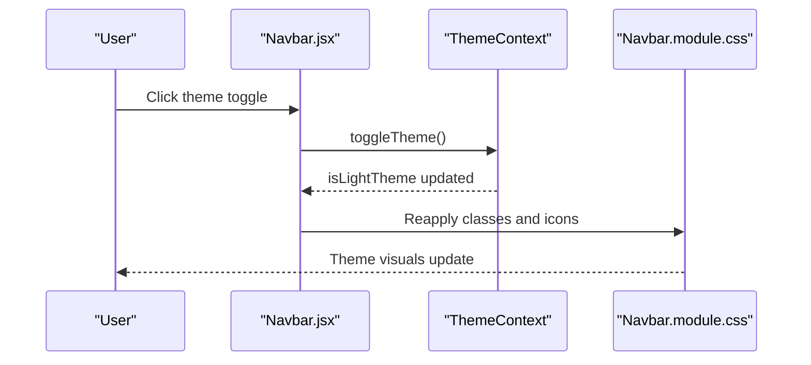
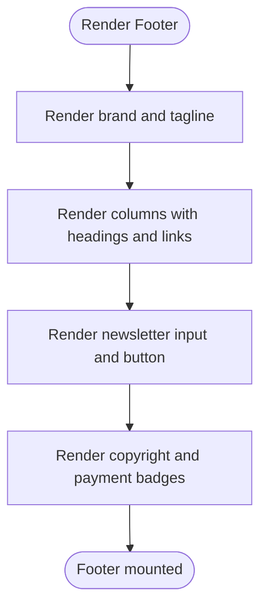
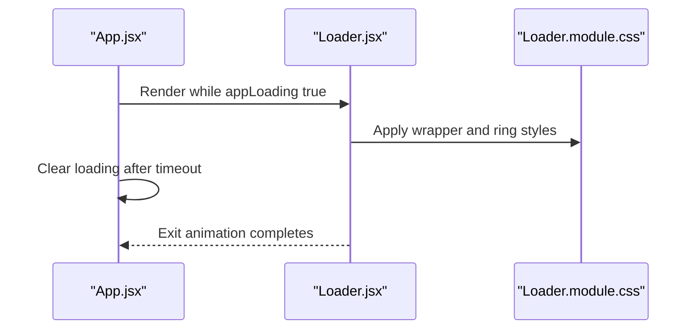
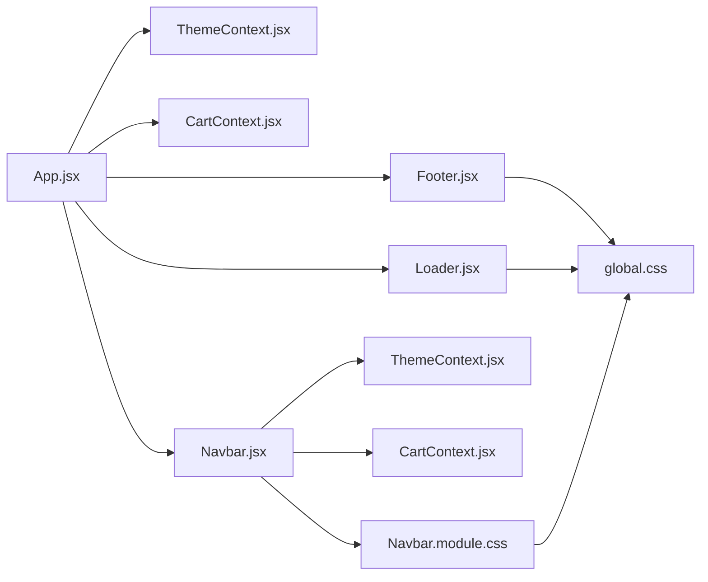

# Theme and UI System

<cite>
**Referenced Files in This Document**
- [ThemeContext.jsx](file://src/context/ThemeContext.jsx)
- [Navbar.jsx](file://src/components/Navbar/Navbar.jsx)
- [Navbar.module.css](file://src/components/Navbar/Navbar.module.css)
- [Footer.jsx](file://src/components/Footer/Footer.jsx)
- [Footer.module.css](file://src/components/Footer/Footer.module.css)
- [Loader.jsx](file://src/components/Loader/Loader.jsx)
- [Loader.module.css](file://src/components/Loader/Loader.module.css)
- [global.css](file://src/styles/global.css)
- [App.jsx](file://src/App.jsx)
- [CartContext.jsx](file://src/context/CartContext.jsx)
- [index.js](file://src/index.js)
- [package.json](file://package.json)
</cite>

## Table of Contents
1. [Introduction](#introduction)
2. [Project Structure](#project-structure)
3. [Core Components](#core-components)
4. [Architecture Overview](#architecture-overview)
5. [Detailed Component Analysis](#detailed-component-analysis)
6. [Dependency Analysis](#dependency-analysis)
7. [Performance Considerations](#performance-considerations)
8. [Accessibility Considerations](#accessibility-considerations)
9. [Troubleshooting Guide](#troubleshooting-guide)
10. [Conclusion](#conclusion)

## Introduction
This document explains the theme and UI system of the application, focusing on:
- ThemeContext implementation for light/dark mode switching and dynamic styling
- Theme persistence via the document root attribute
- Navbar component with responsive design, mobile navigation, and theme-aware styling
- Footer component, loader component, and global styling architecture
- Examples of theme switching functionality, CSS modules usage, and responsive breakpoints
- Animation systems with Framer Motion, component styling patterns, and design system consistency
- Accessibility considerations, cross-browser compatibility, and performance optimizations for theme switching

## Project Structure
The UI system is organized around a central theme provider, shared global styles, and modularized components with CSS modules. Providers wrap the app to supply theme and cart state to all components. Global CSS defines theme tokens and responsive containers. Components encapsulate styles via CSS modules and integrate animations from Framer Motion.

**Diagram sources**
- [index.js:1-6](file://src/index.js#L1-L6)
- [App.jsx:1-75](file://src/App.jsx#L1-L75)
- [ThemeContext.jsx:1-30](file://src/context/ThemeContext.jsx#L1-L30)
- [CartContext.jsx:1-62](file://src/context/CartContext.jsx#L1-L62)
- [Navbar.jsx:1-143](file://src/components/Navbar/Navbar.jsx#L1-L143)
- [Navbar.module.css:1-273](file://src/components/Navbar/Navbar.module.css#L1-L273)
- [Footer.jsx:1-65](file://src/components/Footer/Footer.jsx#L1-L65)
- [Footer.module.css:1-291](file://src/components/Footer/Footer.module.css#L1-L291)
- [Loader.jsx:1-18](file://src/components/Loader/Loader.jsx#L1-L18)
- [Loader.module.css:1-66](file://src/components/Loader/Loader.module.css#L1-L66)
- [global.css:1-142](file://src/styles/global.css#L1-L142)

**Section sources**
- [index.js:1-6](file://src/index.js#L1-L6)
- [App.jsx:1-75](file://src/App.jsx#L1-L75)
- [global.css:1-142](file://src/styles/global.css#L1-L142)

## Core Components
- ThemeContext: Provides theme state and a toggle function. Applies the current theme to the document root for CSS variable scoping.
- Navbar: Implements responsive navigation, scroll-aware styling, animated transitions, mobile menu, and theme toggle button.
- Footer: Grid-based layout with responsive columns, newsletter form, and payment badges.
- Loader: Page loader with animated spinner and fade-out exit.
- Global styles: CSS custom properties define theme tokens and gradients; media queries adjust spacing and container sizes.

Key capabilities:
- Dynamic theming via data attributes on the document element
- CSS modules for scoped component styles
- Framer Motion for micro-interactions and page transitions
- Responsive breakpoints embedded in component CSS modules

**Section sources**
- [ThemeContext.jsx:1-30](file://src/context/ThemeContext.jsx#L1-L30)
- [Navbar.jsx:1-143](file://src/components/Navbar/Navbar.jsx#L1-L143)
- [Footer.jsx:1-65](file://src/components/Footer/Footer.jsx#L1-L65)
- [Loader.jsx:1-18](file://src/components/Loader/Loader.jsx#L1-L18)
- [global.css:1-142](file://src/styles/global.css#L1-L142)

## Architecture Overview
The theme system centers on a single source of truth for theme state and propagates it through a React context provider. Components consume theme state via a custom hook and apply it to their styles. Global CSS variables switch values depending on the theme applied to the document root. CSS modules encapsulate component-specific styles and leverage global variables for consistency.

**Diagram sources**
- [Navbar.jsx:61-83](file://src/components/Navbar/Navbar.jsx#L61-L83)
- [ThemeContext.jsx:5-22](file://src/context/ThemeContext.jsx#L5-L22)
- [global.css:3-74](file://src/styles/global.css#L3-L74)

## Detailed Component Analysis

### ThemeContext Implementation
- Provider state: Boolean flag indicating light theme.
- Side effect: On state change, sets a data attribute on the document root to reflect the active theme.
- Hook: Custom hook ensures consumers are within the provider and exposes theme state and toggle function.

**Diagram sources**
- [ThemeContext.jsx:5-30](file://src/context/ThemeContext.jsx#L5-L30)

**Section sources**
- [ThemeContext.jsx:1-30](file://src/context/ThemeContext.jsx#L1-L30)
- [global.css:3-74](file://src/styles/global.css#L3-L74)

### Navbar Component
Responsibilities:
- Scroll-aware styling: Adds a class when scrolled to apply backdrop blur and shadow.
- Navigation: Renders static links and a mobile hamburger menu.
- Theme toggle: Switches between sun/moon icons and toggles the theme.
- Cart badge: Uses cart context to show item count with spring animation.
- Animations: Framer Motion entrance for the navbar and mobile menu, and badge scaling.

Responsive behavior:
- Desktop: Full nav bar with logo, links, actions, and sign-in.
- Tablet/Mobile: Hides desktop links and sign-in; shows hamburger menu.
- Large screens: Adjusts container padding and inner widths.

Accessibility:
- Buttons include aria-labels for icons and menu toggle.
- Active link highlighting improves focus visibility.

Animation patterns:
- Initial slide-down entrance for the navbar.
- Smooth opacity/height transitions for mobile menu.
- Spring scaling for cart badge.

**Diagram sources**
- [Navbar.jsx:115-140](file://src/components/Navbar/Navbar.jsx#L115-L140)
- [Navbar.module.css:246-273](file://src/components/Navbar/Navbar.module.css#L246-L273)

**Section sources**
- [Navbar.jsx:1-143](file://src/components/Navbar/Navbar.jsx#L1-L143)
- [Navbar.module.css:1-273](file://src/components/Navbar/Navbar.module.css#L1-L273)

### Footer Component
Structure:
- Brand area with logo and tagline.
- Three link columns (Company, Support, Legal).
- Newsletter subscription form.
- Bottom bar with copyright and payment badges.

Responsive layout:
- Grid-based columns with breakpoint-driven rearrangement.
- Mobile-first adjustments stack and realign content.

Styling patterns:
- Uses global variables for colors, borders, and gradients.
- Hover states for links and social buttons emphasize interactivity.

**Diagram sources**
- [Footer.jsx:10-65](file://src/components/Footer/Footer.jsx#L10-L65)
- [Footer.module.css:1-291](file://src/components/Footer/Footer.module.css#L1-L291)

**Section sources**
- [Footer.jsx:1-65](file://src/components/Footer/Footer.jsx#L1-L65)
- [Footer.module.css:1-291](file://src/components/Footer/Footer.module.css#L1-L291)

### Loader Component
Purpose:
- Full-screen loading overlay during app initialization.
- Animated spinner with three concentric rings and pulsing dots.

Behavior:
- Fades out on mount completion.
- Uses global background and accent colors for consistent theming.

**Diagram sources**
- [App.jsx:55-75](file://src/App.jsx#L55-L75)
- [Loader.jsx:4-18](file://src/components/Loader/Loader.jsx#L4-L18)
- [Loader.module.css:1-66](file://src/components/Loader/Loader.module.css#L1-L66)

**Section sources**
- [Loader.jsx:1-18](file://src/components/Loader/Loader.jsx#L1-L18)
- [Loader.module.css:1-66](file://src/components/Loader/Loader.module.css#L1-L66)

### Global Styling Architecture
Design tokens:
- CSS custom properties define colors, gradients, shadows, radii, fonts, transitions, and container sizing.
- Light theme overrides are scoped under a data-theme selector to swap tokens.

Layout utilities:
- Container class centers content and applies responsive padding.
- Scrollbar styling harmonizes with theme colors.

Responsive breakpoints:
- Media queries adjust container sizes and component paddings for large desktops.
- Component CSS modules embed their own breakpoints for fine-grained control.

**Section sources**
- [global.css:1-142](file://src/styles/global.css#L1-L142)

## Dependency Analysis
- App composes providers and renders shell components.
- Navbar depends on ThemeContext and CartContext, and imports CSS modules.
- Footer and Loader depend on global CSS and component CSS modules.
- ThemeContext updates global CSS variables via the document root.

**Diagram sources**
- [App.jsx:1-75](file://src/App.jsx#L1-L75)
- [ThemeContext.jsx:1-30](file://src/context/ThemeContext.jsx#L1-L30)
- [CartContext.jsx:1-62](file://src/context/CartContext.jsx#L1-L62)
- [Navbar.jsx:1-143](file://src/components/Navbar/Navbar.jsx#L1-L143)
- [Footer.jsx:1-65](file://src/components/Footer/Footer.jsx#L1-L65)
- [Loader.jsx:1-18](file://src/components/Loader/Loader.jsx#L1-L18)
- [Navbar.module.css:1-273](file://src/components/Navbar/Navbar.module.css#L1-L273)
- [global.css:1-142](file://src/styles/global.css#L1-L142)

**Section sources**
- [App.jsx:1-75](file://src/App.jsx#L1-L75)
- [ThemeContext.jsx:1-30](file://src/context/ThemeContext.jsx#L1-L30)
- [CartContext.jsx:1-62](file://src/context/CartContext.jsx#L1-L62)
- [Navbar.jsx:1-143](file://src/components/Navbar/Navbar.jsx#L1-L143)
- [Footer.jsx:1-65](file://src/components/Footer/Footer.jsx#L1-L65)
- [Loader.jsx:1-18](file://src/components/Loader/Loader.jsx#L1-L18)
- [global.css:1-142](file://src/styles/global.css#L1-L142)

## Performance Considerations
- Theme switching is O(1): a single DOM attribute update triggers CSS recalculation.
- CSS variables minimize cascade churn compared to class toggling.
- CSS modules scope styles to components, reducing global style conflicts.
- Framer Motion animations are hardware-accelerated; keep animations minimal for low-power devices.
- Avoid unnecessary re-renders by memoizing callbacks in contexts (already handled via useCallback).
- Lazy-load heavy assets and defer non-critical resources.

[No sources needed since this section provides general guidance]

## Accessibility Considerations
- Buttons include aria-labels for icons and menu toggle.
- Active states and hover effects improve focus visibility.
- Color contrast remains consistent across themes via global variables.
- Prefer semantic HTML and ensure keyboard navigability in menus.

**Section sources**
- [Navbar.jsx:55-64](file://src/components/Navbar/Navbar.jsx#L55-L64)
- [Navbar.jsx:109-111](file://src/components/Navbar/Navbar.jsx#L109-L111)
- [Footer.jsx:25-29](file://src/components/Footer/Footer.jsx#L25-L29)

## Troubleshooting Guide
- Theme toggle not working:
  - Verify the ThemeProvider wraps the app.
  - Confirm the data-theme attribute updates on the document element.
- Styles not applying in a component:
  - Ensure the component imports its CSS module and uses class names correctly.
  - Check global CSS variables are present and not overridden unexpectedly.
- Mobile menu not appearing:
  - Confirm the hamburger click handler toggles the open state.
  - Verify media queries match device width and that component CSS is loaded.
- Animation glitches:
  - Reduce animation complexity or duration.
  - Ensure AnimatePresence is configured correctly around route changes.

**Section sources**
- [ThemeContext.jsx:5-22](file://src/context/ThemeContext.jsx#L5-L22)
- [Navbar.jsx:115-140](file://src/components/Navbar/Navbar.jsx#L115-L140)
- [global.css:3-74](file://src/styles/global.css#L3-L74)

## Conclusion
The theme and UI system leverages a lightweight theme provider, global CSS variables, and CSS modules to deliver a consistent, responsive, and animated interface. Theme switching is efficient and visually cohesive across components. The design system’s tokens and breakpoints enable scalable maintenance and cross-browser compatibility. By following the patterns outlined here, teams can extend the system with confidence while preserving accessibility and performance.