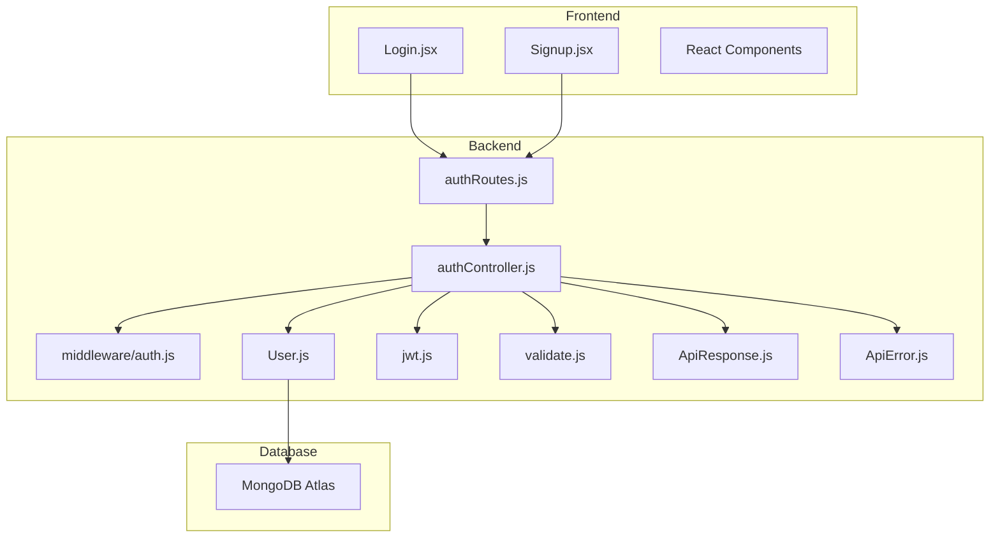
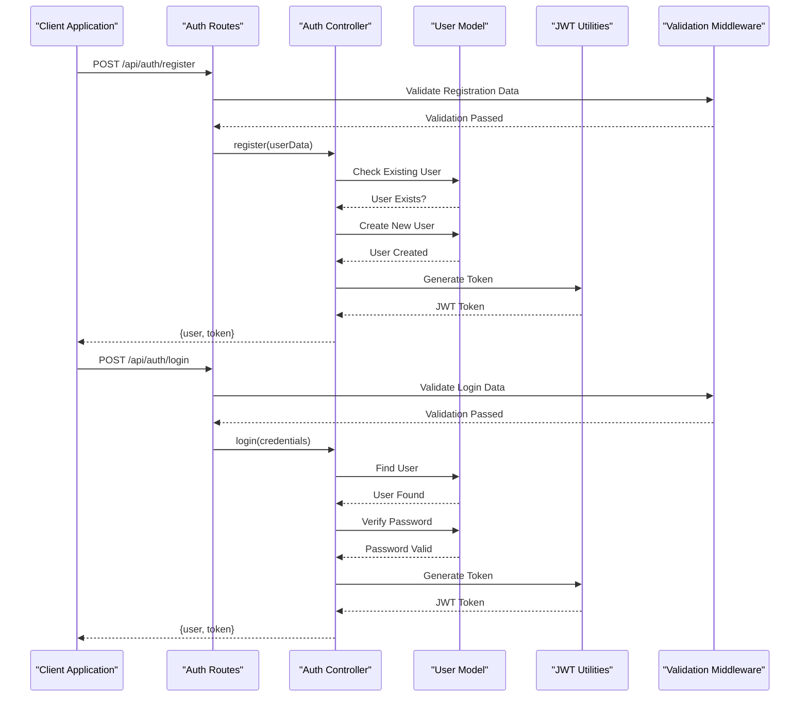
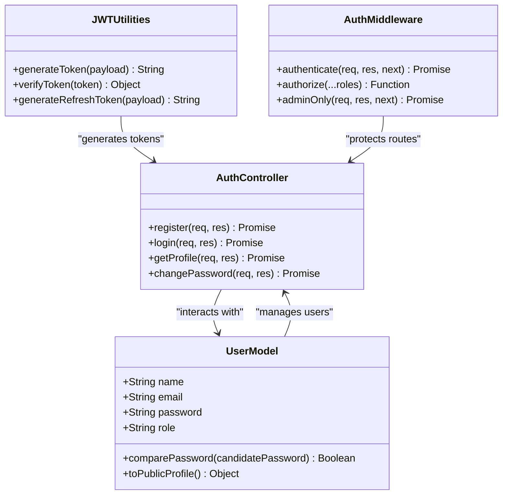
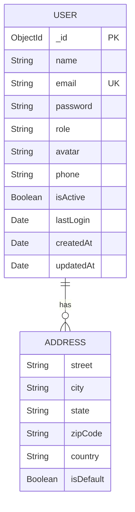
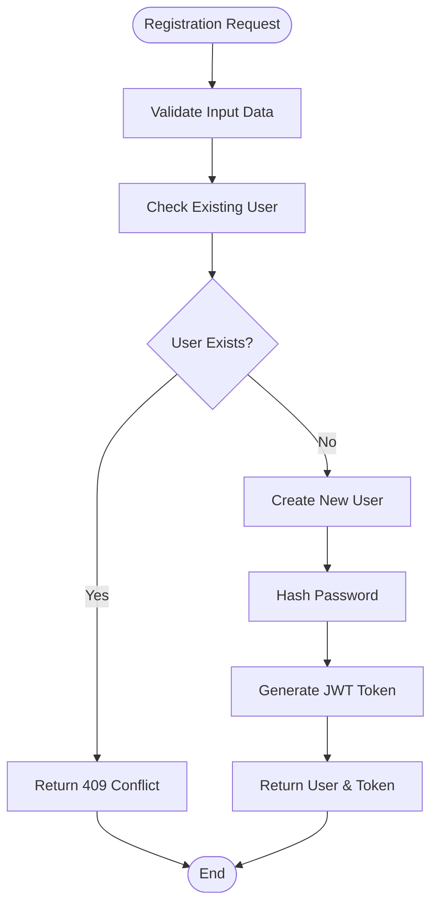
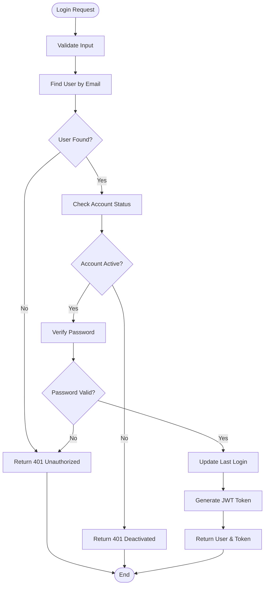
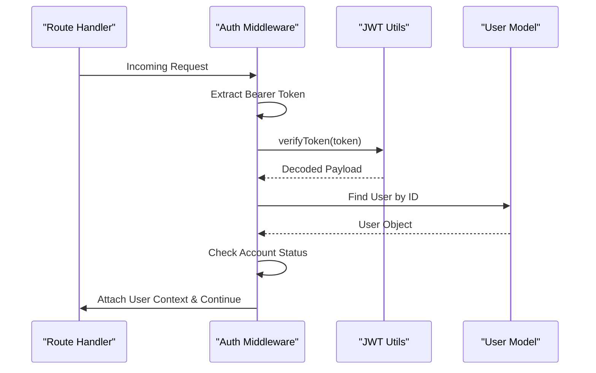
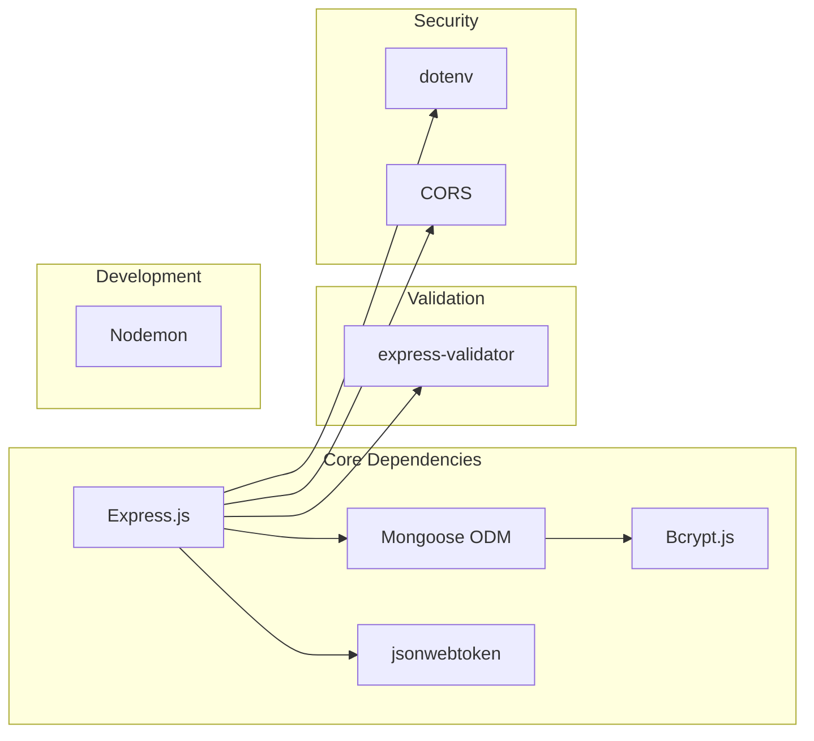
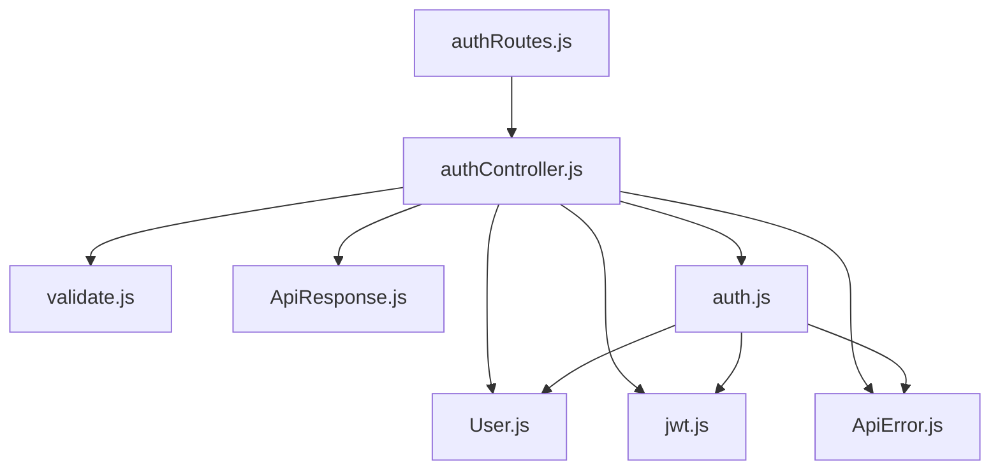
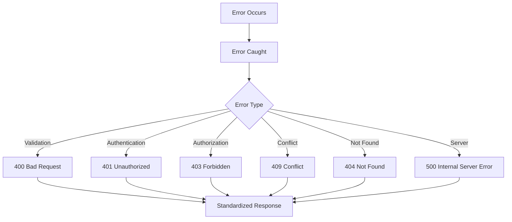

# User Authentication System

<cite>
**Referenced Files in This Document**
- [authController.js](file://backend/controllers/authController.js)
- [auth.js](file://backend/middleware/auth.js)
- [User.js](file://backend/models/User.js)
- [jwt.js](file://backend/utils/jwt.js)
- [authRoutes.js](file://backend/routes/authRoutes.js)
- [validate.js](file://backend/middleware/validate.js)
- [ApiError.js](file://backend/utils/ApiError.js)
- [ApiResponse.js](file://backend/utils/ApiResponse.js)
- [error.js](file://backend/middleware/error.js)
- [index.js](file://backend/index.js)
- [db.js](file://backend/db/db.js)
- [Login.jsx](file://src/pages/Login/Login.jsx)
- [Signup.jsx](file://src/pages/Signup/Signup.jsx)
</cite>

## Table of Contents
1. [Introduction](#introduction)
2. [Project Structure](#project-structure)
3. [Core Components](#core-components)
4. [Architecture Overview](#architecture-overview)
5. [Detailed Component Analysis](#detailed-component-analysis)
6. [Dependency Analysis](#dependency-analysis)
7. [Performance Considerations](#performance-considerations)
8. [Troubleshooting Guide](#troubleshooting-guide)
9. [Conclusion](#conclusion)

## Introduction
This document provides comprehensive documentation for the user authentication system in the e-commerce application. The system implements JWT (JSON Web Token) based authentication with robust middleware validation, secure password handling, and standardized API responses. It covers the complete authentication workflow including user registration, login, password management, and session handling, along with frontend login/signup components and backend controller functions.

## Project Structure
The authentication system follows a clean MVC (Model-View-Controller) architecture with clear separation of concerns:

**Diagram sources**
- [authRoutes.js:1-85](file://backend/routes/authRoutes.js#L1-L85)
- [authController.js:1-299](file://backend/controllers/authController.js#L1-L299)
- [User.js:1-135](file://backend/models/User.js#L1-L135)

**Section sources**
- [authRoutes.js:1-85](file://backend/routes/authRoutes.js#L1-L85)
- [authController.js:1-299](file://backend/controllers/authController.js#L1-L299)
- [User.js:1-135](file://backend/models/User.js#L1-L135)

## Core Components

### Authentication Workflow
The authentication system implements a comprehensive workflow covering all essential user management operations:

**Diagram sources**
- [authController.js:17-47](file://backend/controllers/authController.js#L17-L47)
- [authController.js:54-94](file://backend/controllers/authController.js#L54-L94)
- [jwt.js:13-29](file://backend/utils/jwt.js#L13-L29)

### Security Implementation
The system implements multiple layers of security:

1. **Password Security**: Bcrypt hashing with 12 salt rounds
2. **Token Security**: JWT with configurable expiration
3. **Input Validation**: Comprehensive validation using express-validator
4. **Middleware Protection**: Authentication and authorization middleware
5. **Error Handling**: Centralized error management

**Section sources**
- [User.js:92-103](file://backend/models/User.js#L92-L103)
- [jwt.js:13-29](file://backend/utils/jwt.js#L13-L29)
- [validate.js:30-67](file://backend/middleware/validate.js#L30-L67)

## Architecture Overview

### JWT Token-Based Authentication
The authentication system uses JWT tokens for stateless authentication:

**Diagram sources**
- [jwt.js:13-42](file://backend/utils/jwt.js#L13-L42)
- [User.js:110-130](file://backend/models/User.js#L110-L130)
- [authController.js:17-299](file://backend/controllers/authController.js#L17-L299)
- [auth.js:10-55](file://backend/middleware/auth.js#L10-L55)

### API Endpoint Structure
The authentication endpoints follow RESTful conventions:

| Method | Endpoint | Description | Authentication |
|--------|----------|-------------|----------------|
| POST | `/api/auth/register` | User registration | None |
| POST | `/api/auth/login` | User login | None |
| GET | `/api/auth/profile` | Get user profile | JWT Required |
| PUT | `/api/auth/profile` | Update profile | JWT Required |
| PUT | `/api/auth/change-password` | Change password | JWT Required |
| POST | `/api/auth/addresses` | Add address | JWT Required |
| PUT | `/api/auth/addresses/:addressId` | Update address | JWT Required |
| DELETE | `/api/auth/addresses/:addressId` | Delete address | JWT Required |
| POST | `/api/auth/logout` | User logout | JWT Required |

**Section sources**
- [authRoutes.js:21-82](file://backend/routes/authRoutes.js#L21-L82)

## Detailed Component Analysis

### User Model Schema
The User model defines the complete user structure with comprehensive validation:

**Diagram sources**
- [User.js:8-72](file://backend/models/User.js#L8-L72)

Key features of the User model:
- **Password Security**: Automatic hashing with bcrypt before save
- **Role Management**: Built-in user/admin roles
- **Address Management**: Embedded address array with default handling
- **Validation**: Comprehensive field validation and sanitization
- **Indexes**: Optimized queries for email and role fields

**Section sources**
- [User.js:8-72](file://backend/models/User.js#L8-L72)
- [User.js:92-103](file://backend/models/User.js#L92-L103)

### Authentication Controller
The authentication controller handles all user-related operations:

#### Registration Process
The registration process includes comprehensive validation and security checks:

**Diagram sources**
- [authController.js:17-47](file://backend/controllers/authController.js#L17-L47)

#### Login Process
The login process implements secure authentication with account validation:

**Diagram sources**
- [authController.js:54-94](file://backend/controllers/authController.js#L54-L94)

**Section sources**
- [authController.js:17-299](file://backend/controllers/authController.js#L17-L299)

### Authentication Middleware
The middleware system provides comprehensive route protection:

#### Authentication Middleware
The authentication middleware validates JWT tokens and attaches user context:

**Diagram sources**
- [auth.js:10-55](file://backend/middleware/auth.js#L10-L55)
- [jwt.js:27-29](file://backend/utils/jwt.js#L27-L29)

#### Authorization Middleware
The authorization middleware provides role-based access control:

| Role | Access Level | Protected Routes |
|------|--------------|------------------|
| `user` | Basic User | Profile, Orders, Addresses |
| `admin` | Administrator | All routes except admin-only |

**Section sources**
- [auth.js:95-110](file://backend/middleware/auth.js#L95-L110)

### Frontend Authentication Components
The frontend provides user-friendly authentication interfaces:

#### Login Component Features
The Login component includes:
- Form validation with real-time feedback
- Password visibility toggle
- Social login options
- Loading states and success feedback
- Responsive design with animations

#### Signup Component Features
The Signup component implements:
- Multi-field validation (name, email, password)
- Password strength requirements
- Confirmation password matching
- Error handling and user feedback
- Progressive enhancement with animations

**Section sources**
- [Login.jsx:1-123](file://src/pages/Login/Login.jsx#L1-L123)
- [Signup.jsx:1-177](file://src/pages/Signup/Signup.jsx#L1-L177)

### Validation System
The validation system ensures data integrity and security:

#### Input Validation Rules
| Field | Validation Rules | Error Messages |
|-------|------------------|----------------|
| `name` | 2-50 characters, required | Name validation errors |
| `email` | Valid email format, required | Email validation errors |
| `password` | 8+ characters, mixed case & numbers | Password validation errors |
| `currentPassword` | Required for password change | Current password validation |

**Section sources**
- [validate.js:30-67](file://backend/middleware/validate.js#L30-L67)

## Dependency Analysis

### External Dependencies
The authentication system relies on several key external libraries:

**Diagram sources**
- [package.json:20-27](file://backend/package.json#L20-L27)

### Internal Dependencies
The internal dependency structure ensures modularity and maintainability:

**Diagram sources**
- [authRoutes.js:4-19](file://backend/routes/authRoutes.js#L4-L19)
- [authController.js:1-6](file://backend/controllers/authController.js#L1-L6)

**Section sources**
- [package.json:20-31](file://backend/package.json#L20-L31)

## Performance Considerations

### Database Optimization
The system implements several performance optimizations:

1. **Indexing Strategy**: Email and role fields are indexed for faster queries
2. **Query Selectivity**: Password field is excluded by default to reduce payload size
3. **Connection Pooling**: MongoDB connection pooling for efficient resource usage
4. **Caching Opportunities**: JWT tokens eliminate database lookups for authenticated requests

### Security Best Practices
The implementation follows industry-standard security practices:

1. **Password Storage**: Bcrypt hashing with 12 salt rounds
2. **Token Expiration**: Configurable JWT expiration (default 7 days)
3. **Input Sanitization**: Comprehensive input validation and sanitization
4. **Error Handling**: Generic error messages to prevent information leakage
5. **CORS Configuration**: Secure cross-origin resource sharing setup

### Scalability Considerations
The system is designed for scalability:

1. **Stateless Authentication**: JWT tokens eliminate server-side session storage
2. **Modular Architecture**: Clear separation of concerns enables independent scaling
3. **Database Optimization**: Proper indexing and query patterns
4. **Error Boundaries**: Centralized error handling prevents cascading failures

## Troubleshooting Guide

### Common Authentication Issues

#### Login Failures
**Symptoms**: Users unable to login despite correct credentials
**Causes**: 
- Account deactivated status
- Incorrect password
- Invalid/expired JWT token
- Database connectivity issues

**Solutions**:
1. Verify user account status in database
2. Check password hash comparison
3. Regenerate JWT token with valid payload
4. Monitor database connection health

#### Registration Conflicts
**Symptoms**: Registration fails with duplicate email error
**Causes**:
- Existing user with same email
- Database constraint violations

**Solutions**:
1. Check for existing user records
2. Implement duplicate detection before creation
3. Provide clear error messaging

#### Token Validation Errors
**Symptoms**: "Invalid token" or "Token expired" errors
**Causes**:
- Expired JWT tokens
- Tampered token signatures
- Incorrect JWT secret configuration

**Solutions**:
1. Implement token refresh mechanism
2. Verify JWT secret environment variable
3. Check token expiration settings

### Error Response Format
The system uses standardized error responses:

**Diagram sources**
- [error.js:84-103](file://backend/middleware/error.js#L84-L103)

**Section sources**
- [error.js:11-121](file://backend/middleware/error.js#L11-L121)
- [ApiError.js:5-21](file://backend/utils/ApiError.js#L5-L21)

### Database Connection Issues
**Common Symptoms**: Authentication endpoints failing with database errors
**Troubleshooting Steps**:
1. Verify MongoDB connection string in environment variables
2. Check network connectivity to MongoDB Atlas
3. Review connection timeout settings
4. Monitor database performance metrics

**Section sources**
- [db.js:7-21](file://backend/db/db.js#L7-L21)

## Conclusion
The user authentication system provides a comprehensive, secure, and scalable solution for user management in the e-commerce application. The implementation follows modern security practices with JWT-based authentication, comprehensive input validation, and centralized error handling. The modular architecture ensures maintainability and extensibility, while the frontend components provide excellent user experience with proper validation and feedback mechanisms.

Key strengths of the system include:
- **Security**: Robust password hashing, token-based authentication, and input validation
- **Scalability**: Stateless JWT authentication eliminates server-side session storage
- **Maintainability**: Clean MVC architecture with clear separation of concerns
- **User Experience**: Comprehensive frontend components with real-time validation
- **Reliability**: Centralized error handling and graceful degradation

The system is ready for production deployment with proper environment configuration and monitoring in place.