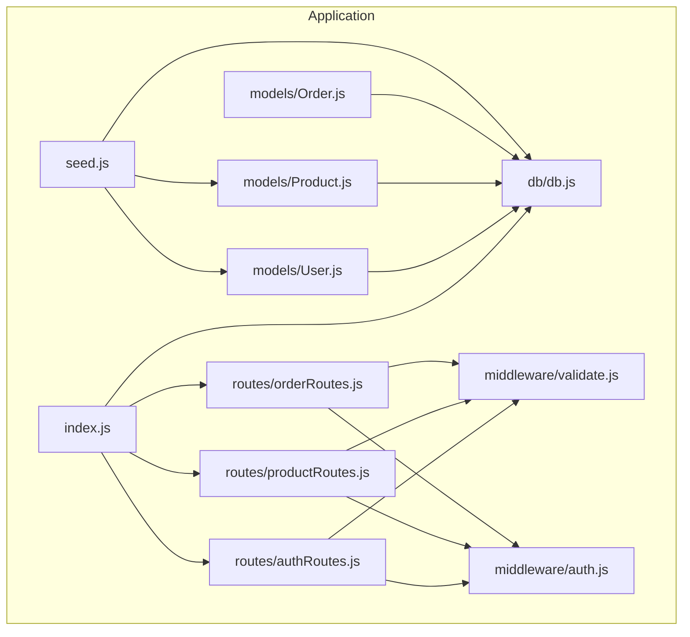
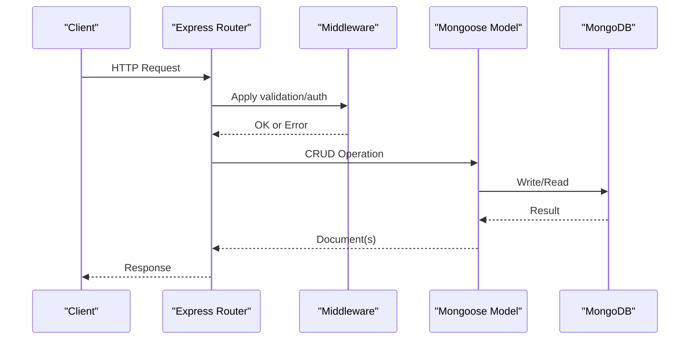
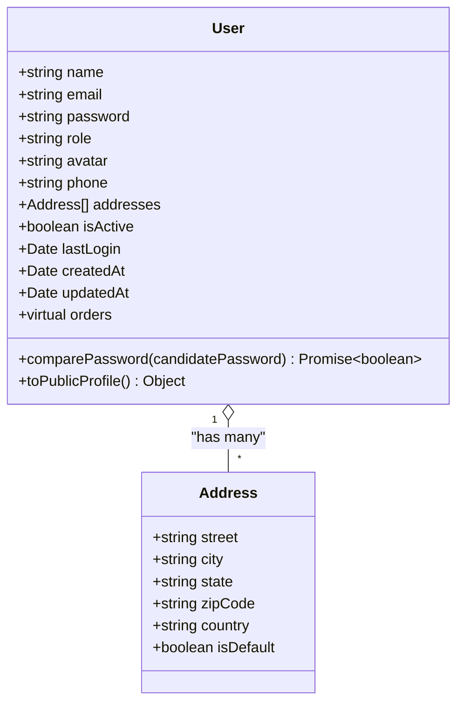
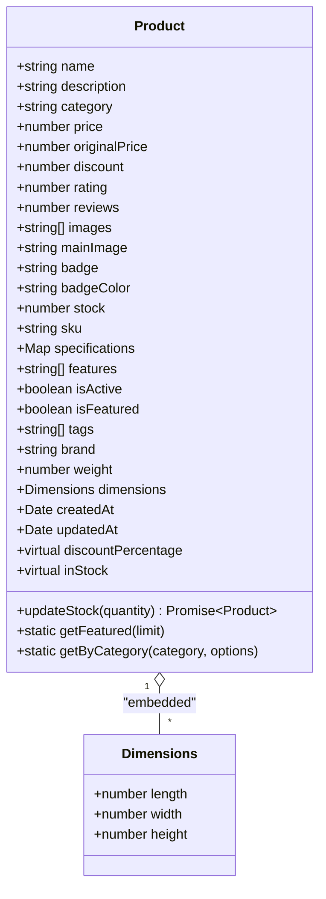
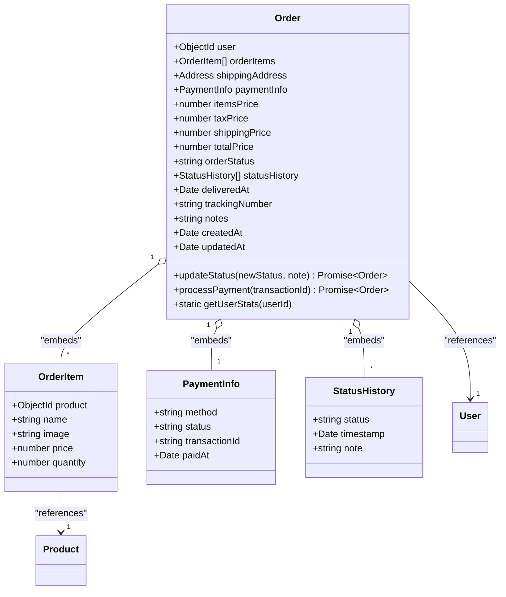
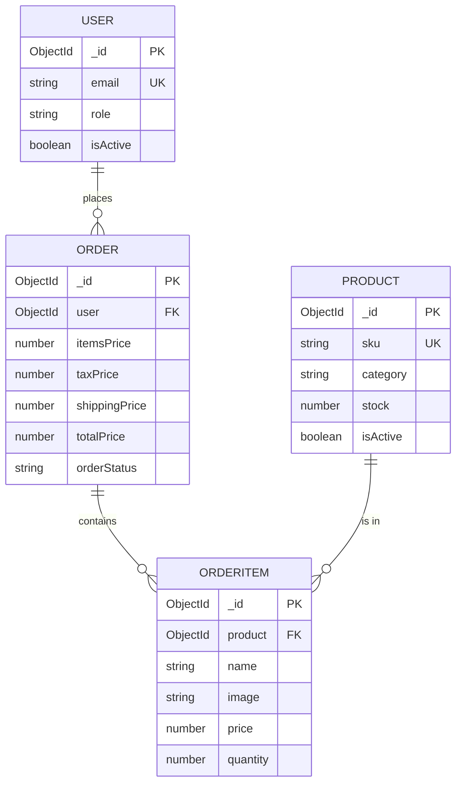
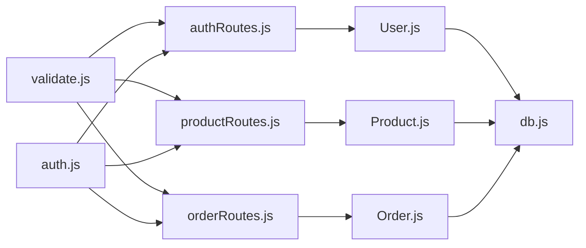

# Database Design

<cite>
**Referenced Files in This Document**
- [db.js](file://backend/db/db.js)
- [User.js](file://backend/models/User.js)
- [Product.js](file://backend/models/Product.js)
- [Order.js](file://backend/models/Order.js)
- [seed.js](file://backend/seed.js)
- [index.js](file://backend/index.js)
- [validate.js](file://backend/middleware/validate.js)
- [auth.js](file://backend/middleware/auth.js)
- [authRoutes.js](file://backend/routes/authRoutes.js)
- [productRoutes.js](file://backend/routes/productRoutes.js)
- [orderRoutes.js](file://backend/routes/orderRoutes.js)
</cite>

## Table of Contents
1. [Introduction](#introduction)
2. [Project Structure](#project-structure)
3. [Core Components](#core-components)
4. [Architecture Overview](#architecture-overview)
5. [Detailed Component Analysis](#detailed-component-analysis)
6. [Dependency Analysis](#dependency-analysis)
7. [Performance Considerations](#performance-considerations)
8. [Troubleshooting Guide](#troubleshooting-guide)
9. [Conclusion](#conclusion)
10. [Appendices](#appendices)

## Introduction
This document describes the MongoDB database schema for the e-commerce application, focusing on the User, Product, and Order models. It explains entity relationships, field definitions, data types, indexes, constraints, validation rules, business rules, and data integrity measures. It also covers data access patterns, seeding strategies, performance considerations, and operational topics such as security, access control, and backups.

## Project Structure
The backend uses Mongoose ODM to define schemas and connect to MongoDB. The application initializes the database connection at startup and exposes REST endpoints routed through Express. Validation and authentication middleware enforce business rules and access control.

**Diagram sources**
- [index.js:1-119](file://backend/index.js#L1-L119)
- [db.js:1-37](file://backend/db/db.js#L1-L37)
- [User.js:1-135](file://backend/models/User.js#L1-L135)
- [Product.js:1-217](file://backend/models/Product.js#L1-L217)
- [Order.js:1-217](file://backend/models/Order.js#L1-L217)
- [validate.js:1-221](file://backend/middleware/validate.js#L1-L221)
- [auth.js:1-124](file://backend/middleware/auth.js#L1-L124)
- [authRoutes.js:1-85](file://backend/routes/authRoutes.js#L1-L85)
- [productRoutes.js:1-101](file://backend/routes/productRoutes.js#L1-L101)
- [orderRoutes.js:1-77](file://backend/routes/orderRoutes.js#L1-L77)
- [seed.js:1-288](file://backend/seed.js#L1-L288)

**Section sources**
- [index.js:1-119](file://backend/index.js#L1-L119)
- [db.js:1-37](file://backend/db/db.js#L1-L37)

## Core Components
- User: Represents customer accounts with roles, addresses, and authentication data.
- Product: Represents catalog items with pricing, inventory, metadata, and search indexes.
- Order: Represents purchase transactions with embedded items, payment info, and status history.

Key characteristics:
- All models use timestamps to track creation/update times.
- Virtuals provide computed fields (e.g., discount percentage, stock availability).
- Pre-save hooks enforce data integrity (e.g., password hashing, SKU generation, price calculation).
- Indexes optimize common queries (email, category+price, status filters, etc.).

**Section sources**
- [User.js:1-135](file://backend/models/User.js#L1-L135)
- [Product.js:1-217](file://backend/models/Product.js#L1-L217)
- [Order.js:1-217](file://backend/models/Order.js#L1-L217)

## Architecture Overview
The application connects to MongoDB Atlas via Mongoose. Requests flow through Express routes to controllers, validated by middleware, persisted to MongoDB collections, and returned to clients.

**Diagram sources**
- [index.js:1-119](file://backend/index.js#L1-L119)
- [validate.js:1-221](file://backend/middleware/validate.js#L1-L221)
- [auth.js:1-124](file://backend/middleware/auth.js#L1-L124)
- [User.js:1-135](file://backend/models/User.js#L1-L135)
- [Product.js:1-217](file://backend/models/Product.js#L1-L217)
- [Order.js:1-217](file://backend/models/Order.js#L1-L217)

## Detailed Component Analysis

### User Model
- Purpose: Store customer profiles, authentication credentials, roles, addresses, and activity logs.
- Primary key: ObjectId (_id).
- Fields:
  - name: String, required, trimmed, length limits.
  - email: String, required, unique, normalized to lowercase, validated.
  - password: String, required, hashed before save, hidden by default in queries.
  - role: Enum('user','admin'), defaults to 'user'.
  - avatar: String, nullable.
  - phone: String, nullable.
  - addresses: Array of embedded address objects (street, city, state, zipCode, country, isDefault).
  - isActive: Boolean, defaults to true.
  - lastLogin: Date, nullable.
  - Timestamps: createdAt, updatedAt.
- Virtuals:
  - orders: Populated reference to Order documents via user._id -> order.user.
- Indexes:
  - email: 1
  - role: 1
- Constraints and validations:
  - Unique email enforced at schema level.
  - Role enum restricted.
  - Password hashed via pre-save hook.
  - Default select: false prevents password exposure in queries.
- Business rules:
  - Addresses array supports multiple entries with one default.
  - isActive controls account validity.
- Access patterns:
  - Profile retrieval via JWT-protected routes.
  - Address management requires authentication.

**Diagram sources**
- [User.js:1-135](file://backend/models/User.js#L1-L135)

**Section sources**
- [User.js:1-135](file://backend/models/User.js#L1-L135)

### Product Model
- Purpose: Store product catalog data, pricing, inventory, badges, and metadata.
- Primary key: ObjectId (_id).
- Fields:
  - name: String, required, trimmed, length limit.
  - description: String, required, length limit.
  - category: String, required, enum, indexed.
  - price: Number, required, min 0.
  - originalPrice: Number, min 0, nullable.
  - discount: Number, 0..100, default 0.
  - rating: Number, 0..5, default 0.
  - reviews: Number, min 0, default 0.
  - images: Array of String URLs, required.
  - mainImage: String URL, required.
  - badge: Enum(null,'Best Seller','Top Rated','New','Hot','Sale','Premium','Deal').
  - badgeColor: String, nullable.
  - stock: Number, required, min 0, default 0.
  - sku: String, unique, sparse (allows null).
  - specifications: Map<String,String>, default {}.
  - features: Array<String>.
  - isActive: Boolean, default true.
  - isFeatured: Boolean, default false.
  - tags: Array<String>, trimmed.
  - brand: String, trimmed, nullable.
  - weight: Number, nullable.
  - dimensions: Embedded object (length, width, height).
  - Timestamps: createdAt, updatedAt.
- Virtuals:
  - discountPercentage: Computed from originalPrice vs price or explicit discount.
  - inStock: Boolean derived from stock > 0.
- Indexes:
  - compound text index on name, description.
  - category:1 + price:1.
  - rating:-1.
  - isFeatured:1.
  - createdAt:-1.
- Constraints and validations:
  - Category enum enforced.
  - Price/originalPrice/discount/rating/reviews min/max checks.
  - SKU auto-generated if missing (pre-save hook).
- Business rules:
  - SKU uniqueness with sparse index allows optional SKU.
  - Stock updates via instance method with safety against negative values.
  - Featured and category queries via static methods.
- Access patterns:
  - List with filtering, sorting, pagination.
  - Search by text.
  - Category-based browsing.
  - SKU lookup.

**Diagram sources**
- [Product.js:1-217](file://backend/models/Product.js#L1-L217)

**Section sources**
- [Product.js:1-217](file://backend/models/Product.js#L1-L217)

### Order Model
- Purpose: Store purchase transactions, including items, shipping, payment, and status history.
- Primary key: ObjectId (_id).
- Fields:
  - user: ObjectId reference to User, required, indexed.
  - orderItems: Array of embedded documents (product ObjectId ref, name, image, price, quantity).
  - shippingAddress: Embedded object (street, city, state, zipCode, country).
  - paymentInfo: Embedded object (method enum, status enum, transactionId, paidAt).
  - itemsPrice: Number, default 0.
  - taxPrice: Number, default 0.
  - shippingPrice: Number, default 0.
  - totalPrice: Number, default 0.
  - orderStatus: Enum('pending','processing','shipped','delivered','cancelled'), default 'pending'.
  - statusHistory: Array of objects (status, timestamp, note).
  - deliveredAt: Date, nullable.
  - trackingNumber: String, nullable.
  - notes: String, max length.
  - Timestamps: createdAt, updatedAt.
- Indexes:
  - user:1 + createdAt:-1.
  - orderStatus:1.
  - paymentInfo.status:1.
  - createdAt:-1.
- Constraints and validations:
  - Quantity min 1.
  - Payment method and status enums.
  - Status history maintained on save.
- Business rules:
  - Pre-save calculates itemsPrice, tax (18%), shipping ($0 free above 500, else $50), and totalPrice.
  - Status transitions tracked with timestamps and notes.
  - Payment completion updates paymentInfo fields.
  - Delivery sets deliveredAt.
  - Statistics aggregation for user order metrics.
- Access patterns:
  - Create order (authenticated).
  - View personal orders.
  - Admin view all orders and update statuses/payments.
  - Retrieve order by ID.

**Diagram sources**
- [Order.js:1-217](file://backend/models/Order.js#L1-L217)

**Section sources**
- [Order.js:1-217](file://backend/models/Order.js#L1-L217)

### Entity Relationships
- One-to-many: User has many Orders; Order belongs to one User.
- Many-to-one: OrderItems reference Product; Product can appear in many OrderItems.
- Virtual population: User.orders virtual joins User._id to Order.user.

**Diagram sources**
- [User.js:1-135](file://backend/models/User.js#L1-L135)
- [Product.js:1-217](file://backend/models/Product.js#L1-L217)
- [Order.js:1-217](file://backend/models/Order.js#L1-L217)

## Dependency Analysis
- Models depend on Mongoose for schema definition and ODM features.
- Controllers and routes depend on models for persistence.
- Validation middleware enforces request constraints before model operations.
- Authentication middleware ensures authorized access to protected endpoints.
- Database connection is established at application startup.

**Diagram sources**
- [validate.js:1-221](file://backend/middleware/validate.js#L1-L221)
- [auth.js:1-124](file://backend/middleware/auth.js#L1-L124)
- [authRoutes.js:1-85](file://backend/routes/authRoutes.js#L1-L85)
- [productRoutes.js:1-101](file://backend/routes/productRoutes.js#L1-L101)
- [orderRoutes.js:1-77](file://backend/routes/orderRoutes.js#L1-L77)
- [User.js:1-135](file://backend/models/User.js#L1-L135)
- [Product.js:1-217](file://backend/models/Product.js#L1-L217)
- [Order.js:1-217](file://backend/models/Order.js#L1-L217)
- [db.js:1-37](file://backend/db/db.js#L1-L37)

**Section sources**
- [validate.js:1-221](file://backend/middleware/validate.js#L1-L221)
- [auth.js:1-124](file://backend/middleware/auth.js#L1-L124)
- [authRoutes.js:1-85](file://backend/routes/authRoutes.js#L1-L85)
- [productRoutes.js:1-101](file://backend/routes/productRoutes.js#L1-L101)
- [orderRoutes.js:1-77](file://backend/routes/orderRoutes.js#L1-L77)
- [User.js:1-135](file://backend/models/User.js#L1-L135)
- [Product.js:1-217](file://backend/models/Product.js#L1-L217)
- [Order.js:1-217](file://backend/models/Order.js#L1-L217)
- [db.js:1-37](file://backend/db/db.js#L1-L37)

## Performance Considerations
- Indexes:
  - User: email, role.
  - Product: text(name, description), category+price, rating desc, isFeatured, createdAt desc.
  - Order: user+createdAt desc, orderStatus, paymentInfo.status, createdAt desc.
- Query patterns:
  - Product listing with category filters, price ranges, sorting, and pagination.
  - Order retrieval by user with recent-first ordering.
  - Aggregation for user order statistics.
- Cost drivers:
  - Text search index on Product.
  - Compound indexes for filtered/sorted queries.
  - Embedded arrays (orderItems) increase document size; consider normalization if growth becomes problematic.
- Recommendations:
  - Monitor slow queries and add targeted indexes.
  - Use projection to limit fields in read-heavy endpoints.
  - Batch writes for bulk operations (e.g., stock updates).
  - Consider sharding for large datasets and high write throughput.

[No sources needed since this section provides general guidance]

## Troubleshooting Guide
- Connection failures:
  - Ensure MONGODB_URI is set and reachable.
  - Check network/firewall settings for MongoDB Atlas.
- Validation errors:
  - Review express-validator messages for malformed requests.
  - Confirm enums and numeric ranges meet schema expectations.
- Authentication issues:
  - Verify JWT presence and validity.
  - Confirm user isActive flag.
- Data integrity:
  - Pre-save hooks enforce password hashing, SKU generation, and price calculations.
  - Use transactions for multi-document updates if needed.

**Section sources**
- [db.js:1-37](file://backend/db/db.js#L1-L37)
- [validate.js:1-221](file://backend/middleware/validate.js#L1-L221)
- [auth.js:1-124](file://backend/middleware/auth.js#L1-L124)
- [User.js:92-103](file://backend/models/User.js#L92-L103)
- [Product.js:156-164](file://backend/models/Product.js#L156-L164)
- [Order.js:139-165](file://backend/models/Order.js#L139-L165)

## Conclusion
The database design centers on three core models with clear relationships and robust validation. Indexes and virtuals support efficient queries and computed fields. Pre-save hooks and middleware ensure data integrity and security. The schema supports typical e-commerce operations with room for future enhancements like denormalization or sharding.

[No sources needed since this section summarizes without analyzing specific files]

## Appendices

### Data Access Patterns
- User
  - Create profile, login, update profile, change password, manage addresses.
- Product
  - Browse, search, filter by category/price, get featured, SKU lookup, stock updates.
- Order
  - Place order, view personal orders, admin manage orders and payments.

**Section sources**
- [authRoutes.js:1-85](file://backend/routes/authRoutes.js#L1-L85)
- [productRoutes.js:1-101](file://backend/routes/productRoutes.js#L1-L101)
- [orderRoutes.js:1-77](file://backend/routes/orderRoutes.js#L1-L77)

### Seeding Strategy
- Seed script clears existing data, creates sample users (regular and admin), and inserts sample products.
- Demonstrates realistic product attributes and user credentials for development/testing.

**Section sources**
- [seed.js:195-288](file://backend/seed.js#L195-L288)

### Data Lifecycle
- Creation: Pre-save hooks generate SKUs and hash passwords.
- Updates: Stock adjustments, status changes, payment completion.
- Deletion: Admin-controlled product deletion; soft-delete patterns can be considered for audit trails.

**Section sources**
- [Product.js:156-164](file://backend/models/Product.js#L156-L164)
- [User.js:92-103](file://backend/models/User.js#L92-L103)
- [Order.js:139-165](file://backend/models/Order.js#L139-L165)

### Security and Access Control
- Authentication: JWT bearer tokens verified by middleware; inactive users blocked.
- Authorization: Role-based access (admin-only endpoints).
- Data protection: Passwords hashed; sensitive fields excluded from default queries.

**Section sources**
- [auth.js:1-124](file://backend/middleware/auth.js#L1-L124)
- [User.js:28-33](file://backend/models/User.js#L28-L33)

### Backup and Operational Notes
- Use MongoDB Atlas automated backups or export/import strategies for production data.
- Maintain separate environments (dev/test/prod) with distinct URIs.
- Monitor indexes and query performance regularly.

[No sources needed since this section provides general guidance]