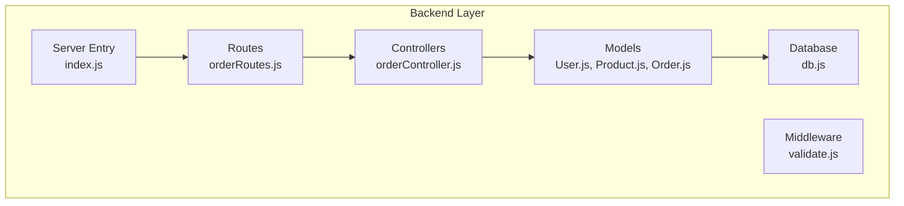
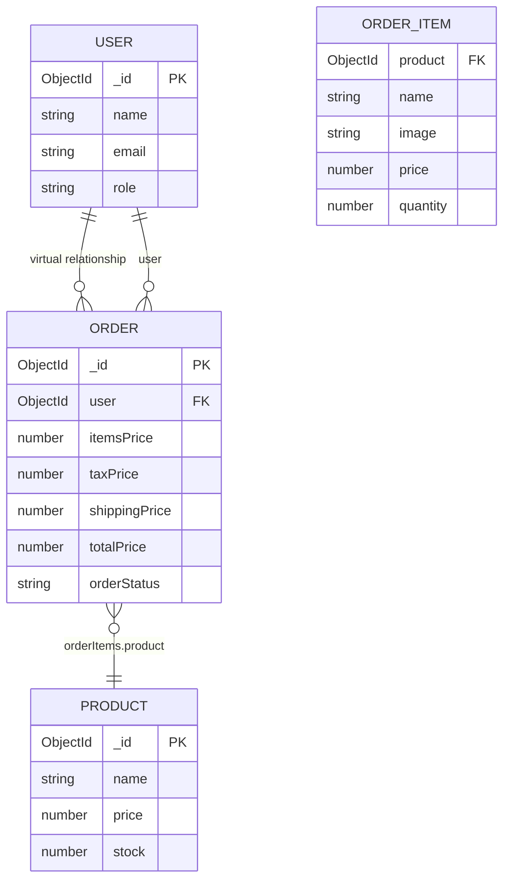
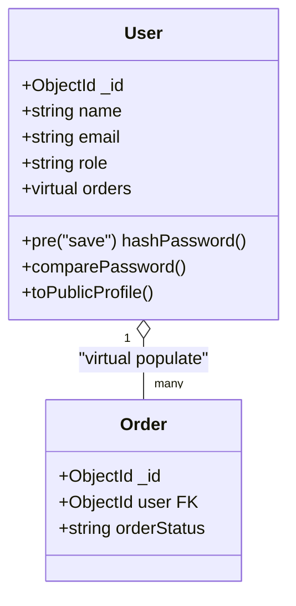
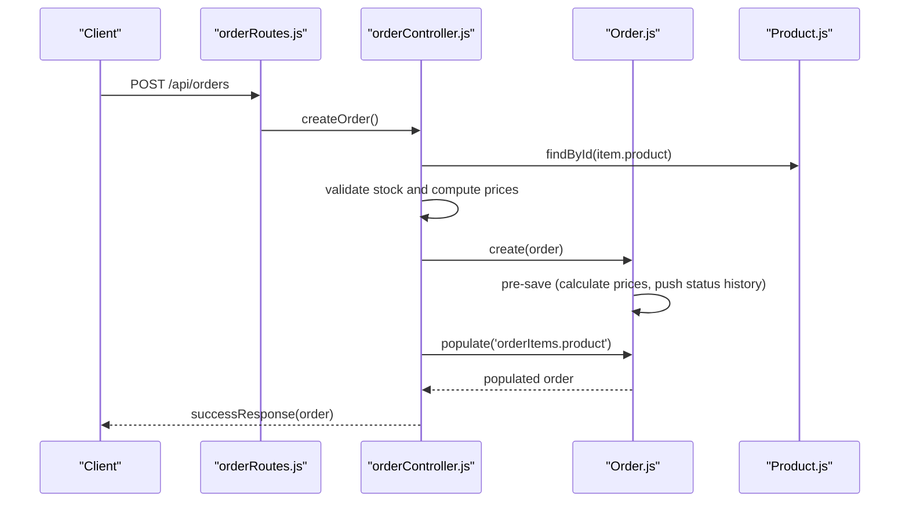
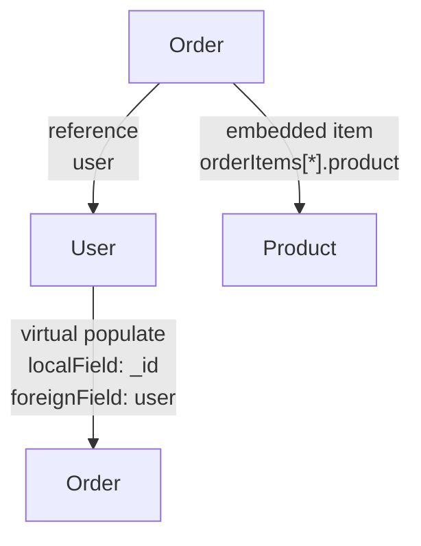
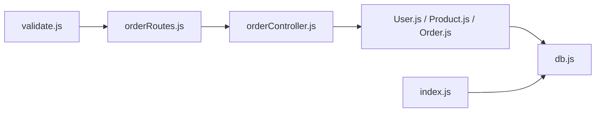
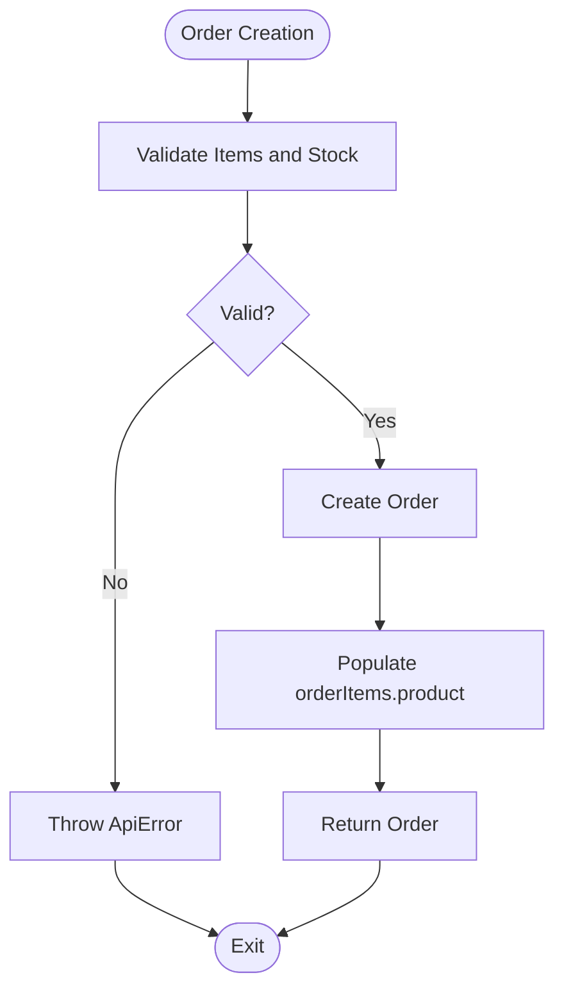

# Database Relationships

<cite>
**Referenced Files in This Document**
- [User.js](file://backend/models/User.js)
- [Product.js](file://backend/models/Product.js)
- [Order.js](file://backend/models/Order.js)
- [orderController.js](file://backend/controllers/orderController.js)
- [orderRoutes.js](file://backend/routes/orderRoutes.js)
- [validate.js](file://backend/middleware/validate.js)
- [db.js](file://backend/db/db.js)
- [index.js](file://backend/index.js)
</cite>

## Table of Contents
1. [Introduction](#introduction)
2. [Project Structure](#project-structure)
3. [Core Components](#core-components)
4. [Architecture Overview](#architecture-overview)
5. [Detailed Component Analysis](#detailed-component-analysis)
6. [Dependency Analysis](#dependency-analysis)
7. [Performance Considerations](#performance-considerations)
8. [Troubleshooting Guide](#troubleshooting-guide)
9. [Conclusion](#conclusion)

## Introduction
This document explains the database relationships among User, Product, and Order models in a MongoDB/Mongoose-based e-commerce application. It covers foreign key references, virtual populate relationships, data integrity constraints, and cascade behaviors. It also documents query patterns, population strategies, and best practices for maintaining referential integrity across collections.

## Project Structure
The application follows a layered architecture with models, controllers, routes, and middleware. The database layer uses Mongoose ODM with virtual relationships and embedded documents.



**Diagram sources**
- [index.js:1-119](file://backend/index.js#L1-L119)
- [orderRoutes.js:1-77](file://backend/routes/orderRoutes.js#L1-L77)
- [orderController.js:1-358](file://backend/controllers/orderController.js#L1-L358)
- [User.js:1-135](file://backend/models/User.js#L1-L135)
- [Product.js:1-217](file://backend/models/Product.js#L1-L217)
- [Order.js:1-217](file://backend/models/Order.js#L1-L217)
- [db.js:1-37](file://backend/db/db.js#L1-L37)

**Section sources**
- [index.js:1-119](file://backend/index.js#L1-L119)
- [orderRoutes.js:1-77](file://backend/routes/orderRoutes.js#L1-L77)

## Core Components
- User: Represents customers with virtual relationship to orders.
- Product: Represents items with embedded order items in orders.
- Order: Contains embedded order items and references User and Product.

Key characteristics:
- User has a virtual relationship to Order documents via a foreign key field.
- Order references User via ObjectId and embeds Product details per item.
- No automatic cascade deletes are configured in the models; business logic handles cleanup.

**Section sources**
- [User.js:74-81](file://backend/models/User.js#L74-L81)
- [Order.js:36-44](file://backend/models/Order.js#L36-L44)
- [Order.js:7-30](file://backend/models/Order.js#L7-L30)

## Architecture Overview
The relationship architecture centers on:
- User to Order: One-to-many (virtual populate).
- Order to Product: Embedded documents (orderItems.product).
- Order to User: Foreign key reference.



**Diagram sources**
- [User.js:74-81](file://backend/models/User.js#L74-L81)
- [Order.js:36-44](file://backend/models/Order.js#L36-L44)
- [Order.js:7-30](file://backend/models/Order.js#L7-L30)

## Detailed Component Analysis

### User Model
- Virtual relationship: orders (virtual populate) references Order documents where Order.user equals User._id.
- Indexes: email, role.
- Security: password hashing on save; select: false prevents password exposure by default.



**Diagram sources**
- [User.js:74-81](file://backend/models/User.js#L74-L81)
- [Order.js:36-44](file://backend/models/Order.js#L36-L44)

**Section sources**
- [User.js:74-81](file://backend/models/User.js#L74-L81)
- [User.js:84-103](file://backend/models/User.js#L84-L103)

### Product Model
- Embedded order items: Product details are embedded in Order.orderItems (name, image, price, quantity).
- Indexes: text search on name/description, category+price, rating, isFeatured, createdAt.
- Stock management: updateStock method decrements stock safely.

```mermaid
classDiagram
class Product {
+ObjectId _id
+string name
+number price
+number stock
+Map specifications
+features[]
}
class OrderItem {
+ObjectId product FK
+string name
+string image
+number price
+number quantity
}
Product ||--o{ OrderItem : "embedded in Order"
```

**Diagram sources**
- [Product.js:146-152](file://backend/models/Product.js#L146-L152)
- [Order.js:7-30](file://backend/models/Order.js#L7-L30)

**Section sources**
- [Product.js:146-152](file://backend/models/Product.js#L146-L152)
- [Product.js:206-212](file://backend/models/Product.js#L206-L212)

### Order Model
- References: user (ObjectId, required, indexed).
- Embedded documents: orderItems (product, name, image, price, quantity).
- Computed fields: itemsPrice, taxPrice, shippingPrice, totalPrice via pre-save hook.
- Status history: maintains status transitions with timestamps.
- Methods: updateStatus, processPayment, getUserStats aggregation helper.



**Diagram sources**
- [orderRoutes.js:20-26](file://backend/routes/orderRoutes.js#L20-L26)
- [orderController.js:17-69](file://backend/controllers/orderController.js#L17-L69)
- [Order.js:139-165](file://backend/models/Order.js#L139-L165)
- [Product.js:206-212](file://backend/models/Product.js#L206-L212)

**Section sources**
- [Order.js:36-44](file://backend/models/Order.js#L36-L44)
- [Order.js:7-30](file://backend/models/Order.js#L7-L30)
- [Order.js:139-165](file://backend/models/Order.js#L139-L165)
- [Order.js:167-193](file://backend/models/Order.js#L167-L193)
- [Order.js:196-212](file://backend/models/Order.js#L196-L212)

### Relationship Cardinality and Direction
- User to Order: One-to-many (virtual populate). A user can place many orders; each order belongs to one user.
- Order to Product: Many-to-one via embedded documents. Each order item references one product, but the product itself is not a separate collection reference in the embedded structure.
- Order to User: Many-to-one via ObjectId reference.



**Diagram sources**
- [User.js:74-81](file://backend/models/User.js#L74-L81)
- [Order.js:36-44](file://backend/models/Order.js#L36-L44)
- [Order.js:7-30](file://backend/models/Order.js#L7-L30)

## Dependency Analysis
- Controllers depend on models for data access and business logic.
- Routes depend on controllers for request handling.
- Validation middleware enforces request constraints before controllers execute.
- Database connection is initialized at server startup.



**Diagram sources**
- [validate.js:158-213](file://backend/middleware/validate.js#L158-L213)
- [orderRoutes.js:16-18](file://backend/routes/orderRoutes.js#L16-L18)
- [orderController.js:1-6](file://backend/controllers/orderController.js#L1-L6)
- [User.js:1-135](file://backend/models/User.js#L1-L135)
- [Product.js:1-217](file://backend/models/Product.js#L1-L217)
- [Order.js:1-217](file://backend/models/Order.js#L1-L217)
- [db.js:7-21](file://backend/db/db.js#L7-L21)
- [index.js:16-17](file://backend/index.js#L16-L17)

**Section sources**
- [validate.js:158-213](file://backend/middleware/validate.js#L158-L213)
- [orderRoutes.js:16-18](file://backend/routes/orderRoutes.js#L16-L18)
- [index.js:16-17](file://backend/index.js#L16-L17)

## Performance Considerations
- Indexes:
  - User: email, role.
  - Product: text(name, description), category+price, rating, isFeatured, createdAt.
  - Order: user+createdAt (for user order history), orderStatus, paymentInfo.status, createdAt.
- Population strategies:
  - Use targeted projections (select fields) when populating to reduce payload size.
  - Prefer selective population (e.g., only name and mainImage) to minimize bandwidth.
- Aggregation:
  - Use aggregation pipelines for statistics (e.g., getUserStats) to offload computation to the database.
- Embedded vs referenced:
  - Embedded order items reduce join overhead but increase document size; consider this trade-off for frequently accessed order lists.

**Section sources**
- [User.js:84-87](file://backend/models/User.js#L84-L87)
- [Product.js:146-152](file://backend/models/Product.js#L146-L152)
- [Order.js:128-135](file://backend/models/Order.js#L128-L135)
- [orderController.js:91-96](file://backend/controllers/orderController.js#L91-L96)
- [orderController.js:129-134](file://backend/controllers/orderController.js#L129-L134)
- [orderController.js:157-159](file://backend/controllers/orderController.js#L157-L159)
- [Order.js:196-212](file://backend/models/Order.js#L196-L212)

## Troubleshooting Guide
Common issues and resolutions:
- Referential integrity:
  - Order.user must reference an existing User document; validation ensures ObjectId format and existence checks occur during order creation.
  - OrderItems.product references Product documents; stock validation prevents overselling.
- Cascade behavior:
  - No automatic cascade deletes are defined in models. Business logic restores stock on order cancellation and recomputes prices on save.
- Authorization:
  - Order retrieval requires ownership or admin role; controllers enforce this before responding.
- Validation failures:
  - Validation middleware throws structured errors for malformed requests; review validation rules for order creation and status updates.



**Diagram sources**
- [orderController.js:17-69](file://backend/controllers/orderController.js#L17-L69)
- [validate.js:161-193](file://backend/middleware/validate.js#L161-L193)

**Section sources**
- [orderController.js:24-51](file://backend/controllers/orderController.js#L24-L51)
- [orderController.js:154-171](file://backend/controllers/orderController.js#L154-L171)
- [orderController.js:239-271](file://backend/controllers/orderController.js#L239-L271)
- [validate.js:161-193](file://backend/middleware/validate.js#L161-L193)

## Conclusion
The application models a clean separation of concerns with explicit relationships:
- User virtual relationship to orders enables efficient user-centric queries.
- Order embeds product details per item to simplify reads while maintaining referential integrity through validation and stock management.
- Order references User via ObjectId to support user-scoped operations.
- No automatic cascades are configured; business logic ensures data consistency (e.g., stock restoration on cancellation, computed pricing on save).

Best practices:
- Use targeted population and projections to optimize performance.
- Leverage indexes for frequent filters and sorts.
- Enforce validation early with middleware to prevent invalid writes.
- Keep embedded documents small and avoid embedding large arrays; consider denormalization for read-heavy scenarios.