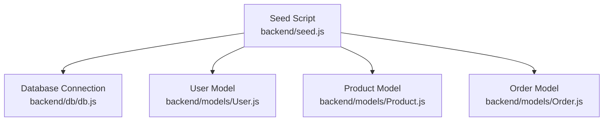
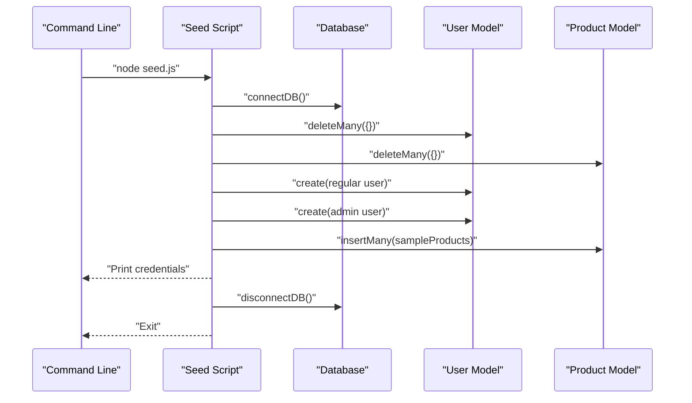
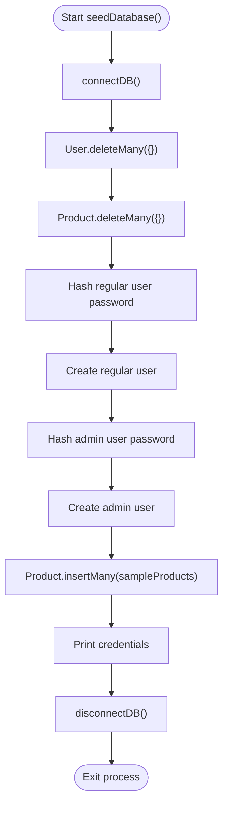
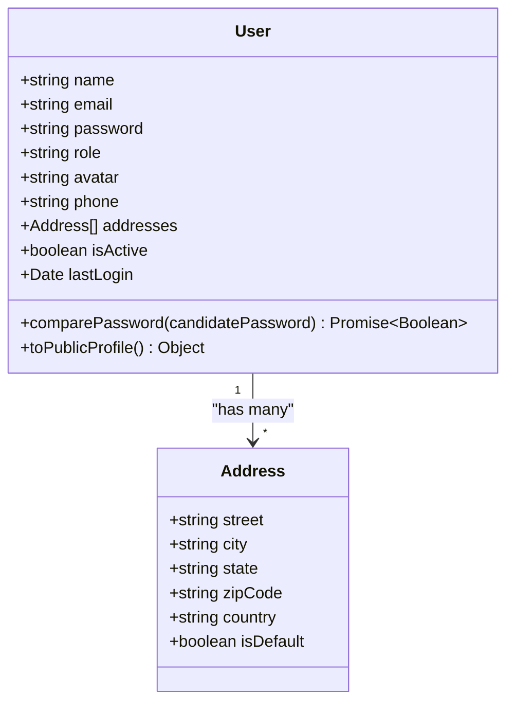
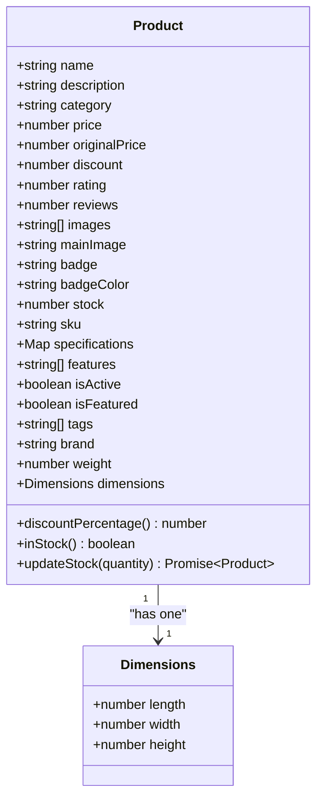
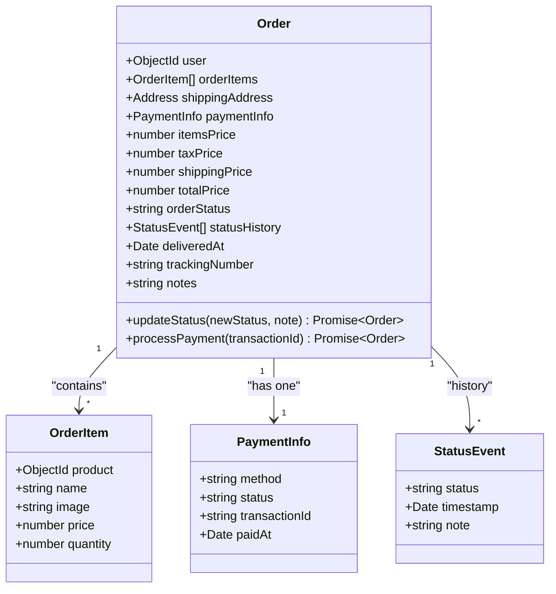
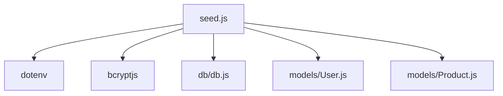

# Database Seeding

<cite>
**Referenced Files in This Document**
- [seed.js](file://backend/seed.js)
- [db.js](file://backend/db/db.js)
- [User.js](file://backend/models/User.js)
- [Product.js](file://backend/models/Product.js)
- [Order.js](file://backend/models/Order.js)
- [package.json](file://backend/package.json)
- [index.js](file://backend/index.js)
- [authRoutes.js](file://backend/routes/authRoutes.js)
- [authController.js](file://backend/controllers/authController.js)
</cite>

## Table of Contents
1. [Introduction](#introduction)
2. [Project Structure](#project-structure)
3. [Core Components](#core-components)
4. [Architecture Overview](#architecture-overview)
5. [Detailed Component Analysis](#detailed-component-analysis)
6. [Dependency Analysis](#dependency-analysis)
7. [Performance Considerations](#performance-considerations)
8. [Troubleshooting Guide](#troubleshooting-guide)
9. [Conclusion](#conclusion)
10. [Appendices](#appendices)

## Introduction
This document explains the database seeding strategy and implementation for the e-commerce backend. It covers the seed data structure, initial user accounts, product catalogs, and order samples. It also details the seeding process, data generation patterns, and how seed data supports development and testing environments. The guide includes seed script execution, data transformation logic, cleanup procedures, and practical examples for maintaining and extending seed data across environments. Best practices for seed data maintenance, version control, and automated seeding in CI/CD pipelines are provided.

## Project Structure
The seeding implementation is centralized in the backend directory. The seed script orchestrates database connections, clears existing data, creates sample users and products, and prints credential information for quick login. Supporting models define the data structures and validation rules for users, products, and orders.

**Diagram sources**
- [seed.js:1-288](file://backend/seed.js#L1-L288)
- [db.js:1-37](file://backend/db/db.js#L1-L37)
- [User.js:1-135](file://backend/models/User.js#L1-L135)
- [Product.js:1-217](file://backend/models/Product.js#L1-L217)
- [Order.js:1-217](file://backend/models/Order.js#L1-L217)

**Section sources**
- [seed.js:1-288](file://backend/seed.js#L1-L288)
- [db.js:1-37](file://backend/db/db.js#L1-L37)

## Core Components
- Seed Script: Orchestrates seeding, connects to the database, clears existing data, creates users and products, and prints credentials.
- Database Connection: Provides connect/disconnect utilities for MongoDB.
- User Model: Defines user schema, validation, hashing, and helper methods.
- Product Model: Defines product schema, validation, indexes, and helpers for pricing and stock.
- Order Model: Defines order schema, embedded items, pricing calculation, and status management.

Key responsibilities:
- Seed Script: Runs once to populate the database with deterministic sample data.
- Models: Enforce data integrity, indexes, and business logic.
- Database Utilities: Manage connection lifecycle and disconnection for cleanup.

**Section sources**
- [seed.js:194-287](file://backend/seed.js#L194-L287)
- [db.js:7-34](file://backend/db/db.js#L7-L34)
- [User.js:8-135](file://backend/models/User.js#L8-L135)
- [Product.js:8-217](file://backend/models/Product.js#L8-L217)
- [Order.js:36-217](file://backend/models/Order.js#L36-L217)

## Architecture Overview
The seeding pipeline follows a straightforward flow: initialize environment, connect to the database, clear existing collections, insert seed data, print credentials, disconnect, and exit.

**Diagram sources**
- [seed.js:194-287](file://backend/seed.js#L194-L287)
- [db.js:7-34](file://backend/db/db.js#L7-L34)
- [User.js:132](file://backend/models/User.js#L132)
- [Product.js:214](file://backend/models/Product.js#L214)

## Detailed Component Analysis

### Seed Script Analysis
The seed script performs:
- Environment configuration loading.
- Database connection via the shared connection utility.
- Data clearing: deletes all users and products.
- User creation: creates a regular user and an admin user with hashed passwords and default addresses.
- Product insertion: inserts a predefined catalog of products.
- Credential printing: displays sample login credentials for quick access.
- Cleanup: disconnects from the database and exits.

**Diagram sources**
- [seed.js:194-287](file://backend/seed.js#L194-L287)
- [db.js:7-34](file://backend/db/db.js#L7-L34)

**Section sources**
- [seed.js:194-287](file://backend/seed.js#L194-L287)

### Database Connection Utilities
The database utilities provide:
- connectDB(): Establishes a connection to MongoDB Atlas using the configured URI and logs connection details.
- disconnectDB(): Safely closes the connection and logs disconnection status.

These utilities are used by the seed script to manage lifecycle and by the main application server.

**Section sources**
- [db.js:7-34](file://backend/db/db.js#L7-L34)
- [index.js:16-17](file://backend/index.js#L16-L17)

### User Model Analysis
The User model defines:
- Fields: name, email, password, role, avatar, phone, addresses, isActive, lastLogin.
- Validation: name length, email uniqueness and format, password minimum length, role enum, address completeness.
- Indexes: email and role for efficient querying.
- Middleware: pre-save password hashing with configurable salt rounds.
- Methods: comparePassword for verification, toPublicProfile for safe serialization.

**Diagram sources**
- [User.js:8-135](file://backend/models/User.js#L8-L135)

**Section sources**
- [User.js:8-135](file://backend/models/User.js#L8-L135)

### Product Model Analysis
The Product model defines:
- Fields: name, description, category, price, originalPrice, discount, rating, reviews, images, mainImage, badge, badgeColor, stock, sku, specifications, features, isActive, isFeatured, tags, brand, weight, dimensions.
- Validation: category enum, numeric bounds, text length limits, arrays presence.
- Indexes: text search on name/description, category/price, rating, isFeatured, createdAt.
- Middleware: pre-save SKU generation if not provided.
- Virtuals: discountPercentage and inStock computed properties.
- Helpers: getFeatured(), getByCategory(), updateStock().

**Diagram sources**
- [Product.js:8-217](file://backend/models/Product.js#L8-L217)

**Section sources**
- [Product.js:8-217](file://backend/models/Product.js#L8-L217)

### Order Model Analysis
The Order model defines:
- Embedded orderItem: product reference, name, image, price, quantity.
- Fields: user reference, orderItems, shippingAddress, paymentInfo, pricing fields, orderStatus, statusHistory, delivery metadata, notes.
- Validation: enums for payment method/status, quantities, text lengths.
- Indexes: user/date, orderStatus, payment status, createdAt.
- Middleware: pre-save pricing calculation (items, tax, shipping), status history initialization.
- Methods: updateStatus(), processPayment(), static getUserStats() aggregation.

**Diagram sources**
- [Order.js:36-217](file://backend/models/Order.js#L36-L217)

**Section sources**
- [Order.js:36-217](file://backend/models/Order.js#L36-L217)

## Dependency Analysis
The seed script depends on:
- Database connection utilities for connectivity.
- User and Product models for schema enforcement and creation.
- bcrypt for password hashing.
- dotenv for environment configuration.

**Diagram sources**
- [seed.js:1-8](file://backend/seed.js#L1-L8)
- [db.js:1-37](file://backend/db/db.js#L1-L37)
- [User.js:1-2](file://backend/models/User.js#L1-L2)
- [Product.js:1](file://backend/models/Product.js#L1)

**Section sources**
- [seed.js:1-8](file://backend/seed.js#L1-L8)
- [package.json:20-28](file://backend/package.json#L20-L28)

## Performance Considerations
- Batch operations: Using insertMany for products reduces round-trips and improves seeding throughput.
- Indexes: Pre-existing indexes on User and Product models support fast lookups during seeding and runtime.
- Password hashing: Salt rounds are configured for secure hashing; consider adjusting rounds for development vs production.
- Cleanup: Deleting all documents before seeding ensures a clean slate but can be expensive on large datasets; use targeted deletion or environment-specific seeding strategies for scale.

[No sources needed since this section provides general guidance]

## Troubleshooting Guide
Common issues and resolutions:
- Connection failures: Verify the MongoDB URI environment variable and network connectivity.
- Duplicate keys: Ensure unique constraints (email, SKU) are respected; the seed script clears data first.
- Password mismatches: Confirm bcrypt hashing and comparePassword usage in authentication flows.
- Pricing inconsistencies: The order pre-save middleware calculates items, tax, shipping, and totals; ensure orderItems are complete when testing order creation.

**Section sources**
- [db.js:17-20](file://backend/db/db.js#L17-L20)
- [User.js:92-112](file://backend/models/User.js#L92-L112)
- [Order.js:139-165](file://backend/models/Order.js#L139-L165)

## Conclusion
The database seeding strategy provides a reliable way to populate the development environment with realistic, structured data. By centralizing the process in a dedicated script and leveraging model-defined validations and indexes, the system ensures consistency and supports rapid iteration. The approach can be extended to include order samples and adapted for different environments with environment-specific configurations.

[No sources needed since this section summarizes without analyzing specific files]

## Appendices

### Seed Data Structure and Generation Patterns
- Users: Two accounts are created with hashed passwords and default addresses. Roles differentiate regular users and administrators.
- Products: A diverse catalog is inserted with standardized fields, badges, pricing, and specifications.
- Orders: While not seeded by default, the Order model’s pre-save logic demonstrates how pricing and status history are computed.

**Section sources**
- [seed.js:208-258](file://backend/seed.js#L208-L258)
- [User.js:28-47](file://backend/models/User.js#L28-L47)
- [Product.js:30-92](file://backend/models/Product.js#L30-L92)
- [Order.js:139-165](file://backend/models/Order.js#L139-L165)

### Seed Script Execution
- Run the script with: node seed.js
- Ensure environment variables are loaded via dotenv.
- The script prints sample credentials for immediate login.

**Section sources**
- [seed.js:1-12](file://backend/seed.js#L1-L12)
- [seed.js:260-274](file://backend/seed.js#L260-L274)

### Data Transformation Logic
- Password hashing: bcrypt is used with a configurable salt round to securely hash passwords before storing.
- SKU generation: Products receive auto-generated SKUs if not provided.
- Pricing computation: Orders compute items price, tax (18%), shipping (free above threshold), and total before save.

**Section sources**
- [seed.js:212-232](file://backend/seed.js#L212-L232)
- [Product.js:156-164](file://backend/models/Product.js#L156-L164)
- [Order.js:140-153](file://backend/models/Order.js#L140-L153)

### Cleanup Procedures
- The seed script clears existing users and products before inserting new data.
- After seeding, the script disconnects from the database and exits.

**Section sources**
- [seed.js:202-206](file://backend/seed.js#L202-L206)
- [seed.js:276-278](file://backend/seed.js#L276-L278)

### Adding New Seed Data
- Extend the sampleProducts array with new entries following the existing schema.
- Add new users by creating additional entries with hashed passwords and addresses.
- Maintain consistency with model validations and indexes.

**Section sources**
- [seed.js:14-192](file://backend/seed.js#L14-L192)
- [Product.js:21-28](file://backend/models/Product.js#L21-L28)
- [User.js:10-57](file://backend/models/User.js#L10-L57)

### Modifying Existing Seeds
- Adjust product fields, ratings, or pricing to reflect new scenarios.
- Update user roles and addresses to simulate different profiles.
- Re-run the seed script to refresh the database state.

**Section sources**
- [seed.js:213-249](file://backend/seed.js#L213-L249)
- [Product.js:30-44](file://backend/models/Product.js#L30-L44)

### Managing Seed Data Across Environments
- Development: Use the seed script to quickly bootstrap local databases.
- Staging/Production: Prefer controlled migrations or admin-created data; avoid destructive seeding in production.
- Environment variables: Ensure MONGODB_URI is configured appropriately per environment.

**Section sources**
- [db.js:9-15](file://backend/db/db.js#L9-L15)
- [index.js:16](file://backend/index.js#L16)

### Best Practices for Seed Data Maintenance
- Version control: Track seed data changes alongside code; keep seed scripts idempotent.
- Security: Never commit plaintext credentials; use hashed values and environment variables for secrets.
- Documentation: Maintain clear comments in seed scripts and model validations.
- Testing: Use seed data to drive integration tests; ensure test isolation by clearing data between runs.

[No sources needed since this section provides general guidance]

### Automated Seeding in CI/CD Pipelines
- Configure environment variables for the test database.
- Run the seed script as part of the pipeline setup step.
- Use database cleanup steps to reset state between jobs.
- Integrate with testing frameworks to seed before running tests.

[No sources needed since this section provides general guidance]