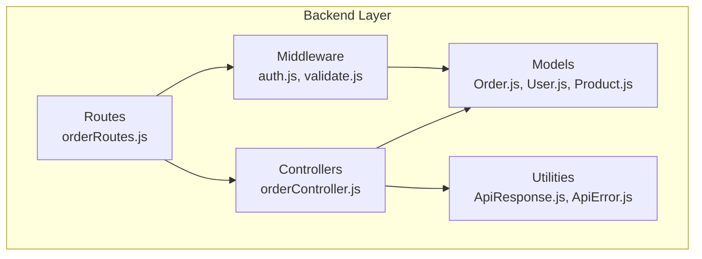
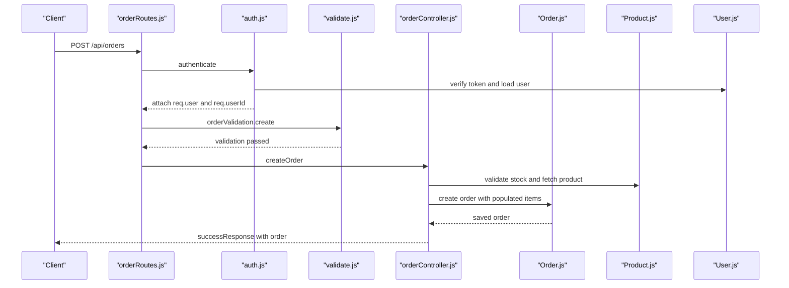
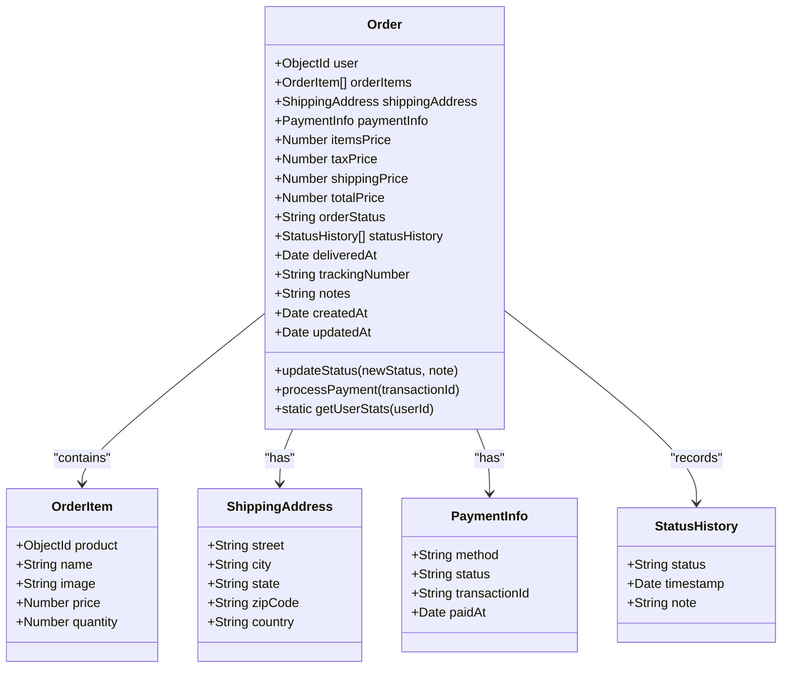
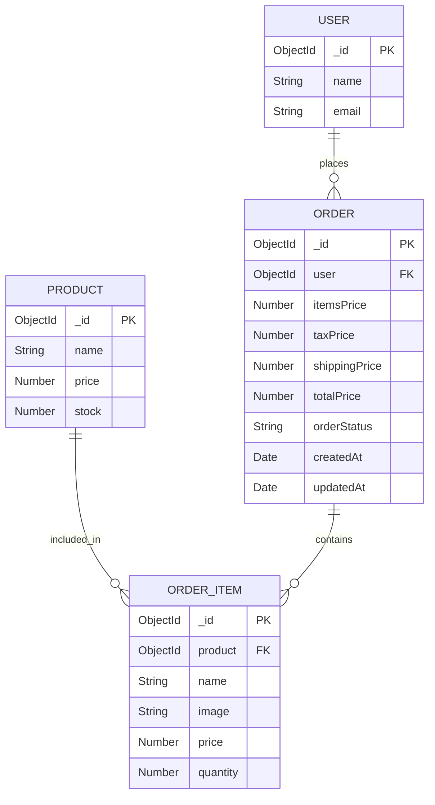
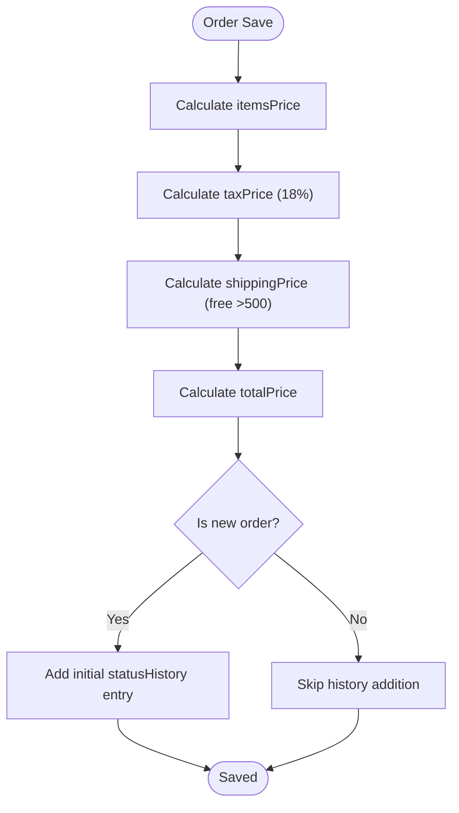
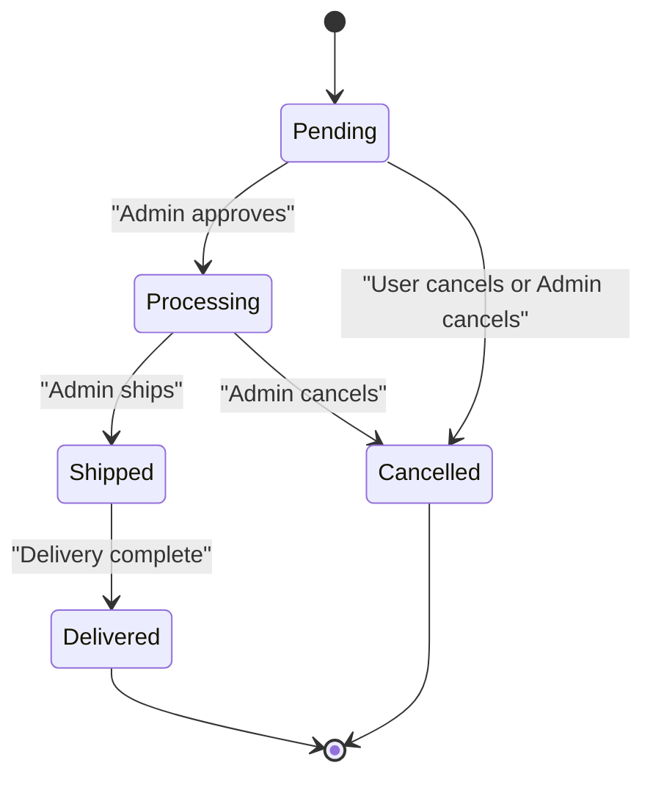
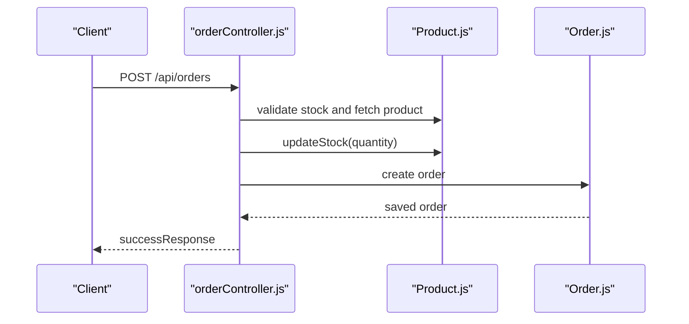
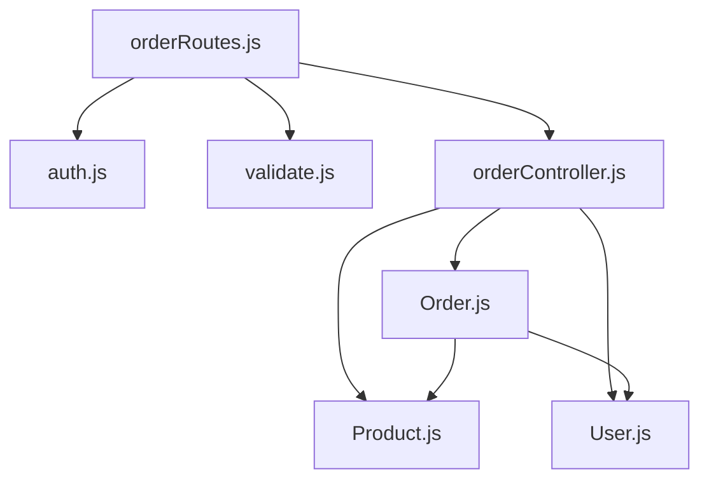

# Order Model

<cite>
**Referenced Files in This Document**
- [Order.js](file://backend/models/Order.js)
- [User.js](file://backend/models/User.js)
- [Product.js](file://backend/models/Product.js)
- [orderController.js](file://backend/controllers/orderController.js)
- [orderRoutes.js](file://backend/routes/orderRoutes.js)
- [validate.js](file://backend/middleware/validate.js)
- [auth.js](file://backend/middleware/auth.js)
- [db.js](file://backend/db/db.js)
- [ApiResponse.js](file://backend/utils/ApiResponse.js)
- [ApiError.js](file://backend/utils/ApiError.js)
</cite>

## Table of Contents
1. [Introduction](#introduction)
2. [Project Structure](#project-structure)
3. [Core Components](#core-components)
4. [Architecture Overview](#architecture-overview)
5. [Detailed Component Analysis](#detailed-component-analysis)
6. [Dependency Analysis](#dependency-analysis)
7. [Performance Considerations](#performance-considerations)
8. [Troubleshooting Guide](#troubleshooting-guide)
9. [Conclusion](#conclusion)
10. [Appendices](#appendices)

## Introduction
This document provides comprehensive data model documentation for the Order schema, detailing all field definitions, relationships with User and Product models, validation rules, status transitions, and business logic for order processing. It also covers lifecycle management, payment processing fields, shipping status tracking, fulfillment workflows, indexing strategies, and practical examples for order creation, status updates, and order history retrieval.

## Project Structure
The Order model is part of a layered architecture:
- Models define the data schema and business logic
- Controllers handle HTTP requests and orchestrate business operations
- Routes define the API endpoints
- Middleware enforces authentication, authorization, and validation
- Utilities standardize responses and error handling

**Diagram sources**
- [orderRoutes.js:1-77](file://backend/routes/orderRoutes.js#L1-L77)
- [orderController.js:1-358](file://backend/controllers/orderController.js#L1-L358)
- [Order.js:1-217](file://backend/models/Order.js#L1-L217)
- [User.js:1-135](file://backend/models/User.js#L1-L135)
- [Product.js:1-217](file://backend/models/Product.js#L1-L217)
- [auth.js:1-124](file://backend/middleware/auth.js#L1-L124)
- [validate.js:1-221](file://backend/middleware/validate.js#L1-L221)
- [ApiResponse.js:1-52](file://backend/utils/ApiResponse.js#L1-L52)
- [ApiError.js:1-21](file://backend/utils/ApiError.js#L1-L21)

**Section sources**
- [orderRoutes.js:1-77](file://backend/routes/orderRoutes.js#L1-L77)
- [orderController.js:1-358](file://backend/controllers/orderController.js#L1-L358)
- [Order.js:1-217](file://backend/models/Order.js#L1-L217)
- [User.js:1-135](file://backend/models/User.js#L1-L135)
- [Product.js:1-217](file://backend/models/Product.js#L1-L217)
- [auth.js:1-124](file://backend/middleware/auth.js#L1-L124)
- [validate.js:1-221](file://backend/middleware/validate.js#L1-L221)
- [ApiResponse.js:1-52](file://backend/utils/ApiResponse.js#L1-L52)
- [ApiError.js:1-21](file://backend/utils/ApiError.js#L1-L21)

## Core Components
This section defines the Order schema and its embedded structures, relationships, and core behaviors.

- Order schema fields
  - user: ObjectId referencing User; indexed for efficient user-specific queries
  - orderItems: Array of embedded orderItemSchema
  - shippingAddress: Embedded object with street, city, state, zipCode, country
  - paymentInfo: Embedded object with method, status, transactionId, paidAt
  - Pricing fields: itemsPrice, taxPrice, shippingPrice, totalPrice
  - orderStatus: Enumerated status with default 'pending'
  - statusHistory: Array of status transitions with timestamps and notes
  - deliveredAt: Timestamp when order reaches delivered status
  - trackingNumber: Optional tracking identifier
  - notes: Optional free-text note with character limit
  - Timestamps: createdAt and updatedAt managed automatically

- Embedded orderItemSchema fields
  - product: ObjectId referencing Product
  - name: Product name snapshot
  - image: Product image snapshot
  - price: Current price snapshot
  - quantity: Positive integer quantity

- Payment methods and statuses
  - Payment methods: card, upi, cod, wallet
  - Payment statuses: pending, completed, failed, refunded

- Order statuses and defaults
  - Statuses: pending, processing, shipped, delivered, cancelled
  - Default: pending

- Business logic
  - Pre-save middleware calculates pricing and maintains status history
  - Instance methods: updateStatus, processPayment
  - Static method: getUserStats aggregation

**Section sources**
- [Order.js:36-126](file://backend/models/Order.js#L36-L126)
- [Order.js:139-165](file://backend/models/Order.js#L139-L165)
- [Order.js:170-193](file://backend/models/Order.js#L170-L193)
- [Order.js:198-212](file://backend/models/Order.js#L198-L212)

## Architecture Overview
The Order model participates in a request-response flow orchestrated by routes, controllers, and middleware. Authentication and authorization ensure only authorized users can access orders, while validation ensures request integrity.

**Diagram sources**
- [orderRoutes.js:25](file://backend/routes/orderRoutes.js#L25)
- [auth.js:10-55](file://backend/middleware/auth.js#L10-L55)
- [validate.js:161-193](file://backend/middleware/validate.js#L161-L193)
- [orderController.js:17-69](file://backend/controllers/orderController.js#L17-L69)
- [Order.js:139-165](file://backend/models/Order.js#L139-L165)
- [Product.js:1-217](file://backend/models/Product.js#L1-L217)
- [User.js:1-135](file://backend/models/User.js#L1-L135)

## Detailed Component Analysis

### Order Schema and Embedded Documents
The Order schema encapsulates the complete order state and history. The embedded orderItemSchema stores product snapshots at the time of purchase, ensuring referential integrity even if product details change later.

**Diagram sources**
- [Order.js:36-126](file://backend/models/Order.js#L36-L126)

**Section sources**
- [Order.js:36-126](file://backend/models/Order.js#L36-L126)

### Relationships with User and Product
- User relationship
  - Order.user references User via ObjectId
  - A virtual property on User enables population of orders
  - Index on Order.user improves user-specific queries

- Product relationship
  - Each orderItem.product references Product via ObjectId
  - During order creation, product details are snapshotted into orderItems
  - Stock is decremented atomically during order creation

**Diagram sources**
- [Order.js:38-44](file://backend/models/Order.js#L38-L44)
- [Order.js:7-30](file://backend/models/Order.js#L7-L30)
- [User.js:77-81](file://backend/models/User.js#L77-L81)
- [Product.js:1-217](file://backend/models/Product.js#L1-L217)

**Section sources**
- [Order.js:38-44](file://backend/models/Order.js#L38-L44)
- [Order.js:7-30](file://backend/models/Order.js#L7-L30)
- [User.js:77-81](file://backend/models/User.js#L77-L81)
- [Product.js:1-217](file://backend/models/Product.js#L1-L217)

### Validation Rules and Business Logic
- Request validation (express-validator)
  - Order creation validates orderItems array, product IDs, quantities, and shippingAddress fields
  - Payment method must be one of card, upi, cod, wallet
  - Status updates validate status enum and order ID format

- Business logic
  - Pre-save middleware computes itemsPrice, taxPrice (18% GST), shippingPrice (free above 500, otherwise 50), and totalPrice
  - Maintains statusHistory with timestamps and notes
  - Sets deliveredAt when order reaches delivered status
  - Processes payment by updating paymentInfo fields and paidAt

**Diagram sources**
- [Order.js:139-165](file://backend/models/Order.js#L139-L165)

**Section sources**
- [validate.js:161-193](file://backend/middleware/validate.js#L161-L193)
- [Order.js:139-165](file://backend/models/Order.js#L139-L165)

### Status Transitions and Lifecycle Management
Order status transitions are enforced to ensure logical progression and prevent invalid state changes.

- Valid transitions
  - pending -> processing, cancelled
  - processing -> shipped, cancelled
  - shipped -> delivered
  - delivered, cancelled are terminal states

- Lifecycle events
  - Creation adds initial statusHistory entry
  - Status updates append entries with timestamps and notes
  - delivered sets deliveredAt timestamp

**Section sources**
- [orderController.js:189-202](file://backend/controllers/orderController.js#L189-L202)
- [Order.js:170-183](file://backend/models/Order.js#L170-L183)

### Payment Processing Fields and Workflows
- Payment fields
  - method: card, upi, cod, wallet
  - status: pending, completed, failed, refunded
  - transactionId: optional identifier
  - paidAt: timestamp when payment completes

- Workflows
  - Admin can set payment status to completed and record transactionId and paidAt
  - Other payment statuses can be set independently

**Section sources**
- [Order.js:52-71](file://backend/models/Order.js#L52-L71)
- [orderController.js:214-232](file://backend/controllers/orderController.js#L214-L232)

### Fulfillment Workflows
- Order creation
  - Validates product existence and stock availability
  - Snapshots product details into orderItems
  - Decrements product stock
  - Creates order with calculated pricing

- Cancellation
  - Users can cancel pending or processing orders
  - Restocks items by incrementing product stock
  - Updates status to cancelled

**Diagram sources**
- [orderController.js:17-69](file://backend/controllers/orderController.js#L17-L69)
- [Product.js:208-212](file://backend/models/Product.js#L208-L212)
- [Order.js:139-165](file://backend/models/Order.js#L139-L165)

**Section sources**
- [orderController.js:17-69](file://backend/controllers/orderController.js#L17-L69)
- [Product.js:208-212](file://backend/models/Product.js#L208-L212)

### Indexing Strategies for Queries
Indexes optimize common query patterns:
- user + createdAt: sorts user orders by recency
- orderStatus: filters by order status
- paymentInfo.status: filters by payment status
- createdAt: sorts by newest

These indexes support:
- Retrieving a user's order history efficiently
- Filtering orders by status or payment status
- Sorting orders by creation time

**Section sources**
- [Order.js:131-134](file://backend/models/Order.js#L131-L134)

### Examples

#### Example 1: Order Creation
- Endpoint: POST /api/orders
- Authentication: Required (user token)
- Validation: orderItems, shippingAddress, paymentInfo.method
- Behavior:
  - Validates product stock and existence
  - Snapshots product details into orderItems
  - Decrements product stock
  - Calculates pricing and creates order
- Response: successResponse with created order

**Section sources**
- [orderRoutes.js:25](file://backend/routes/orderRoutes.js#L25)
- [validate.js:161-193](file://backend/middleware/validate.js#L161-L193)
- [orderController.js:17-69](file://backend/controllers/orderController.js#L17-L69)

#### Example 2: Status Update
- Endpoint: PUT /api/orders/:id/status
- Authentication: Required (admin)
- Validation: order ID and status
- Behavior:
  - Validates status transition against allowed transitions
  - Updates orderStatus and appends statusHistory
  - Sets deliveredAt if status becomes delivered
- Response: successResponse with updated order

**Section sources**
- [orderRoutes.js:53](file://backend/routes/orderRoutes.js#L53)
- [validate.js:195-205](file://backend/middleware/validate.js#L195-L205)
- [orderController.js:178-207](file://backend/controllers/orderController.js#L178-L207)

#### Example 3: Order History Retrieval
- Endpoint: GET /api/orders/my-orders
- Authentication: Required (user)
- Behavior:
  - Retrieves orders for the authenticated user
  - Populates product details for order items
  - Paginates results
- Response: successResponse with orders and pagination metadata

**Section sources**
- [orderRoutes.js:32](file://backend/routes/orderRoutes.js#L32)
- [orderController.js:125-147](file://backend/controllers/orderController.js#L125-L147)

## Dependency Analysis
The Order model depends on Product and User models for referential integrity and on middleware for authentication, authorization, and validation.

**Diagram sources**
- [Order.js:38-44](file://backend/models/Order.js#L38-L44)
- [orderController.js:1-6](file://backend/controllers/orderController.js#L1-L6)
- [orderRoutes.js:16-18](file://backend/routes/orderRoutes.js#L16-L18)
- [auth.js:1-5](file://backend/middleware/auth.js#L1-L5)
- [validate.js:1-2](file://backend/middleware/validate.js#L1-L2)

**Section sources**
- [Order.js:38-44](file://backend/models/Order.js#L38-L44)
- [orderController.js:1-6](file://backend/controllers/orderController.js#L1-L6)
- [orderRoutes.js:16-18](file://backend/routes/orderRoutes.js#L16-L18)
- [auth.js:1-5](file://backend/middleware/auth.js#L1-L5)
- [validate.js:1-2](file://backend/middleware/validate.js#L1-L2)

## Performance Considerations
- Index usage
  - Ensure queries leverage user + createdAt, orderStatus, paymentInfo.status, and createdAt indexes
  - Use projection to limit populated fields when retrieving orders

- Aggregation efficiency
  - Use targeted match conditions to reduce aggregation scope
  - Consider caching frequently accessed order statistics

- Population strategies
  - Populate only necessary fields to minimize payload size
  - Use lean queries for read-heavy operations

[No sources needed since this section provides general guidance]

## Troubleshooting Guide
Common issues and resolutions:
- Validation failures
  - Cause: Invalid orderItems, missing shippingAddress fields, or invalid payment method
  - Resolution: Review orderValidation rules and ensure request payload conforms to schema

- Authorization errors
  - Cause: Missing or invalid token, unauthorized access to another user's order
  - Resolution: Verify authentication middleware and route protection

- Stock-related errors
  - Cause: Insufficient product stock during order creation
  - Resolution: Check product stock before placing orders or adjust inventory policies

- Status transition errors
  - Cause: Attempting invalid status change
  - Resolution: Follow allowed transitions and ensure orderStatus matches expected state

**Section sources**
- [validate.js:161-193](file://backend/middleware/validate.js#L161-L193)
- [auth.js:10-55](file://backend/middleware/auth.js#L10-L55)
- [orderController.js:24-36](file://backend/controllers/orderController.js#L24-L36)
- [orderController.js:189-202](file://backend/controllers/orderController.js#L189-L202)

## Conclusion
The Order model provides a robust foundation for e-commerce order management, integrating user and product references, comprehensive validation, strict status transitions, and efficient indexing. Its embedded design ensures historical accuracy, while instance and static methods encapsulate business logic for payment processing, status updates, and analytics.

## Appendices

### API Endpoints Reference
- POST /api/orders: Create order (requires authentication)
- GET /api/orders/my-orders: Retrieve user's orders (requires authentication)
- GET /api/orders/stats/overview: Get order statistics (admin only)
- GET /api/orders/:id: Get order by ID (requires authentication)
- PUT /api/orders/:id/status: Update order status (admin only)
- PUT /api/orders/:id/payment: Update payment status (admin only)
- PUT /api/orders/:id/cancel: Cancel order (requires authentication)
- GET /api/orders: List all orders (admin only)

**Section sources**
- [orderRoutes.js:25-74](file://backend/routes/orderRoutes.js#L25-L74)