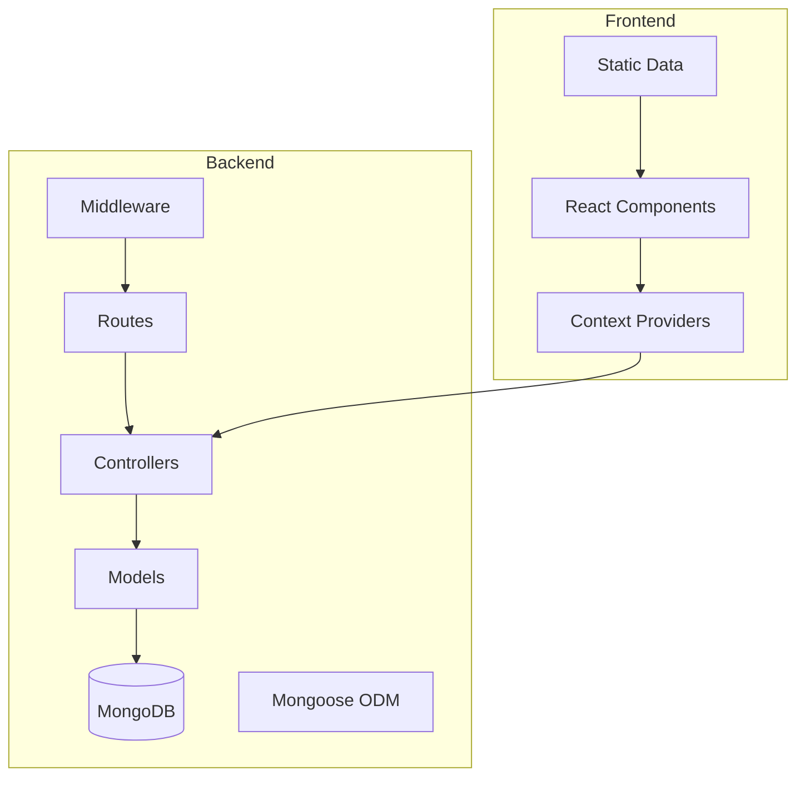
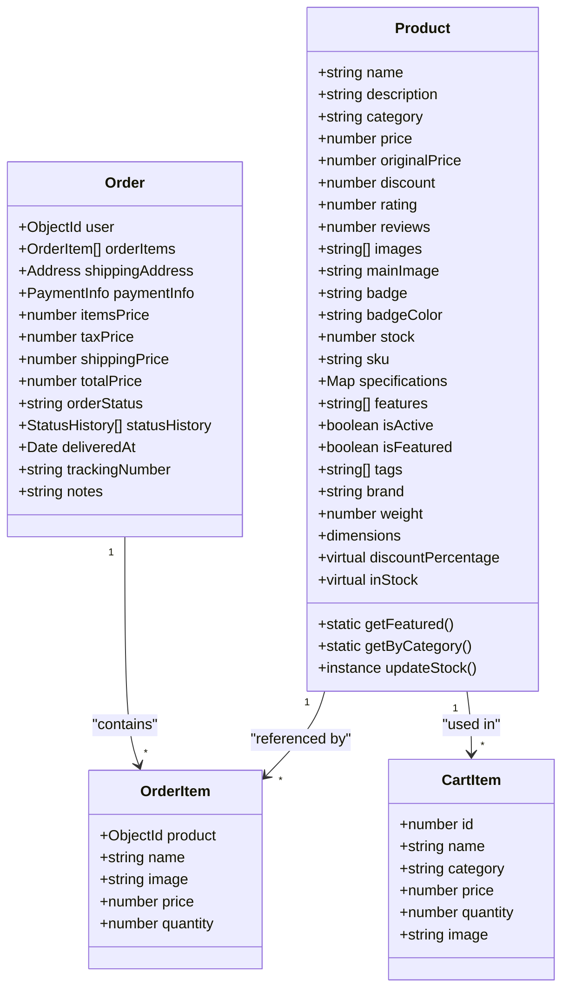
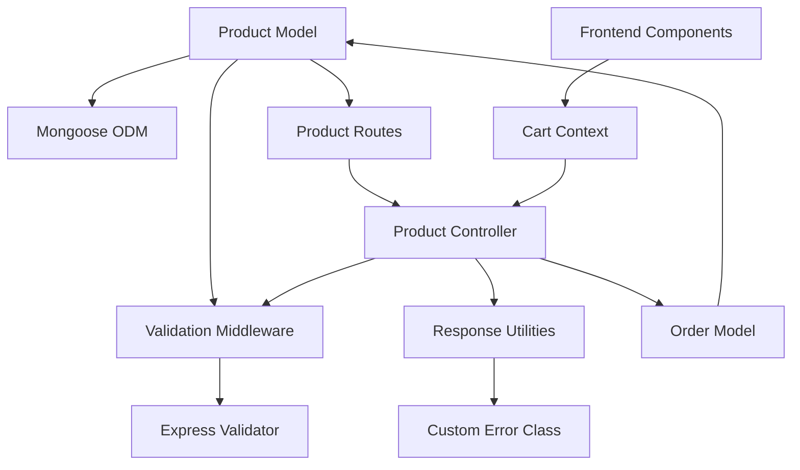

# Product Model

<cite>
**Referenced Files in This Document**
- [Product.js](file://backend/models/Product.js)
- [productController.js](file://backend/controllers/productController.js)
- [productRoutes.js](file://backend/routes/productRoutes.js)
- [validate.js](file://backend/middleware/validate.js)
- [Order.js](file://backend/models/Order.js)
- [orderController.js](file://backend/controllers/orderController.js)
- [CartContext.jsx](file://src/context/CartContext.jsx)
- [Cart.jsx](file://src/components/Cart/Cart.jsx)
- [ProductCard.jsx](file://src/components/ProductCard/ProductCard.jsx)
- [products.js](file://src/data/products.js)
- [db.js](file://backend/db/db.js)
- [index.js](file://backend/index.js)
</cite>

## Table of Contents
1. [Introduction](#introduction)
2. [Project Structure](#project-structure)
3. [Core Components](#core-components)
4. [Architecture Overview](#architecture-overview)
5. [Detailed Component Analysis](#detailed-component-analysis)
6. [Dependency Analysis](#dependency-analysis)
7. [Performance Considerations](#performance-considerations)
8. [Troubleshooting Guide](#troubleshooting-guide)
9. [Conclusion](#conclusion)

## Introduction
This document provides comprehensive data model documentation for the Product schema in an e-commerce application. It covers field definitions, validation rules, constraints, data types, categorization strategies, pricing mechanisms, inventory management, search optimization, and business logic for product availability. Additionally, it explains relationships with orders and cart items, and provides practical examples for product creation, search queries, filtering operations, and inventory updates.

## Project Structure
The Product model is part of a full-stack e-commerce application with separate frontend and backend layers. The backend implements a RESTful API using Express.js and MongoDB/Mongoose, while the frontend provides React components for product display and cart management.

**Diagram sources**
- [index.js:1-119](file://backend/index.js#L1-L119)
- [db.js:1-37](file://backend/db/db.js#L1-L37)

**Section sources**
- [index.js:1-119](file://backend/index.js#L1-L119)
- [db.js:1-37](file://backend/db/db.js#L1-L37)

## Core Components
The Product model defines the schema for product documents stored in MongoDB. It includes essential product attributes, pricing and inventory fields, categorization, metadata, and business logic for stock management and search optimization.

Key aspects of the Product model:
- Complete product information storage with validation constraints
- Pricing strategies with original price, discount, and calculated discount percentage
- Inventory management with stock tracking and availability checks
- Categorization system with predefined categories and indexing
- Metadata fields for badges, specifications, and features
- Search optimization through text indexes and composite indexes
- Business logic for SKU generation and stock updates

**Section sources**
- [Product.js:1-217](file://backend/models/Product.js#L1-L217)

## Architecture Overview
The Product model integrates with the broader e-commerce architecture through several key relationships:

**Diagram sources**
- [Product.js:1-217](file://backend/models/Product.js#L1-L217)
- [Order.js:1-217](file://backend/models/Order.js#L1-L217)
- [CartContext.jsx:1-62](file://src/context/CartContext.jsx#L1-L62)

**Section sources**
- [Product.js:1-217](file://backend/models/Product.js#L1-L217)
- [Order.js:1-217](file://backend/models/Order.js#L1-L217)
- [CartContext.jsx:1-62](file://src/context/CartContext.jsx#L1-L62)

## Detailed Component Analysis

### Product Schema Definition
The Product schema defines comprehensive field definitions with strict validation rules and constraints:

#### Core Identity Fields
- **name**: String, required, trimmed, max 100 characters
- **description**: String, required, max 2000 characters
- **category**: String, required, enum validation with predefined categories
- **sku**: String, unique with sparse index, auto-generated if not provided

#### Pricing and Discount System
- **price**: Number, required, non-negative
- **originalPrice**: Number, nullable, non-negative
- **discount**: Number, 0-100%, default 0
- **Virtual discountPercentage**: Calculated based on originalPrice and price

#### Inventory Management
- **stock**: Number, required, non-negative, default 0
- **Virtual inStock**: Boolean check for stock > 0
- **updateStock()**: Instance method to decrement stock safely

#### Quality Metrics
- **rating**: Number, 0-5, default 0
- **reviews**: Number, non-negative, default 0

#### Media and Presentation
- **images**: Array of strings, required at least one
- **mainImage**: String, required
- **badge**: Enum with predefined values, nullable
- **badgeColor**: String, nullable

#### Additional Attributes
- **specifications**: Map of string key-value pairs
- **features**: Array of strings
- **tags**: Array of strings
- **brand**: String, nullable
- **weight**: Number, nullable
- **dimensions**: Embedded object with length, width, height

**Section sources**
- [Product.js:8-125](file://backend/models/Product.js#L8-L125)

### Validation Rules and Constraints
The Product model implements comprehensive validation at both schema and middleware levels:

#### Schema-Level Validation
- Required field enforcement with custom error messages
- Type constraints and numeric bounds
- Enum validation for categorical fields
- Array validation for media collections

#### Middleware-Level Validation
- Express-validator integration for API requests
- Parameter validation for ID-based routes
- Query parameter validation for filtering
- Body validation for create/update operations

#### Business Logic Validation
- Stock availability checks during order processing
- Price validation ensuring non-negative values
- Category enumeration validation
- Image URL validation

**Section sources**
- [Product.js:10-125](file://backend/models/Product.js#L10-L125)
- [validate.js:72-156](file://backend/middleware/validate.js#L72-L156)

### Indexing Strategies for Search Optimization
The Product model implements strategic indexing for optimal query performance:

#### Text Search Index
- Composite text index on name and description for full-text search
- Enables efficient product discovery through natural language queries

#### Category and Price Index
- Compound index on category and price for filtered browsing
- Supports category-based navigation and price-range queries

#### Performance-Optimized Indexes
- Rating index for sorting by popularity
- Featured product index for promotional displays
- Creation timestamp index for chronological sorting

#### Search Implementation
- Text search queries using MongoDB's text search capabilities
- Combined with active status filtering for relevant results
- Score-based sorting for search relevance

**Section sources**
- [Product.js:147-151](file://backend/models/Product.js#L147-L151)
- [productController.js:55-58](file://backend/controllers/productController.js#L55-L58)

### Pricing Strategies and Business Logic
The Product model implements sophisticated pricing logic:

#### Discount Calculation
- Automatic discount percentage calculation from originalPrice and price
- Fallback to explicit discount field when originalPrice unavailable
- Rounded percentage values for display consistency

#### Availability Logic
- Virtual inStock property for real-time availability checks
- Stock validation during order processing
- Prevents overselling through stock decrement logic

#### SKU Generation
- Auto-generation of unique identifiers if not provided
- Category-based prefix for logical organization
- Timestamp and random suffix for uniqueness

**Section sources**
- [Product.js:130-142](file://backend/models/Product.js#L130-L142)
- [Product.js:156-164](file://backend/models/Product.js#L156-L164)

### Inventory Management Operations
The Product model provides robust inventory management capabilities:

#### Stock Updates
- Safe decrement operation preventing negative stock
- Validation bypass for internal operations
- Automatic stock floor protection at 0

#### Bulk Operations
- Category-based filtering for bulk inventory management
- Price range filtering for promotional adjustments
- Featured product management for marketing campaigns

#### Integration with Orders
- Real-time stock validation during order placement
- Automatic stock deduction upon successful purchase
- Availability notifications for low stock scenarios

**Section sources**
- [Product.js:208-212](file://backend/models/Product.js#L208-L212)
- [orderController.js:31-36](file://backend/controllers/orderController.js#L31-L36)

### Relationships with Orders and Cart Items
The Product model participates in two critical business relationships:

#### Order Integration
- Embedded order items reference Product documents
- Price locking through product price capture
- Stock validation prevents overselling
- Historical pricing preserved for order records

#### Cart Integration
- Frontend cart stores product data locally
- Quantity management for shopping cart operations
- Real-time price calculations and updates
- Wishlist functionality for product favorites

**Section sources**
- [Order.js:7-30](file://backend/models/Order.js#L7-L30)
- [CartContext.jsx:9-32](file://src/context/CartContext.jsx#L9-L32)

### API Endpoints and Usage Patterns
The Product model exposes comprehensive API functionality:

#### CRUD Operations
- Create, read, update, and soft-delete product records
- Admin-only access for modification operations
- Validation enforced at multiple layers

#### Advanced Queries
- Category-based filtering with price ranges
- Text search with relevance scoring
- Featured product retrieval
- Category aggregation with statistics

#### Filtering and Sorting
- Multi-field filtering with category, price, and badge
- Flexible sorting by various product attributes
- Pagination support for large result sets
- Dynamic query parameter validation

**Section sources**
- [productController.js:16-85](file://backend/controllers/productController.js#L16-L85)
- [productController.js:141-172](file://backend/controllers/productController.js#L141-L172)
- [productController.js:295-326](file://backend/controllers/productController.js#L295-L326)

## Dependency Analysis

**Diagram sources**
- [Product.js:1-217](file://backend/models/Product.js#L1-L217)
- [validate.js:1-221](file://backend/middleware/validate.js#L1-L221)
- [productController.js:1-341](file://backend/controllers/productController.js#L1-L341)
- [Order.js:1-217](file://backend/models/Order.js#L1-L217)

**Section sources**
- [Product.js:1-217](file://backend/models/Product.js#L1-L217)
- [validate.js:1-221](file://backend/middleware/validate.js#L1-L221)
- [productController.js:1-341](file://backend/controllers/productController.js#L1-L341)

## Performance Considerations
The Product model implements several performance optimization strategies:

### Database Indexing
- Strategic compound indexes for common query patterns
- Text search index for efficient product discovery
- Sparse indexes for optional fields like SKU
- TTL indexes for temporary promotions (conceptual)

### Query Optimization
- Projection-based queries to minimize data transfer
- Aggregation pipelines for complex analytics
- Efficient pagination with skip/take patterns
- Selective field retrieval for list views

### Memory Management
- Virtual properties computed on-demand
- Lazy evaluation for expensive calculations
- Efficient array operations for media collections
- Minimal memory footprint for static data

### Caching Opportunities
- Category aggregation results caching
- Featured product lists caching
- Search result caching for popular queries
- Price calculation caching for repeated operations

## Troubleshooting Guide

### Common Validation Errors
- **Missing required fields**: Ensure all mandatory fields are provided
- **Invalid category values**: Use only predefined categories
- **Negative numeric values**: Verify price, stock, and rating constraints
- **URL validation failures**: Confirm image URLs are accessible

### Stock Management Issues
- **Insufficient stock errors**: Verify product availability before purchase
- **Negative stock values**: Check for concurrent access issues
- **Stock synchronization**: Monitor inventory updates across sessions

### Search and Filtering Problems
- **Text search failures**: Ensure proper text index configuration
- **Category filtering issues**: Verify category enumeration values
- **Price range queries**: Check numeric validation and bounds

### API Integration Challenges
- **Authentication failures**: Verify admin credentials for protected endpoints
- **Request payload validation**: Ensure proper JSON structure
- **Response parsing**: Handle pagination and error response formats

**Section sources**
- [validate.js:12-25](file://backend/middleware/validate.js#L12-L25)
- [orderController.js:31-36](file://backend/controllers/orderController.js#L31-L36)

## Conclusion
The Product model provides a comprehensive foundation for e-commerce product management with robust validation, flexible pricing strategies, and efficient search capabilities. Its integration with orders and cart systems ensures seamless commerce operations, while strategic indexing and validation rules guarantee performance and data integrity. The model's extensible design accommodates future enhancements while maintaining backward compatibility and operational reliability.

The combination of schema-level constraints, middleware validation, and business logic creates a resilient system that handles complex e-commerce scenarios efficiently. The clear separation of concerns between models, controllers, and routes enables maintainable code organization and facilitates future development efforts.