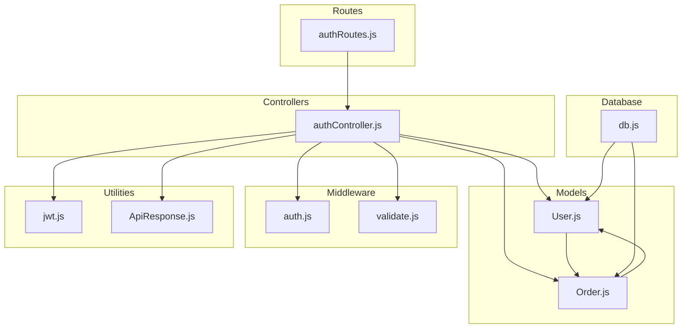
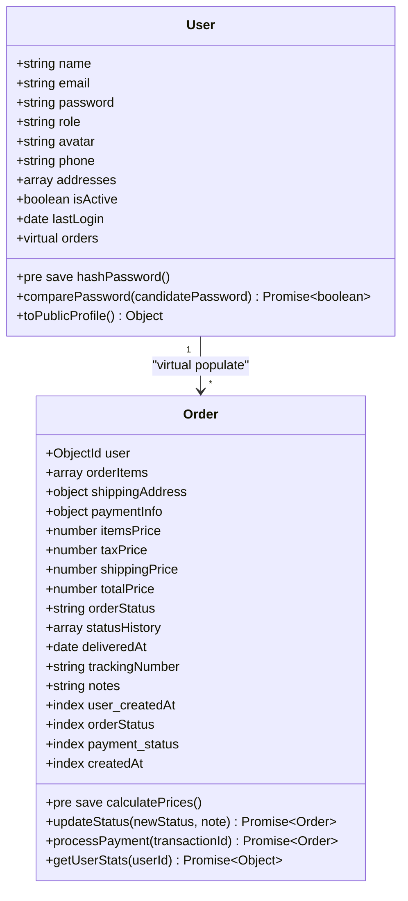
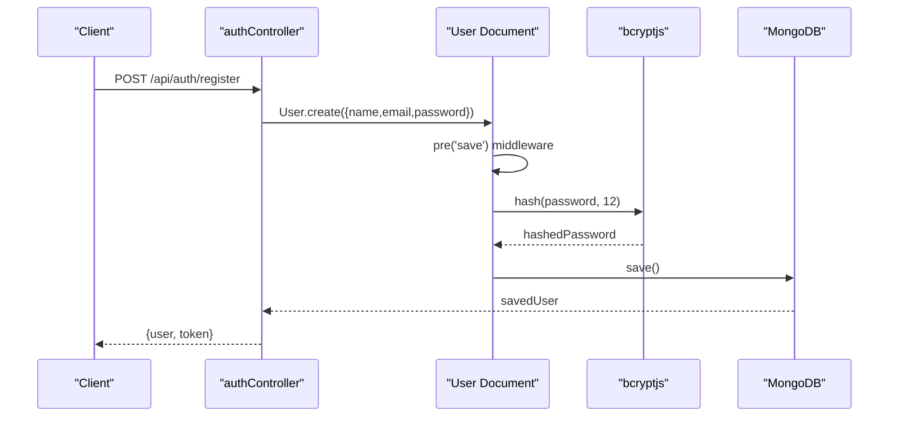
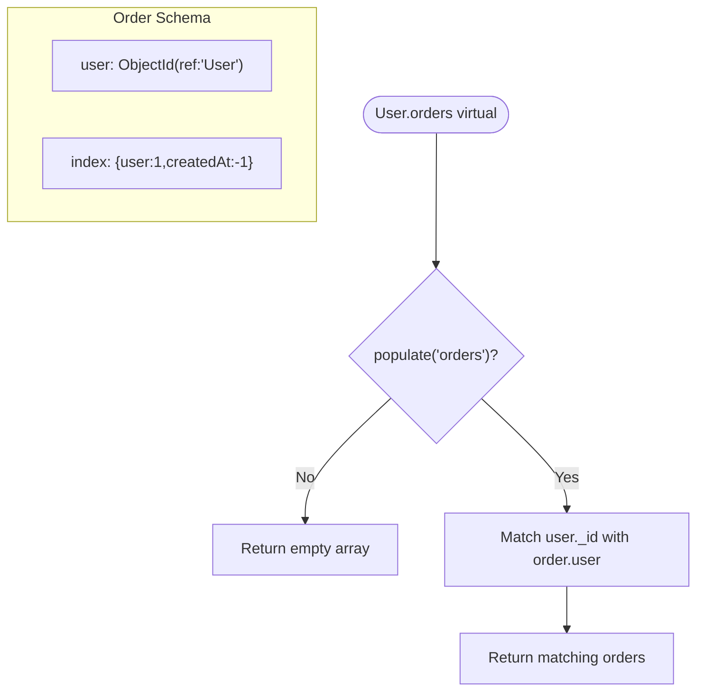
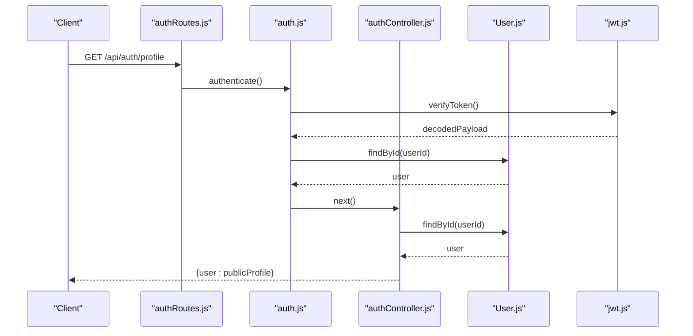
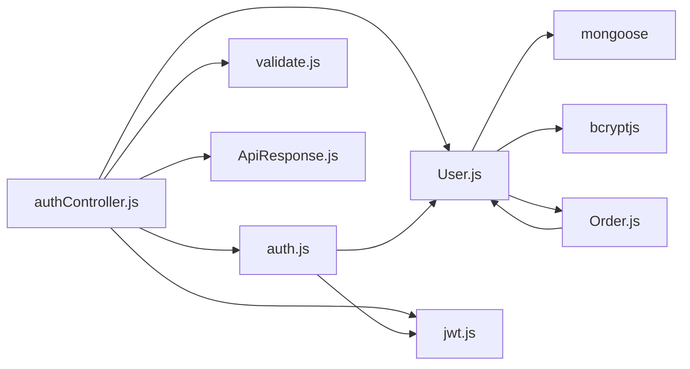

# User Model

<cite>
**Referenced Files in This Document**
- [User.js](file://backend/models/User.js)
- [Order.js](file://backend/models/Order.js)
- [authController.js](file://backend/controllers/authController.js)
- [auth.js](file://backend/middleware/auth.js)
- [validate.js](file://backend/middleware/validate.js)
- [jwt.js](file://backend/utils/jwt.js)
- [db.js](file://backend/db/db.js)
- [authRoutes.js](file://backend/routes/authRoutes.js)
- [ApiResponse.js](file://backend/utils/ApiResponse.js)
</cite>

## Table of Contents
1. [Introduction](#introduction)
2. [Project Structure](#project-structure)
3. [Core Components](#core-components)
4. [Architecture Overview](#architecture-overview)
5. [Detailed Component Analysis](#detailed-component-analysis)
6. [Dependency Analysis](#dependency-analysis)
7. [Performance Considerations](#performance-considerations)
8. [Troubleshooting Guide](#troubleshooting-guide)
9. [Conclusion](#conclusion)

## Introduction
This document provides comprehensive data model documentation for the User schema in a full-stack e-commerce application. It covers field definitions, validation rules, constraints, data types, security measures, indexing strategies, and business rules. It also explains the virtual relationship with the Orders collection and demonstrates practical usage patterns for user creation, profile updates, and query operations.

## Project Structure
The User model is part of the backend models layer and integrates with controllers, middleware, and utilities to provide a secure and scalable authentication system.

**Diagram sources**
- [User.js:1-135](file://backend/models/User.js#L1-L135)
- [Order.js:1-217](file://backend/models/Order.js#L1-L217)
- [authController.js:1-299](file://backend/controllers/authController.js#L1-L299)
- [auth.js:1-124](file://backend/middleware/auth.js#L1-L124)
- [validate.js:1-221](file://backend/middleware/validate.js#L1-L221)
- [jwt.js:1-49](file://backend/utils/jwt.js#L1-L49)
- [db.js:1-37](file://backend/db/db.js#L1-L37)
- [authRoutes.js:1-85](file://backend/routes/authRoutes.js#L1-L85)
- [ApiResponse.js:1-52](file://backend/utils/ApiResponse.js#L1-L52)

**Section sources**
- [User.js:1-135](file://backend/models/User.js#L1-L135)
- [Order.js:1-217](file://backend/models/Order.js#L1-L217)
- [authController.js:1-299](file://backend/controllers/authController.js#L1-L299)
- [auth.js:1-124](file://backend/middleware/auth.js#L1-L124)
- [validate.js:1-221](file://backend/middleware/validate.js#L1-L221)
- [jwt.js:1-49](file://backend/utils/jwt.js#L1-L49)
- [db.js:1-37](file://backend/db/db.js#L1-L37)
- [authRoutes.js:1-85](file://backend/routes/authRoutes.js#L1-L85)
- [ApiResponse.js:1-52](file://backend/utils/ApiResponse.js#L1-L52)

## Core Components
This section documents the User schema fields, validation rules, constraints, and data types.

- **name**
  - Type: String
  - Required: Yes
  - Constraints: Minimum length 2, Maximum length 50
  - Behavior: Trimmed automatically
  - Validation: Enforced by schema definition and controller validation

- **email**
  - Type: String
  - Required: Yes
  - Constraints: Unique, Lowercase, Trimmed
  - Pattern: Email regex validation
  - Validation: Enforced by schema definition and controller validation

- **password**
  - Type: String
  - Required: Yes
  - Constraints: Minimum length 8
  - Security: Not selected by default in queries (select: false)
  - Validation: Enforced by schema definition and controller validation

- **role**
  - Type: String
  - Enum: user, admin
  - Default: user
  - Business rule: Controls access permissions

- **avatar**
  - Type: String
  - Default: null
  - Optional: Supports profile image URL

- **phone**
  - Type: String
  - Default: null
  - Behavior: Trimmed

- **addresses** (Array of embedded documents)
  - Fields:
    - street: String, Required
    - city: String, Required
    - state: String, Required
    - zipCode: String, Required
    - country: String, Default: 'India'
    - isDefault: Boolean, Default: false
  - Business rule: Only one default address per user

- **isActive**
  - Type: Boolean
  - Default: true
  - Security: Deactivates accounts without deletion

- **lastLogin**
  - Type: Date
  - Default: null
  - Purpose: Tracks user activity

- **Timestamps**
  - createdAt: Automatically managed
  - updatedAt: Automatically managed

**Section sources**
- [User.js:8-72](file://backend/models/User.js#L8-L72)
- [User.js:108-130](file://backend/models/User.js#L108-L130)
- [validate.js:30-67](file://backend/middleware/validate.js#L30-L67)

## Architecture Overview
The User model participates in a virtual populate relationship with the Orders collection, enabling efficient retrieval of user orders without embedding large arrays. The system enforces security through middleware, password hashing, and selective field querying.

**Diagram sources**
- [User.js:77-81](file://backend/models/User.js#L77-L81)
- [Order.js:129-134](file://backend/models/Order.js#L129-L134)

**Section sources**
- [User.js:77-81](file://backend/models/User.js#L77-L81)
- [Order.js:129-134](file://backend/models/Order.js#L129-L134)

## Detailed Component Analysis

### Field Definitions and Validation Rules
The User schema enforces strict validation at both the schema and controller levels:

- **Schema-level validations**:
  - Length constraints for name and password
  - Email format validation
  - Unique constraint on email
  - Enum validation for role
  - Selective field querying for password

- **Controller-level validations**:
  - express-validator middleware for registration and login
  - Additional business rule checks (account activation, duplicate detection)

**Section sources**
- [User.js:10-66](file://backend/models/User.js#L10-L66)
- [validate.js:30-67](file://backend/middleware/validate.js#L30-L67)
- [authController.js:17-47](file://backend/controllers/authController.js#L17-L47)

### Password Hashing Middleware Implementation
The User model implements pre-save middleware to hash passwords before saving:

**Diagram sources**
- [User.js:92-103](file://backend/models/User.js#L92-L103)
- [authController.js:27-46](file://backend/controllers/authController.js#L27-L46)

Key implementation details:
- Hash only when password is modified
- Salt rounds: 12
- Error handling in middleware
- Password field excluded from default queries

**Section sources**
- [User.js:92-103](file://backend/models/User.js#L92-L103)

### Instance Methods
The User model provides two essential instance methods:

- **comparePassword(candidatePassword)**:
  - Compares provided password with stored hash
  - Returns Promise<boolean>
  - Used during login and password change operations

- **toPublicProfile()**:
  - Returns sanitized user object
  - Excludes sensitive fields (password, internal IDs)
  - Includes profile-relevant fields for API responses

**Section sources**
- [User.js:110-112](file://backend/models/User.js#L110-L112)
- [User.js:118-130](file://backend/models/User.js#L118-L130)

### Virtual Relationship with Orders Collection
The User model defines a virtual populated relationship with the Orders collection:

**Diagram sources**
- [User.js:77-81](file://backend/models/User.js#L77-L81)
- [Order.js:38-43](file://backend/models/Order.js#L38-L43)
- [Order.js:131](file://backend/models/Order.js#L131)

Implementation details:
- Local field: _id
- Foreign field: user
- Reference: Order model
- Population requires explicit call

**Section sources**
- [User.js:77-81](file://backend/models/User.js#L77-L81)
- [Order.js:38-43](file://backend/models/Order.js#L38-L43)

### Address Management Business Rules
The User model supports multiple addresses with specific business rules:

- **Default address management**:
  - Only one default address per user
  - Setting new default removes default flag from others
  - Validation ensures consistent state

- **Address structure**:
  - Required fields: street, city, state, zipCode
  - Optional: country (defaults to 'India'), isDefault (defaults to false)

**Section sources**
- [authController.js:181-186](file://backend/controllers/authController.js#L181-L186)
- [authController.js:226-231](file://backend/controllers/authController.js#L226-L231)
- [User.js:48-57](file://backend/models/User.js#L48-L57)

### Authentication and Authorization Flow
The User model integrates with middleware for authentication and authorization:

**Diagram sources**
- [authRoutes.js:40](file://backend/routes/authRoutes.js#L40)
- [auth.js:10-55](file://backend/middleware/auth.js#L10-L55)
- [authController.js:101-111](file://backend/controllers/authController.js#L101-L111)
- [jwt.js:27-29](file://backend/utils/jwt.js#L27-L29)

**Section sources**
- [authRoutes.js:40](file://backend/routes/authRoutes.js#L40)
- [auth.js:10-55](file://backend/middleware/auth.js#L10-L55)
- [authController.js:101-111](file://backend/controllers/authController.js#L101-L111)
- [jwt.js:27-29](file://backend/utils/jwt.js#L27-L29)

## Dependency Analysis
The User model has clear dependencies and relationships:

**Diagram sources**
- [User.js:1-2](file://backend/models/User.js#L1-L2)
- [authController.js:1-6](file://backend/controllers/authController.js#L1-L6)
- [auth.js:1-4](file://backend/middleware/auth.js#L1-L4)

Key dependencies:
- mongoose for schema definition and virtuals
- bcryptjs for password hashing
- express-validator for input validation
- jsonwebtoken for JWT operations

**Section sources**
- [User.js:1-2](file://backend/models/User.js#L1-L2)
- [authController.js:1-6](file://backend/controllers/authController.js#L1-L6)
- [auth.js:1-4](file://backend/middleware/auth.js#L1-L4)

## Performance Considerations
The User model implements several indexing strategies for optimal query performance:

- **Single-field indexes**:
  - email: 1 (unique index)
  - role: 1 (for role-based filtering)

- **Compound indexes**:
  - user + createdAt: 1,-1 (orders sorting by date)

- **Additional indexes**:
  - orderStatus: 1 (status filtering)
  - paymentInfo.status: 1 (payment status filtering)
  - createdAt: -1 (newest orders)

Security measures:
- Password field excluded from default queries (select: false)
- Explicit password selection only when needed
- Token-based authentication with middleware verification

**Section sources**
- [User.js:86-87](file://backend/models/User.js#L86-L87)
- [Order.js:131-134](file://backend/models/Order.js#L131-L134)
- [authController.js:58](file://backend/controllers/authController.js#L58)
- [authController.js:147](file://backend/controllers/authController.js#L147)

## Troubleshooting Guide

### Common Issues and Solutions

**Password Hashing Failures**
- Symptom: Users cannot log in after registration
- Cause: Password not hashed or middleware error
- Solution: Check bcrypt hash function and error handling in pre-save middleware

**Virtual Populate Issues**
- Symptom: User.orders returns empty array
- Cause: Missing populate('orders') call
- Solution: Ensure explicit population when accessing orders

**Address Management Problems**
- Symptom: Multiple default addresses set
- Cause: Missing default address cleanup logic
- Solution: Implement proper default address management in controllers

**Authentication Failures**
- Symptom: 401 Unauthorized errors
- Cause: Invalid tokens, deactivated accounts, or missing middleware
- Solution: Verify JWT secret, check user isActive flag, ensure middleware chain

**Section sources**
- [User.js:92-103](file://backend/models/User.js#L92-L103)
- [authController.js:181-186](file://backend/controllers/authController.js#L181-L186)
- [auth.js:37-39](file://backend/middleware/auth.js#L37-L39)

## Conclusion
The User model provides a robust foundation for user management in the e-commerce platform. Its design emphasizes security through password hashing, selective field querying, and middleware-based authentication. The virtual relationship with Orders enables efficient order retrieval while maintaining data integrity. The comprehensive validation rules and business logic ensure data consistency and support the application's operational requirements.