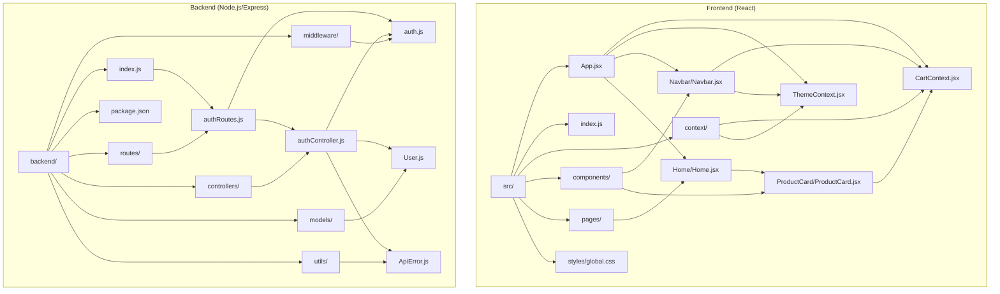
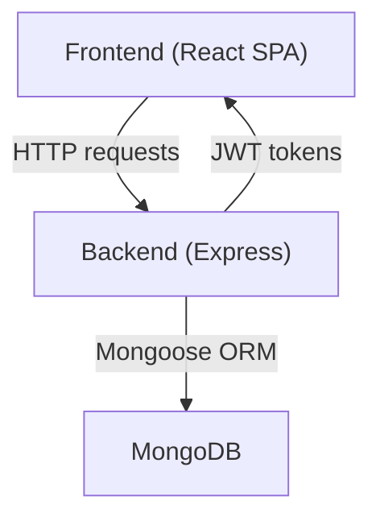
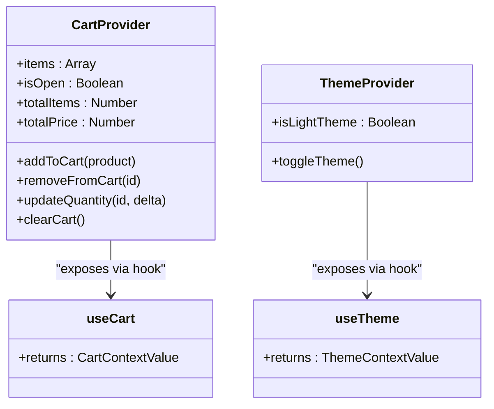
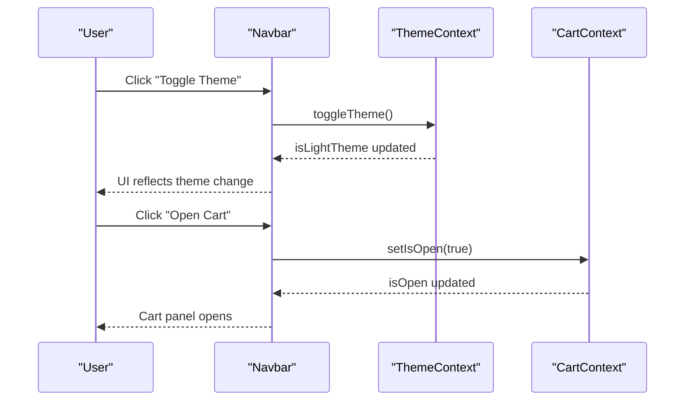
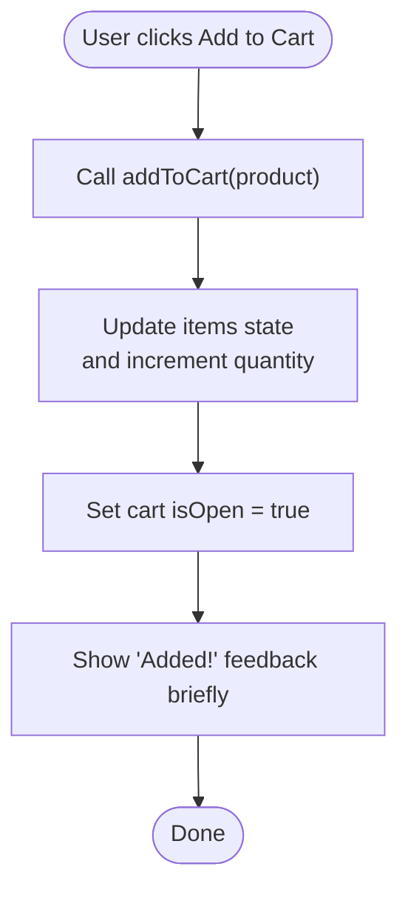
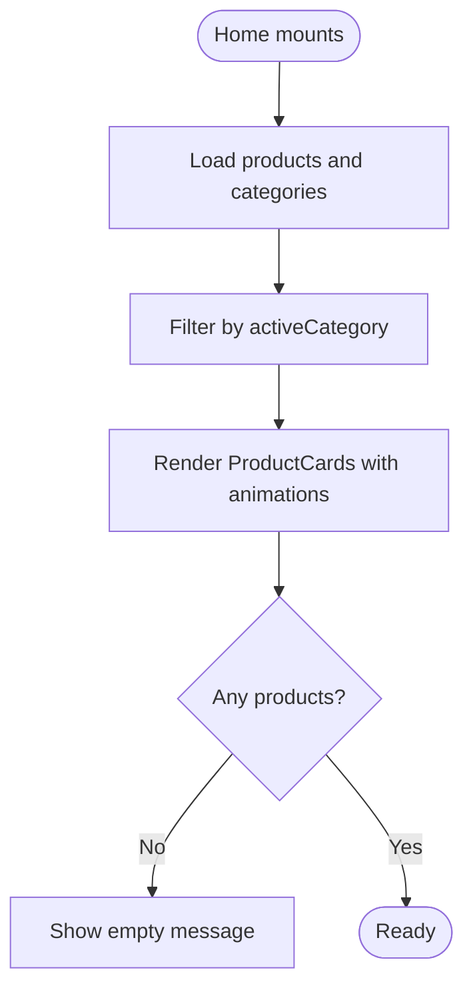
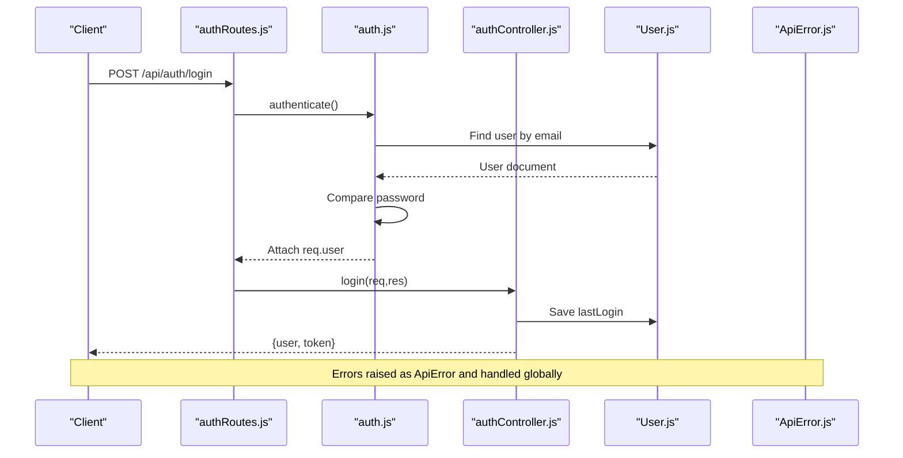
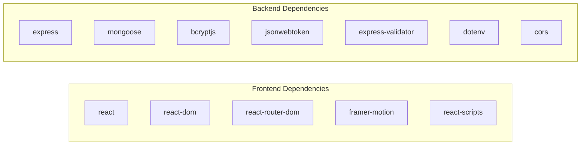

# Development Guidelines

<cite>
**Referenced Files in This Document**
- [package.json](file://package.json)
- [backend/package.json](file://backend/package.json)
- [README.md](file://README.md)
- [src/index.js](file://src/index.js)
- [src/App.jsx](file://src/App.jsx)
- [src/context/CartContext.jsx](file://src/context/CartContext.jsx)
- [src/context/ThemeContext.jsx](file://src/context/ThemeContext.jsx)
- [src/components/Navbar/Navbar.jsx](file://src/components/Navbar/Navbar.jsx)
- [src/components/ProductCard/ProductCard.jsx](file://src/components/ProductCard/ProductCard.jsx)
- [src/styles/global.css](file://src/styles/global.css)
- [src/pages/Home/Home.jsx](file://src/pages/Home/Home.jsx)
- [backend/index.js](file://backend/index.js)
- [backend/controllers/authController.js](file://backend/controllers/authController.js)
- [backend/middleware/auth.js](file://backend/middleware/auth.js)
- [backend/utils/ApiError.js](file://backend/utils/ApiError.js)
- [backend/models/User.js](file://backend/models/User.js)
- [backend/routes/authRoutes.js](file://backend/routes/authRoutes.js)
- [backend/API_GUIDE.md](file://backend/API_GUIDE.md)
</cite>

## Table of Contents
1. [Introduction](#introduction)
2. [Project Structure](#project-structure)
3. [Core Components](#core-components)
4. [Architecture Overview](#architecture-overview)
5. [Detailed Component Analysis](#detailed-component-analysis)
6. [Dependency Analysis](#dependency-analysis)
7. [Performance Considerations](#performance-considerations)
8. [Security Considerations](#security-considerations)
9. [Testing Strategies](#testing-strategies)
10. [Environment Configuration](#environment-configuration)
11. [Build Processes](#build-processes)
12. [Deployment Procedures](#deployment-procedures)
13. [Contribution Guidelines](#contribution-guidelines)
14. [Code Review Processes](#code-review-processes)
15. [Quality Assurance Practices](#quality-assurance-practices)
16. [Examples and Best Practices](#examples-and-best-practices)
17. [Troubleshooting Guide](#troubleshooting-guide)
18. [Conclusion](#conclusion)

## Introduction
This document defines development guidelines and best practices for the fullstack e-commerce application. It covers code organization standards, component development patterns, styling conventions with CSS modules, testing strategies, environment configuration, build processes, deployment procedures, contribution and code review processes, quality assurance practices, performance optimization, security considerations, and maintainability. The goal is to ensure consistent, scalable, and secure development across both the frontend (React) and backend (Node.js/Express/MongoDB) layers.

## Project Structure
The project follows a clear separation of concerns:
- Frontend (React): organized by feature folders (components, pages, context, styles), with CSS modules for scoped styling and global CSS for base themes.
- Backend (Node.js/Express): organized by MVC-like layers (controllers, routes, middleware, models, utils, db) and a central entry point.

**Diagram sources**
- [src/App.jsx:1-75](file://src/App.jsx#L1-L75)
- [src/index.js:1-6](file://src/index.js#L1-L6)
- [src/context/CartContext.jsx:1-62](file://src/context/CartContext.jsx#L1-L62)
- [src/context/ThemeContext.jsx:1-30](file://src/context/ThemeContext.jsx#L1-L30)
- [src/components/Navbar/Navbar.jsx:1-143](file://src/components/Navbar/Navbar.jsx#L1-L143)
- [src/components/ProductCard/ProductCard.jsx:1-134](file://src/components/ProductCard/ProductCard.jsx#L1-L134)
- [src/pages/Home/Home.jsx:1-176](file://src/pages/Home/Home.jsx#L1-L176)
- [src/styles/global.css:1-142](file://src/styles/global.css#L1-L142)
- [backend/index.js:1-119](file://backend/index.js#L1-L119)
- [backend/controllers/authController.js:1-299](file://backend/controllers/authController.js#L1-L299)
- [backend/middleware/auth.js:1-124](file://backend/middleware/auth.js#L1-L124)
- [backend/models/User.js:1-135](file://backend/models/User.js#L1-L135)
- [backend/routes/authRoutes.js:1-85](file://backend/routes/authRoutes.js#L1-L85)
- [backend/utils/ApiError.js:1-21](file://backend/utils/ApiError.js#L1-L21)

**Section sources**
- [src/index.js:1-6](file://src/index.js#L1-L6)
- [src/App.jsx:1-75](file://src/App.jsx#L1-L75)
- [backend/index.js:1-119](file://backend/index.js#L1-L119)

## Core Components
- Application bootstrap and routing: The React app initializes providers and routes, with animated transitions and a loader during startup.
- Context providers: Centralized state for cart and theme, exposing typed hooks for consumption.
- Feature components: Reusable UI units (Navbar, ProductCard) with CSS modules and animations.
- Pages: Feature-rich pages (Home) composed of components and styled via CSS modules.
- Backend entrypoint: Express server with database connection, CORS, middleware, routes, and error handling.

Key patterns:
- Provider composition in App.jsx ensures predictable state access.
- CSS modules scoped styles per component with global variables for theme tokens.
- Frontend animations via Framer Motion for micro-interactions and page transitions.
- Backend uses a layered architecture with explicit middleware for auth and validation.

**Section sources**
- [src/App.jsx:1-75](file://src/App.jsx#L1-L75)
- [src/context/CartContext.jsx:1-62](file://src/context/CartContext.jsx#L1-L62)
- [src/context/ThemeContext.jsx:1-30](file://src/context/ThemeContext.jsx#L1-L30)
- [src/components/Navbar/Navbar.jsx:1-143](file://src/components/Navbar/Navbar.jsx#L1-L143)
- [src/components/ProductCard/ProductCard.jsx:1-134](file://src/components/ProductCard/ProductCard.jsx#L1-L134)
- [src/pages/Home/Home.jsx:1-176](file://src/pages/Home/Home.jsx#L1-L176)
- [src/styles/global.css:1-142](file://src/styles/global.css#L1-L142)
- [backend/index.js:1-119](file://backend/index.js#L1-L119)

## Architecture Overview
High-level architecture:
- Frontend: React SPA with routing, state management via Context, and CSS modules.
- Backend: Express server with modular routes, controllers, middleware, and models.
- Data: MongoDB via Mongoose; JWT-based authentication; CORS-enabled API.

**Diagram sources**
- [src/App.jsx:1-75](file://src/App.jsx#L1-L75)
- [backend/index.js:1-119](file://backend/index.js#L1-L119)
- [backend/models/User.js:1-135](file://backend/models/User.js#L1-L135)

## Detailed Component Analysis

### Frontend Providers and Contexts
- CartContext: Manages cart items, open state, and derived totals; exposes callbacks via a hook.
- ThemeContext: Manages theme preference and applies a data attribute to the document root for CSS scoping.

**Diagram sources**
- [src/context/CartContext.jsx:1-62](file://src/context/CartContext.jsx#L1-L62)
- [src/context/ThemeContext.jsx:1-30](file://src/context/ThemeContext.jsx#L1-L30)

**Section sources**
- [src/context/CartContext.jsx:1-62](file://src/context/CartContext.jsx#L1-L62)
- [src/context/ThemeContext.jsx:1-30](file://src/context/ThemeContext.jsx#L1-L30)

### Navbar Component
- Integrates ThemeContext and CartContext.
- Uses Framer Motion for entrance, badge count, and mobile menu animations.
- Responsive design with mobile hamburger menu and dynamic active link highlighting.

**Diagram sources**
- [src/components/Navbar/Navbar.jsx:1-143](file://src/components/Navbar/Navbar.jsx#L1-L143)
- [src/context/ThemeContext.jsx:1-30](file://src/context/ThemeContext.jsx#L1-L30)
- [src/context/CartContext.jsx:1-62](file://src/context/CartContext.jsx#L1-L62)

**Section sources**
- [src/components/Navbar/Navbar.jsx:1-143](file://src/components/Navbar/Navbar.jsx#L1-L143)

### ProductCard Component
- Uses CartContext to add items and show feedback.
- Implements star rating, discount calculation, and modal quick-view via React Portal.
- Animations for hover, tap, and portal transitions.

**Diagram sources**
- [src/components/ProductCard/ProductCard.jsx:1-134](file://src/components/ProductCard/ProductCard.jsx#L1-L134)
- [src/context/CartContext.jsx:1-62](file://src/context/CartContext.jsx#L1-L62)

**Section sources**
- [src/components/ProductCard/ProductCard.jsx:1-134](file://src/components/ProductCard/ProductCard.jsx#L1-L134)

### Home Page
- Filters products by category and animates grid entries.
- Uses Framer Motion variants for staggered entrance and route transitions.

**Diagram sources**
- [src/pages/Home/Home.jsx:1-176](file://src/pages/Home/Home.jsx#L1-L176)

**Section sources**
- [src/pages/Home/Home.jsx:1-176](file://src/pages/Home/Home.jsx#L1-L176)

### Backend Authentication Flow
- Routes define endpoints for auth operations.
- Middleware authenticates and authorizes requests.
- Controllers implement business logic and response formatting.
- Models encapsulate schema and hashing.

**Diagram sources**
- [backend/routes/authRoutes.js:1-85](file://backend/routes/authRoutes.js#L1-L85)
- [backend/middleware/auth.js:1-124](file://backend/middleware/auth.js#L1-L124)
- [backend/controllers/authController.js:1-299](file://backend/controllers/authController.js#L1-L299)
- [backend/models/User.js:1-135](file://backend/models/User.js#L1-L135)
- [backend/utils/ApiError.js:1-21](file://backend/utils/ApiError.js#L1-L21)

**Section sources**
- [backend/routes/authRoutes.js:1-85](file://backend/routes/authRoutes.js#L1-L85)
- [backend/middleware/auth.js:1-124](file://backend/middleware/auth.js#L1-L124)
- [backend/controllers/authController.js:1-299](file://backend/controllers/authController.js#L1-L299)
- [backend/models/User.js:1-135](file://backend/models/User.js#L1-L135)
- [backend/utils/ApiError.js:1-21](file://backend/utils/ApiError.js#L1-L21)

## Dependency Analysis
- Frontend dependencies include React, React Router, Framer Motion, and Testing Library packages configured by react-scripts.
- Backend dependencies include Express, Mongoose, bcrypt, JWT, and validation utilities; scripts for dev/test/start.

**Diagram sources**
- [package.json:5-16](file://package.json#L5-L16)
- [backend/package.json:20-28](file://backend/package.json#L20-L28)

**Section sources**
- [package.json:1-42](file://package.json#L1-L42)
- [backend/package.json:1-33](file://backend/package.json#L1-L33)

## Performance Considerations
- Frontend
  - Prefer CSS modules and CSS variables for efficient styling updates.
  - Use lazy loading for images and avoid heavy computations in render paths.
  - Keep animations minimal and targeted to improve frame rates.
  - Memoize callbacks passed to child components using useCallback to prevent unnecessary re-renders.
- Backend
  - Use indexes on frequently queried fields (e.g., email).
  - Hash passwords with appropriate cost; avoid excessive rounds.
  - Limit payload sizes and apply rate limiting for authentication endpoints.
  - Stream large responses and paginate lists.

[No sources needed since this section provides general guidance]

## Security Considerations
- Authentication
  - Use HTTPS in production and secure cookies if using session-based auth.
  - Enforce strong password policies and consider multi-factor authentication.
  - Rotate secrets and invalidate tokens on logout.
- Input Validation and Sanitization
  - Validate and sanitize all inputs; use express-validator for route-level checks.
- Error Handling
  - Do not expose internal errors to clients; log stack traces securely.
- CORS and Headers
  - Configure CORS origins carefully and set security headers (e.g., HSTS, CSP).
- Data Protection
  - Encrypt sensitive data at rest; mask logs containing PII.

[No sources needed since this section provides general guidance]

## Testing Strategies
- Frontend
  - Unit tests for pure functions and isolated components using Testing Library.
  - Snapshot tests for static UIs; interaction tests for user flows.
  - Mock external APIs and contexts to isolate component behavior.
- Backend
  - Use Jest for unit and integration tests; mock Mongoose models and external services.
  - Test error paths, validation failures, and edge cases.
  - CI should run tests on pull requests and enforce coverage thresholds.

[No sources needed since this section provides general guidance]

## Environment Configuration
- Frontend
  - Environment variables are supported by Create React App; prefix variables with REACT_APP_ for runtime exposure.
  - Configure browserslist targets for compatibility.
- Backend
  - Use dotenv to load environment variables (NODE_ENV, CLIENT_URL, PORT).
  - Store secrets in environment variables; never commit to source control.
  - Configure development vs production logging and error reporting.

**Section sources**
- [backend/index.js:1-119](file://backend/index.js#L1-L119)
- [package.json:29-40](file://package.json#L29-L40)

## Build Processes
- Frontend
  - Development: npm start runs the dev server.
  - Production: npm run build generates optimized static assets.
  - Tests: npm test launches the test runner.
- Backend
  - Development: nodemon watches for changes (dev script).
  - Production: node index.js starts the server.

**Section sources**
- [package.json:17-22](file://package.json#L17-L22)
- [backend/package.json:6-9](file://backend/package.json#L6-L9)
- [README.md:5-30](file://README.md#L5-L30)

## Deployment Procedures
- Frontend
  - Deploy the build output to a static host or CDN; configure base href and routing if needed.
  - Enable gzip/br compression and cache headers for optimal performance.
- Backend
  - Containerize with Docker; define health checks and resource limits.
  - Use environment-specific config files and secrets management.
  - Scale horizontally behind a load balancer; monitor logs and metrics.

[No sources needed since this section provides general guidance]

## Contribution Guidelines
- Branching
  - Use feature branches prefixed with feature/, fix/, chore/.
- Commits
  - Write clear, imperative commit messages; reference issues.
- Code Style
  - Follow existing patterns: functional components, hooks, CSS modules, and consistent naming.
- Reviews
  - All changes require at least one review; ensure tests pass and style checks succeed.

[No sources needed since this section provides general guidance]

## Code Review Processes
- Focus areas: correctness, readability, performance, security, accessibility, and test coverage.
- Automated checks: linting, formatting, and tests must pass.
- Manual review: peer review for logic, architecture, and maintainability.

[No sources needed since this section provides general guidance]

## Quality Assurance Practices
- Static Analysis
  - Run linters and formatters consistently across the team.
- Accessibility
  - Audit components for ARIA attributes, keyboard navigation, and screen reader support.
- Performance
  - Monitor bundle size and runtime performance; optimize slow paths.
- Observability
  - Instrument logs, metrics, and tracing; alert on errors and latency spikes.

[No sources needed since this section provides general guidance]

## Examples and Best Practices

### Component Structure Example
- Place related JSX, CSS module, and assets in a feature folder (e.g., components/Navbar).
- Export default component and import styles via module.css.
- Keep presentational logic minimal; delegate data fetching to higher-level components or hooks.

**Section sources**
- [src/components/Navbar/Navbar.jsx:1-143](file://src/components/Navbar/Navbar.jsx#L1-L143)

### Context Usage Example
- Wrap the app with providers in App.jsx.
- Consume context via typed hooks; guard against missing provider usage.

**Section sources**
- [src/App.jsx:64-74](file://src/App.jsx#L64-L74)
- [src/context/CartContext.jsx:58-62](file://src/context/CartContext.jsx#L58-L62)
- [src/context/ThemeContext.jsx:24-30](file://src/context/ThemeContext.jsx#L24-L30)

### API Integration Pattern
- Define routes in routes/* and controllers in controllers/*.
- Use middleware for authentication and validation.
- Return structured responses using a consistent response utility.

**Section sources**
- [backend/routes/authRoutes.js:1-85](file://backend/routes/authRoutes.js#L1-L85)
- [backend/middleware/auth.js:1-124](file://backend/middleware/auth.js#L1-L124)
- [backend/controllers/authController.js:1-299](file://backend/controllers/authController.js#L1-L299)

## Troubleshooting Guide
- Frontend
  - If animations do not appear, verify Framer Motion imports and variants are correctly defined.
  - If styles conflict, ensure CSS modules are used and specificity is managed via :local(...) or scoped selectors.
- Backend
  - If authentication fails, confirm Authorization header format and token validity.
  - If CORS errors occur, verify CLIENT_URL and allowed headers in the backend configuration.

**Section sources**
- [src/components/Navbar/Navbar.jsx:1-143](file://src/components/Navbar/Navbar.jsx#L1-L143)
- [src/styles/global.css:1-142](file://src/styles/global.css#L1-L142)
- [backend/index.js:24-30](file://backend/index.js#L24-L30)
- [backend/middleware/auth.js:14-24](file://backend/middleware/auth.js#L14-L24)

## Conclusion
These guidelines establish a consistent foundation for building, testing, deploying, and maintaining the application. By adhering to the outlined patterns—component organization, CSS modules, provider-driven state, layered backend architecture, robust error handling, and security-conscious practices—you can deliver a reliable, scalable, and user-friendly e-commerce platform.