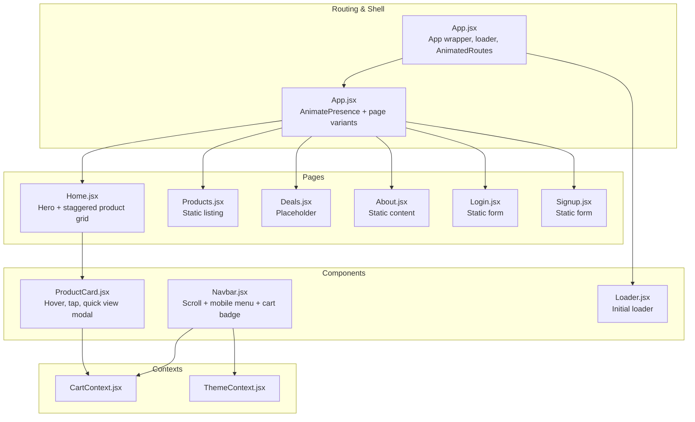
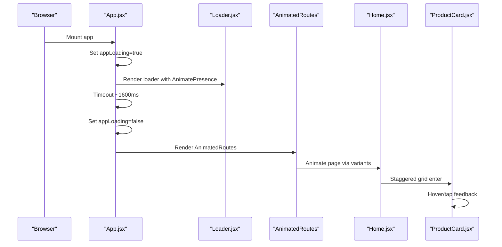
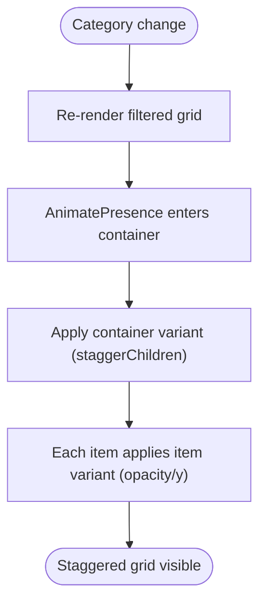
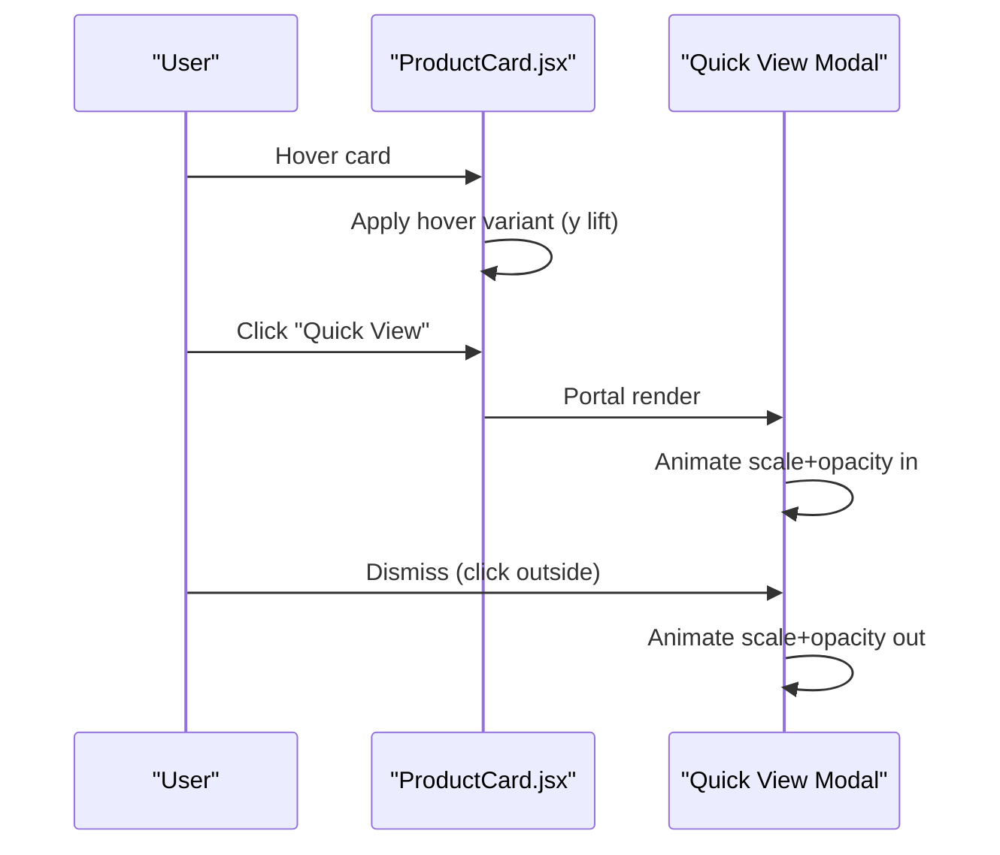
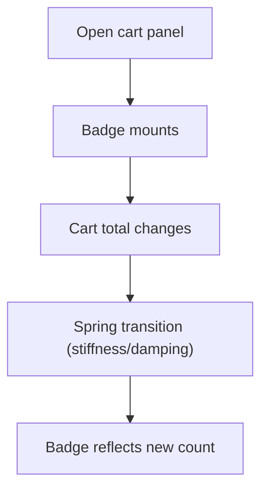
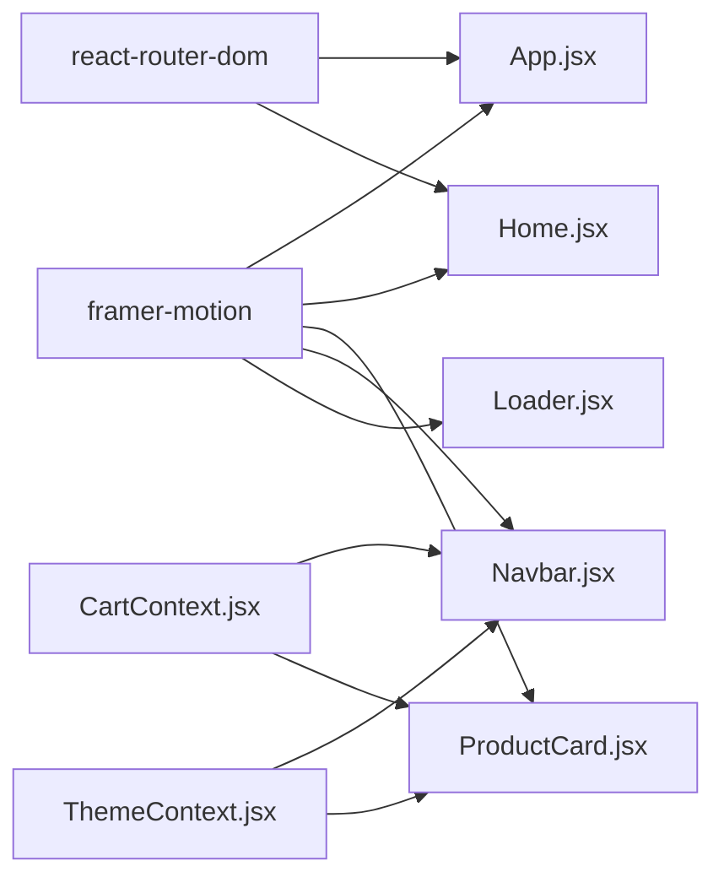

# Animation and Transition System

<cite>
**Referenced Files in This Document**
- [App.jsx](file://src/App.jsx)
- [Loader.jsx](file://src/components/Loader/Loader.jsx)
- [Loader.module.css](file://src/components/Loader/Loader.module.css)
- [Home.jsx](file://src/pages/Home/Home.jsx)
- [Home.module.css](file://src/pages/Home/Home.module.css)
- [ProductCard.jsx](file://src/components/ProductCard/ProductCard.jsx)
- [ProductCard.module.css](file://src/components/ProductCard/ProductCard.module.css)
- [Navbar.jsx](file://src/components/Navbar/Navbar.jsx)
- [CartContext.jsx](file://src/context/CartContext.jsx)
- [ThemeContext.jsx](file://src/context/ThemeContext.jsx)
- [products.js](file://src/data/products.js)
- [package.json](file://package.json)
</cite>

## Table of Contents
1. [Introduction](#introduction)
2. [Project Structure](#project-structure)
3. [Core Components](#core-components)
4. [Architecture Overview](#architecture-overview)
5. [Detailed Component Analysis](#detailed-component-analysis)
6. [Dependency Analysis](#dependency-analysis)
7. [Performance Considerations](#performance-considerations)
8. [Troubleshooting Guide](#troubleshooting-guide)
9. [Conclusion](#conclusion)

## Introduction
This document explains the animation and transition system built with Framer Motion across the application. It covers page transitions, entrance/exit effects, loader animations, component-level animations, staggered animations, and interactive animations. It also documents animation configuration (variants, timing functions, easing curves), and provides guidance on performance, browser compatibility, and graceful degradation for users with reduced motion preferences.

## Project Structure
The animation system spans several layers:
- Application shell and routing with page transitions
- Page-level animations and staggered lists
- Component-level micro-interactions and modal animations
- Loader animation during app initialization
- Shared contexts powering cart and theme-driven UI updates

**Diagram sources**
- [App.jsx:18-53](file://src/App.jsx#L18-L53)
- [Home.jsx:18-176](file://src/pages/Home/Home.jsx#L18-L176)
- [Loader.jsx:4-18](file://src/components/Loader/Loader.jsx#L4-L18)
- [Navbar.jsx:8-143](file://src/components/Navbar/Navbar.jsx#L8-L143)
- [ProductCard.jsx:20-134](file://src/components/ProductCard/ProductCard.jsx#L20-L134)
- [CartContext.jsx:5-62](file://src/context/CartContext.jsx#L5-L62)
- [ThemeContext.jsx:5-30](file://src/context/ThemeContext.jsx#L5-L30)

**Section sources**
- [App.jsx:1-75](file://src/App.jsx#L1-L75)
- [Home.jsx:1-176](file://src/pages/Home/Home.jsx#L1-L176)
- [Loader.jsx:1-18](file://src/components/Loader/Loader.jsx#L1-L18)
- [Navbar.jsx:1-143](file://src/components/Navbar/Navbar.jsx#L1-L143)
- [ProductCard.jsx:1-134](file://src/components/ProductCard/ProductCard.jsx#L1-L134)
- [CartContext.jsx:1-62](file://src/context/CartContext.jsx#L1-L62)
- [ThemeContext.jsx:1-30](file://src/context/ThemeContext.jsx#L1-L30)

## Core Components
- Page transitions with AnimatePresence and variants
- Staggered entrance for product grids
- Interactive hover/tap feedback
- Modal entrance/exit with portal
- Cart badge spring animation
- Initial loader with fade exit

**Section sources**
- [App.jsx:18-53](file://src/App.jsx#L18-L53)
- [Home.jsx:8-16](file://src/pages/Home/Home.jsx#L8-L16)
- [ProductCard.jsx:40-46](file://src/components/ProductCard/ProductCard.jsx#L40-L46)
- [Navbar.jsx:91-104](file://src/components/Navbar/Navbar.jsx#L91-L104)
- [Loader.jsx:6-11](file://src/components/Loader/Loader.jsx#L6-L11)

## Architecture Overview
Framer Motion orchestrates three primary flows:
- App-level loader fades out before rendering animated routes
- Page-level transitions with directional opacity/y displacement
- Component-level micro-interactions (hover, tap, layout animations)

**Diagram sources**
- [App.jsx:55-75](file://src/App.jsx#L55-L75)
- [Loader.jsx:4-18](file://src/components/Loader/Loader.jsx#L4-L18)
- [App.jsx:24-53](file://src/App.jsx#L24-L53)
- [Home.jsx:137-151](file://src/pages/Home/Home.jsx#L137-L151)
- [ProductCard.jsx:40-46](file://src/components/ProductCard/ProductCard.jsx#L40-L46)

## Detailed Component Analysis

### Page Transitions and Loader
- App-level loader uses AnimatePresence to mount/unmount a single Loader component. It fades out on exit.
- AnimatedRoutes wraps Routes with AnimatePresence and mode="wait". Each page animates with variants that adjust opacity and vertical displacement, using easing and durations tailored to readability and snappiness.
- Authentication pages bypass the shared header/footer; the loader appears only once during boot.

Key configuration highlights:
- Loader exit transition duration
- Page variants: initial/exit/enter with easing and duration
- AnimatePresence mode="wait" prevents overlapping during route changes

**Section sources**
- [App.jsx:55-75](file://src/App.jsx#L55-L75)
- [App.jsx:18-22](file://src/App.jsx#L18-L22)
- [App.jsx:24-53](file://src/App.jsx#L24-L53)
- [Loader.jsx:4-18](file://src/components/Loader/Loader.jsx#L4-L18)

### Staggered Animations on Home
- The product grid uses AnimatePresence with a container variant that staggers child entrances.
- Item variants define opacity and vertical displacement with easing and duration.
- The grid re-renders when the active category changes; AnimatePresence ensures smooth transitions between states.

**Diagram sources**
- [Home.jsx:137-151](file://src/pages/Home/Home.jsx#L137-L151)
- [Home.jsx:8-16](file://src/pages/Home/Home.jsx#L8-L16)

**Section sources**
- [Home.jsx:137-151](file://src/pages/Home/Home.jsx#L137-L151)
- [Home.jsx:8-16](file://src/pages/Home/Home.jsx#L8-L16)

### Interactive Animations and Layout Transitions
- Product card: initial opacity/y, hover lift effect, layout animation enabled for smooth DOM rearrangements.
- Quick view modal: scales and fades in using initial/animate transitions with short duration.
- Cart button: whileTap for press feedback; cart badge uses a spring transition for numeric changes.

**Diagram sources**
- [ProductCard.jsx:40-46](file://src/components/ProductCard/ProductCard.jsx#L40-L46)
- [ProductCard.jsx:89-131](file://src/components/ProductCard/ProductCard.jsx#L89-L131)
- [ProductCard.jsx:91-96](file://src/components/ProductCard/ProductCard.jsx#L91-L96)

**Section sources**
- [ProductCard.jsx:40-46](file://src/components/ProductCard/ProductCard.jsx#L40-L46)
- [ProductCard.jsx:89-131](file://src/components/ProductCard/ProductCard.jsx#L89-L131)

### Navbar and Cart Badge Spring
- Navbar slides down on mount and reacts to scroll.
- Cart badge counts animate with a spring physics-based transition when items change.

**Diagram sources**
- [Navbar.jsx:24-28](file://src/components/Navbar/Navbar.jsx#L24-L28)
- [Navbar.jsx:91-104](file://src/components/Navbar/Navbar.jsx#L91-L104)

**Section sources**
- [Navbar.jsx:24-28](file://src/components/Navbar/Navbar.jsx#L24-L28)
- [Navbar.jsx:91-104](file://src/components/Navbar/Navbar.jsx#L91-L104)
- [CartContext.jsx:36-37](file://src/context/CartContext.jsx#L36-L37)

### Loader Animation Details
- The loader wrapper fades out on exit with a short duration.
- The spinner uses pure CSS animations for the ring segments and dots, complementing the Framer Motion exit.

**Section sources**
- [Loader.jsx:6-11](file://src/components/Loader/Loader.jsx#L6-L11)
- [Loader.module.css:13-66](file://src/components/Loader/Loader.module.css#L13-L66)

## Dependency Analysis
- Framer Motion is used for page transitions, component micro-interactions, and layout animations.
- React Router DOM coordinates navigation and location-based keys for route transitions.
- Contexts (Cart and Theme) influence UI state and indirectly drive animation triggers (e.g., cart badge count).

**Diagram sources**
- [package.json:10-10](file://package.json#L10-L10)
- [App.jsx:2-2](file://src/App.jsx#L2-L2)
- [Home.jsx:3-3](file://src/pages/Home/Home.jsx#L3-L3)
- [ProductCard.jsx:3-3](file://src/components/ProductCard/ProductCard.jsx#L3-L3)
- [Navbar.jsx:3-3](file://src/components/Navbar/Navbar.jsx#L3-L3)
- [Loader.jsx:1-1](file://src/components/Loader/Loader.jsx#L1-L1)
- [CartContext.jsx:1-1](file://src/context/CartContext.jsx#L1-L1)
- [ThemeContext.jsx:1-1](file://src/context/ThemeContext.jsx#L1-L1)

**Section sources**
- [package.json:10-10](file://package.json#L10-L10)
- [App.jsx:2-2](file://src/App.jsx#L2-L2)
- [Home.jsx:3-3](file://src/pages/Home/Home.jsx#L3-L3)
- [ProductCard.jsx:3-3](file://src/components/ProductCard/ProductCard.jsx#L3-L3)
- [Navbar.jsx:3-3](file://src/components/Navbar/Navbar.jsx#L3-L3)
- [Loader.jsx:1-1](file://src/components/Loader/Loader.jsx#L1-L1)
- [CartContext.jsx:1-1](file://src/context/CartContext.jsx#L1-L1)
- [ThemeContext.jsx:1-1](file://src/context/ThemeContext.jsx#L1-L1)

## Performance Considerations
- Prefer transform and opacity for animations to leverage GPU acceleration.
- Keep durations reasonable (e.g., 0.2–0.4s for micro-interactions, 0.35–0.8s for page transitions) to maintain perceived performance.
- Use AnimatePresence with mode="wait" to avoid overlapping animations during route changes.
- Limit heavy computations during animations; memoize derived values (as seen with filtered products).
- Use layout animations judiciously; they trigger reflows—enable only when DOM structure changes.
- Avoid long CSS animations conflicting with JS-driven ones; keep loaders CSS-driven and overlay-only.

[No sources needed since this section provides general guidance]

## Troubleshooting Guide
- Page transitions not firing:
  - Ensure AnimatePresence wraps the animated container and that the key changes on route/location change.
  - Verify variants are applied to the animated element and that initial/animate/exit props are set.
- Staggered animations not working:
  - Confirm the container has a variants object with staggerChildren and children use the item variants.
  - Ensure the key prop on the container changes when the dataset changes.
- Quick view modal not animating:
  - Check that initial and animate states are defined and that the modal is rendered conditionally.
  - Confirm the portal target exists and event handlers properly close the modal.
- Cart badge spring looks sluggish:
  - Adjust spring stiffness/damping to balance responsiveness and overshoot.
  - Ensure the badge re-renders only when totalItems changes.
- Loader does not disappear:
  - Confirm appLoading state flips after the timeout and that AnimatePresence removes the component after exit completes.

**Section sources**
- [App.jsx:24-53](file://src/App.jsx#L24-L53)
- [Home.jsx:8-16](file://src/pages/Home/Home.jsx#L8-L16)
- [Home.jsx:137-151](file://src/pages/Home/Home.jsx#L137-L151)
- [ProductCard.jsx:89-131](file://src/components/ProductCard/ProductCard.jsx#L89-L131)
- [Navbar.jsx:91-104](file://src/components/Navbar/Navbar.jsx#L91-L104)

## Conclusion
The animation system combines Framer Motion’s declarative transitions with React Router for seamless page navigation, and component-level micro-interactions for responsive feedback. Variants, easing, and durations are tuned for clarity and performance. Staggered animations enhance perceived load times, while loader and cart badge animations provide immediate feedback. Following the performance and troubleshooting guidance ensures smooth experiences across devices and user preferences.