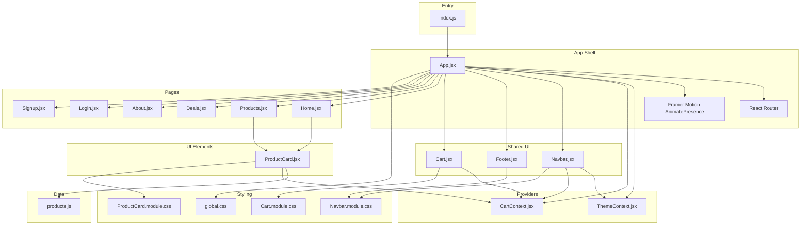
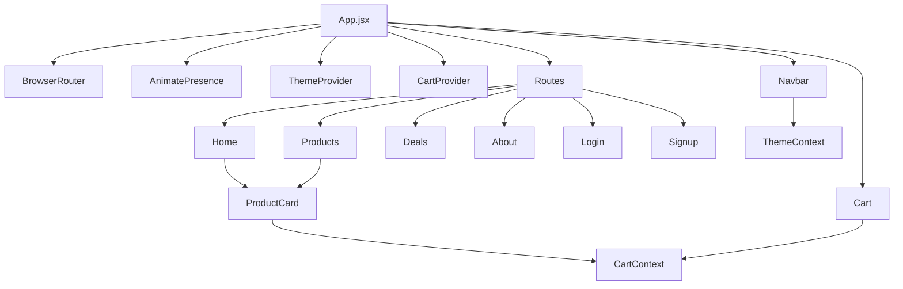
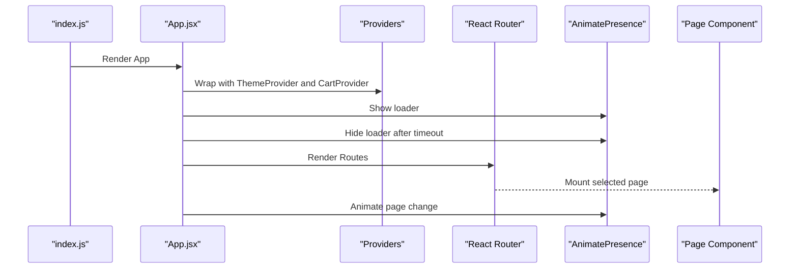
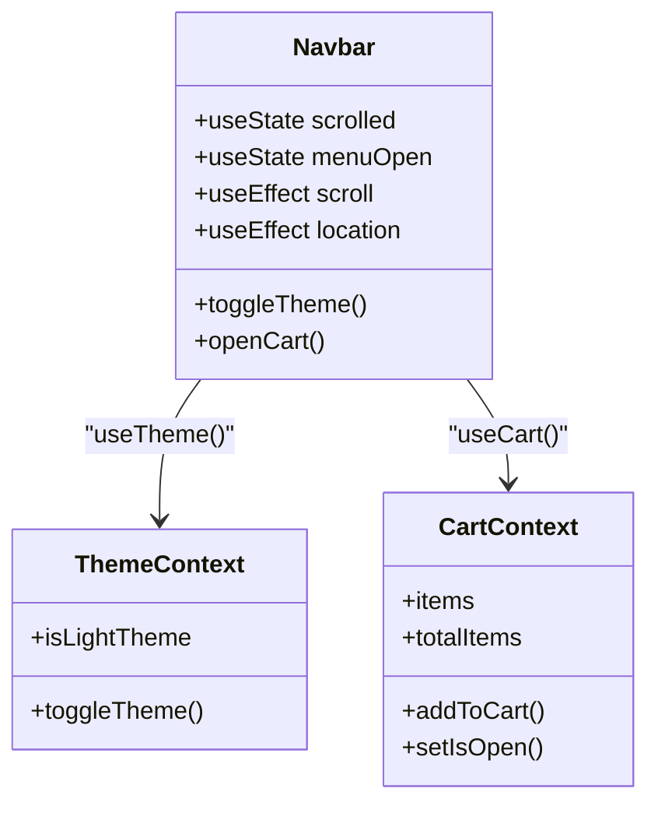
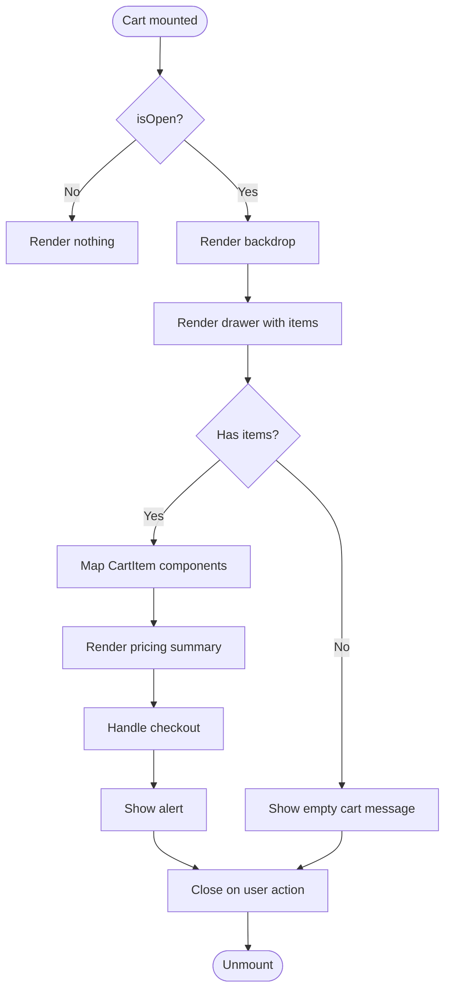
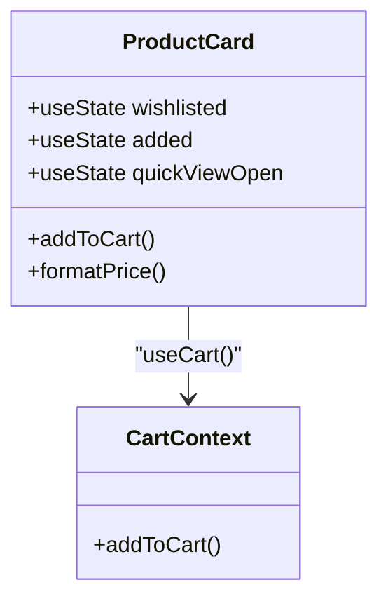
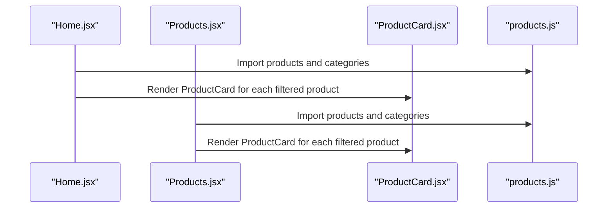
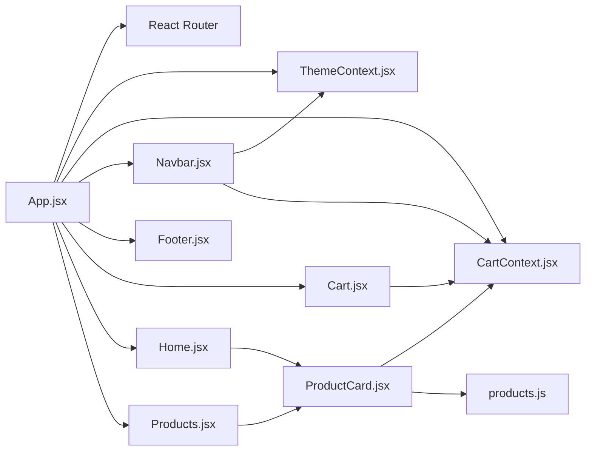

# Component Hierarchy

<cite>
**Referenced Files in This Document**
- [App.jsx](file://src/App.jsx)
- [index.js](file://src/index.js)
- [CartContext.jsx](file://src/context/CartContext.jsx)
- [ThemeContext.jsx](file://src/context/ThemeContext.jsx)
- [Navbar.jsx](file://src/components/Navbar/Navbar.jsx)
- [Footer.jsx](file://src/components/Footer/Footer.jsx)
- [Cart.jsx](file://src/components/Cart/Cart.jsx)
- [ProductCard.jsx](file://src/components/ProductCard/ProductCard.jsx)
- [Home.jsx](file://src/pages/Home/Home.jsx)
- [Products.jsx](file://src/pages/Products/Products.jsx)
- [Navbar.module.css](file://src/components/Navbar/Navbar.module.css)
- [Cart.module.css](file://src/components/Cart/Cart.module.css)
- [ProductCard.module.css](file://src/components/ProductCard/ProductCard.module.css)
- [global.css](file://src/styles/global.css)
- [products.js](file://src/data/products.js)
</cite>

## Table of Contents
1. [Introduction](#introduction)
2. [Project Structure](#project-structure)
3. [Core Components](#core-components)
4. [Architecture Overview](#architecture-overview)
5. [Detailed Component Analysis](#detailed-component-analysis)
6. [Dependency Analysis](#dependency-analysis)
7. [Performance Considerations](#performance-considerations)
8. [Troubleshooting Guide](#troubleshooting-guide)
9. [Conclusion](#conclusion)

## Introduction
This document explains the React component hierarchy and organization of the application. It starts from the root App component and details how pages, shared components, and UI elements are structured. It also covers composition patterns, how prop drilling is avoided using React Context, lifecycle management, and how functional components integrate with modular CSS architecture via CSS modules.

## Project Structure
The application follows a clear separation of concerns:
- Root entry renders the App component.
- App composes routing, animations, providers, and page components.
- Pages represent top-level views.
- Shared components (Navbar, Footer, Cart) are reused across pages.
- UI elements (ProductCard) are used within pages.
- Context providers centralize state for cart and theme.
- Modular CSS modules encapsulate component styling.

**Diagram sources**
- [index.js:1-6](file://src/index.js#L1-L6)
- [App.jsx:1-75](file://src/App.jsx#L1-L75)
- [ThemeContext.jsx:1-30](file://src/context/ThemeContext.jsx#L1-L30)
- [CartContext.jsx:1-62](file://src/context/CartContext.jsx#L1-L62)
- [Navbar.jsx:1-143](file://src/components/Navbar/Navbar.jsx#L1-L143)
- [Footer.jsx:1-65](file://src/components/Footer/Footer.jsx#L1-L65)
- [Cart.jsx:1-260](file://src/components/Cart/Cart.jsx#L1-L260)
- [ProductCard.jsx:1-134](file://src/components/ProductCard/ProductCard.jsx#L1-L134)
- [Home.jsx:1-176](file://src/pages/Home/Home.jsx#L1-L176)
- [Products.jsx:1-50](file://src/pages/Products/Products.jsx#L1-L50)
- [Navbar.module.css:1-273](file://src/components/Navbar/Navbar.module.css#L1-L273)
- [Cart.module.css:1-430](file://src/components/Cart/Cart.module.css#L1-L430)
- [ProductCard.module.css:1-414](file://src/components/ProductCard/ProductCard.module.css#L1-L414)
- [global.css:1-142](file://src/styles/global.css#L1-L142)
- [products.js:1-100](file://src/data/products.js#L1-L100)

**Section sources**
- [index.js:1-6](file://src/index.js#L1-L6)
- [App.jsx:1-75](file://src/App.jsx#L1-L75)

## Core Components
- App: Orchestrates routing, page transitions, loaders, and provider wrappers. It conditionally renders Navbar, Cart, Footer, and pages based on route.
- Providers:
  - ThemeProvider: Manages theme state and applies it to the document root.
  - CartProvider: Centralizes cart state and exposes actions to add/remove/update items and compute totals.
- Shared UI:
  - Navbar: Navigation bar with theme toggle, cart badge, and responsive mobile menu.
  - Footer: Multi-column footer with links and newsletter signup.
  - Cart: Slide-in drawer with item list, quantities, pricing summary, and checkout flow.
- Pages:
  - Home: Hero section, category filters, and product grid with animations.
  - Products: Category filtering and product grid.
- UI Elements:
  - ProductCard: Individual product card with quick view modal, ratings, pricing, and add-to-cart.

**Section sources**
- [App.jsx:1-75](file://src/App.jsx#L1-L75)
- [ThemeContext.jsx:1-30](file://src/context/ThemeContext.jsx#L1-L30)
- [CartContext.jsx:1-62](file://src/context/CartContext.jsx#L1-L62)
- [Navbar.jsx:1-143](file://src/components/Navbar/Navbar.jsx#L1-L143)
- [Footer.jsx:1-65](file://src/components/Footer/Footer.jsx#L1-L65)
- [Cart.jsx:1-260](file://src/components/Cart/Cart.jsx#L1-L260)
- [Home.jsx:1-176](file://src/pages/Home/Home.jsx#L1-L176)
- [Products.jsx:1-50](file://src/pages/Products/Products.jsx#L1-L50)
- [ProductCard.jsx:1-134](file://src/components/ProductCard/ProductCard.jsx#L1-L134)

## Architecture Overview
The app uses React Router for navigation and Framer Motion for page and component transitions. Providers wrap the app to supply theme and cart state globally. Pages render reusable components and UI elements. CSS modules keep styles scoped per component, while global CSS defines theme tokens and base styles.

**Diagram sources**
- [App.jsx:1-75](file://src/App.jsx#L1-L75)
- [Home.jsx:1-176](file://src/pages/Home/Home.jsx#L1-L176)
- [Products.jsx:1-50](file://src/pages/Products/Products.jsx#L1-L50)
- [ProductCard.jsx:1-134](file://src/components/ProductCard/ProductCard.jsx#L1-L134)
- [Navbar.jsx:1-143](file://src/components/Navbar/Navbar.jsx#L1-L143)
- [Cart.jsx:1-260](file://src/components/Cart/Cart.jsx#L1-L260)
- [ThemeContext.jsx:1-30](file://src/context/ThemeContext.jsx#L1-L30)
- [CartContext.jsx:1-62](file://src/context/CartContext.jsx#L1-L62)

## Detailed Component Analysis

### App Component and Routing
- Wraps the app with ThemeProvider and CartProvider.
- Renders a loader initially, then animated routes.
- Uses AnimatePresence to animate route transitions with page variants.
- Conditionally renders Navbar, Cart, and Footer depending on current route.
- Imports and mounts pages for Home, Products, Deals, About, Login, and Signup.

**Diagram sources**
- [index.js:1-6](file://src/index.js#L1-L6)
- [App.jsx:55-75](file://src/App.jsx#L55-L75)

**Section sources**
- [App.jsx:18-53](file://src/App.jsx#L18-L53)
- [App.jsx:55-75](file://src/App.jsx#L55-L75)

### Navbar Component
- Consumes ThemeContext to toggle theme and apply theme-specific styles.
- Consumes CartContext to show cart item count and open the cart drawer.
- Implements scroll-aware styling and responsive mobile menu with animations.
- Integrates with routing via Link and reacts to location changes to close menus.

**Diagram sources**
- [Navbar.jsx:8-143](file://src/components/Navbar/Navbar.jsx#L8-L143)
- [ThemeContext.jsx:5-29](file://src/context/ThemeContext.jsx#L5-L29)
- [CartContext.jsx:58-62](file://src/context/CartContext.jsx#L58-L62)

**Section sources**
- [Navbar.jsx:1-143](file://src/components/Navbar/Navbar.jsx#L1-L143)
- [Navbar.module.css:1-273](file://src/components/Navbar/Navbar.module.css#L1-L273)

### Footer Component
- Displays brand identity, social links, and newsletter signup.
- Uses a static mapping of footer sections and links.
- Leverages component-scoped CSS for layout and typography.

**Section sources**
- [Footer.jsx:1-65](file://src/components/Footer/Footer.jsx#L1-L65)

### Cart Component
- Consumes CartContext to manage items, totals, and visibility.
- Implements a slide-in drawer with backdrop, item list, and summary.
- Handles outside clicks and Escape key to close.
- Provides checkout flow with alert feedback and clears cart actions.

**Diagram sources**
- [Cart.jsx:75-260](file://src/components/Cart/Cart.jsx#L75-L260)
- [CartContext.jsx:5-62](file://src/context/CartContext.jsx#L5-L62)

**Section sources**
- [Cart.jsx:1-260](file://src/components/Cart/Cart.jsx#L1-L260)
- [Cart.module.css:1-430](file://src/components/Cart/Cart.module.css#L1-L430)

### ProductCard Component
- Consumes CartContext to add items to the cart.
- Renders star ratings, pricing, badges, and quick view modal.
- Uses createPortal for the quick view overlay to escape stacking contexts.
- Implements hover effects and animations for interactive feedback.

**Diagram sources**
- [ProductCard.jsx:20-134](file://src/components/ProductCard/ProductCard.jsx#L20-L134)
- [CartContext.jsx:9-20](file://src/context/CartContext.jsx#L9-L20)

**Section sources**
- [ProductCard.jsx:1-134](file://src/components/ProductCard/ProductCard.jsx#L1-L134)
- [ProductCard.module.css:1-414](file://src/components/ProductCard/ProductCard.module.css#L1-L414)

### Pages: Home and Products
- Both pages consume the shared ProductCard and data from products.js.
- Home adds hero content, statistics, and category filtering with staggered animations.
- Products focuses on filtering and grid rendering.

**Diagram sources**
- [Home.jsx:18-176](file://src/pages/Home/Home.jsx#L18-L176)
- [Products.jsx:6-50](file://src/pages/Products/Products.jsx#L6-L50)
- [ProductCard.jsx:20-134](file://src/components/ProductCard/ProductCard.jsx#L20-L134)
- [products.js:1-100](file://src/data/products.js#L1-L100)

**Section sources**
- [Home.jsx:1-176](file://src/pages/Home/Home.jsx#L1-L176)
- [Products.jsx:1-50](file://src/pages/Products/Products.jsx#L1-L50)
- [products.js:1-100](file://src/data/products.js#L1-L100)

### Component Composition Patterns and Prop Drilling Prevention
- Composition: App composes pages and shared components; pages compose UI elements.
- Context-based prop drilling prevention:
  - ThemeContext eliminates passing theme props down multiple levels.
  - CartContext centralizes cart state and actions, avoiding prop drilling across pages and components.
- Local state: Components maintain small, local state (e.g., Navbar scroll/menu state, ProductCard UI toggles) to minimize cross-cutting concerns.

**Section sources**
- [ThemeContext.jsx:1-30](file://src/context/ThemeContext.jsx#L1-L30)
- [CartContext.jsx:1-62](file://src/context/CartContext.jsx#L1-L62)
- [Navbar.jsx:1-143](file://src/components/Navbar/Navbar.jsx#L1-L143)
- [ProductCard.jsx:1-134](file://src/components/ProductCard/ProductCard.jsx#L1-L134)

### Lifecycle Management
- App: Initializes loader state and cleans up timeout on unmount.
- Navbar: Subscribes/unsubscribes to scroll and location events; resets menu on route change.
- Cart: Locks body scroll, listens to Escape key, and handles outside clicks; cleans up event listeners.
- ProductCard: Manages temporary UI states (added, quick view) with timeouts and controlled visibility.

**Section sources**
- [App.jsx:56-61](file://src/App.jsx#L56-L61)
- [Navbar.jsx:15-21](file://src/components/Navbar/Navbar.jsx#L15-L21)
- [Cart.jsx:87-108](file://src/components/Cart/Cart.jsx#L87-L108)
- [ProductCard.jsx:33-37](file://src/components/ProductCard/ProductCard.jsx#L33-L37)

### Integration Examples
- Navbar integrates with ThemeContext to switch themes and with CartContext to open the cart and reflect item counts.
- Footer is a presentational component reused across pages.
- ProductCard integrates with CartContext to add items and with data from products.js to render product details.
- Cart integrates with CartContext to manage items, quantities, totals, and checkout flow.

**Section sources**
- [Navbar.jsx:1-143](file://src/components/Navbar/Navbar.jsx#L1-L143)
- [Footer.jsx:1-65](file://src/components/Footer/Footer.jsx#L1-L65)
- [ProductCard.jsx:1-134](file://src/components/ProductCard/ProductCard.jsx#L1-L134)
- [Cart.jsx:1-260](file://src/components/Cart/Cart.jsx#L1-L260)
- [products.js:1-100](file://src/data/products.js#L1-L100)

### Modular CSS Architecture
- Global CSS defines theme tokens and base styles applied to the document root and consumed by components.
- Component CSS modules provide scoped styles:
  - Navbar.module.css: Layout, theme-aware styles, responsive breakpoints.
  - Cart.module.css: Drawer, backdrop, item list, summary, and alerts.
  - ProductCard.module.css: Card, overlays, quick view modal, and responsive adjustments.
- Components import styles via module.css and apply class names conditionally based on state.

**Section sources**
- [global.css:1-142](file://src/styles/global.css#L1-L142)
- [Navbar.module.css:1-273](file://src/components/Navbar/Navbar.module.css#L1-L273)
- [Cart.module.css:1-430](file://src/components/Cart/Cart.module.css#L1-L430)
- [ProductCard.module.css:1-414](file://src/components/ProductCard/ProductCard.module.css#L1-L414)

## Dependency Analysis
- App depends on routing, animation, providers, and page components.
- Pages depend on shared components and data.
- Shared components depend on contexts and CSS modules.
- UI elements depend on contexts and data.

**Diagram sources**
- [App.jsx:1-75](file://src/App.jsx#L1-L75)
- [Home.jsx:1-176](file://src/pages/Home/Home.jsx#L1-L176)
- [Products.jsx:1-50](file://src/pages/Products/Products.jsx#L1-L50)
- [ProductCard.jsx:1-134](file://src/components/ProductCard/ProductCard.jsx#L1-L134)
- [Navbar.jsx:1-143](file://src/components/Navbar/Navbar.jsx#L1-L143)
- [Cart.jsx:1-260](file://src/components/Cart/Cart.jsx#L1-L260)
- [CartContext.jsx:1-62](file://src/context/CartContext.jsx#L1-L62)
- [ThemeContext.jsx:1-30](file://src/context/ThemeContext.jsx#L1-L30)
- [products.js:1-100](file://src/data/products.js#L1-L100)

**Section sources**
- [App.jsx:1-75](file://src/App.jsx#L1-L75)
- [Home.jsx:1-176](file://src/pages/Home/Home.jsx#L1-L176)
- [Products.jsx:1-50](file://src/pages/Products/Products.jsx#L1-L50)
- [ProductCard.jsx:1-134](file://src/components/ProductCard/ProductCard.jsx#L1-L134)
- [Navbar.jsx:1-143](file://src/components/Navbar/Navbar.jsx#L1-L143)
- [Cart.jsx:1-260](file://src/components/Cart/Cart.jsx#L1-L260)
- [CartContext.jsx:1-62](file://src/context/CartContext.jsx#L1-L62)
- [ThemeContext.jsx:1-30](file://src/context/ThemeContext.jsx#L1-L30)
- [products.js:1-100](file://src/data/products.js#L1-L100)

## Performance Considerations
- Use callbacks from contexts (e.g., memoized actions) to prevent unnecessary re-renders.
- Prefer CSS transforms and opacity for animations to leverage GPU acceleration.
- Keep local state minimal and co-located to reduce re-renders.
- Use portals judiciously to avoid excessive DOM overhead.
- Lazy-load images and avoid heavy computations in render paths.

## Troubleshooting Guide
- Theme not applying: Verify ThemeProvider wraps the app and that theme tokens are defined in global CSS.
- Cart actions not working: Ensure CartProvider wraps the app and that useCart is called within provider scope.
- Cart drawer not closing: Confirm event listeners are attached only when open and cleaned up on unmount.
- Navbar menu not resetting: Ensure location effect resets menu state on route changes.
- Quick view modal not rendering: Verify portal target exists and event propagation is handled correctly.

**Section sources**
- [ThemeContext.jsx:24-29](file://src/context/ThemeContext.jsx#L24-L29)
- [CartContext.jsx:58-62](file://src/context/CartContext.jsx#L58-L62)
- [Cart.jsx:87-108](file://src/components/Cart/Cart.jsx#L87-L108)
- [Navbar.jsx:21](file://src/components/Navbar/Navbar.jsx#L21)
- [ProductCard.jsx:89-131](file://src/components/ProductCard/ProductCard.jsx#L89-L131)

## Conclusion
The application demonstrates a clean, scalable React component hierarchy with clear separation between pages, shared components, and UI elements. Provider-based state management prevents prop drilling, while CSS modules ensure maintainable, scoped styling. The combination of routing, animations, and reusable components creates a cohesive user experience across the app.