# Frontend Architecture

<cite>
**Referenced Files in This Document**
- [App.jsx](file://src/App.jsx)
- [index.js](file://src/index.js)
- [CartContext.jsx](file://src/context/CartContext.jsx)
- [ThemeContext.jsx](file://src/context/ThemeContext.jsx)
- [Navbar.jsx](file://src/components/Navbar/Navbar.jsx)
- [Cart.jsx](file://src/components/Cart/Cart.jsx)
- [ProductCard.jsx](file://src/components/ProductCard/ProductCard.jsx)
- [Home.jsx](file://src/pages/Home/Home.jsx)
- [Products.jsx](file://src/pages/Products/Products.jsx)
- [Login.jsx](file://src/pages/Login/Login.jsx)
- [Loader.jsx](file://src/components/Loader/Loader.jsx)
- [global.css](file://src/styles/global.css)
- [products.js](file://src/data/products.js)
- [index.html](file://public/index.html)
- [package.json](file://package.json)
</cite>

## Table of Contents
1. [Introduction](#introduction)
2. [Project Structure](#project-structure)
3. [Core Components](#core-components)
4. [Architecture Overview](#architecture-overview)
5. [Detailed Component Analysis](#detailed-component-analysis)
6. [Dependency Analysis](#dependency-analysis)
7. [Performance Considerations](#performance-considerations)
8. [Troubleshooting Guide](#troubleshooting-guide)
9. [Conclusion](#conclusion)
10. [Appendices](#appendices)

## Introduction
This document describes the frontend architecture of the React application. It focuses on the high-level design, component-based architecture, system boundaries, and the data flow through context providers. It also documents integration patterns with the backend API, technical decisions around React Hooks and the Context API, component composition patterns, styling architecture with CSS modules, and responsive design considerations. The goal is to provide a clear understanding of how components interact, how state is managed, and how the UI responds to user actions and theme changes.

## Project Structure
The frontend is organized into feature-based directories under src:
- context: Centralized state management via React Context providers
- components: Reusable UI building blocks (Navbar, Cart, ProductCard, Loader, Footer)
- pages: Route-level pages (Home, Products, Deals, About, Login, Signup)
- data: Static product catalog and categories
- styles: Global CSS variables and base styles
- public: Static assets and the HTML entry point

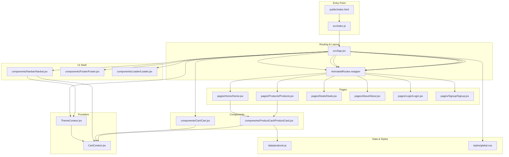

**Diagram sources**
- [index.js:1-6](file://src/index.js#L1-L6)
- [index.html:1-44](file://public/index.html#L1-L44)
- [App.jsx:1-75](file://src/App.jsx#L1-L75)
- [ThemeContext.jsx:1-30](file://src/context/ThemeContext.jsx#L1-L30)
- [CartContext.jsx:1-62](file://src/context/CartContext.jsx#L1-L62)
- [Navbar.jsx:1-143](file://src/components/Navbar/Navbar.jsx#L1-L143)
- [Cart.jsx:1-260](file://src/components/Cart/Cart.jsx#L1-L260)
- [ProductCard.jsx:1-134](file://src/components/ProductCard/ProductCard.jsx#L1-L134)
- [Home.jsx:1-176](file://src/pages/Home/Home.jsx#L1-L176)
- [Products.jsx:1-50](file://src/pages/Products/Products.jsx#L1-L50)
- [products.js:1-100](file://src/data/products.js#L1-L100)
- [global.css:1-142](file://src/styles/global.css#L1-L142)

**Section sources**
- [index.js:1-6](file://src/index.js#L1-L6)
- [index.html:1-44](file://public/index.html#L1-L44)
- [App.jsx:1-75](file://src/App.jsx#L1-L75)

## Core Components
- App: Orchestrates providers, routing, animations, and the loader. It conditionally renders the Navbar, Cart drawer, and pages, and applies theme and cart providers at the top level.
- Providers:
  - ThemeProvider: Manages theme state and applies a data attribute to the document root for CSS variable switching.
  - CartProvider: Centralizes cart state, exposes actions to add/remove/update items, and calculates totals.
- UI Shell:
  - Navbar: Integrates theme toggling, cart badge, navigation, and mobile menu.
  - Cart: Slide-in drawer with item list, quantities, pricing summary, and checkout flow.
  - ProductCard: Renders product info, ratings, pricing, quick view modal, and add-to-cart action.
- Pages:
  - Home: Hero section, category filters, and featured product grid.
  - Products: Full product listing with category filtering.
  - Login: Authentication form with validation and submission feedback.
- Data and Styles:
  - products.js: Static product catalog and categories.
  - global.css: CSS custom properties, theme-aware variables, and responsive utilities.

**Section sources**
- [App.jsx:1-75](file://src/App.jsx#L1-L75)
- [ThemeContext.jsx:1-30](file://src/context/ThemeContext.jsx#L1-L30)
- [CartContext.jsx:1-62](file://src/context/CartContext.jsx#L1-L62)
- [Navbar.jsx:1-143](file://src/components/Navbar/Navbar.jsx#L1-L143)
- [Cart.jsx:1-260](file://src/components/Cart/Cart.jsx#L1-L260)
- [ProductCard.jsx:1-134](file://src/components/ProductCard/ProductCard.jsx#L1-L134)
- [Home.jsx:1-176](file://src/pages/Home/Home.jsx#L1-L176)
- [Products.jsx:1-50](file://src/pages/Products/Products.jsx#L1-L50)
- [Login.jsx:1-123](file://src/pages/Login/Login.jsx#L1-L123)
- [products.js:1-100](file://src/data/products.js#L1-L100)
- [global.css:1-142](file://src/styles/global.css#L1-L142)

## Architecture Overview
The frontend follows a provider-centric architecture:
- App wraps the entire tree with ThemeProvider and CartProvider.
- Routing is handled by react-router-dom with animated transitions.
- Framer Motion powers page transitions and component animations.
- CSS Modules are used per component for scoped styling.
- Global CSS variables drive theme switching and responsive design.

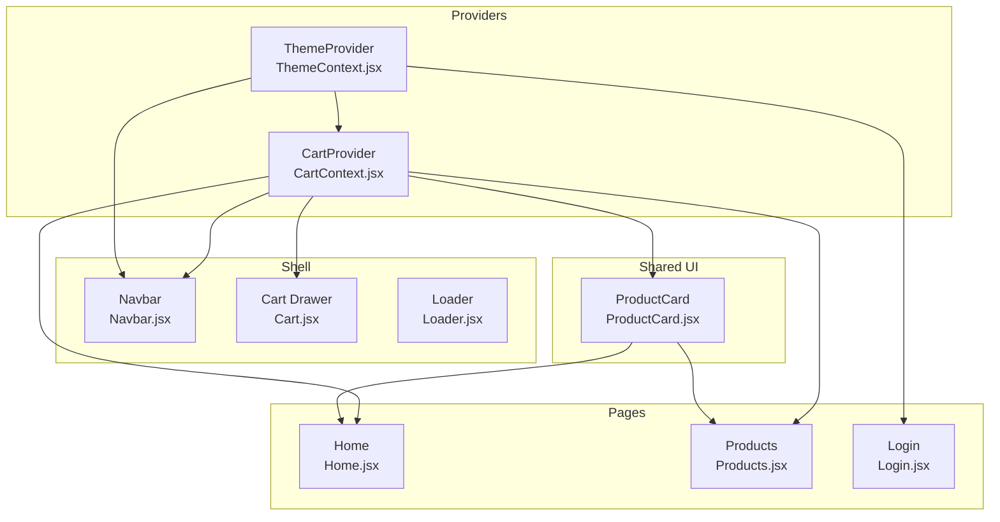

**Diagram sources**
- [App.jsx:1-75](file://src/App.jsx#L1-L75)
- [ThemeContext.jsx:1-30](file://src/context/ThemeContext.jsx#L1-L30)
- [CartContext.jsx:1-62](file://src/context/CartContext.jsx#L1-L62)
- [Navbar.jsx:1-143](file://src/components/Navbar/Navbar.jsx#L1-L143)
- [Cart.jsx:1-260](file://src/components/Cart/Cart.jsx#L1-L260)
- [ProductCard.jsx:1-134](file://src/components/ProductCard/ProductCard.jsx#L1-L134)
- [Home.jsx:1-176](file://src/pages/Home/Home.jsx#L1-L176)
- [Products.jsx:1-50](file://src/pages/Products/Products.jsx#L1-L50)
- [Login.jsx:1-123](file://src/pages/Login/Login.jsx#L1-L123)

## Detailed Component Analysis

### App and Routing Layer
- App sets up providers, router, and a pre-loader animation. It conditionally renders Navbar, Cart drawer, and Footer based on route visibility.
- AnimatedRoutes encapsulates page transitions using Framer Motion and react-router-dom’s location-based keys.
- The loader appears until a timeout completes, after which AnimatedRoutes mounts.

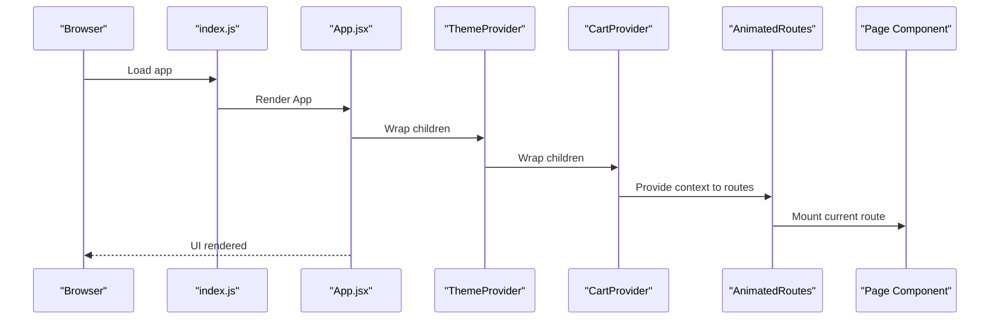

**Diagram sources**
- [index.js:1-6](file://src/index.js#L1-L6)
- [App.jsx:1-75](file://src/App.jsx#L1-L75)

**Section sources**
- [App.jsx:1-75](file://src/App.jsx#L1-L75)
- [index.js:1-6](file://src/index.js#L1-L6)

### ThemeContext and Theme Management
- ThemeProvider manages a boolean flag for theme selection and applies a data attribute to the document root to switch CSS variables.
- useTheme returns the current theme state and a toggle function used by Navbar.

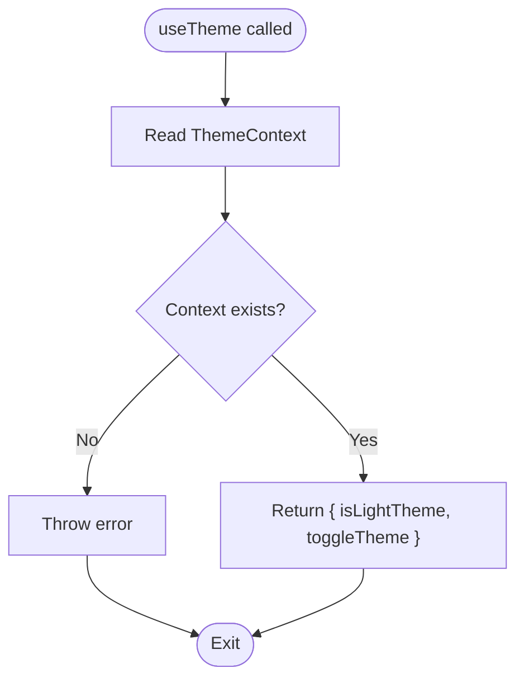

**Diagram sources**
- [ThemeContext.jsx:1-30](file://src/context/ThemeContext.jsx#L1-L30)

**Section sources**
- [ThemeContext.jsx:1-30](file://src/context/ThemeContext.jsx#L1-L30)
- [Navbar.jsx:1-143](file://src/components/Navbar/Navbar.jsx#L1-L143)
- [global.css:1-142](file://src/styles/global.css#L1-L142)

### CartContext and Shopping Cart
- CartProvider maintains items array, drawer open state, and derived totals.
- Actions include adding items (incrementing quantity if present), removing items, updating quantities, clearing the cart, and exposing totals.
- useCart enforces usage within provider boundaries.

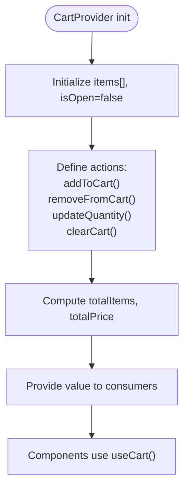

**Diagram sources**
- [CartContext.jsx:1-62](file://src/context/CartContext.jsx#L1-L62)

**Section sources**
- [CartContext.jsx:1-62](file://src/context/CartContext.jsx#L1-L62)
- [Cart.jsx:1-260](file://src/components/Cart/Cart.jsx#L1-L260)
- [ProductCard.jsx:1-134](file://src/components/ProductCard/ProductCard.jsx#L1-L134)
- [Navbar.jsx:1-143](file://src/components/Navbar/Navbar.jsx#L1-L143)

### Navbar: Navigation, Theme Toggle, and Cart Badge
- Subscribes to theme and cart contexts to render the logo, links, theme toggle icon, cart button with animated badge, and mobile menu.
- Uses scroll effects and route-based active states.

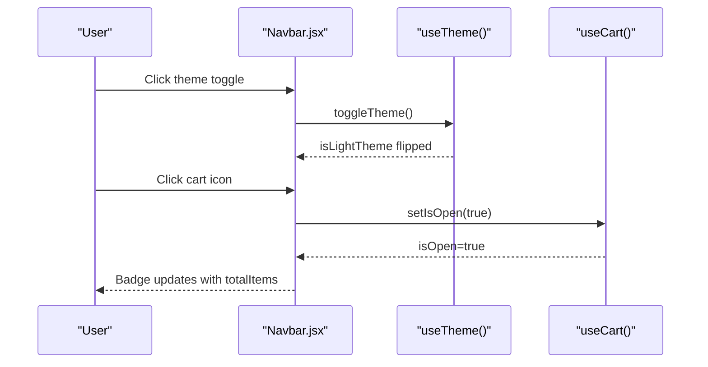

**Diagram sources**
- [Navbar.jsx:1-143](file://src/components/Navbar/Navbar.jsx#L1-L143)
- [ThemeContext.jsx:1-30](file://src/context/ThemeContext.jsx#L1-L30)
- [CartContext.jsx:1-62](file://src/context/CartContext.jsx#L1-L62)

**Section sources**
- [Navbar.jsx:1-143](file://src/components/Navbar/Navbar.jsx#L1-L143)
- [ThemeContext.jsx:1-30](file://src/context/ThemeContext.jsx#L1-L30)
- [CartContext.jsx:1-62](file://src/context/CartContext.jsx#L1-L62)

### Cart Drawer: Items, Pricing, and Checkout
- Renders a slide-in drawer with items list, quantity controls, remove actions, and a summary section.
- Calculates discount, delivery costs, and final price.
- Handles outside clicks, escape key, and body scroll locking.

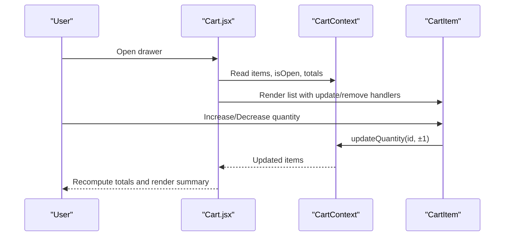

**Diagram sources**
- [Cart.jsx:1-260](file://src/components/Cart/Cart.jsx#L1-L260)
- [CartContext.jsx:1-62](file://src/context/CartContext.jsx#L1-L62)

**Section sources**
- [Cart.jsx:1-260](file://src/components/Cart/Cart.jsx#L1-L260)
- [CartContext.jsx:1-62](file://src/context/CartContext.jsx#L1-L62)

### ProductCard: Add to Cart and Quick View
- Displays product image, category, name, star rating, pricing, and discount percentage.
- Provides quick view modal via portal and integrates with CartContext to add items.
- Uses motion primitives for hover and tap interactions.

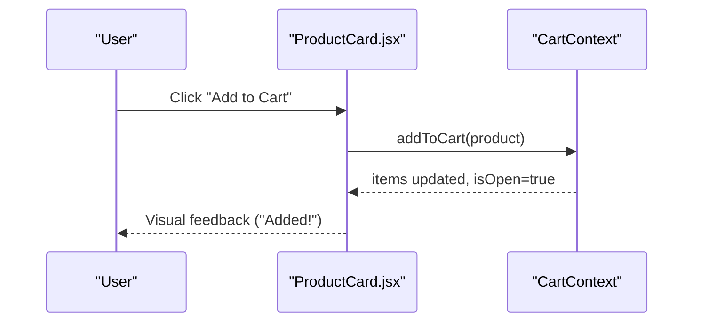

**Diagram sources**
- [ProductCard.jsx:1-134](file://src/components/ProductCard/ProductCard.jsx#L1-L134)
- [CartContext.jsx:1-62](file://src/context/CartContext.jsx#L1-L62)

**Section sources**
- [ProductCard.jsx:1-134](file://src/components/ProductCard/ProductCard.jsx#L1-L134)
- [CartContext.jsx:1-62](file://src/context/CartContext.jsx#L1-L62)
- [products.js:1-100](file://src/data/products.js#L1-L100)

### Pages: Home and Products
- Home: Hero section, stats, category filters, and a staggered product grid with animations.
- Products: Full listing with category filters and grid layout.

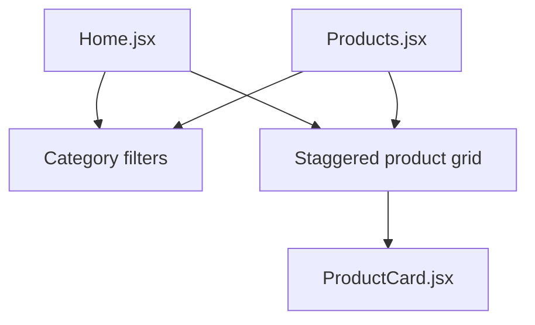

**Diagram sources**
- [Home.jsx:1-176](file://src/pages/Home/Home.jsx#L1-L176)
- [Products.jsx:1-50](file://src/pages/Products/Products.jsx#L1-L50)
- [ProductCard.jsx:1-134](file://src/components/ProductCard/ProductCard.jsx#L1-L134)

**Section sources**
- [Home.jsx:1-176](file://src/pages/Home/Home.jsx#L1-L176)
- [Products.jsx:1-50](file://src/pages/Products/Products.jsx#L1-L50)
- [ProductCard.jsx:1-134](file://src/components/ProductCard/ProductCard.jsx#L1-L134)
- [products.js:1-100](file://src/data/products.js#L1-L100)

### Login Page: Form and Feedback
- Implements a form with controlled inputs, password visibility toggle, and submission feedback.
- Uses motion for card entrance and success state.

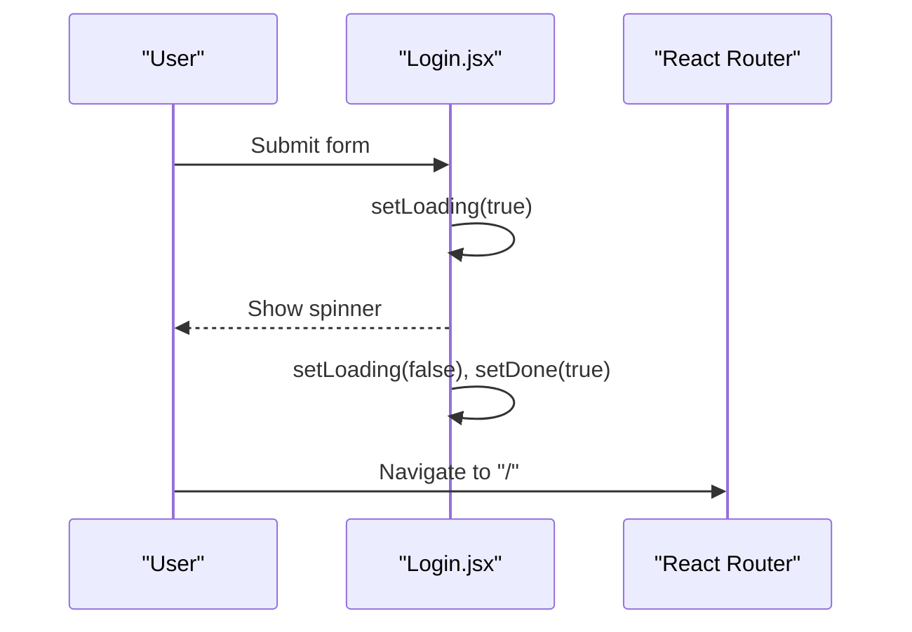

**Diagram sources**
- [Login.jsx:1-123](file://src/pages/Login/Login.jsx#L1-L123)

**Section sources**
- [Login.jsx:1-123](file://src/pages/Login/Login.jsx#L1-L123)

## Dependency Analysis
- Providers are at the top of the tree and consumed by shell components and page components.
- CartContext is consumed by Navbar (badge), Cart (drawer), and ProductCard (add to cart).
- ThemeContext is consumed by Navbar (theme toggle) and global CSS (theme variables).
- Pages depend on ProductCard and static data.
- Animation library (Framer Motion) is used across components for micro-interactions and page transitions.

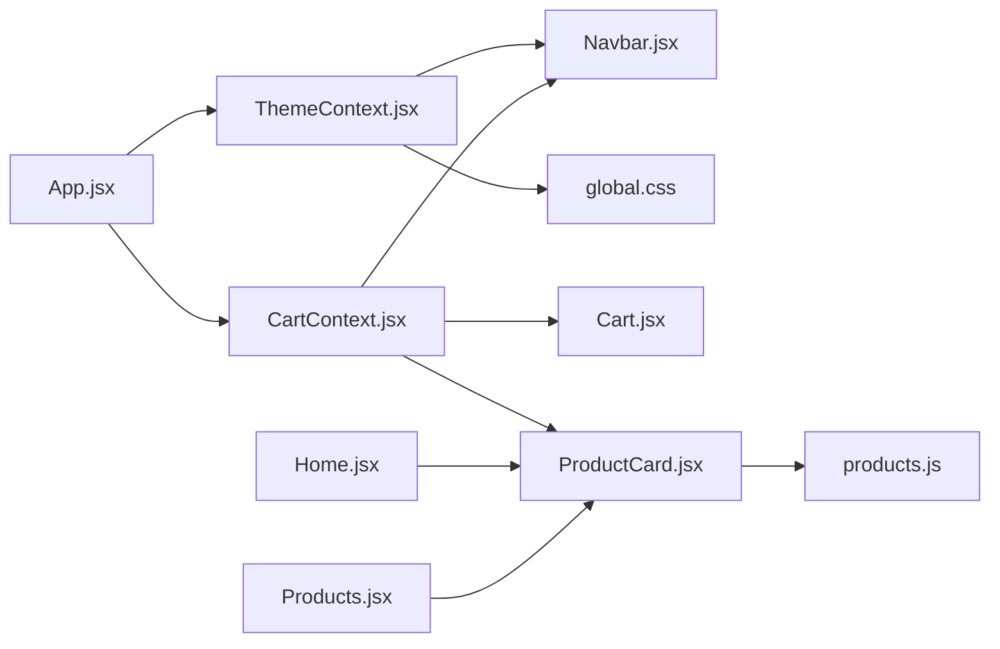

**Diagram sources**
- [ThemeContext.jsx:1-30](file://src/context/ThemeContext.jsx#L1-L30)
- [CartContext.jsx:1-62](file://src/context/CartContext.jsx#L1-L62)
- [Navbar.jsx:1-143](file://src/components/Navbar/Navbar.jsx#L1-L143)
- [Cart.jsx:1-260](file://src/components/Cart/Cart.jsx#L1-L260)
- [ProductCard.jsx:1-134](file://src/components/ProductCard/ProductCard.jsx#L1-L134)
- [Home.jsx:1-176](file://src/pages/Home/Home.jsx#L1-L176)
- [Products.jsx:1-50](file://src/pages/Products/Products.jsx#L1-L50)
- [products.js:1-100](file://src/data/products.js#L1-L100)
- [global.css:1-142](file://src/styles/global.css#L1-L142)
- [App.jsx:1-75](file://src/App.jsx#L1-L75)

**Section sources**
- [App.jsx:1-75](file://src/App.jsx#L1-L75)
- [ThemeContext.jsx:1-30](file://src/context/ThemeContext.jsx#L1-L30)
- [CartContext.jsx:1-62](file://src/context/CartContext.jsx#L1-L62)
- [Navbar.jsx:1-143](file://src/components/Navbar/Navbar.jsx#L1-L143)
- [Cart.jsx:1-260](file://src/components/Cart/Cart.jsx#L1-L260)
- [ProductCard.jsx:1-134](file://src/components/ProductCard/ProductCard.jsx#L1-L134)
- [Home.jsx:1-176](file://src/pages/Home/Home.jsx#L1-L176)
- [Products.jsx:1-50](file://src/pages/Products/Products.jsx#L1-L50)
- [products.js:1-100](file://src/data/products.js#L1-L100)
- [global.css:1-142](file://src/styles/global.css#L1-L142)

## Performance Considerations
- Context granularity: CartProvider exposes computed totals and actions; keep updates minimal to avoid unnecessary re-renders.
- Memoization: useCallback is used for cart actions to prevent prop drift and reduce re-renders in consumers.
- Animations: Framer Motion is used for lightweight UI animations; prefer layout animations only where necessary.
- Images: Lazy loading is applied in ProductCard; ensure external images are optimized.
- Scroll locking: Cart drawer locks body scroll; ensure cleanup on unmount.
- CSS Modules: Scoped styles reduce specificity conflicts and improve maintainability.

[No sources needed since this section provides general guidance]

## Troubleshooting Guide
- Context not wrapped: If useCart or useTheme throws an error, ensure the respective provider is mounted above the consuming component.
- Theme not applying: Verify the data attribute on the document root and CSS variable overrides in global styles.
- Cart drawer not closing: Confirm event listeners for outside clicks and escape key are attached and cleaned up.
- Routing issues: Ensure AnimatedRoutes wraps Routes and uses location as key to reset transitions on route change.
- Loader timing: Adjust the timeout in App to match perceived loading; avoid premature hiding.

**Section sources**
- [CartContext.jsx:58-62](file://src/context/CartContext.jsx#L58-L62)
- [ThemeContext.jsx:24-30](file://src/context/ThemeContext.jsx#L24-L30)
- [Cart.jsx:86-108](file://src/components/Cart/Cart.jsx#L86-L108)
- [App.jsx:24-53](file://src/App.jsx#L24-L53)

## Conclusion
The frontend employs a clean, provider-driven architecture with clear separation of concerns. Context APIs manage cross-cutting state (theme and cart), while pages and components remain declarative and reusable. CSS Modules and global CSS variables support modular styling and theme switching. Framer Motion enhances UX with subtle animations. The structure supports scalability and maintainability, with room to integrate backend APIs by extending context actions and data fetching hooks.

[No sources needed since this section summarizes without analyzing specific files]

## Appendices

### Styling Architecture and Responsive Design
- CSS Modules: Each component uses a dedicated module CSS file for scoped styles.
- Global CSS: Defines CSS custom properties and theme-aware variables; light/dark themes switch via a data attribute.
- Responsive utilities: Container widths, paddings, and media queries adapt to larger screens.

**Section sources**
- [global.css:1-142](file://src/styles/global.css#L1-L142)

### Infrastructure and Build Requirements
- React 19, react-router-dom, framer-motion, and react-scripts are used for UI, routing, animations, and build tooling.
- The app targets modern browsers with specified support ranges.

**Section sources**
- [package.json:1-42](file://package.json#L1-L42)