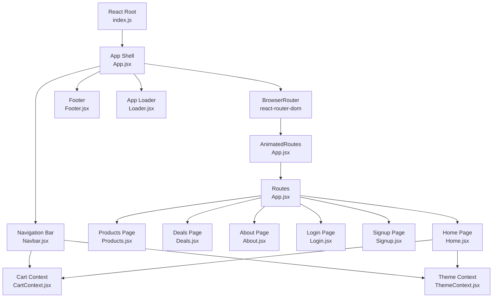
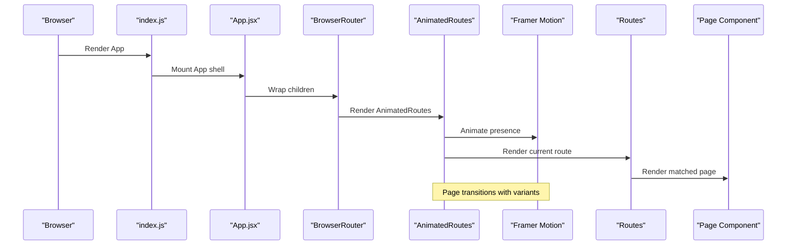
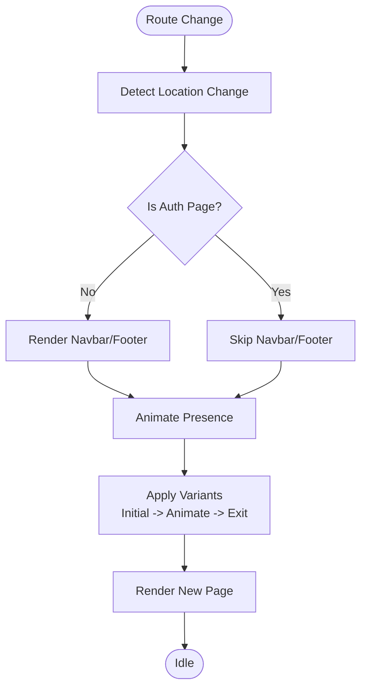
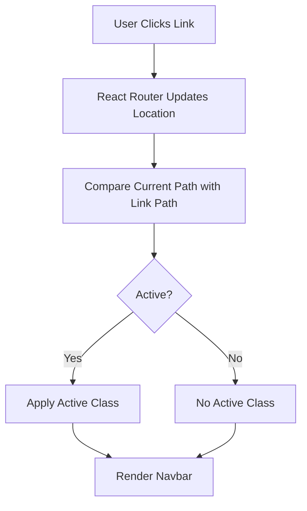
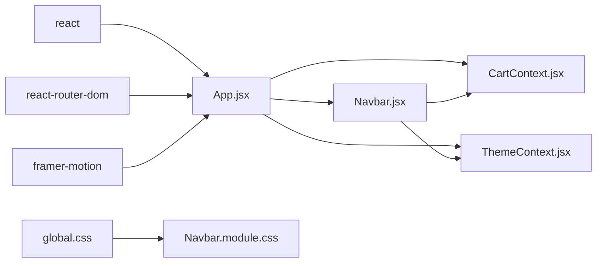

# Routing and Navigation

<cite>
**Referenced Files in This Document**
- [App.jsx](file://src/App.jsx)
- [index.js](file://src/index.js)
- [Navbar.jsx](file://src/components/Navbar/Navbar.jsx)
- [Navbar.module.css](file://src/components/Navbar/Navbar.module.css)
- [CartContext.jsx](file://src/context/CartContext.jsx)
- [ThemeContext.jsx](file://src/context/ThemeContext.jsx)
- [Home.jsx](file://src/pages/Home/Home.jsx)
- [Login.jsx](file://src/pages/Login/Login.jsx)
- [Signup.jsx](file://src/pages/Signup/Signup.jsx)
- [Footer.jsx](file://src/components/Footer/Footer.jsx)
- [Loader.jsx](file://src/components/Loader/Loader.jsx)
- [global.css](file://src/styles/global.css)
- [package.json](file://package.json)
</cite>

## Table of Contents
1. [Introduction](#introduction)
2. [Project Structure](#project-structure)
3. [Core Components](#core-components)
4. [Architecture Overview](#architecture-overview)
5. [Detailed Component Analysis](#detailed-component-analysis)
6. [Dependency Analysis](#dependency-analysis)
7. [Performance Considerations](#performance-considerations)
8. [Troubleshooting Guide](#troubleshooting-guide)
9. [Conclusion](#conclusion)

## Introduction
This document explains the React Router DOM implementation and navigation system used in the application. It covers routing configuration with animated page transitions powered by Framer Motion, route protection mechanisms, conditional rendering based on authentication status, and the integration of the navigation bar. It also documents mobile-responsive navigation patterns, active link highlighting, programmatic navigation, route parameters handling, navigation guards, performance optimization for route transitions, and accessibility considerations for navigation elements.

## Project Structure
The routing and navigation system centers around the application shell and page components. The router is configured at the root level, and page transitions are animated using Framer Motion. The navigation bar integrates with the routing system and provides responsive behavior for desktop and mobile.

**Diagram sources**
- [index.js:1-6](file://src/index.js#L1-L6)
- [App.jsx:1-75](file://src/App.jsx#L1-L75)
- [Navbar.jsx:1-143](file://src/components/Navbar/Navbar.jsx#L1-L143)
- [CartContext.jsx:1-62](file://src/context/CartContext.jsx#L1-L62)
- [ThemeContext.jsx:1-30](file://src/context/ThemeContext.jsx#L1-L30)
- [Home.jsx:1-176](file://src/pages/Home/Home.jsx#L1-L176)
- [Footer.jsx:1-65](file://src/components/Footer/Footer.jsx#L1-L65)
- [Loader.jsx:1-18](file://src/components/Loader/Loader.jsx#L1-L18)

**Section sources**
- [index.js:1-6](file://src/index.js#L1-L6)
- [App.jsx:1-75](file://src/App.jsx#L1-L75)

## Core Components
- Application shell and router configuration: The application bootstraps the router and sets up animated page transitions with Framer Motion. Authentication-aware conditional rendering is implemented to hide navigation elements on authentication pages.
- Navigation bar: Provides desktop and mobile navigation, active link highlighting, theme switching, cart integration, and responsive behavior.
- Context providers: Cart and theme contexts are provided at the application root to enable cross-component state sharing.
- Page components: Home page demonstrates programmatic navigation and animated content.

Key implementation references:
- Router and animated routes: [App.jsx:24-53](file://src/App.jsx#L24-L53)
- Conditional rendering for auth pages: [App.jsx:26](file://src/App.jsx#L26)
- Navigation bar integration: [App.jsx:30-31](file://src/App.jsx#L30-L31)
- Cart and theme contexts: [App.jsx:4](file://src/App.jsx#L4-L5), [CartContext.jsx:5-56](file://src/context/CartContext.jsx#L5-L56), [ThemeContext.jsx:5-22](file://src/context/ThemeContext.jsx#L5-L22)
- Programmatic navigation example: [Home.jsx:21](file://src/pages/Home/Home.jsx#L21), [Home.jsx:73](file://src/pages/Home/Home.jsx#L73), [Home.jsx:81](file://src/pages/Home/Home.jsx#L81)

**Section sources**
- [App.jsx:18-53](file://src/App.jsx#L18-L53)
- [CartContext.jsx:1-62](file://src/context/CartContext.jsx#L1-L62)
- [ThemeContext.jsx:1-30](file://src/context/ThemeContext.jsx#L1-L30)
- [Home.jsx:18-85](file://src/pages/Home/Home.jsx#L18-L85)

## Architecture Overview
The routing architecture uses React Router DOM with animated page transitions. The animation pipeline ensures smooth transitions between routes, while the navigation bar remains consistent except on authentication pages. Context providers supply shared state to the navigation bar and pages.

**Diagram sources**
- [index.js:1-6](file://src/index.js#L1-L6)
- [App.jsx:24-53](file://src/App.jsx#L24-L53)
- [App.jsx:18-22](file://src/App.jsx#L18-L22)

## Detailed Component Analysis

### Routing Configuration and Animated Transitions
- Router setup: The application wraps the app with BrowserRouter to enable client-side routing.
- Animated routes: AnimatedRoutes uses AnimatePresence with mode="wait" and a motion wrapper keyed by location pathname to animate transitions.
- Page variants: A variant object defines initial, animate, and exit states for smooth fade and subtle movement during transitions.
- Conditional rendering: Authentication pages (/login, /signup) are excluded from Navbar and Footer rendering to keep the auth forms focused.

Implementation references:
- Router and animated routes: [App.jsx:66-70](file://src/App.jsx#L66-L70), [App.jsx:24-53](file://src/App.jsx#L24-L53)
- Page variants: [App.jsx:18-22](file://src/App.jsx#L18-L22)
- Auth page exclusion: [App.jsx:26](file://src/App.jsx#L26), [App.jsx:30-31](file://src/App.jsx#L30-L31), [App.jsx:48](file://src/App.jsx#L48)

**Diagram sources**
- [App.jsx:24-53](file://src/App.jsx#L24-L53)
- [App.jsx:18-22](file://src/App.jsx#L18-L22)

**Section sources**
- [App.jsx:18-53](file://src/App.jsx#L18-L53)

### Navigation Bar Integration and Active Link Highlighting
- Desktop navigation: The navbar renders a list of links mapped from a static array, with active state determined by the current location.
- Mobile responsiveness: A hamburger menu toggles a mobile drawer containing the same navigation links plus theme switch and sign-in/sign-up actions.
- Active link highlighting: The active class is applied conditionally based on the current pathname.
- Accessibility: Buttons and links include aria-label attributes for assistive technologies.

Implementation references:
- Navigation bar structure and effects: [Navbar.jsx:8-143](file://src/components/Navbar/Navbar.jsx#L8-L143)
- Active link logic: [Navbar.jsx:44-46](file://src/components/Navbar/Navbar.jsx#L44-L46)
- Mobile menu toggle: [Navbar.jsx:109-111](file://src/components/Navbar/Navbar.jsx#L109-L111)
- Scroll effect and cleanup: [Navbar.jsx:15-19](file://src/components/Navbar/Navbar.jsx#L15-L19)
- Responsive breakpoints: [Navbar.module.css:247-273](file://src/components/Navbar/Navbar.module.css#L247-L273)

**Diagram sources**
- [Navbar.jsx:44-46](file://src/components/Navbar/Navbar.jsx#L44-L46)

**Section sources**
- [Navbar.jsx:8-143](file://src/components/Navbar/Navbar.jsx#L8-L143)
- [Navbar.module.css:78-122](file://src/components/Navbar/Navbar.module.css#L78-L122)

### Mobile-Responsive Navigation Patterns
- Desktop layout: Navigation links are centered and styled with hover and active states.
- Tablet/mobile layout: Links and login button are hidden; a hamburger icon reveals a vertical mobile menu with themed background and blur effect.
- Theme-aware styling: The navbar adapts its appearance based on the active theme via CSS custom properties.

Implementation references:
- Desktop vs mobile visibility: [Navbar.module.css:256-264](file://src/components/Navbar/Navbar.module.css#L256-L264)
- Mobile menu drawer: [Navbar.jsx:115-140](file://src/components/Navbar/Navbar.jsx#L115-L140)
- Theme integration: [ThemeContext.jsx:5-22](file://src/context/ThemeContext.jsx#L5-L22), [Navbar.module.css:19-24](file://src/components/Navbar/Navbar.module.css#L19-L24)

**Section sources**
- [Navbar.module.css:247-273](file://src/components/Navbar/Navbar.module.css#L247-L273)
- [Navbar.jsx:115-140](file://src/components/Navbar/Navbar.jsx#L115-L140)

### Route Protection Mechanisms
- Current state: There is no explicit route protection in the provided code. Authentication-aware conditional rendering hides Navbar and Footer on /login and /signup.
- Recommended guard pattern: Implement a custom hook or higher-order component that checks authentication state and redirects unauthenticated users away from protected routes. Place guards around sensitive routes or wrap the Routes component with a protection layer.

Implementation references:
- Auth page exclusion: [App.jsx:26](file://src/App.jsx#L26), [App.jsx:30-31](file://src/App.jsx#L30-L31)

**Section sources**
- [App.jsx:24-53](file://src/App.jsx#L24-L53)

### Conditional Rendering Based on Authentication Status
- Conditional rendering: Navbar and Footer are conditionally rendered depending on whether the current path is an authentication page.
- Authentication pages: /login and /signup are treated as special cases to avoid rendering navigation elements.

Implementation references:
- Auth page detection: [App.jsx:26](file://src/App.jsx#L26)
- Conditional render: [App.jsx:30-31](file://src/App.jsx#L30-L31), [App.jsx:48](file://src/App.jsx#L48)

**Section sources**
- [App.jsx:24-53](file://src/App.jsx#L24-L53)

### Programmatic Navigation
- useNavigate hook: Pages can programmatically navigate by calling useNavigate and passing a path string.
- Examples:
  - Navigate to products from home hero CTA.
  - Navigate to deals from home hero CTA and banner.
  - Navigate back to home from login success message.

Implementation references:
- Programmatic navigation in Home: [Home.jsx:21](file://src/pages/Home/Home.jsx#L21), [Home.jsx:73](file://src/pages/Home/Home.jsx#L73), [Home.jsx:81](file://src/pages/Home/Home.jsx#L81)

**Section sources**
- [Home.jsx:18-85](file://src/pages/Home/Home.jsx#L18-L85)

### Route Parameters Handling
- Current state: The provided code does not demonstrate route parameters handling. Routes are defined with static paths.
- Recommended approach: Use React Router’s useParams hook in page components to read dynamic segments from the URL. Define routes with placeholders (e.g., /products/:id) and consume parameters in the component.

Implementation references:
- Static routes: [App.jsx:40-46](file://src/App.jsx#L40-L46)

**Section sources**
- [App.jsx:40-46](file://src/App.jsx#L40-L46)

### Navigation Guards
- Current state: No explicit guards are implemented in the provided code.
- Recommended implementation: Create a guard component or hook that checks authentication state and either allows navigation or redirects. Apply guards around protected routes or globally via a navigation listener.

Implementation references:
- Auth-aware conditional rendering: [App.jsx:26](file://src/App.jsx#L26)

**Section sources**
- [App.jsx:24-53](file://src/App.jsx#L24-L53)

### Cart and Theme Integration in Navigation
- Cart integration: The navbar exposes a cart button that toggles the cart panel via the CartContext. The badge updates reactively based on total items.
- Theme integration: The navbar includes a theme toggle that switches between light and dark themes using ThemeContext.

Implementation references:
- Cart integration: [Navbar.jsx:85-105](file://src/components/Navbar/Navbar.jsx#L85-L105), [CartContext.jsx:5-56](file://src/context/CartContext.jsx#L5-L56)
- Theme integration: [Navbar.jsx:61-83](file://src/components/Navbar/Navbar.jsx#L61-L83), [ThemeContext.jsx:5-22](file://src/context/ThemeContext.jsx#L5-L22)

**Section sources**
- [Navbar.jsx:8-143](file://src/components/Navbar/Navbar.jsx#L8-L143)
- [CartContext.jsx:1-62](file://src/context/CartContext.jsx#L1-L62)
- [ThemeContext.jsx:1-30](file://src/context/ThemeContext.jsx#L1-L30)

### Accessibility Considerations
- ARIA labels: Buttons and links include aria-label attributes for assistive technologies.
- Focus and keyboard navigation: Ensure focus indicators and keyboard operability for interactive elements (links, buttons).
- Semantic markup: Use semantic HTML elements (nav, ul, li) for navigation structure.

Implementation references:
- ARIA labels: [Navbar.jsx:64](file://src/components/Navbar/Navbar.jsx#L64), [Navbar.jsx:109](file://src/components/Navbar/Navbar.jsx#L109)
- Semantic structure: [Navbar.jsx:24-142](file://src/components/Navbar/Navbar.jsx#L24-L142)

**Section sources**
- [Navbar.jsx:8-143](file://src/components/Navbar/Navbar.jsx#L8-L143)

## Dependency Analysis
The routing system depends on React Router DOM and Framer Motion for animations. Context providers supply state to the navigation bar and pages. The global theme variables influence navbar styling.

**Diagram sources**
- [package.json:10-13](file://package.json#L10-L13)
- [App.jsx:1-16](file://src/App.jsx#L1-L16)
- [Navbar.jsx:1-6](file://src/components/Navbar/Navbar.jsx#L1-L6)
- [global.css:1-142](file://src/styles/global.css#L1-L142)
- [Navbar.module.css:1-273](file://src/components/Navbar/Navbar.module.css#L1-L273)

**Section sources**
- [package.json:10-13](file://package.json#L10-L13)
- [App.jsx:1-16](file://src/App.jsx#L1-L16)

## Performance Considerations
- Animation performance: Use Framer Motion’s built-in optimizations (e.g., transform and opacity) to minimize layout thrashing. Keep transition durations reasonable to avoid perceived lag.
- Conditional rendering: Avoid unnecessary re-renders by keeping the conditional logic minimal and leveraging memoization where appropriate.
- Bundle size: Prefer lazy loading for heavy pages to reduce initial load time.
- CSS variables: Centralize theme and spacing variables to reduce CSS overhead and improve maintainability.

[No sources needed since this section provides general guidance]

## Troubleshooting Guide
- Navigation not updating active state: Verify that the active comparison uses the correct path and that the Link component’s to prop matches the expected path.
- Mobile menu not closing: Ensure the location change handler resets the menu state when the route changes.
- Theme not applying: Confirm that the theme provider is wrapping the app and that CSS variables are correctly set on the document root.
- Cart badge not updating: Check that the cart context is correctly providing totalItems and that the badge is conditionally rendered only when totalItems > 0.

**Section sources**
- [Navbar.jsx:21](file://src/components/Navbar/Navbar.jsx#L21)
- [ThemeContext.jsx:8-11](file://src/context/ThemeContext.jsx#L8-L11)
- [CartContext.jsx:36](file://src/context/CartContext.jsx#L36)

## Conclusion
The application implements a clean routing and navigation system with animated transitions and responsive design. While authentication-aware conditional rendering is present, explicit route protection and parameter handling are not implemented in the provided code. The navigation bar integrates cart and theme contexts seamlessly, and accessibility is considered through ARIA labels and semantic markup. Extending the system with route guards, parameter handling, and performance optimizations would further strengthen the navigation experience.