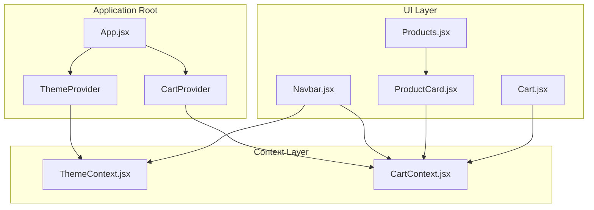
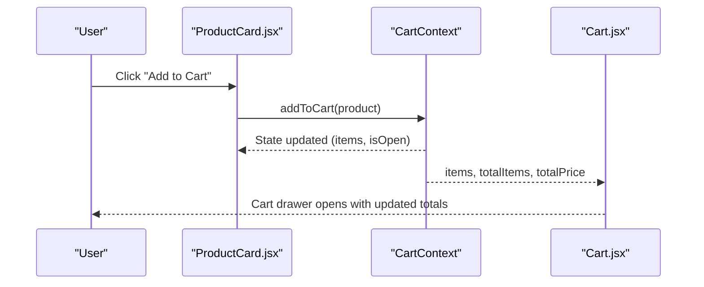
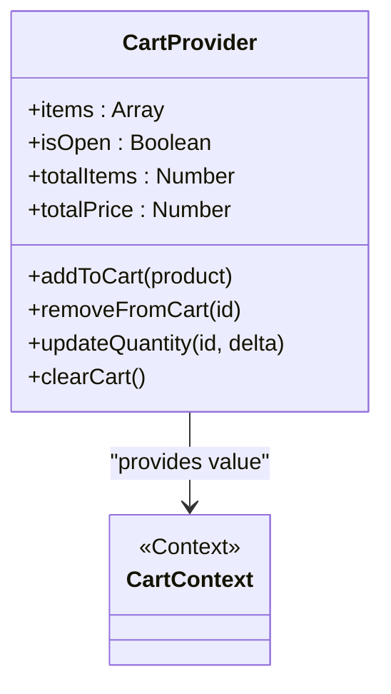
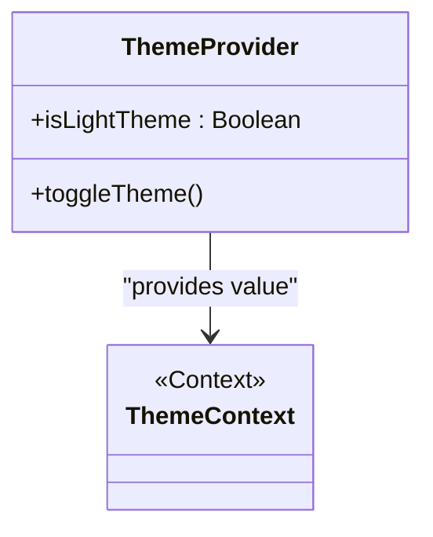
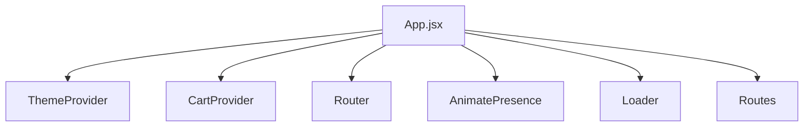
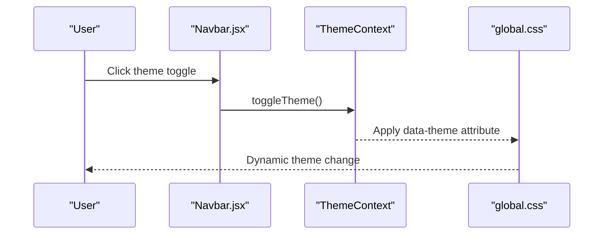
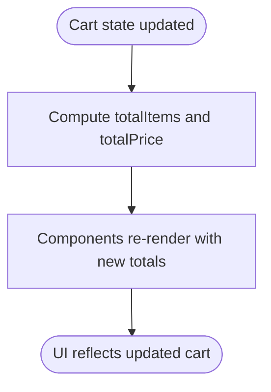
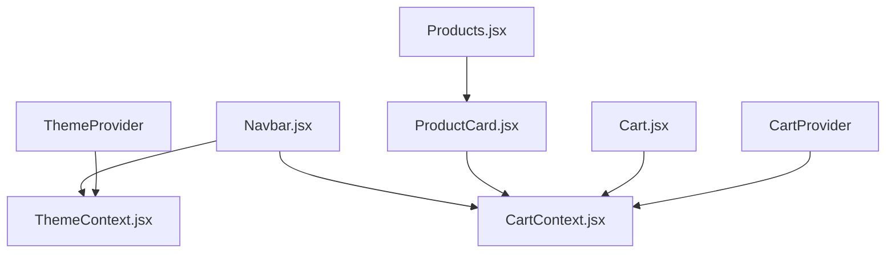

# State Management with Context API

<cite>
**Referenced Files in This Document**
- [CartContext.jsx](file://src/context/CartContext.jsx)
- [ThemeContext.jsx](file://src/context/ThemeContext.jsx)
- [App.jsx](file://src/App.jsx)
- [Navbar.jsx](file://src/components/Navbar/Navbar.jsx)
- [Cart.jsx](file://src/components/Cart/Cart.jsx)
- [ProductCard.jsx](file://src/components/ProductCard/ProductCard.jsx)
- [Products.jsx](file://src/pages/Products/Products.jsx)
- [global.css](file://src/styles/global.css)
- [products.js](file://src/data/products.js)
- [package.json](file://package.json)
</cite>

## Table of Contents
1. [Introduction](#introduction)
2. [Project Structure](#project-structure)
3. [Core Components](#core-components)
4. [Architecture Overview](#architecture-overview)
5. [Detailed Component Analysis](#detailed-component-analysis)
6. [Dependency Analysis](#dependency-analysis)
7. [Performance Considerations](#performance-considerations)
8. [Troubleshooting Guide](#troubleshooting-guide)
9. [Conclusion](#conclusion)

## Introduction
This document explains the Context API-based state management system implemented in the application. It focuses on two primary contexts:
- CartContext: Manages shopping cart state across components, including add/remove/update operations, real-time calculations, and UI state (open/closed).
- ThemeContext: Handles light/dark mode switching, applies theme to the document root, and enables dynamic styling updates.

The guide covers provider wrapping strategies, concrete examples of useContext usage, state update patterns, performance considerations, and best practices to avoid unnecessary re-renders.

## Project Structure
The state management is organized around two context providers wrapped at the application root. Components consume these contexts to access state and dispatch actions.

**Diagram sources**
- [App.jsx:55-75](file://src/App.jsx#L55-L75)
- [ThemeContext.jsx:5-22](file://src/context/ThemeContext.jsx#L5-L22)
- [CartContext.jsx:5-56](file://src/context/CartContext.jsx#L5-L56)
- [Navbar.jsx:4-12](file://src/components/Navbar/Navbar.jsx#L4-L12)
- [ProductCard.jsx:4-24](file://src/components/ProductCard/ProductCard.jsx#L4-L24)
- [Cart.jsx:76-76](file://src/components/Cart/Cart.jsx#L76-L76)
- [Products.jsx:2-3](file://src/pages/Products/Products.jsx#L2-L3)

**Section sources**
- [App.jsx:1-75](file://src/App.jsx#L1-L75)
- [package.json:1-42](file://package.json#L1-L42)

## Core Components
This section documents the two contexts and their responsibilities.

- CartContext
  - Provides cart state: items, isOpen, and derived totals (totalItems, totalPrice).
  - Exposes actions: addToCart, removeFromCart, updateQuantity, clearCart, and setIsOpen.
  - Uses memoized callbacks to prevent unnecessary re-renders of consumers.

- ThemeContext
  - Manages isLightTheme state and exposes toggleTheme.
  - Applies the theme to the document root via a data attribute for CSS-driven styling.

**Section sources**
- [CartContext.jsx:1-62](file://src/context/CartContext.jsx#L1-L62)
- [ThemeContext.jsx:1-30](file://src/context/ThemeContext.jsx#L1-L30)

## Architecture Overview
The application wraps the entire app with ThemeProvider and CartProvider. Components access context values through dedicated hooks and trigger state updates via action functions.

**Diagram sources**
- [ProductCard.jsx:33-37](file://src/components/ProductCard/ProductCard.jsx#L33-L37)
- [CartContext.jsx:9-20](file://src/context/CartContext.jsx#L9-L20)
- [Cart.jsx:76-76](file://src/components/Cart/Cart.jsx#L76-L76)

## Detailed Component Analysis

### CartContext Implementation
CartContext encapsulates cart state and actions. It computes derived values (totalItems, totalPrice) and exposes them alongside the state.

Key implementation patterns:
- State initialization: items and isOpen managed via useState.
- Actions implemented with useCallback to stabilize references:
  - addToCart: merges existing items or adds a new item with quantity 1.
  - removeFromCart: filters out items by id.
  - updateQuantity: adjusts quantity and removes items when quantity reaches zero.
  - clearCart: resets items to an empty array.
- Derived values: computed via reduce on items for totalItems and totalPrice.
- Provider value: exposes all state and actions for consumption.

**Diagram sources**
- [CartContext.jsx:5-56](file://src/context/CartContext.jsx#L5-L56)

**Section sources**
- [CartContext.jsx:5-56](file://src/context/CartContext.jsx#L5-L56)

### ThemeContext Implementation
ThemeContext controls light/dark mode and applies it to the document root for CSS-driven styling.

Key implementation patterns:
- State: isLightTheme toggled by toggleTheme.
- Side effect: useEffect applies a data attribute to document.documentElement reflecting the current theme.
- Provider value: exposes isLightTheme and toggleTheme.

**Diagram sources**
- [ThemeContext.jsx:5-22](file://src/context/ThemeContext.jsx#L5-L22)

**Section sources**
- [ThemeContext.jsx:5-22](file://src/context/ThemeContext.jsx#L5-L22)

### Provider Wrapping Strategy
App.jsx demonstrates the provider composition pattern:
- ThemeProvider wraps the entire application.
- CartProvider wraps the routing layer.
- Animated loader and route transitions occur within the providers.

**Diagram sources**
- [App.jsx:64-74](file://src/App.jsx#L64-L74)

**Section sources**
- [App.jsx:55-75](file://src/App.jsx#L55-L75)

### Consumer Usage Patterns

- Using CartContext in Navbar:
  - Consumes totalItems and setIsOpen to show the cart badge and open the drawer.
  - Consumes isLightTheme and toggleTheme to switch themes.

- Using CartContext in ProductCard:
  - Calls addToCart to add a product to the cart.
  - Uses formatted prices and UI feedback.

- Using CartContext in Cart drawer:
  - Reads items, totalItems, totalPrice to render the cart summary.
  - Uses updateQuantity and removeFromCart to modify items.
  - Uses setIsOpen to close the drawer.

- Using ThemeContext in Navbar:
  - Toggles theme via toggleTheme and reflects current theme in UI.

**Diagram sources**
- [Navbar.jsx:61-83](file://src/components/Navbar/Navbar.jsx#L61-L83)
- [ThemeContext.jsx:13-15](file://src/context/ThemeContext.jsx#L13-L15)
- [global.css:52-74](file://src/styles/global.css#L52-L74)

**Section sources**
- [Navbar.jsx:11-12](file://src/components/Navbar/Navbar.jsx#L11-L12)
- [ProductCard.jsx:24-37](file://src/components/ProductCard/ProductCard.jsx#L24-L37)
- [Cart.jsx:76-76](file://src/components/Cart/Cart.jsx#L76-L76)
- [global.css:82-95](file://src/styles/global.css#L82-L95)

### Real-Time Calculations and UI Updates
CartContext computes totalItems and totalPrice on demand from items. Consumers rely on these derived values to render summaries and badges without manual recalculation.

- Cart drawer displays subtotal, discount, delivery, and total using derived values.
- Navbar badge updates reactively as items change.

**Diagram sources**
- [CartContext.jsx:36-37](file://src/context/CartContext.jsx#L36-L37)
- [Cart.jsx:110-112](file://src/components/Cart/Cart.jsx#L110-L112)
- [Navbar.jsx:91-103](file://src/components/Navbar/Navbar.jsx#L91-L103)

**Section sources**
- [CartContext.jsx:36-37](file://src/context/CartContext.jsx#L36-L37)
- [Cart.jsx:110-112](file://src/components/Cart/Cart.jsx#L110-L112)
- [Navbar.jsx:91-103](file://src/components/Navbar/Navbar.jsx#L91-L103)

### State Persistence Considerations
- Cart state is currently local to the browser session and does not persist across reloads. No localStorage integration is present in the current implementation.
- Theme preference is not persisted in the current implementation; it resets on reload.

Recommendations for persistence (conceptual):
- For Cart: Store items in localStorage on state changes and hydrate on mount.
- For Theme: Persist isLightTheme in localStorage and apply on mount.

[No sources needed since this section provides conceptual guidance]

## Dependency Analysis
The application’s dependency graph centers on the two contexts and their consumers.

**Diagram sources**
- [App.jsx:4-5](file://src/App.jsx#L4-L5)
- [Navbar.jsx:4-5](file://src/components/Navbar/Navbar.jsx#L4-L5)
- [ProductCard.jsx:4](file://src/components/ProductCard/ProductCard.jsx#L4)
- [Cart.jsx:3](file://src/components/Cart/Cart.jsx#L3)
- [Products.jsx:2](file://src/pages/Products/Products.jsx#L2)
- [ThemeContext.jsx:3](file://src/context/ThemeContext.jsx#L3)
- [CartContext.jsx:3](file://src/context/CartContext.jsx#L3)

**Section sources**
- [App.jsx:4-5](file://src/App.jsx#L4-L5)
- [Navbar.jsx:4-5](file://src/components/Navbar/Navbar.jsx#L4-L5)
- [ProductCard.jsx:4](file://src/components/ProductCard/ProductCard.jsx#L4)
- [Cart.jsx:3](file://src/components/Cart/Cart.jsx#L3)
- [Products.jsx:2](file://src/pages/Products/Products.jsx#L2)
- [ThemeContext.jsx:3](file://src/context/ThemeContext.jsx#L3)
- [CartContext.jsx:3](file://src/context/CartContext.jsx#L3)

## Performance Considerations
- Memoization: CartContext uses useCallback for actions to stabilize references and minimize re-renders in consumers.
- Derived values: totalItems and totalPrice are computed on demand; consumers should avoid recomputing them locally.
- Provider scope: Wrapping only necessary parts of the tree reduces unnecessary propagation of context updates.
- Event handlers: Prefer passing stable references (callbacks) to child components to avoid prop drilling and excessive re-renders.

[No sources needed since this section provides general guidance]

## Troubleshooting Guide
Common issues and resolutions:
- Error: "useCart must be used inside CartProvider"
  - Cause: A component used useCart without being wrapped by CartProvider.
  - Resolution: Ensure CartProvider is higher in the component tree than any consumer.

- Error: "useTheme must be used within a ThemeProvider"
  - Cause: A component used useTheme without being wrapped by ThemeProvider.
  - Resolution: Ensure ThemeProvider is higher in the component tree than any consumer.

- Theme not applying
  - Cause: Missing data-theme attribute on document.documentElement.
  - Resolution: Verify ThemeProvider is rendering and useEffect runs on mount.

- Cart totals not updating
  - Cause: Consumers not subscribing to the context value or not using derived values.
  - Resolution: Ensure components use useCart and read totalItems/totalPrice from the context.

**Section sources**
- [CartContext.jsx:58-62](file://src/context/CartContext.jsx#L58-L62)
- [ThemeContext.jsx:24-30](file://src/context/ThemeContext.jsx#L24-L30)
- [ThemeContext.jsx:8-11](file://src/context/ThemeContext.jsx#L8-L11)

## Conclusion
The application employs a clean, minimal Context API implementation:
- CartContext centralizes cart state and actions with memoized callbacks and computed totals.
- ThemeContext manages theme state and applies it globally via CSS variables.
- Providers are composed at the root to enable seamless cross-component access.
- Consumers demonstrate practical patterns for adding items, updating quantities, and rendering totals.

Future enhancements could include:
- Persisting cart and theme preferences to localStorage.
- Optimizing provider boundaries to limit re-renders.
- Introducing selectors or reducers for complex state logic if the cart grows larger.