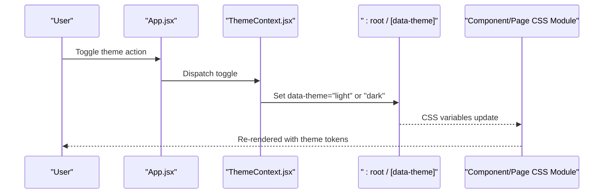
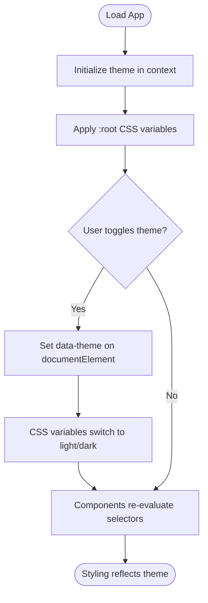
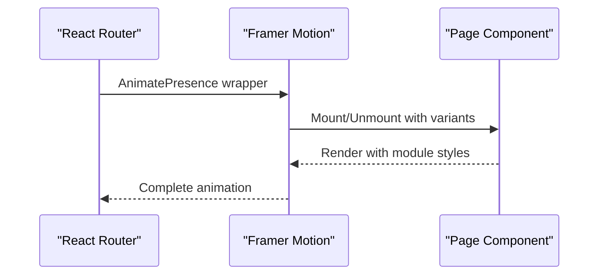
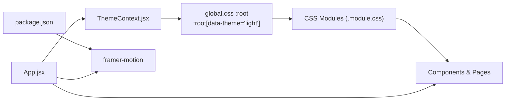

# Styling Architecture and Design System

<cite>
**Referenced Files in This Document**
- [global.css](file://src/styles/global.css)
- [index.css](file://src/index.css)
- [ThemeContext.jsx](file://src/context/ThemeContext.jsx)
- [App.jsx](file://src/App.jsx)
- [Cart.module.css](file://src/components/Cart/Cart.module.css)
- [Footer.module.css](file://src/components/Footer/Footer.module.css)
- [Navbar.module.css](file://src/components/Navbar/Navbar.module.css)
- [ProductCard.module.css](file://src/components/ProductCard/ProductCard.module.css)
- [Home.module.css](file://src/pages/Home/Home.module.css)
- [Loader.module.css](file://src/components/Loader/Loader.module.css)
- [About.module.css](file://src/pages/About/About.module.css)
- [Products.module.css](file://src/pages/Products/Products.module.css)
- [Deals.module.css](file://src/pages/Deals/Deals.module.css)
- [Login.module.css](file://src/pages/Login/Login.module.css)
- [Signup.module.css](file://src/pages/Signup/Signup.module.css)
- [package.json](file://package.json)
</cite>

## Table of Contents
1. [Introduction](#introduction)
2. [Project Structure](#project-structure)
3. [Core Components](#core-components)
4. [Architecture Overview](#architecture-overview)
5. [Detailed Component Analysis](#detailed-component-analysis)
6. [Dependency Analysis](#dependency-analysis)
7. [Performance Considerations](#performance-considerations)
8. [Troubleshooting Guide](#troubleshooting-guide)
9. [Conclusion](#conclusion)
10. [Appendices](#appendices)

## Introduction
This document explains the styling architecture and design system of the application. It covers CSS Modules for component-scoped styles, CSS custom properties for theme management, and responsive design patterns. It also documents the design system including color schemes, typography scales, spacing systems, and breakpoints. Examples demonstrate component styling patterns, theme-aware styling, and animation implementations. Finally, it addresses CSS-in-JS alternatives, performance optimization techniques, and maintainability best practices for large-scale styling.

## Project Structure
The styling system is organized around:
- Global CSS variables and base styles
- React context for theme management
- CSS Modules scoped to components and pages
- Shared design tokens via CSS custom properties

```mermaid
graph TB
subgraph "Global Styles"
GCSS["src/styles/global.css"]
ICSS["src/index.css"]
end
subgraph "React Layer"
APP["src/App.jsx"]
THEMECTX["src/context/ThemeContext.jsx"]
end
subgraph "Components"
NAV["Navbar.module.css"]
FOOTER["Footer.module.css"]
CART["Cart.module.css"]
PRODCARD["ProductCard.module.css"]
LOADER["Loader.module.css"]
end
subgraph "Pages"
HOME["Home.module.css"]
ABOUT["About.module.css"]
PRODUCTS["Products.module.css"]
DEALS["Deals.module.css"]
LOGIN["Login.module.css"]
SIGNUP["Signup.module.css"]
end
APP --> THEMECTX
APP --> NAV
APP --> FOOTER
APP --> CART
APP --> HOME
APP --> PRODUCTS
APP --> DEALS
APP --> ABOUT
APP --> LOGIN
APP --> SIGNUP
APP --> LOADER
GCSS --> NAV
GCSS --> FOOTER
GCSS --> CART
GCSS --> PRODCARD
GCSS --> HOME
GCSS --> ABOUT
GCSS --> PRODUCTS
GCSS --> DEALS
GCSS --> LOGIN
GCSS --> SIGNUP
GCSS --> LOADER
```

**Diagram sources**
- [App.jsx:1-75](file://src/App.jsx#L1-L75)
- [ThemeContext.jsx:1-30](file://src/context/ThemeContext.jsx#L1-L30)
- [global.css:1-142](file://src/styles/global.css#L1-L142)

**Section sources**
- [App.jsx:1-75](file://src/App.jsx#L1-L75)
- [global.css:1-142](file://src/styles/global.css#L1-L142)
- [index.css:1-14](file://src/index.css#L1-L14)

## Core Components
- Global design tokens: CSS custom properties define colors, gradients, shadows, radii, fonts, transitions, containers, and spacing scale.
- Theme provider: React context toggles a data attribute on the document root to switch themes.
- Component modules: Each component/page uses CSS Modules to scope styles and consume global tokens.
- Base resets and utilities: Normalize margins/padding, global container utility, scrollbar styling, and media queries for large screens.

Key design system elements:
- Color scheme: Dark and light themes with accent colors and semantic roles.
- Typography: Two font families with display/body weights and responsive sizing.
- Spacing: A consistent scale mapped to CSS variables.
- Breakpoints: Media queries tuned for desktop, tablet, and mobile.

**Section sources**
- [global.css:3-50](file://src/styles/global.css#L3-L50)
- [global.css:52-74](file://src/styles/global.css#L52-L74)
- [global.css:114-142](file://src/styles/global.css#L114-L142)
- [ThemeContext.jsx:5-22](file://src/context/ThemeContext.jsx#L5-L22)

## Architecture Overview
The styling architecture combines CSS custom properties with CSS Modules and React context:
- CSS custom properties in :root and :root[data-theme="light"] provide theme-aware tokens.
- CSS Modules import local class names and compose with global tokens.
- React context updates the data-theme attribute to drive theme switching.
- Framer Motion animates route transitions and loader states.

**Diagram sources**
- [ThemeContext.jsx:8-15](file://src/context/ThemeContext.jsx#L8-L15)
- [global.css:52-74](file://src/styles/global.css#L52-L74)
- [App.jsx:64-74](file://src/App.jsx#L64-L74)

**Section sources**
- [ThemeContext.jsx:1-30](file://src/context/ThemeContext.jsx#L1-L30)
- [App.jsx:55-75](file://src/App.jsx#L55-L75)
- [global.css:1-142](file://src/styles/global.css#L1-L142)

## Detailed Component Analysis

### Theme Management and CSS Custom Properties
- Tokens: Colors, gradients, shadows, radii, fonts, transitions, container sizes, and spacing scale.
- Dark/light overrides: :root and :root[data-theme="light"] adjust tokens per theme.
- Usage: Components reference tokens via var(--token-name) for colors, spacing, radii, and typography.

**Diagram sources**
- [ThemeContext.jsx:8-15](file://src/context/ThemeContext.jsx#L8-L15)
- [global.css:52-74](file://src/styles/global.css#L52-L74)

**Section sources**
- [global.css:3-50](file://src/styles/global.css#L3-L50)
- [global.css:52-74](file://src/styles/global.css#L52-L74)
- [ThemeContext.jsx:5-22](file://src/context/ThemeContext.jsx#L5-L22)

### Component Scoping with CSS Modules
Each component uses a dedicated module CSS file to scope styles. Components import their module and apply local class names. Global tokens are consumed via CSS variables.

Examples of scoping and token usage:
- Navbar: Fixed header with gradient logo, hover states, and mobile menu.
- Footer: Grid layout with brand, links, newsletter, and payment badges.
- ProductCard: Hover effects, quick-view overlay, pricing, and modal.
- Cart: Drawer, item list, summary, and checkout button.
- Loader: Three-ring spinner with theme-aware colors.

**Section sources**
- [Navbar.module.css:1-273](file://src/components/Navbar/Navbar.module.css#L1-L273)
- [Footer.module.css:1-291](file://src/components/Footer/Footer.module.css#L1-L291)
- [ProductCard.module.css:1-414](file://src/components/ProductCard/ProductCard.module.css#L1-L414)
- [Cart.module.css:1-430](file://src/components/Cart/Cart.module.css#L1-L430)
- [Loader.module.css:1-66](file://src/components/Loader/Loader.module.css#L1-L66)

### Page Layouts and Responsive Patterns
Pages leverage the global container and spacing tokens, with media queries for breakpoints:
- Home: Hero with animated floating cards, product filters, and responsive grid.
- Products: Filter chips and responsive product grid.
- About: Sectioned content with stats and responsive layout.
- Deals: Banner with decorative backgrounds and centered content.
- Login/Signup: Auth forms with focus states, social logins, and responsive adjustments.

Responsive patterns:
- clamp() for fluid typography and spacing.
- CSS Grid and aspect-ratio for flexible layouts.
- Media queries for desktop/tablet/mobile breakpoints.

**Section sources**
- [Home.module.css:1-539](file://src/pages/Home/Home.module.css#L1-L539)
- [Products.module.css:1-89](file://src/pages/Products/Products.module.css#L1-L89)
- [About.module.css:1-111](file://src/pages/About/About.module.css#L1-L111)
- [Deals.module.css:1-128](file://src/pages/Deals/Deals.module.css#L1-L128)
- [Login.module.css:1-346](file://src/pages/Login/Login.module.css#L1-L346)
- [Signup.module.css:1-290](file://src/pages/Signup/Signup.module.css#L1-L290)

### Animation and Interaction Patterns
Animations and transitions:
- Transitions: All components use a shared transition variable for smooth state changes.
- Keyframes: Floating cards in the home hero and spinner animations in loaders.
- Route transitions: Framer Motion animates page changes with variants.

**Diagram sources**
- [App.jsx:18-22](file://src/App.jsx#L18-L22)
- [App.jsx:32-52](file://src/App.jsx#L32-L52)

**Section sources**
- [global.css:34-35](file://src/styles/global.css#L34-L35)
- [Home.module.css:245-256](file://src/pages/Home/Home.module.css#L245-L256)
- [Loader.module.css:46-66](file://src/components/Loader/Loader.module.css#L46-L66)
- [App.jsx:18-22](file://src/App.jsx#L18-L22)

### Design System: Tokens and Patterns
- Color system: Background, surface, borders, text, muted, accents, and gold. Light theme overrides accent palette.
- Typography: Display and body fonts with responsive sizing and gradient text effects.
- Spacing: A scale from 8px to 128px mapped to CSS variables for consistent gutters and paddings.
- Breakpoints: Tailored queries for large desktops, desktops, tablets, and mobile devices.
- Utilities: Global container class and scrollbar customization.

**Section sources**
- [global.css:3-50](file://src/styles/global.css#L3-L50)
- [global.css:114-142](file://src/styles/global.css#L114-L142)

## Dependency Analysis
The styling stack depends on:
- CSS custom properties for theme tokens
- CSS Modules for component scoping
- React context for theme state
- Framer Motion for animations

**Diagram sources**
- [ThemeContext.jsx:1-30](file://src/context/ThemeContext.jsx#L1-L30)
- [global.css:1-142](file://src/styles/global.css#L1-L142)
- [App.jsx:1-75](file://src/App.jsx#L1-L75)
- [package.json:10](file://package.json#L10)

**Section sources**
- [package.json:10](file://package.json#L10)
- [App.jsx:1-75](file://src/App.jsx#L1-L75)

## Performance Considerations
- Prefer CSS custom properties for theme tokens to avoid runtime JavaScript style computations.
- Use CSS Modules to minimize global CSS and reduce selector conflicts.
- Keep animations lightweight (transform/opacity) and limit expensive properties.
- Use clamp() for scalable typography and spacing to reduce media queries.
- Avoid deep nesting in CSS Modules; keep selectors shallow for faster matching.
- Lazy-load heavy assets and defer non-critical animations until after hydration.

## Troubleshooting Guide
Common issues and resolutions:
- Theme not applying: Ensure the data-theme attribute is set on the document root and that :root[data-theme="..."] variables override correctly.
- Styles not scoped: Verify components import their .module.css and use local class names.
- Animations stutter: Reduce animation complexity, prefer transform/opacity, and avoid layout thrashing.
- Scrollbar styles not visible: Confirm global scrollbar pseudo-elements target the correct theme tokens.

**Section sources**
- [ThemeContext.jsx:8-15](file://src/context/ThemeContext.jsx#L8-L15)
- [global.css:124-129](file://src/styles/global.css#L124-L129)

## Conclusion
The application employs a robust, scalable styling architecture:
- CSS custom properties unify theme tokens across dark and light modes.
- CSS Modules provide component-scoped styles and maintainable class names.
- Global design tokens enable consistent color, typography, spacing, and breakpoints.
- React context and CSS variables power seamless theme switching.
- Framer Motion enhances UX with smooth transitions and loaders.
This foundation supports large-scale development with clear separation of concerns and predictable styling behavior.

## Appendices

### Appendix A: Example Component Styling Patterns
- Theme-aware hover states: Use :root[data-theme="..."] to adjust hover colors consistently.
- Gradient text and backgrounds: Compose CSS variables for gradients and text fills.
- Responsive grids: Combine CSS Grid with clamp() and aspect-ratio for adaptive layouts.
- Overlay and transitions: Use opacity and transform for subtle interactive feedback.

**Section sources**
- [Navbar.module.css:19-24](file://src/components/Navbar/Navbar.module.css#L19-L24)
- [Footer.module.css:284-291](file://src/components/Footer/Footer.module.css#L284-L291)
- [ProductCard.module.css:125-135](file://src/components/ProductCard/ProductCard.module.css#L125-L135)
- [Home.module.css:421-453](file://src/pages/Home/Home.module.css#L421-L453)

### Appendix B: CSS-in-JS Alternatives
Alternatives to consider for large applications:
- Styled Components: Encapsulated styling with JavaScript, but increases bundle size.
- Emotion: CSS-in-JS with caching and server-side rendering support.
- Vanilla Extract: Zero-runtime CSS-in-JS generating static CSS files.
- Stitches: CSS-in-JS with a small runtime and strong typing.

Evaluate trade-offs between runtime size, SSR compatibility, developer ergonomics, and tooling support.

### Appendix C: Maintainability Best Practices
- Centralize tokens: Keep all design tokens in global.css variables.
- Naming conventions: Use BEM-like or atomic naming in CSS Modules for readability.
- Component cohesion: Group related styles per component; avoid cross-component coupling.
- Documentation: Add comments for complex animations and responsive rules.
- Testing: Snapshot test critical layout states under both themes.