# Project Overview

<cite>
**Referenced Files in This Document**
- [README.md](file://README.md)
- [package.json](file://package.json)
- [backend/package.json](file://backend/package.json)
- [src/App.jsx](file://src/App.jsx)
- [src/context/CartContext.jsx](file://src/context/CartContext.jsx)
- [src/context/ThemeContext.jsx](file://src/context/ThemeContext.jsx)
- [backend/index.js](file://backend/index.js)
- [backend/db/db.js](file://backend/db/db.js)
- [backend/controllers/authController.js](file://backend/controllers/authController.js)
- [backend/controllers/productController.js](file://backend/controllers/productController.js)
- [backend/controllers/orderController.js](file://backend/controllers/orderController.js)
- [backend/models/User.js](file://backend/models/User.js)
- [backend/models/Product.js](file://backend/models/Product.js)
- [backend/models/Order.js](file://backend/models/Order.js)
- [backend/utils/ApiResponse.js](file://backend/utils/ApiResponse.js)
</cite>

## Table of Contents
1. [Introduction](#introduction)
2. [Project Structure](#project-structure)
3. [Core Components](#core-components)
4. [Architecture Overview](#architecture-overview)
5. [Detailed Component Analysis](#detailed-component-analysis)
6. [Dependency Analysis](#dependency-analysis)
7. [Performance Considerations](#performance-considerations)
8. [Troubleshooting Guide](#troubleshooting-guide)
9. [Conclusion](#conclusion)

## Introduction
This fullstack e-commerce application is a modern, scalable platform designed to deliver a seamless shopping experience. It combines a React-powered frontend with a Node.js/Express backend, backed by MongoDB for persistence. The system emphasizes clean architecture, standardized APIs, and developer-friendly patterns such as Model-View-Controller (MVC) separation, centralized error handling, and reusable frontend contexts.

Key goals:
- Provide a responsive, animated UI with smooth navigation and cart management
- Offer robust product discovery, filtering, and ordering workflows
- Enforce secure authentication and authorization via JWT
- Support administrative operations for product and order management
- Maintain consistent API responses and predictable error handling

## Project Structure
The repository follows a clear separation of concerns:
- Frontend (React): Pages, components, context providers, and routing
- Backend (Node.js/Express): Controllers, models, middleware, utilities, and routes
- Shared concerns: Database connection, API response helpers, and JWT utilities

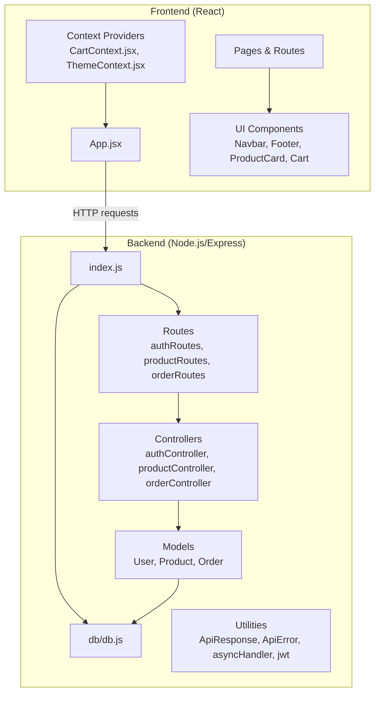

**Diagram sources**
- [src/App.jsx:1-75](file://src/App.jsx#L1-L75)
- [backend/index.js:1-119](file://backend/index.js#L1-L119)
- [backend/db/db.js:1-37](file://backend/db/db.js#L1-L37)
- [backend/controllers/authController.js:1-299](file://backend/controllers/authController.js#L1-L299)
- [backend/controllers/productController.js:1-341](file://backend/controllers/productController.js#L1-L341)
- [backend/controllers/orderController.js:1-358](file://backend/controllers/orderController.js#L1-L358)
- [backend/models/User.js:1-135](file://backend/models/User.js#L1-L135)
- [backend/models/Product.js:1-217](file://backend/models/Product.js#L1-L217)
- [backend/models/Order.js:1-217](file://backend/models/Order.js#L1-L217)
- [backend/utils/ApiResponse.js:1-52](file://backend/utils/ApiResponse.js#L1-L52)

**Section sources**
- [README.md:1-71](file://README.md#L1-L71)
- [package.json:1-42](file://package.json#L1-L42)
- [backend/package.json:1-33](file://backend/package.json#L1-L33)

## Core Components
- Frontend
  - Routing and animation: Animated page transitions and route guards for authentication pages
  - Context providers: Cart management and theme switching
  - UI building blocks: Navigation bar, footer, loader, product cards, and cart panel
- Backend
  - API server: Express app with CORS, JSON parsing, health checks, and global error handling
  - Authentication: User registration, login, profile management, and address operations
  - Product catalog: CRUD, filtering, sorting, pagination, and search
  - Orders: Creation, retrieval, status updates, payment processing, cancellation, and analytics
  - Data layer: Mongoose models with indexes, virtuals, and pre-save hooks
  - Utilities: Standardized success/error responses, async handler wrapper, JWT helpers

Practical examples:
- Browse products with filters and pagination
- Add items to cart, adjust quantities, and checkout
- Place an order with shipping and payment info
- Admin view orders and update statuses/payments
- Toggle light/dark theme across the app

**Section sources**
- [src/App.jsx:1-75](file://src/App.jsx#L1-L75)
- [src/context/CartContext.jsx:1-62](file://src/context/CartContext.jsx#L1-L62)
- [src/context/ThemeContext.jsx:1-30](file://src/context/ThemeContext.jsx#L1-L30)
- [backend/index.js:1-119](file://backend/index.js#L1-L119)
- [backend/controllers/authController.js:1-299](file://backend/controllers/authController.js#L1-L299)
- [backend/controllers/productController.js:1-341](file://backend/controllers/productController.js#L1-L341)
- [backend/controllers/orderController.js:1-358](file://backend/controllers/orderController.js#L1-L358)
- [backend/models/User.js:1-135](file://backend/models/User.js#L1-L135)
- [backend/models/Product.js:1-217](file://backend/models/Product.js#L1-L217)
- [backend/models/Order.js:1-217](file://backend/models/Order.js#L1-L217)
- [backend/utils/ApiResponse.js:1-52](file://backend/utils/ApiResponse.js#L1-L52)

## Architecture Overview
High-level flow:
- The React frontend renders pages and manages state via context providers
- Requests are sent to the Express backend API
- Controllers handle business logic, validate inputs, and orchestrate model operations
- Models define schemas, indexes, and helper methods
- Database connectivity is centralized and error-handled

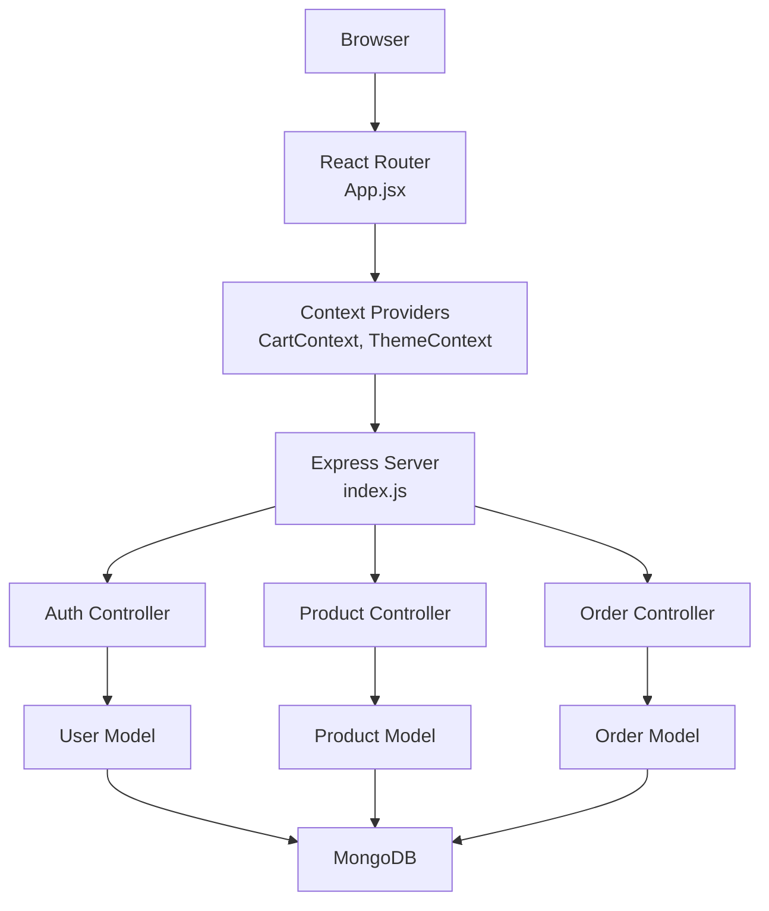

**Diagram sources**
- [src/App.jsx:1-75](file://src/App.jsx#L1-L75)
- [backend/index.js:1-119](file://backend/index.js#L1-L119)
- [backend/controllers/authController.js:1-299](file://backend/controllers/authController.js#L1-L299)
- [backend/controllers/productController.js:1-341](file://backend/controllers/productController.js#L1-L341)
- [backend/controllers/orderController.js:1-358](file://backend/controllers/orderController.js#L1-L358)
- [backend/models/User.js:1-135](file://backend/models/User.js#L1-L135)
- [backend/models/Product.js:1-217](file://backend/models/Product.js#L1-L217)
- [backend/models/Order.js:1-217](file://backend/models/Order.js#L1-L217)
- [backend/db/db.js:1-37](file://backend/db/db.js#L1-L37)

## Detailed Component Analysis

### Frontend: App and Routing
- Animated page transitions with Framer Motion
- Conditional rendering for authentication pages
- Provider tree: ThemeProvider wraps CartProvider, which wraps Router

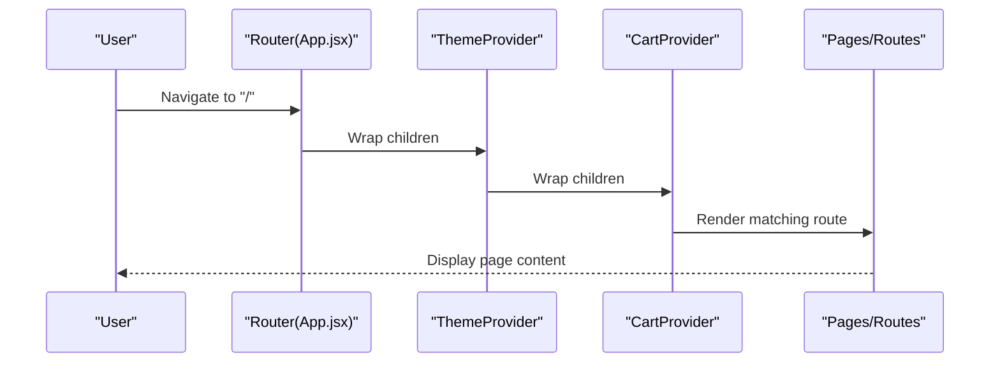

**Diagram sources**
- [src/App.jsx:1-75](file://src/App.jsx#L1-L75)

**Section sources**
- [src/App.jsx:1-75](file://src/App.jsx#L1-L75)

### Frontend: Cart Context
- Centralized cart state with add/remove/update/clear operations
- Computed totals for items and price
- Open/close state for cart UI

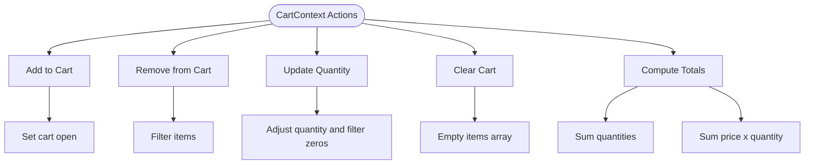

**Diagram sources**
- [src/context/CartContext.jsx:1-62](file://src/context/CartContext.jsx#L1-L62)

**Section sources**
- [src/context/CartContext.jsx:1-62](file://src/context/CartContext.jsx#L1-L62)

### Frontend: Theme Context
- Theme toggle persists across the app via document attribute
- Provider exposes theme state and toggle function

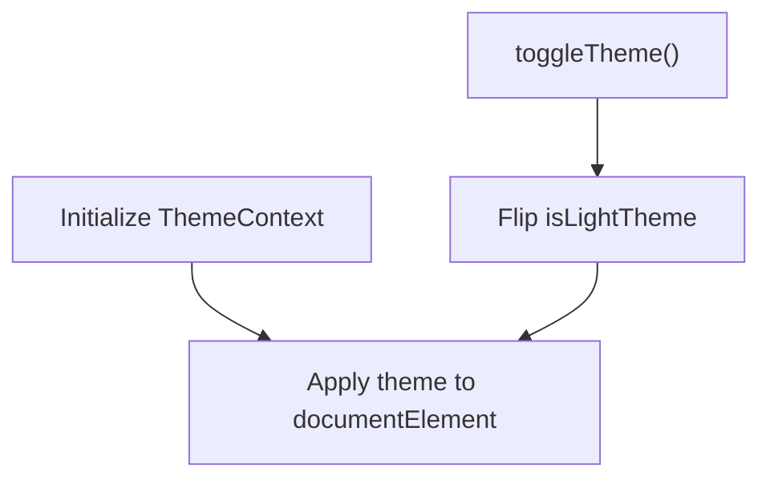

**Diagram sources**
- [src/context/ThemeContext.jsx:1-30](file://src/context/ThemeContext.jsx#L1-L30)

**Section sources**
- [src/context/ThemeContext.jsx:1-30](file://src/context/ThemeContext.jsx#L1-L30)

### Backend: API Server Bootstrap
- Loads environment configuration
- Initializes Express app, connects to MongoDB, configures CORS
- Registers routes under /api/* and sets up health check
- Global error handling and graceful shutdown

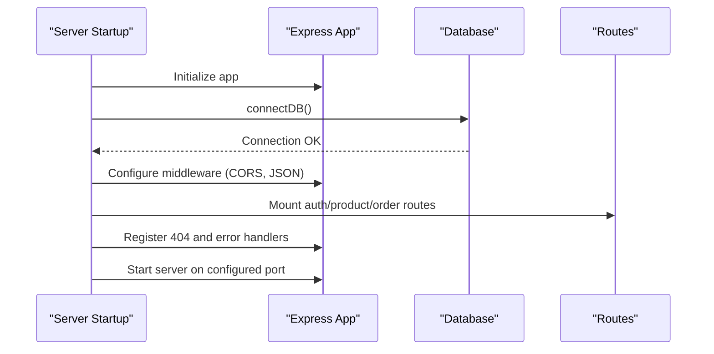

**Diagram sources**
- [backend/index.js:1-119](file://backend/index.js#L1-L119)
- [backend/db/db.js:1-37](file://backend/db/db.js#L1-L37)

**Section sources**
- [backend/index.js:1-119](file://backend/index.js#L1-L119)
- [backend/db/db.js:1-37](file://backend/db/db.js#L1-L37)

### Backend: Authentication Controller
- Registration: Validates uniqueness, creates user, generates JWT
- Login: Verifies credentials, checks activation, updates last login
- Profile: Retrieve/update profile and manage addresses
- Password change and logout placeholder

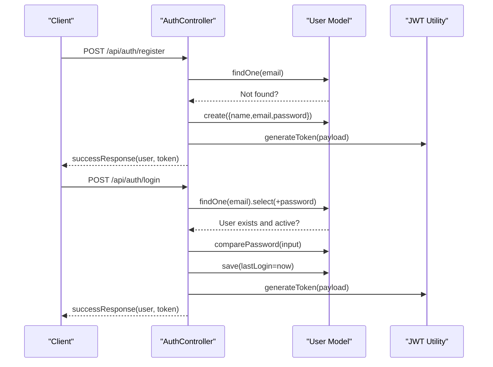

**Diagram sources**
- [backend/controllers/authController.js:1-299](file://backend/controllers/authController.js#L1-L299)
- [backend/models/User.js:1-135](file://backend/models/User.js#L1-L135)

**Section sources**
- [backend/controllers/authController.js:1-299](file://backend/controllers/authController.js#L1-L299)
- [backend/models/User.js:1-135](file://backend/models/User.js#L1-L135)

### Backend: Product Catalog Controller
- List products with category, price range, featured, badge, and text search
- Pagination and sorting support
- CRUD operations (admin-only)
- Stock updates and category aggregation

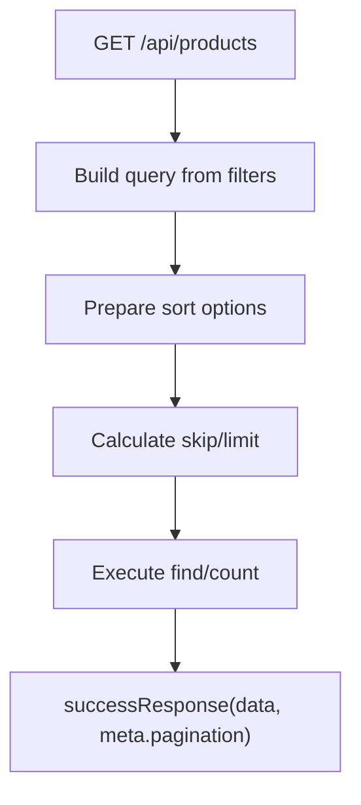

**Diagram sources**
- [backend/controllers/productController.js:1-341](file://backend/controllers/productController.js#L1-L341)
- [backend/models/Product.js:1-217](file://backend/models/Product.js#L1-L217)

**Section sources**
- [backend/controllers/productController.js:1-341](file://backend/controllers/productController.js#L1-L341)
- [backend/models/Product.js:1-217](file://backend/models/Product.js#L1-L217)

### Backend: Orders Controller
- Create order: validates products, checks stock, calculates prices, persists order
- Retrieve orders: admin/all, my orders, by ID with population
- Update status/payment: enforces valid transitions and updates history
- Cancel order: restores stock and updates status
- Stats: overall, by status, and monthly revenue aggregation

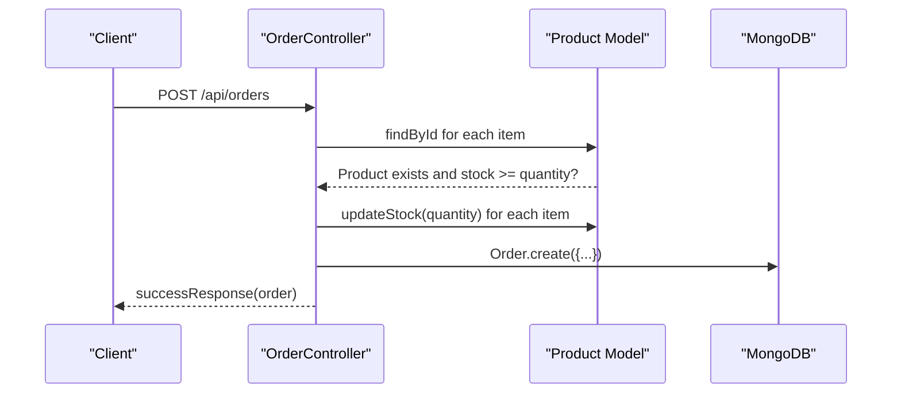

**Diagram sources**
- [backend/controllers/orderController.js:1-358](file://backend/controllers/orderController.js#L1-L358)
- [backend/models/Order.js:1-217](file://backend/models/Order.js#L1-L217)
- [backend/models/Product.js:1-217](file://backend/models/Product.js#L1-L217)

**Section sources**
- [backend/controllers/orderController.js:1-358](file://backend/controllers/orderController.js#L1-L358)
- [backend/models/Order.js:1-217](file://backend/models/Order.js#L1-L217)
- [backend/models/Product.js:1-217](file://backend/models/Product.js#L1-L217)

### Backend: Data Models
- User: schema with validation, hashing, and public profile method
- Product: schema with indexes, SKU generation, discount calculation, and stock update
- Order: embedded items, pricing calculations, status history, and helper methods

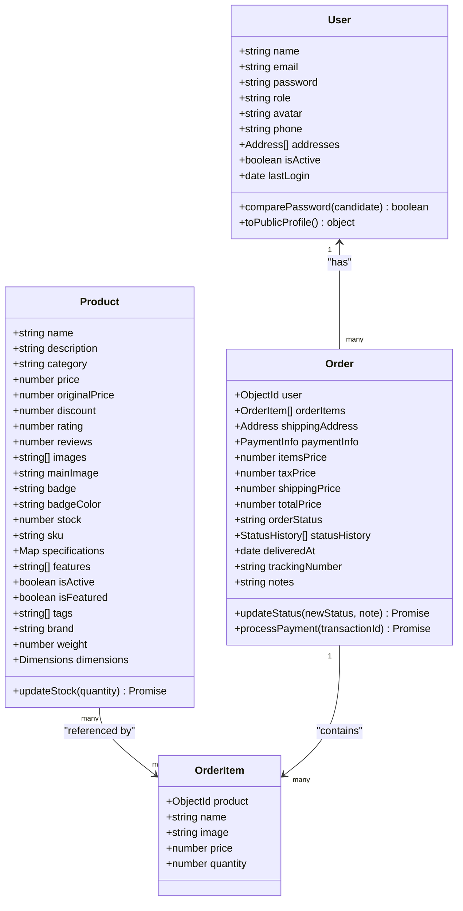

**Diagram sources**
- [backend/models/User.js:1-135](file://backend/models/User.js#L1-L135)
- [backend/models/Product.js:1-217](file://backend/models/Product.js#L1-L217)
- [backend/models/Order.js:1-217](file://backend/models/Order.js#L1-L217)

**Section sources**
- [backend/models/User.js:1-135](file://backend/models/User.js#L1-L135)
- [backend/models/Product.js:1-217](file://backend/models/Product.js#L1-L217)
- [backend/models/Order.js:1-217](file://backend/models/Order.js#L1-L217)

### Backend: API Response Utilities
- Standardized success and error responses
- Consistent shape across endpoints for frontend consumption

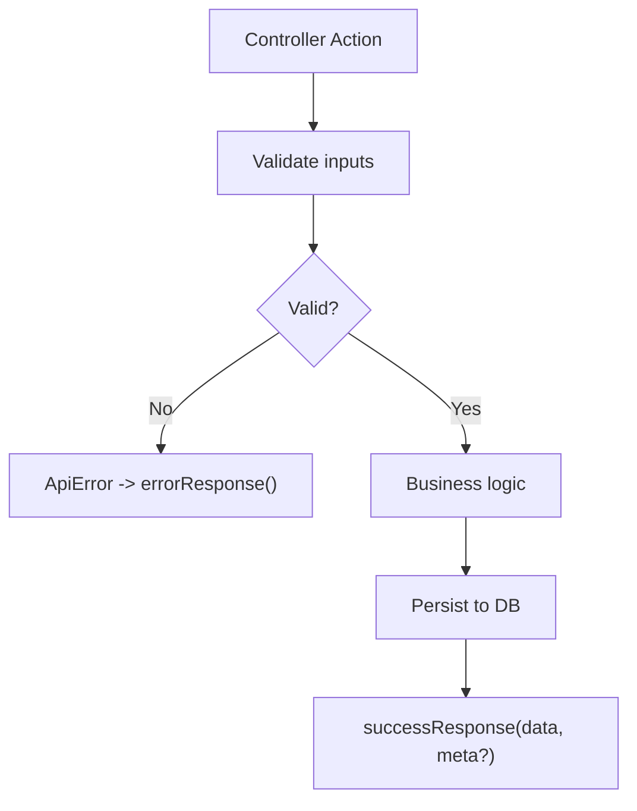

**Diagram sources**
- [backend/utils/ApiResponse.js:1-52](file://backend/utils/ApiResponse.js#L1-L52)
- [backend/controllers/authController.js:1-299](file://backend/controllers/authController.js#L1-L299)
- [backend/controllers/productController.js:1-341](file://backend/controllers/productController.js#L1-L341)
- [backend/controllers/orderController.js:1-358](file://backend/controllers/orderController.js#L1-L358)

**Section sources**
- [backend/utils/ApiResponse.js:1-52](file://backend/utils/ApiResponse.js#L1-L52)

## Dependency Analysis
- Frontend
  - React, React Router DOM, Framer Motion, and testing libraries
  - Local context providers for cart and theme
- Backend
  - Express, CORS, dotenv, Mongoose, bcrypt, jsonwebtoken, express-validator
  - Modular structure with clear separation between controllers, models, routes, and utilities

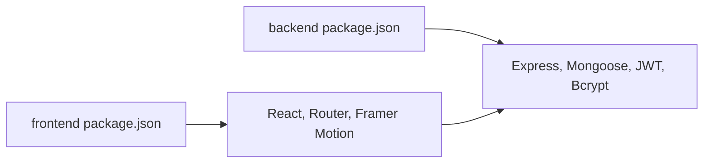

**Diagram sources**
- [package.json:1-42](file://package.json#L1-L42)
- [backend/package.json:1-33](file://backend/package.json#L1-L33)

**Section sources**
- [package.json:1-42](file://package.json#L1-L42)
- [backend/package.json:1-33](file://backend/package.json#L1-L33)

## Performance Considerations
- Database indexing: Product, User, and Order schemas include targeted indexes for frequent queries (category, price, email, role, status)
- Aggregation pipelines: Product categories and order statistics leverage aggregation for efficient reporting
- Pagination: Controllers implement skip/limit to avoid large payloads
- Virtuals: Computed fields (discount percentage, in-stock) reduce client-side computation
- Recommendations:
  - Enable MongoDB Atlas search indexes for advanced text search
  - Add caching for frequently accessed product lists
  - Use connection pooling and monitor slow queries
  - Implement rate limiting for authentication endpoints

[No sources needed since this section provides general guidance]

## Troubleshooting Guide
Common issues and resolutions:
- Database connection failures
  - Verify environment variables for MongoDB URI and client URL
  - Confirm network access and Atlas cluster configuration
- CORS errors
  - Ensure CLIENT_URL matches the frontend origin
  - Confirm credentials and allowed methods/headers
- Authentication problems
  - Check JWT secret and expiration settings
  - Validate password hashing and comparison logic
- Order creation failures
  - Confirm product availability and stock updates
  - Review pricing calculations and populated order items
- Global error handling
  - Use standardized error responses for consistent client handling

**Section sources**
- [backend/index.js:1-119](file://backend/index.js#L1-L119)
- [backend/db/db.js:1-37](file://backend/db/db.js#L1-L37)
- [backend/utils/ApiResponse.js:1-52](file://backend/utils/ApiResponse.js#L1-L52)

## Conclusion
This e-commerce application demonstrates a well-structured fullstack solution with a reactive frontend and a robust backend. It leverages modern technologies and patterns to provide a scalable foundation for product browsing, user management, and order processing. The modular architecture, standardized API responses, and thoughtful data modeling enable easy extension and maintenance.

[No sources needed since this section summarizes without analyzing specific files]