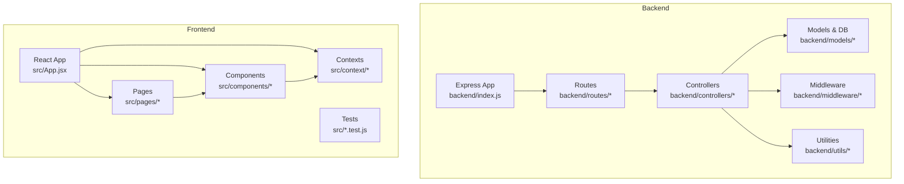
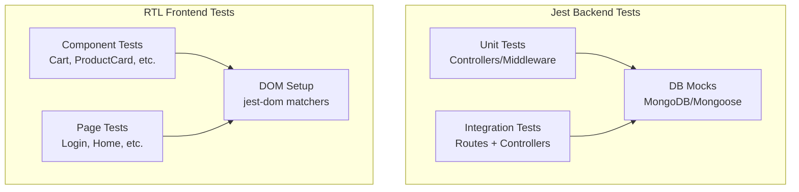
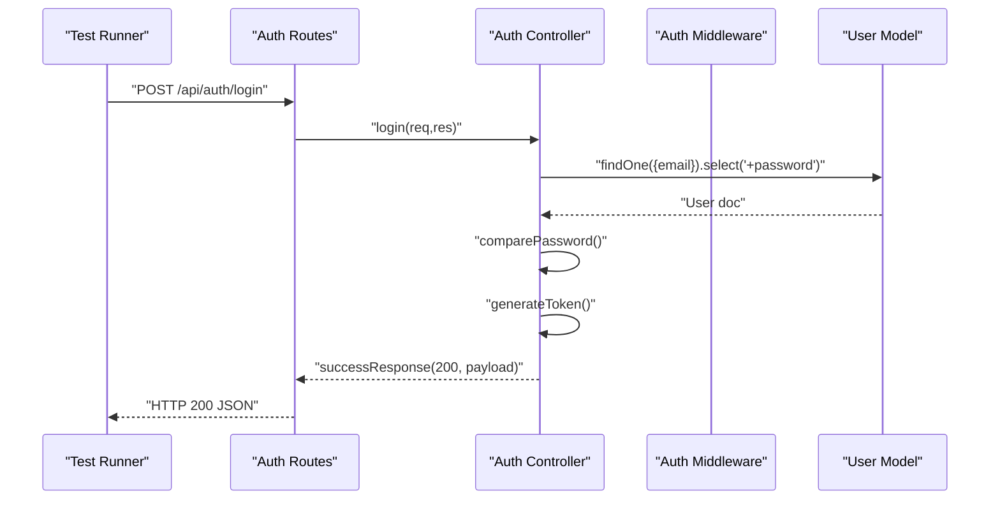
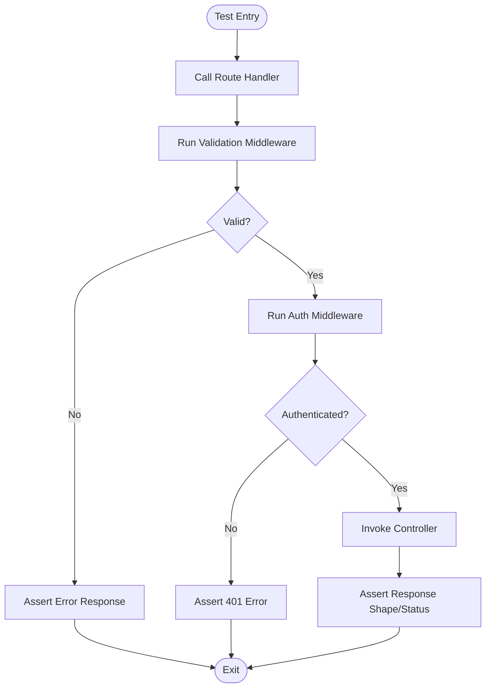
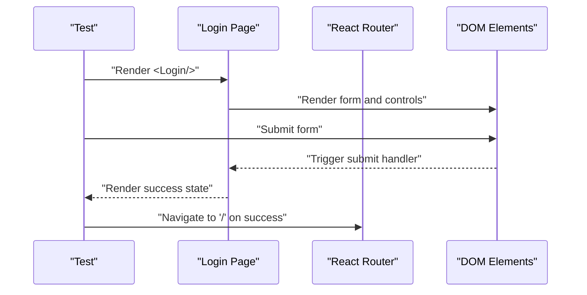
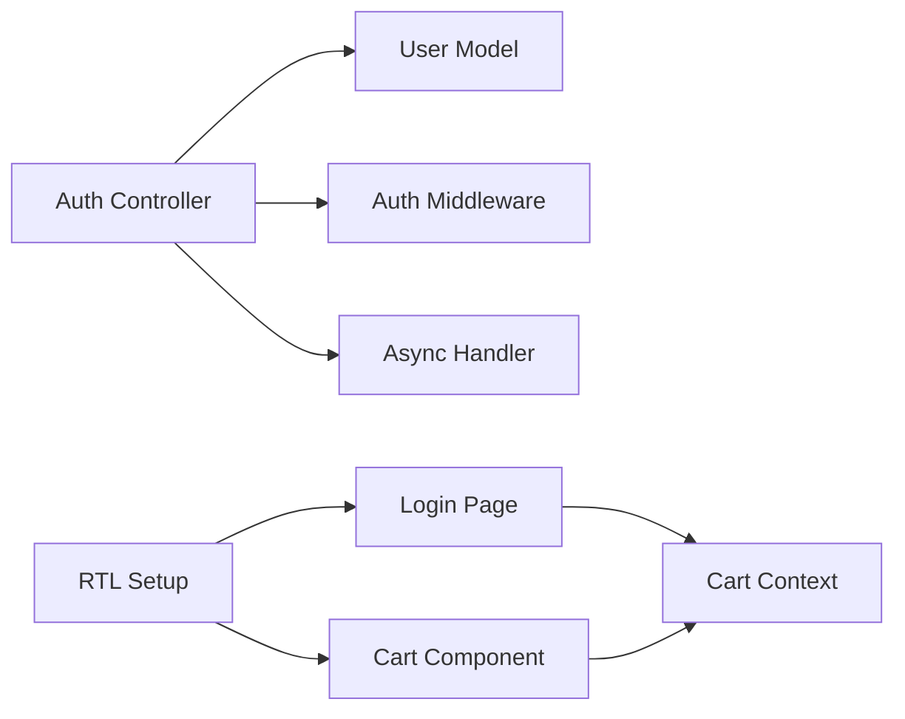

# Testing Strategy

<cite>
**Referenced Files in This Document**
- [backend/package.json](file://backend/package.json)
- [package.json](file://package.json)
- [backend/index.js](file://backend/index.js)
- [backend/controllers/authController.js](file://backend/controllers/authController.js)
- [backend/routes/authRoutes.js](file://backend/routes/authRoutes.js)
- [backend/middleware/auth.js](file://backend/middleware/auth.js)
- [backend/utils/asyncHandler.js](file://backend/utils/asyncHandler.js)
- [backend/models/User.js](file://backend/models/User.js)
- [src/App.test.js](file://src/App.test.js)
- [src/setupTests.js](file://src/setupTests.js)
- [src/pages/Login/Login.jsx](file://src/pages/Login/Login.jsx)
- [src/components/Cart/Cart.jsx](file://src/components/Cart/Cart.jsx)
- [src/context/CartContext.jsx](file://src/context/CartContext.jsx)
</cite>

## Table of Contents
1. [Introduction](#introduction)
2. [Project Structure](#project-structure)
3. [Core Components](#core-components)
4. [Architecture Overview](#architecture-overview)
5. [Detailed Component Analysis](#detailed-component-analysis)
6. [Dependency Analysis](#dependency-analysis)
7. [Performance Considerations](#performance-considerations)
8. [Troubleshooting Guide](#troubleshooting-guide)
9. [Conclusion](#conclusion)
10. [Appendices](#appendices)

## Introduction
This document defines a comprehensive testing strategy for the fullstack application. It covers:
- Backend unit testing with Jest for controllers and middleware
- Frontend component testing with React Testing Library for UI components and pages
- Integration testing approaches for authentication flows and API endpoints
- Test organization, patterns, and mock strategies
- Examples of testing authentication flows, API endpoints, and component interactions
- Coverage expectations, CI setup, and automated workflows
- Guidance for writing effective tests and debugging failures

## Project Structure
The repository follows a clear separation of concerns:
- Backend: Express server, controllers, routes, middleware, models, and utilities
- Frontend: React application with pages, components, contexts, and tests

**Diagram sources**
- [backend/index.js:1-119](file://backend/index.js#L1-L119)
- [backend/routes/authRoutes.js:1-85](file://backend/routes/authRoutes.js#L1-L85)
- [backend/controllers/authController.js:1-299](file://backend/controllers/authController.js#L1-L299)
- [backend/middleware/auth.js:1-124](file://backend/middleware/auth.js#L1-L124)
- [backend/models/User.js:1-135](file://backend/models/User.js#L1-L135)
- [backend/utils/asyncHandler.js:1-16](file://backend/utils/asyncHandler.js#L1-L16)
- [src/App.jsx](file://src/App.jsx)
- [src/pages/Login/Login.jsx:1-123](file://src/pages/Login/Login.jsx#L1-L123)
- [src/components/Cart/Cart.jsx:1-260](file://src/components/Cart/Cart.jsx#L1-L260)
- [src/context/CartContext.jsx:1-62](file://src/context/CartContext.jsx#L1-L62)

**Section sources**
- [backend/package.json:1-33](file://backend/package.json#L1-L33)
- [package.json:1-42](file://package.json#L1-L42)
- [backend/index.js:1-119](file://backend/index.js#L1-L119)

## Core Components
This section outlines the primary targets for testing and their responsibilities.

- Backend Express app
  - Initializes middleware, routes, and error handlers
  - Exposes health checks and API endpoints
  - Starts the server and handles graceful shutdown

- Authentication controller
  - Implements registration, login, profile retrieval, updates, password change, and address management
  - Uses async handler wrapper and custom response/error utilities

- Authentication routes
  - Mounts controller actions behind validation and authentication middleware

- Authentication middleware
  - Validates JWT tokens and attaches user context
  - Provides optional auth and role-based authorization helpers

- User model
  - Defines schema, hashing pre-save hook, password comparison, and public profile serialization

- Frontend React app
  - Includes a minimal test scaffold and setup for DOM assertions
  - Pages and components demonstrate interactive UI behavior suitable for component testing

**Section sources**
- [backend/index.js:1-119](file://backend/index.js#L1-L119)
- [backend/controllers/authController.js:1-299](file://backend/controllers/authController.js#L1-L299)
- [backend/routes/authRoutes.js:1-85](file://backend/routes/authRoutes.js#L1-L85)
- [backend/middleware/auth.js:1-124](file://backend/middleware/auth.js#L1-L124)
- [backend/models/User.js:1-135](file://backend/models/User.js#L1-L135)
- [src/App.test.js:1-9](file://src/App.test.js#L1-L9)
- [src/setupTests.js:1-6](file://src/setupTests.js#L1-L6)

## Architecture Overview
The testing architecture leverages:
- Jest for backend unit and integration tests
- React Testing Library for frontend component and page tests
- Suppression of database connectivity during unit tests via mocking
- Shared test setup for DOM assertions

**Diagram sources**
- [backend/package.json:6-10](file://backend/package.json#L6-L10)
- [package.json:17-21](file://package.json#L17-L21)
- [src/setupTests.js:1-6](file://src/setupTests.js#L1-L6)

## Detailed Component Analysis

### Backend Unit Testing with Jest
Focus areas:
- Controllers: Validate success paths, error conditions, and response shapes
- Middleware: Validate token extraction, verification, and user attachment
- Utilities: Validate async wrapper behavior and error propagation
- Models: Validate schema constraints and instance methods

Recommended patterns:
- Use supertest or a lightweight HTTP server wrapper to test routes without a live database connection
- Mock Mongoose models and JWT utilities to isolate units
- Assert HTTP status codes, response bodies, and error middleware invocation
- Prefer deterministic inputs and controlled environments

Example test targets (paths only):
- Authentication controller actions: [backend/controllers/authController.js:17-47](file://backend/controllers/authController.js#L17-L47), [backend/controllers/authController.js:54-94](file://backend/controllers/authController.js#L54-L94), [backend/controllers/authController.js:101-111](file://backend/controllers/authController.js#L101-L111)
- Authentication middleware: [backend/middleware/auth.js:10-55](file://backend/middleware/auth.js#L10-L55)
- Async handler wrapper: [backend/utils/asyncHandler.js:9-13](file://backend/utils/asyncHandler.js#L9-L13)
- User model methods: [backend/models/User.js:110-112](file://backend/models/User.js#L110-L112), [backend/models/User.js:118-130](file://backend/models/User.js#L118-L130)

Mock strategies:
- Replace Mongoose model methods with Jest spies/fakes for create/find/save
- Stub JWT verification to return predefined user payloads
- Use in-memory mocks for database operations to avoid flakiness

Coverage expectations:
- Controllers: target 90%+ statement/branch/func/line coverage
- Middleware: 100% branch coverage for token and user resolution paths
- Utilities: 100% coverage for error propagation and edge cases

**Section sources**
- [backend/controllers/authController.js:1-299](file://backend/controllers/authController.js#L1-L299)
- [backend/middleware/auth.js:1-124](file://backend/middleware/auth.js#L1-L124)
- [backend/utils/asyncHandler.js:1-16](file://backend/utils/asyncHandler.js#L1-L16)
- [backend/models/User.js:1-135](file://backend/models/User.js#L1-L135)

### Frontend Component Testing with React Testing Library
Focus areas:
- Pages: Validate form submission, loading states, navigation, and success messages
- Components: Validate rendering, interactions, context consumption, and animations
- Contexts: Validate state updates and derived computations

Recommended patterns:
- Render components under test with appropriate providers (e.g., Cart provider)
- Interact with elements using user-event or direct queries
- Assert DOM content, accessibility attributes, and visual feedback
- Keep tests declarative and focused on user-visible behavior

Example test targets (paths only):
- Login page: [src/pages/Login/Login.jsx:1-123](file://src/pages/Login/Login.jsx#L1-L123)
- Cart component: [src/components/Cart/Cart.jsx:1-260](file://src/components/Cart/Cart.jsx#L1-L260)
- Cart context: [src/context/CartContext.jsx:1-62](file://src/context/CartContext.jsx#L1-L62)

Coverage expectations:
- Pages: 90%+ for user flows (rendering, interactions, navigation)
- Components: 90%+ for rendering and interaction logic
- Contexts: 100% for state transitions and derived values

**Section sources**
- [src/pages/Login/Login.jsx:1-123](file://src/pages/Login/Login.jsx#L1-L123)
- [src/components/Cart/Cart.jsx:1-260](file://src/components/Cart/Cart.jsx#L1-L260)
- [src/context/CartContext.jsx:1-62](file://src/context/CartContext.jsx#L1-L62)

### Integration Testing Approaches
End-to-end flows:
- Authentication flow: Registration → Login → Profile retrieval → Logout
- API endpoint testing: Validate request validation, auth middleware enforcement, and error responses
- Component integration: Validate context-driven UI updates and cross-component interactions

Patterns:
- Use a test HTTP client to hit mounted routes
- Inject mocked dependencies for models and JWT utilities
- Verify side effects (e.g., last login updates) and response payloads
- For frontend, simulate network requests with React Query or fetch-mock if applicable

Example flows (paths only):
- Auth routes mounting and middleware: [backend/routes/authRoutes.js:26-82](file://backend/routes/authRoutes.js#L26-L82), [backend/middleware/auth.js:10-55](file://backend/middleware/auth.js#L10-L55)
- Express app wiring: [backend/index.js:50-75](file://backend/index.js#L50-L75)

**Section sources**
- [backend/routes/authRoutes.js:1-85](file://backend/routes/authRoutes.js#L1-L85)
- [backend/middleware/auth.js:1-124](file://backend/middleware/auth.js#L1-L124)
- [backend/index.js:1-119](file://backend/index.js#L1-L119)

### Authentication Flow Testing
Backend controller tests:
- Registration: Validate duplicate detection, creation, token generation, and response shape
- Login: Validate credential checks, inactive account handling, last login update, and token issuance
- Profile: Validate private route enforcement and user data serialization
- Password change: Validate current password verification and persistence
- Addresses: Validate CRUD operations with default address logic

Frontend page tests:
- Login page: Validate form submission, loading states, toggle visibility, and success message rendering

**Diagram sources**
- [backend/routes/authRoutes.js:28-33](file://backend/routes/authRoutes.js#L28-L33)
- [backend/controllers/authController.js:54-94](file://backend/controllers/authController.js#L54-L94)
- [backend/middleware/auth.js:10-55](file://backend/middleware/auth.js#L10-L55)
- [backend/models/User.js:110-112](file://backend/models/User.js#L110-L112)

**Section sources**
- [backend/controllers/authController.js:1-299](file://backend/controllers/authController.js#L1-L299)
- [backend/middleware/auth.js:1-124](file://backend/middleware/auth.js#L1-L124)
- [backend/models/User.js:1-135](file://backend/models/User.js#L1-L135)
- [src/pages/Login/Login.jsx:1-123](file://src/pages/Login/Login.jsx#L1-L123)

### API Endpoint Testing Patterns
- Validation: Ensure validation middleware triggers appropriate errors for malformed inputs
- Authentication: Confirm protected routes reject missing or invalid tokens
- Authorization: Validate role-based restrictions where applicable
- Error handling: Verify global error middleware receives thrown errors and responds consistently

**Diagram sources**
- [backend/routes/authRoutes.js:17-20](file://backend/routes/authRoutes.js#L17-L20)
- [backend/middleware/auth.js:95-110](file://backend/middleware/auth.js#L95-L110)
- [backend/controllers/authController.js:1-299](file://backend/controllers/authController.js#L1-L299)

**Section sources**
- [backend/routes/authRoutes.js:1-85](file://backend/routes/authRoutes.js#L1-L85)
- [backend/middleware/auth.js:1-124](file://backend/middleware/auth.js#L1-L124)
- [backend/controllers/authController.js:1-299](file://backend/controllers/authController.js#L1-L299)

### Component Interaction Testing
- Cart component: Validate adding items, updating quantities, removing items, clearing cart, and summary calculations
- Context provider: Validate state transitions and derived totals
- Page-level flows: Validate navigation, form submission, and success states

**Diagram sources**
- [src/pages/Login/Login.jsx:14-20](file://src/pages/Login/Login.jsx#L14-L20)

**Section sources**
- [src/pages/Login/Login.jsx:1-123](file://src/pages/Login/Login.jsx#L1-L123)
- [src/components/Cart/Cart.jsx:1-260](file://src/components/Cart/Cart.jsx#L1-L260)
- [src/context/CartContext.jsx:1-62](file://src/context/CartContext.jsx#L1-L62)

## Dependency Analysis
Testing dependencies and coupling:
- Backend tests depend on controller exports and middleware behavior
- Controllers depend on models and JWT utilities; mock these for unit isolation
- Frontend tests depend on component composition and context providers
- Global test setup enhances DOM assertions for frontend tests

**Diagram sources**
- [backend/controllers/authController.js:1-299](file://backend/controllers/authController.js#L1-L299)
- [backend/middleware/auth.js:1-124](file://backend/middleware/auth.js#L1-L124)
- [backend/utils/asyncHandler.js:1-16](file://backend/utils/asyncHandler.js#L1-L16)
- [backend/models/User.js:1-135](file://backend/models/User.js#L1-L135)
- [src/pages/Login/Login.jsx:1-123](file://src/pages/Login/Login.jsx#L1-L123)
- [src/components/Cart/Cart.jsx:1-260](file://src/components/Cart/Cart.jsx#L1-L260)
- [src/context/CartContext.jsx:1-62](file://src/context/CartContext.jsx#L1-L62)
- [src/setupTests.js:1-6](file://src/setupTests.js#L1-L6)

**Section sources**
- [backend/controllers/authController.js:1-299](file://backend/controllers/authController.js#L1-L299)
- [backend/middleware/auth.js:1-124](file://backend/middleware/auth.js#L1-L124)
- [backend/utils/asyncHandler.js:1-16](file://backend/utils/asyncHandler.js#L1-L16)
- [backend/models/User.js:1-135](file://backend/models/User.js#L1-L135)
- [src/pages/Login/Login.jsx:1-123](file://src/pages/Login/Login.jsx#L1-L123)
- [src/components/Cart/Cart.jsx:1-260](file://src/components/Cart/Cart.jsx#L1-L260)
- [src/context/CartContext.jsx:1-62](file://src/context/CartContext.jsx#L1-L62)
- [src/setupTests.js:1-6](file://src/setupTests.js#L1-L6)

## Performance Considerations
- Prefer mocking expensive operations (database, crypto) to keep tests fast
- Use lightweight HTTP wrappers for integration tests to avoid full server boot
- Limit heavy DOM queries; focus on user-centric assertions
- Parallelize independent tests to reduce CI runtime

## Troubleshooting Guide
Common issues and resolutions:
- Unhandled promise rejections in backend: Ensure async handler wrapper is applied to all route handlers
- Missing DOM matchers in frontend: Confirm jest-dom setup is included in test setup
- Authentication failures: Verify token injection and middleware chain in tests
- Flaky database tests: Use in-memory mocks or ephemeral test databases

Debugging tips:
- Add targeted logs in test setup to trace request/response flows
- Use verbose Jest output to inspect thrown errors and stack traces
- For frontend, snapshot DOM snapshots to capture unexpected renders

**Section sources**
- [backend/utils/asyncHandler.js:1-16](file://backend/utils/asyncHandler.js#L1-L16)
- [src/setupTests.js:1-6](file://src/setupTests.js#L1-L6)
- [backend/index.js:94-108](file://backend/index.js#L94-L108)

## Conclusion
This testing strategy emphasizes:
- Isolation of units via mocking
- Realistic integration tests for routes and middleware
- Comprehensive frontend component and page coverage
- Clear patterns for authentication and API endpoint validation
- Practical guidance for CI and debugging

Adhering to these patterns ensures reliable, maintainable tests across the stack.

## Appendices

### Test Scripts and CI Setup
- Backend: Jest script configured for test execution
- Frontend: React Scripts test script configured for component tests
- Recommended CI steps: Install dependencies, run backend tests, run frontend tests, collect coverage

**Section sources**
- [backend/package.json:6-10](file://backend/package.json#L6-L10)
- [package.json:17-21](file://package.json#L17-L21)

### Example Test Organization
- Backend
  - Unit tests under a dedicated folder (e.g., backend/__tests__/unit/)
  - Integration tests under a dedicated folder (e.g., backend/__tests__/integration/)
- Frontend
  - Place tests alongside components/pages with .test.js suffix
  - Use setupTests.js for global test enhancements

[No sources needed since this section provides general guidance]