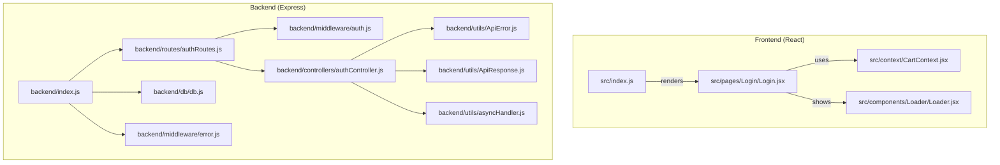
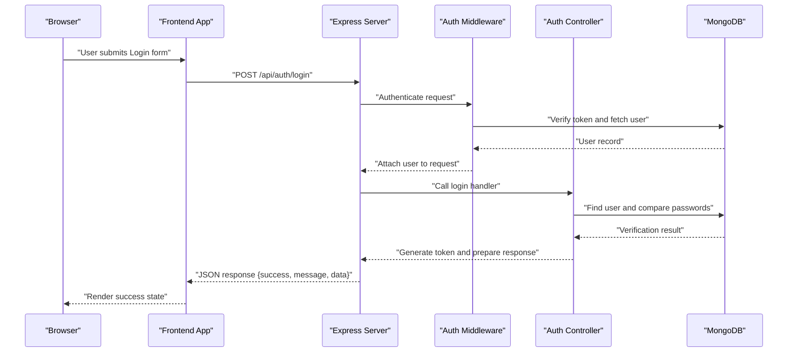
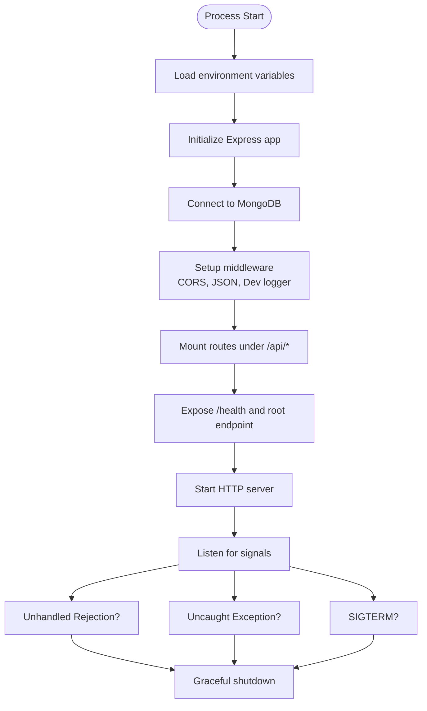
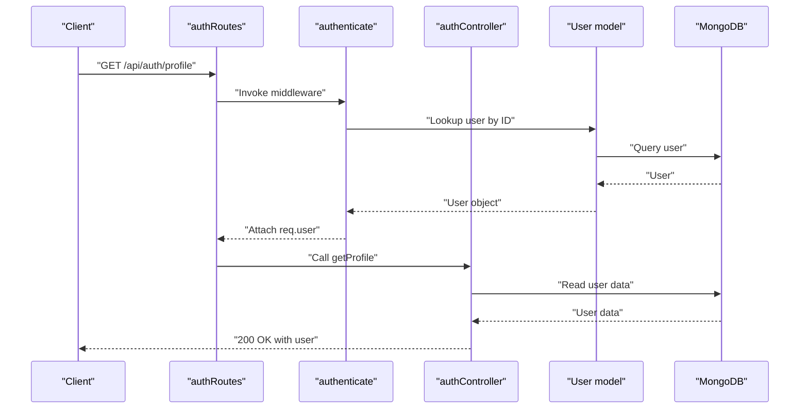
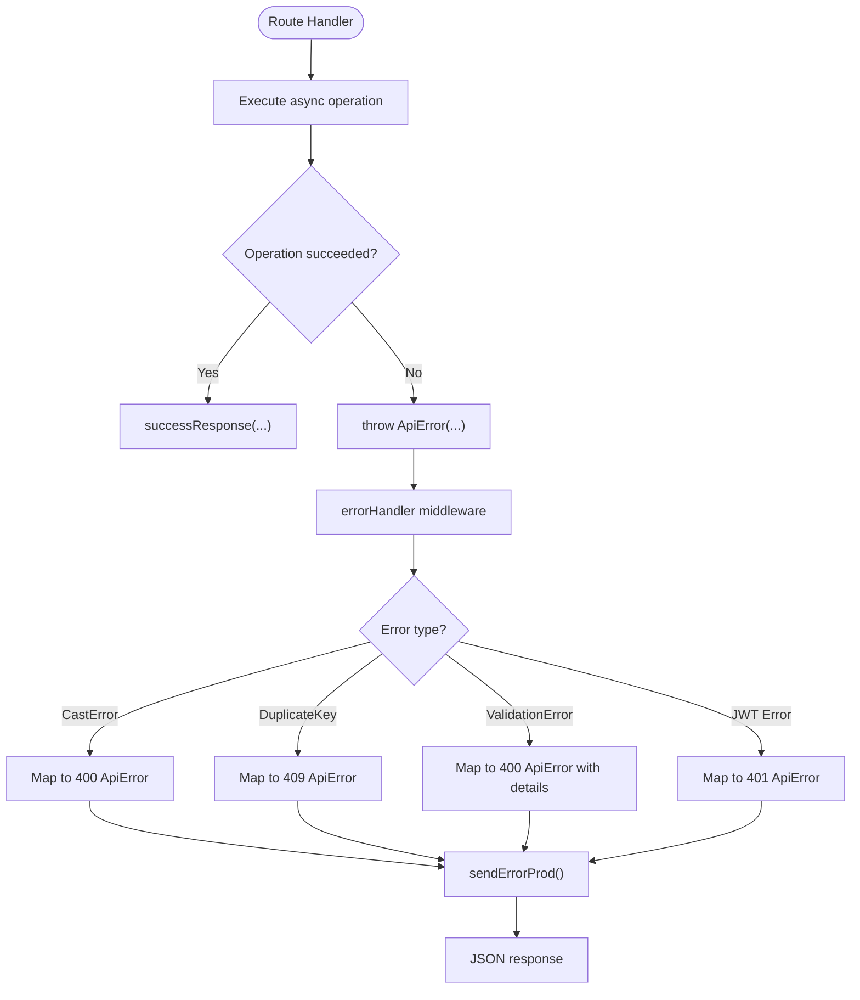
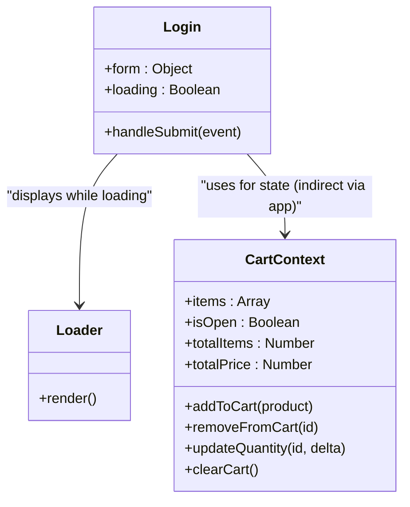
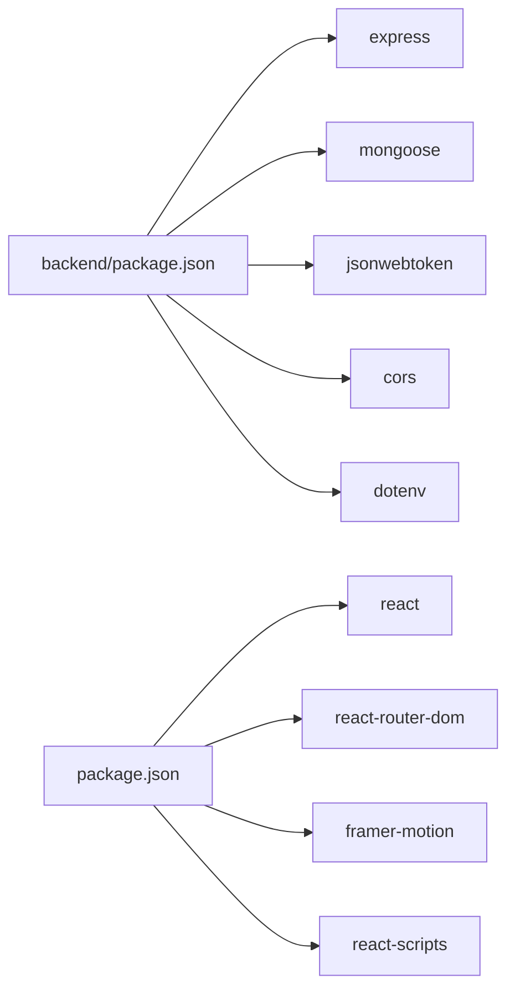

# Troubleshooting & FAQ

<cite>
**Referenced Files in This Document**
- [backend/index.js](file://backend/index.js)
- [backend/middleware/error.js](file://backend/middleware/error.js)
- [backend/utils/ApiError.js](file://backend/utils/ApiError.js)
- [backend/utils/ApiResponse.js](file://backend/utils/ApiResponse.js)
- [backend/utils/asyncHandler.js](file://backend/utils/asyncHandler.js)
- [backend/db/db.js](file://backend/db/db.js)
- [backend/controllers/authController.js](file://backend/controllers/authController.js)
- [backend/middleware/auth.js](file://backend/middleware/auth.js)
- [backend/routes/authRoutes.js](file://backend/routes/authRoutes.js)
- [backend/package.json](file://backend/package.json)
- [package.json](file://package.json)
- [src/pages/Login/Login.jsx](file://src/pages/Login/Login.jsx)
- [src/components/Loader/Loader.jsx](file://src/components/Loader/Loader.jsx)
- [src/context/CartContext.jsx](file://src/context/CartContext.jsx)
</cite>

## Table of Contents
1. [Introduction](#introduction)
2. [Project Structure](#project-structure)
3. [Core Components](#core-components)
4. [Architecture Overview](#architecture-overview)
5. [Detailed Component Analysis](#detailed-component-analysis)
6. [Dependency Analysis](#dependency-analysis)
7. [Performance Considerations](#performance-considerations)
8. [Troubleshooting Guide](#troubleshooting-guide)
9. [Conclusion](#conclusion)
10. [Appendices](#appendices)

## Introduction
This document provides a comprehensive troubleshooting guide for common setup problems, runtime errors, and debugging techniques across both frontend and backend components. It includes error message references, diagnostic steps, resolution procedures, performance tips, memory leak prevention, logging and monitoring approaches, and community/support resources.

## Project Structure
The project follows a classic fullstack layout:
- Frontend built with React and served via Create React App scripts.
- Backend built with Express, Mongoose, and JWT-based authentication.
- Shared error handling and standardized response utilities.

**Diagram sources**
- [backend/index.js:1-119](file://backend/index.js#L1-L119)
- [backend/routes/authRoutes.js:1-85](file://backend/routes/authRoutes.js#L1-L85)
- [backend/middleware/auth.js:1-124](file://backend/middleware/auth.js#L1-L124)
- [backend/controllers/authController.js:1-299](file://backend/controllers/authController.js#L1-L299)
- [backend/db/db.js:1-37](file://backend/db/db.js#L1-L37)
- [backend/middleware/error.js:1-121](file://backend/middleware/error.js#L1-L121)
- [backend/utils/ApiError.js:1-21](file://backend/utils/ApiError.js#L1-L21)
- [backend/utils/ApiResponse.js:1-52](file://backend/utils/ApiResponse.js#L1-L52)
- [backend/utils/asyncHandler.js:1-16](file://backend/utils/asyncHandler.js#L1-L16)
- [src/index.js:1-6](file://src/index.js#L1-L6)
- [src/pages/Login/Login.jsx:1-123](file://src/pages/Login/Login.jsx#L1-L123)
- [src/context/CartContext.jsx:1-62](file://src/context/CartContext.jsx#L1-L62)
- [src/components/Loader/Loader.jsx:1-18](file://src/components/Loader/Loader.jsx#L1-L18)

**Section sources**
- [backend/index.js:1-119](file://backend/index.js#L1-L119)
- [backend/package.json:1-33](file://backend/package.json#L1-L33)
- [package.json:1-42](file://package.json#L1-L42)

## Core Components
- Backend server initialization, middleware, routes, and error handling.
- Authentication middleware and controller for user registration, login, profile, and addresses.
- Database connection utilities and graceful shutdown hooks.
- Frontend entry point, login page, loader, and cart context.

**Section sources**
- [backend/index.js:1-119](file://backend/index.js#L1-L119)
- [backend/middleware/auth.js:1-124](file://backend/middleware/auth.js#L1-L124)
- [backend/controllers/authController.js:1-299](file://backend/controllers/authController.js#L1-L299)
- [backend/db/db.js:1-37](file://backend/db/db.js#L1-L37)
- [src/index.js:1-6](file://src/index.js#L1-L6)

## Architecture Overview
The backend exposes REST endpoints under /api/*, protected by authentication middleware. Controllers use async wrappers to simplify error propagation to centralized error handling. The frontend consumes these endpoints and manages UI state locally.

**Diagram sources**
- [backend/routes/authRoutes.js:1-85](file://backend/routes/authRoutes.js#L1-L85)
- [backend/middleware/auth.js:1-124](file://backend/middleware/auth.js#L1-L124)
- [backend/controllers/authController.js:1-299](file://backend/controllers/authController.js#L1-L299)
- [backend/db/db.js:1-37](file://backend/db/db.js#L1-L37)

## Detailed Component Analysis

### Backend Server Initialization and Lifecycle
- Initializes Express, loads environment variables, connects to MongoDB, configures CORS, JSON parsing, and logging in development.
- Defines health check and root endpoints, registers routes, and sets up global 404 and error handlers.
- Implements graceful shutdown on SIGTERM and exits on unhandled rejections/exceptions.

**Diagram sources**
- [backend/index.js:1-119](file://backend/index.js#L1-L119)
- [backend/db/db.js:1-37](file://backend/db/db.js#L1-L37)

**Section sources**
- [backend/index.js:1-119](file://backend/index.js#L1-L119)
- [backend/db/db.js:1-37](file://backend/db/db.js#L1-L37)

### Authentication Middleware and Routes
- Authentication middleware extracts Bearer tokens, verifies them, attaches user to request, and enforces active user checks.
- Routes define public and private endpoints for auth operations and apply validation and auth middleware.

**Diagram sources**
- [backend/routes/authRoutes.js:1-85](file://backend/routes/authRoutes.js#L1-L85)
- [backend/middleware/auth.js:1-124](file://backend/middleware/auth.js#L1-L124)
- [backend/controllers/authController.js:1-299](file://backend/controllers/authController.js#L1-L299)

**Section sources**
- [backend/middleware/auth.js:1-124](file://backend/middleware/auth.js#L1-L124)
- [backend/routes/authRoutes.js:1-85](file://backend/routes/authRoutes.js#L1-L85)
- [backend/controllers/authController.js:1-299](file://backend/controllers/authController.js#L1-L299)

### Error Handling and Standardized Responses
- Centralized error handler converts database and JWT errors into user-friendly messages and ensures operational errors are returned without leaking internal details in production.
- Standardized success and error response helpers enforce consistent JSON shape.

**Diagram sources**
- [backend/middleware/error.js:1-121](file://backend/middleware/error.js#L1-L121)
- [backend/utils/ApiError.js:1-21](file://backend/utils/ApiError.js#L1-L21)
- [backend/utils/ApiResponse.js:1-52](file://backend/utils/ApiResponse.js#L1-L52)

**Section sources**
- [backend/middleware/error.js:1-121](file://backend/middleware/error.js#L1-L121)
- [backend/utils/ApiError.js:1-21](file://backend/utils/ApiError.js#L1-L21)
- [backend/utils/ApiResponse.js:1-52](file://backend/utils/ApiResponse.js#L1-L52)

### Frontend Components and State Management
- Frontend entry renders the root React app.
- Login page demonstrates loading states and success messaging.
- Cart context manages items, quantities, and totals with safe updates.
- Loader component provides animated feedback during async operations.

**Diagram sources**
- [src/context/CartContext.jsx:1-62](file://src/context/CartContext.jsx#L1-L62)
- [src/pages/Login/Login.jsx:1-123](file://src/pages/Login/Login.jsx#L1-L123)
- [src/components/Loader/Loader.jsx:1-18](file://src/components/Loader/Loader.jsx#L1-L18)

**Section sources**
- [src/index.js:1-6](file://src/index.js#L1-L6)
- [src/pages/Login/Login.jsx:1-123](file://src/pages/Login/Login.jsx#L1-L123)
- [src/context/CartContext.jsx:1-62](file://src/context/CartContext.jsx#L1-L62)
- [src/components/Loader/Loader.jsx:1-18](file://src/components/Loader/Loader.jsx#L1-L18)

## Dependency Analysis
- Backend depends on Express, Mongoose, JWT, CORS, dotenv, and express-validator.
- Frontend uses React, React Router, Framer Motion, and React Scripts for build/test.

**Diagram sources**
- [backend/package.json:1-33](file://backend/package.json#L1-L33)
- [package.json:1-42](file://package.json#L1-L42)

**Section sources**
- [backend/package.json:1-33](file://backend/package.json#L1-L33)
- [package.json:1-42](file://package.json#L1-L42)

## Performance Considerations
- Database connection pooling and keep-alive are handled by Mongoose defaults; ensure environment variables are configured for production.
- Limit payload sizes for JSON bodies to avoid excessive memory usage; the server already applies limits.
- Prefer pagination for list endpoints and avoid loading large arrays into memory.
- Minimize synchronous work in middleware and controllers; offload heavy tasks to background jobs.
- Monitor garbage collection and long tasks in Node.js using profiling tools.
- On the frontend, avoid unnecessary re-renders by using memoization and stable callbacks in contexts.

[No sources needed since this section provides general guidance]

## Troubleshooting Guide

### Backend Setup and Runtime Issues

- Environment Variables Missing
  - Symptoms: Application fails to start or database connection fails.
  - Checks:
    - Ensure required environment variables are present (e.g., database URI, client URL).
    - Confirm environment file is loaded by the server.
  - Resolution:
    - Set missing variables in your environment or .env file.
    - Restart the server after changes.

  **Section sources**
  - [backend/index.js:1-119](file://backend/index.js#L1-L119)
  - [backend/db/db.js:1-37](file://backend/db/db.js#L1-L37)

- Database Connection Failures
  - Symptoms: Immediate startup error indicating connection failure.
  - Checks:
    - Verify the database URI and network connectivity.
    - Confirm the database service is reachable.
  - Resolution:
    - Fix the URI and credentials.
    - Retry connection after ensuring the service is up.

  **Section sources**
  - [backend/db/db.js:1-37](file://backend/db/db.js#L1-L37)

- CORS Errors in Development
  - Symptoms: Preflight or runtime CORS errors when calling backend from localhost.
  - Checks:
    - Confirm client URL matches the allowed origin.
  - Resolution:
    - Set the client URL to match the frontend origin.

  **Section sources**
  - [backend/index.js:24-30](file://backend/index.js#L24-L30)

- Health Endpoint Returns Unexpected Status
  - Symptoms: Health check failing.
  - Checks:
    - Review server logs around startup.
    - Confirm database connection completed.
  - Resolution:
    - Fix configuration issues and restart.

  **Section sources**
  - [backend/index.js:40-48](file://backend/index.js#L40-L48)

- Unhandled Rejections and Exceptions
  - Symptoms: Server shuts down abruptly with error logs.
  - Checks:
    - Look for unhandled promise rejections or uncaught exceptions.
  - Resolution:
    - Add proper error handling in async routes.
    - Wrap route handlers with the async wrapper utility.

  **Section sources**
  - [backend/index.js:94-116](file://backend/index.js#L94-L116)
  - [backend/utils/asyncHandler.js:1-16](file://backend/utils/asyncHandler.js#L1-L16)

- Graceful Shutdown on Termination Signals
  - Symptoms: Long-running tasks interrupted on deployment.
  - Checks:
    - Ensure SIGTERM is received and server closes gracefully.
  - Resolution:
    - Use the provided signal handlers for graceful termination.

  **Section sources**
  - [backend/index.js:110-116](file://backend/index.js#L110-L116)

### Authentication and Authorization Issues

- 401 Access Denied Without Token
  - Symptoms: Requests to private endpoints fail immediately.
  - Checks:
    - Confirm Authorization header is present and starts with Bearer.
  - Resolution:
    - Include a valid Bearer token in the header.

  **Section sources**
  - [backend/middleware/auth.js:14-24](file://backend/middleware/auth.js#L14-L24)

- 401 Invalid or Expired Token
  - Symptoms: JWT verification errors.
  - Checks:
    - Validate token signature and expiration.
  - Resolution:
    - Require users to log in again and regenerate token.

  **Section sources**
  - [backend/middleware/auth.js:47-52](file://backend/middleware/auth.js#L47-L52)

- 403 Insufficient Role
  - Symptoms: Admin-only endpoint denies access.
  - Checks:
    - Confirm user role matches required role(s).
  - Resolution:
    - Assign appropriate role or restrict access.

  **Section sources**
  - [backend/middleware/auth.js:95-110](file://backend/middleware/auth.js#L95-L110)

- 404 Not Found
  - Symptoms: Calling undefined routes returns 404.
  - Checks:
    - Verify route paths and HTTP method.
  - Resolution:
    - Use correct endpoint or implement the route.

  **Section sources**
  - [backend/middleware/error.js:109-115](file://backend/middleware/error.js#L109-L115)

### Error Handling and Logging

- Production vs Development Error Responses
  - Symptoms: Inconsistent error details in production.
  - Checks:
    - Confirm NODE_ENV and error handler behavior.
  - Resolution:
    - Use operational errors for user-facing messages; avoid leaking internal details.

  **Section sources**
  - [backend/middleware/error.js:88-102](file://backend/middleware/error.js#L88-L102)

- Standardized Response Shape
  - Symptoms: Mixed response formats across endpoints.
  - Checks:
    - Ensure success and error response helpers are used consistently.
  - Resolution:
    - Adopt standardized helpers for all endpoints.

  **Section sources**
  - [backend/utils/ApiResponse.js:1-52](file://backend/utils/ApiResponse.js#L1-L52)

- Database-Specific Errors
  - CastError (invalid ObjectId):
    - 400 response indicating invalid identifier.
  - Duplicate Key Error:
    - 409 response indicating duplicate value.
  - Validation Errors:
    - 400 response with detailed validation messages.
  - JWT Errors:
    - 401 response for invalid/expired tokens.

  **Section sources**
  - [backend/middleware/error.js:11-32](file://backend/middleware/error.js#L11-L32)
  - [backend/middleware/error.js:95-99](file://backend/middleware/error.js#L95-L99)

### Frontend Setup and Runtime Issues

- Cannot Start Frontend Locally
  - Symptoms: npm/yarn start fails.
  - Checks:
    - Ensure Node.js and npm are installed and compatible.
    - Confirm dependencies are installed.
  - Resolution:
    - Install dependencies and retry.

  **Section sources**
  - [package.json:17-21](file://package.json#L17-L21)

- Build Fails or Tests Hang
  - Symptoms: Build or test commands timeout or crash.
  - Checks:
    - Review test configuration and environment.
  - Resolution:
    - Fix failing tests and update dependencies if needed.

  **Section sources**
  - [package.json:17-21](file://package.json#L17-L21)

- Login Page Does Not Reflect Success
  - Symptoms: Form submits but success state does not appear.
  - Checks:
    - Confirm frontend logic transitions to success state after submission.
  - Resolution:
    - Implement actual API calls and state updates.

  **Section sources**
  - [src/pages/Login/Login.jsx:14-20](file://src/pages/Login/Login.jsx#L14-L20)

- Loader Animation Does Not Appear
  - Symptoms: No loading indicator during async operations.
  - Checks:
    - Confirm loader component is rendered conditionally.
  - Resolution:
    - Wire up loading state and render the loader component.

  **Section sources**
  - [src/components/Loader/Loader.jsx:1-18](file://src/components/Loader/Loader.jsx#L1-L18)

- Cart Context Provider Missing
  - Symptoms: Hook throws an error indicating provider missing.
  - Checks:
    - Ensure CartProvider wraps the application.
  - Resolution:
    - Wrap the app with the provider.

  **Section sources**
  - [src/context/CartContext.jsx:58-62](file://src/context/CartContext.jsx#L58-L62)

### Performance and Memory Leaks

- Excessive Memory Usage
  - Causes: Large payloads, caching unbounded data, or memory leaks in long-lived listeners.
  - Fixes:
    - Apply payload limits and pagination.
    - Avoid storing large objects in state; use normalized data.
    - Dispose of event listeners and timers.

  **Section sources**
  - [backend/index.js:20-21](file://backend/index.js#L20-L21)

- Slow API Responses
  - Causes: N+1 queries, lack of indexing, or blocking operations.
  - Fixes:
    - Optimize queries and add indexes.
    - Move heavy computations off the request thread.

  **Section sources**
  - [backend/controllers/authController.js:1-299](file://backend/controllers/authController.js#L1-L299)

### Debugging Tools, Logging, and Monitoring

- Backend Logging
  - Enable development request logging to stdout.
  - Use structured logging libraries for production.
  - Monitor error logs for recurring patterns.

  **Section sources**
  - [backend/index.js:33-38](file://backend/index.js#L33-L38)

- Frontend Console and Network
  - Use browser devtools to inspect network requests and console errors.
  - Add logging for async flows and state changes.

  **Section sources**
  - [src/pages/Login/Login.jsx:14-20](file://src/pages/Login/Login.jsx#L14-L20)

- Monitoring and Profiling
  - Use Node.js profiler and metrics libraries.
  - Track response times, error rates, and resource usage.

  [No sources needed since this section provides general guidance]

### Community Resources, Support Channels, and Escalation

- Community Resources
  - Official documentation for frameworks and libraries.
  - Stack Overflow and GitHub Discussions for peer support.

- Support Channels
  - Open issues on the repository with reproducible steps and logs.
  - Include environment details, versions, and error messages.

- Escalation Procedures
  - For critical production incidents, engage maintainers with incident reports and timelines.
  - Provide sanitized logs and steps to reproduce.

[No sources needed since this section provides general guidance]

## Conclusion
This guide consolidates actionable steps to diagnose and resolve common setup and runtime issues across the frontend and backend. By following the diagnostic steps, applying the recommended fixes, and adopting robust logging and monitoring practices, teams can maintain a reliable and performant application.

## Appendices

### Quick Checklist
- Backend
  - Environment variables set and loaded.
  - Database reachable and credentials correct.
  - CORS origin matches client URL.
  - Health endpoint responds.
  - Proper error handling and logging enabled.
- Frontend
  - Dependencies installed.
  - Build succeeds.
  - Providers wrap the app.
  - Loader and state transitions work.

[No sources needed since this section provides general guidance]